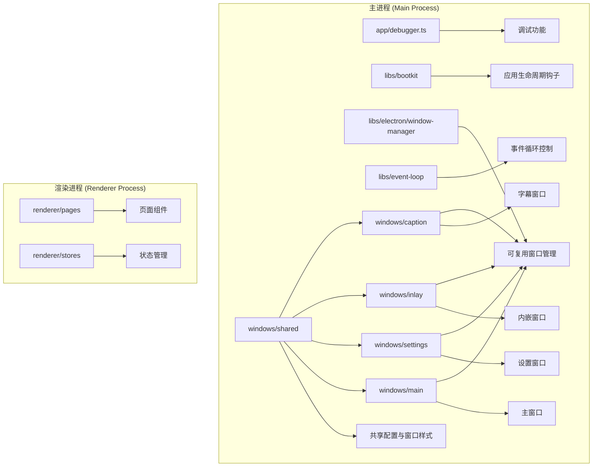
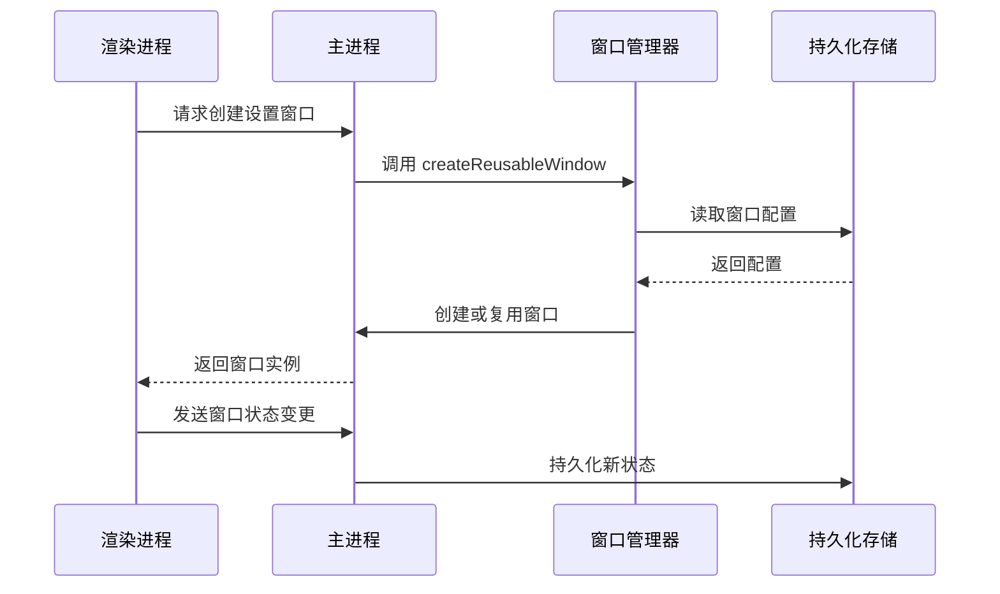
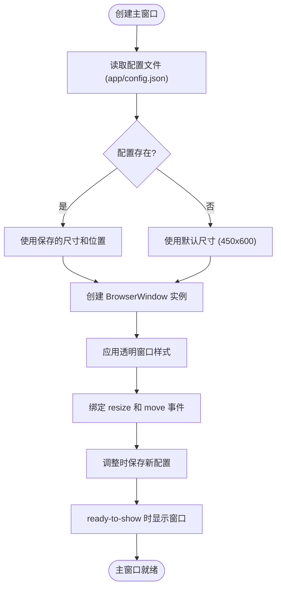
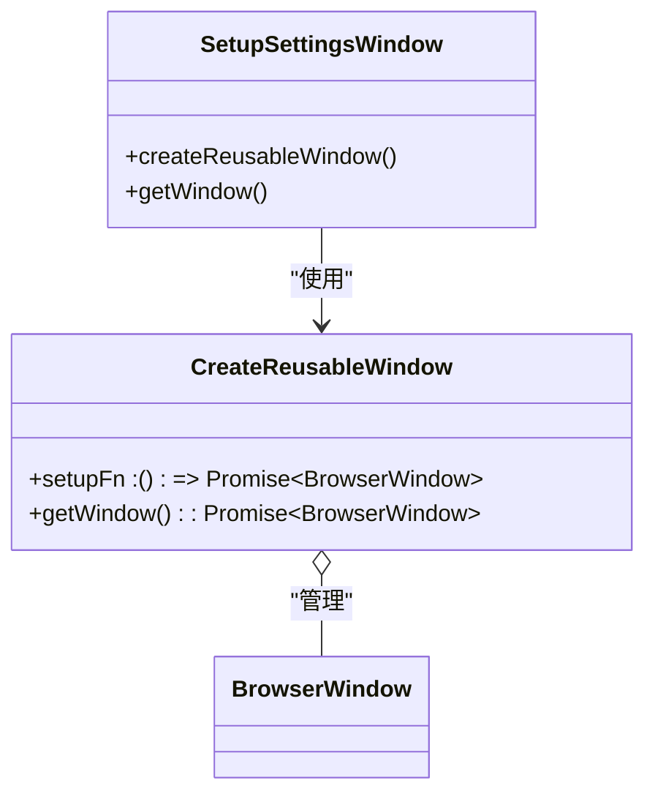
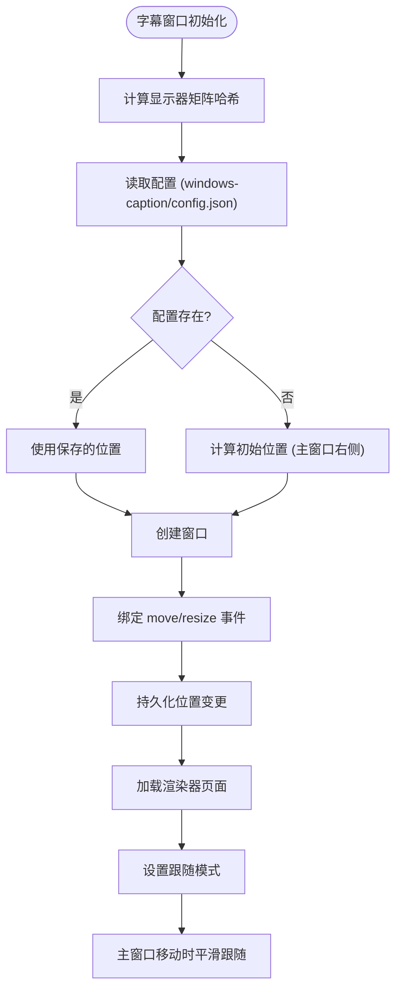

# 窗口管理系统

<cite>
**本文档引用的文件**  
- [window.ts](file://apps/stage-tamagotchi/src/main/services/electron/window.ts)
- [main/index.ts](file://apps/stage-tamagotchi/src/main/windows/main/index.ts)
- [settings/index.ts](file://apps/stage-tamagotchi/src/main/windows/settings/index.ts)
- [inlay/index.ts](file://apps/stage-tamagotchi/src/main/windows/inlay/index.ts)
- [caption/index.ts](file://apps/stage-tamagotchi/src/main/windows/caption/index.ts)
- [reusable.ts](file://apps/stage-tamagotchi/src/main/libs/electron/window-manager/reusable.ts)
- [persistence.ts](file://apps/stage-tamagotchi/src/main/windows/shared/persistence.ts)
- [window.ts](file://apps/stage-tamagotchi/src/main/windows/shared/window.ts)
- [lifecycle.ts](file://apps/stage-tamagotchi/src/main/libs/bootkit/lifecycle.ts)
- [eventa.ts](file://apps/stage-tamagotchi/src/shared/eventa.ts)
</cite>

## 目录
1. [简介](#简介)
2. [项目结构](#项目结构)
3. [核心组件](#核心组件)
4. [架构概述](#架构概述)
5. [详细组件分析](#详细组件分析)
6. [依赖分析](#依赖分析)
7. [性能考虑](#性能考虑)
8. [故障排除指南](#故障排除指南)
9. [结论](#结论)

## 简介
`stage-tamagotchi` 是一个基于 Electron 的窗口管理系统，支持主窗口、设置窗口、内嵌窗口和字幕窗口等多种窗口类型。系统采用模块化设计，通过 Electron 的主进程与渲染进程通信机制实现跨窗口状态同步和交互控制。窗口管理策略包括可复用窗口、持久化配置、自定义窗口样式和跨平台兼容性处理。

## 项目结构
`stage-tamagotchi` 应用的主进程代码位于 `src/main` 目录下，主要分为以下几个模块：
- `app`：应用级功能（如调试器）
- `libs`：基础库（启动套件、Electron 工具、事件循环）
- `services/electron`：Electron 服务封装
- `windows`：各类窗口的实现（主窗口、设置窗口、内嵌窗口、字幕窗口等）
- `shared`：主进程与渲染进程共享的工具和类型定义



**Diagram sources**
- [main/index.ts](file://apps/stage-tamagotchi/src/main/windows/main/index.ts)
- [settings/index.ts](file://apps/stage-tamagotchi/src/main/windows/settings/index.ts)
- [inlay/index.ts](file://apps/stage-tamagotchi/src/main/windows/inlay/index.ts)
- [caption/index.ts](file://apps/stage-tamagotchi/src/main/windows/caption/index.ts)
- [reusable.ts](file://apps/stage-tamagotchi/src/main/libs/electron/window-manager/reusable.ts)
- [persistence.ts](file://apps/stage-tamagotchi/src/main/windows/shared/persistence.ts)

**Section sources**
- [main/index.ts](file://apps/stage-tamagotchi/src/main/windows/main/index.ts)
- [settings/index.ts](file://apps/stage-tamagotchi/src/main/windows/settings/index.ts)
- [inlay/index.ts](file://apps/stage-tamagotchi/src/main/windows/inlay/index.ts)
- [caption/index.ts](file://apps/stage-tamagotchi/src/main/windows/caption/index.ts)

## 核心组件
系统核心组件包括主窗口、设置窗口、内嵌窗口和字幕窗口，每种窗口都有特定的用途和管理策略。主窗口是应用的主要交互界面，设置窗口用于配置应用参数，内嵌窗口提供轻量级信息展示，字幕窗口则用于跟随主窗口移动并显示实时信息。

**Section sources**
- [main/index.ts](file://apps/stage-tamagotchi/src/main/windows/main/index.ts)
- [settings/index.ts](file://apps/stage-tamagotchi/src/main/windows/settings/index.ts)
- [inlay/index.ts](file://apps/stage-tamagotchi/src/main/windows/inlay/index.ts)
- [caption/index.ts](file://apps/stage-tamagotchi/src/main/windows/caption/index.ts)

## 架构概述
系统采用分层架构，主进程负责窗口创建、销毁和状态管理，渲染进程负责UI展示和用户交互。通过 `@unbird/eventa` 实现主进程与渲染进程之间的双向通信。窗口状态（位置、大小）通过文件系统持久化存储，确保跨会话一致性。



**Diagram sources**
- [window.ts](file://apps/stage-tamagotchi/src/main/services/electron/window.ts)
- [persistence.ts](file://apps/stage-tamagotchi/src/main/windows/shared/persistence.ts)
- [reusable.ts](file://apps/stage-tamagotchi/src/main/libs/electron/window-manager/reusable.ts)

## 详细组件分析

### 主窗口分析
主窗口是应用的核心界面，采用透明无边框设计，始终置顶显示。窗口位置和大小在用户调整后自动保存，支持跨显示器工作区适配。通过 `setAlwaysOnTop` 和 `setVisibleOnAllWorkspaces` 确保窗口在所有工作空间可见。



**Diagram sources**
- [main/index.ts](file://apps/stage-tamagotchi/src/main/windows/main/index.ts)
- [persistence.ts](file://apps/stage-tamagotchi/src/main/windows/shared/persistence.ts)
- [window.ts](file://apps/stage-tamagotchi/src/main/windows/shared/window.ts)

**Section sources**
- [main/index.ts](file://apps/stage-tamagotchi/src/main/windows/main/index.ts)

### 设置窗口分析
设置窗口采用可复用模式，首次调用时创建，后续调用直接显示已有实例。窗口大小固定为 600x800，通过 `createReusableWindow` 工厂函数封装创建逻辑，避免重复创建导致的内存泄漏。



**Diagram sources**
- [settings/index.ts](file://apps/stage-tamagotchi/src/main/windows/settings/index.ts)
- [reusable.ts](file://apps/stage-tamagotchi/src/main/libs/electron/window-manager/reusable.ts)

**Section sources**
- [settings/index.ts](file://apps/stage-tamagotchi/src/main/windows/settings/index.ts)

### 内嵌窗口分析
内嵌窗口根据屏幕分辨率动态调整尺寸和位置，采用模糊背景效果（vibrancy），在 macOS 上隐藏窗口按钮。窗口位置基于主显示器工作区计算，确保在不同分辨率下都有良好的用户体验。

**Section sources**
- [inlay/index.ts](file://apps/stage-tamagotchi/src/main/windows/inlay/index.ts)

### 字幕窗口分析
字幕窗口具有跟随主窗口移动的特殊功能，支持手动拖拽和自动跟随两种模式。通过 `animejs` 实现平滑动画效果，窗口位置根据显示器矩阵哈希值进行持久化存储，确保多显示器环境下的正确行为。



**Diagram sources**
- [caption/index.ts](file://apps/stage-tamagotchi/src/main/windows/caption/index.ts)
- [persistence.ts](file://apps/stage-tamagotchi/src/main/windows/shared/persistence.ts)

**Section sources**
- [caption/index.ts](file://apps/stage-tamagotchi/src/main/windows/caption/index.ts)

## 依赖分析
系统依赖关系清晰，各模块职责分明。主进程核心依赖包括 Electron 原生模块、`@unbird/eventa` 通信库、`defu` 对象合并库和 `es-toolkit` 工具函数库。

```mermaid
graph LR
A[主进程] --> B[Electron]
A --> C[@unbird/eventa]
A --> D[defu]
A --> E[es-toolkit]
A --> F[std-env]
B --> G[BrowserWindow]
B --> H[ipcMain]
C --> I[跨进程通信]
D --> J[配置合并]
E --> K[节流/防抖]
F --> L[平台检测]
```

**Diagram sources**
- [package.json](file://apps/stage-tamagotchi/package.json)
- [main/index.ts](file://apps/stage-tamagotchi/src/main/windows/main/index.ts)

**Section sources**
- [main/index.ts](file://apps/stage-tamagotchi/src/main/windows/main/index.ts)

## 性能考虑
系统通过多种机制优化性能和资源使用：
- 使用 `throttle(250)` 限制配置保存频率，避免频繁磁盘I/O
- 采用可复用窗口模式，减少窗口创建销毁开销
- 使用 `debounce` 和 `throttle` 控制跟随窗口的更新频率
- 通过 `setMaxListeners(100)` 防止事件监听器泄漏警告

## 故障排除指南
常见问题及解决方案：
- **窗口无法拖拽**：检查是否在 Linux 平台，该平台使用不同拖拽实现
- **配置未保存**：确认 `userData` 目录可写，检查 `throttle` 是否正常工作
- **跨显示器位置错误**：检查显示器矩阵哈希计算逻辑
- **内存泄漏**：确保窗口关闭时正确清理事件监听器

**Section sources**
- [reusable.ts](file://apps/stage-tamagotchi/src/main/libs/electron/window-manager/reusable.ts)
- [persistence.ts](file://apps/stage-tamagotchi/src/main/windows/shared/persistence.ts)
- [lifecycle.ts](file://apps/stage-tamagotchi/src/main/libs/bootkit/lifecycle.ts)

## 结论
`stage-tamagotchi` 窗口管理系统通过模块化设计和最佳实践实现了高效、稳定的多窗口管理。系统支持多种窗口类型，具有良好的跨平台兼容性和用户体验。通过可复用窗口、配置持久化和动画效果等特性，为复杂桌面应用提供了可靠的窗口管理解决方案。