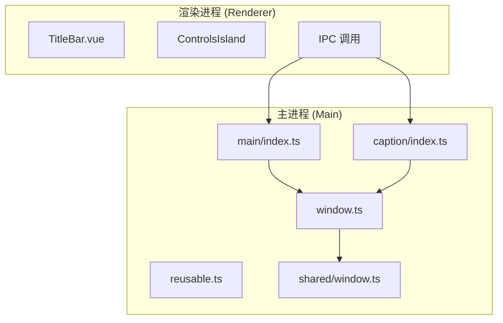
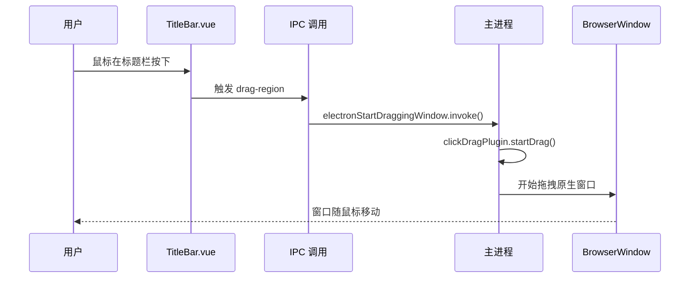
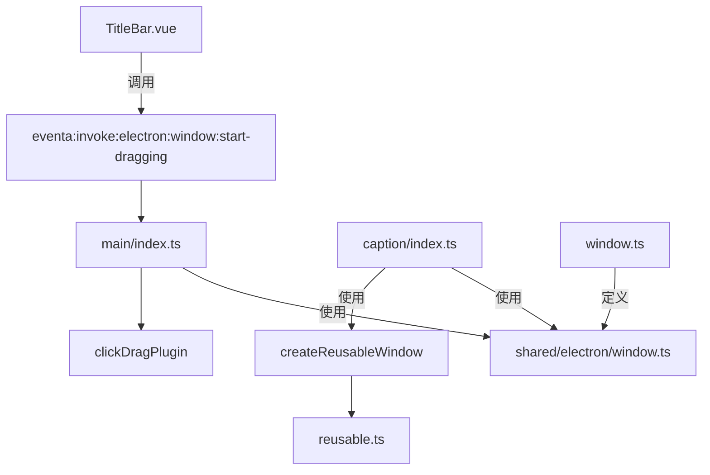

# 窗口行为与交互控制

<cite>
**本文档引用文件**  
- [TitleBar.vue](file://apps/stage-tamagotchi/src/renderer/components/Window/TitleBar.vue)
- [main/index.ts](file://apps/stage-tamagotchi/src/main/windows/main/index.ts)
- [caption/index.ts](file://apps/stage-tamagotchi/src/main/windows/caption/index.ts)
- [reusable.ts](file://apps/stage-tamagotchi/src/main/libs/electron/window-manager/reusable.ts)
- [window.ts](file://apps/stage-tamagotchi/src/shared/electron/window.ts)
- [window.ts](file://apps/stage-tamagotchi/src/main/services/electron/window.ts)
</cite>

## 目录
1. [简介](#简介)
2. [项目结构](#项目结构)
3. [核心组件](#核心组件)
4. [架构概览](#架构概览)
5. [详细组件分析](#详细组件分析)
6. [依赖分析](#依赖分析)
7. [性能考虑](#性能考虑)
8. [故障排除指南](#故障排除指南)
9. [结论](#结论)

## 简介
本文档深入解析基于 Electron 框架的窗口行为控制机制，重点阐述自定义标题栏、无边框窗口拖拽、大小调整、鼠标穿透、窗口置顶等高级交互功能的实现原理。通过分析 `TitleBar.vue` 组件与后端 IPC 调用的协作模式，揭示前端交互与原生窗口操作的完整链路。

## 项目结构
项目采用分层架构，核心窗口管理逻辑位于 `apps/stage-tamagotchi` 应用中，分为 `main`（主进程）和 `renderer`（渲染进程）两大部分。主进程负责创建和管理 `BrowserWindow` 实例，处理系统级事件；渲染进程负责 UI 展示和用户交互，通过 IPC 与主进程通信。

**窗口行为控制相关文件分布：**
- **前端组件**: `src/renderer/components/Window/TitleBar.vue`
- **主窗口管理**: `src/main/windows/main/index.ts`
- **副窗口（字幕）管理**: `src/main/windows/caption/index.ts`
- **窗口服务**: `src/main/services/electron/window.ts`
- **共享 IPC 事件定义**: `src/shared/electron/window.ts`



**图示来源**
- [TitleBar.vue](file://apps/stage-tamagotchi/src/renderer/components/Window/TitleBar.vue)
- [main/index.ts](file://apps/stage-tamagotchi/src/main/windows/main/index.ts)
- [caption/index.ts](file://apps/stage-tamagotchi/src/main/windows/caption/index.ts)
- [window.ts](file://apps/stage-tamagotchi/src/main/services/electron/window.ts)

## 核心组件
核心组件包括 `TitleBar.vue` 前端组件、主窗口管理器、字幕窗口管理器和可复用窗口工厂。`TitleBar.vue` 负责提供用户交互界面，通过添加 `drag-region` 类实现拖拽移动；主窗口管理器负责创建主应用窗口并处理其生命周期；字幕窗口管理器实现了复杂的跟随主窗口移动和动画效果；可复用窗口工厂确保窗口实例的单例性和正确回收。

**组件来源**
- [TitleBar.vue](file://apps/stage-tamagotchi/src/renderer/components/Window/TitleBar.vue#L1-L39)
- [main/index.ts](file://apps/stage-tamagotchi/src/main/windows/main/index.ts#L27-L153)
- [caption/index.ts](file://apps/stage-tamagotchi/src/main/windows/caption/index.ts#L135-L383)
- [reusable.ts](file://apps/stage-tamagotchi/src/main/libs/electron/window-manager/reusable.ts#L2-L19)

## 架构概览
系统采用典型的 Electron 分层架构，前端通过 Vue.js 框架构建 UI，后端使用 Electron API 管理原生窗口。两者通过 `@unbird/eventa` 库封装的 IPC 机制进行通信。关键设计模式包括：
1.  **事件驱动**: 窗口的移动、缩放事件被监听并持久化到配置文件。
2.  **状态同步**: 使用 `defineInvokeHandler` 和 `context.emit` 在主进程和渲染进程间同步窗口状态（如是否跟随主窗口）。
3.  **可复用性**: `createReusableWindow` 工厂函数确保窗口实例的唯一性，避免重复创建。



**图示来源**
- [TitleBar.vue](file://apps/stage-tamagotchi/src/renderer/components/Window/TitleBar.vue#L15-L15)
- [main/index.ts](file://apps/stage-tamagotchi/src/main/windows/main/index.ts#L108-L132)
- [window.ts](file://apps/stage-tamagotchi/src/shared/electron/window.ts#L10-L13)

## 详细组件分析

### 自定义标题栏与拖拽移动
`TitleBar.vue` 组件通过在根 `div` 上添加 `drag-region` CSS 类，将该区域标记为可拖拽区域。当用户在此区域按下鼠标时，操作系统会触发窗口拖拽操作，从而实现无边框窗口的移动。组件根据平台（macOS/其他）调整内边距，确保在 macOS 上窗口按钮区域不被遮挡。

#### 拖拽移动实现流程
```mermaid
flowchart TD
A[用户在 drag-region 区域按下鼠标] --> B[操作系统捕获拖拽事件]
B --> C[Electron 将事件传递给原生窗口]
C --> D[调用 clickDragPlugin.startDrag()]
D --> E[原生窗口开始随鼠标移动]
E --> F[用户释放鼠标，窗口定位]
```

**图示来源**
- [TitleBar.vue](file://apps/stage-tamagotchi/src/renderer/components/Window/TitleBar.vue#L15-L15)
- [main/index.ts](file://apps/stage-tamagotchi/src/main/windows/main/index.ts#L108-L132)

### 窗口大小调整
无边框窗口的大小调整通常通过在窗口边缘预留透明区域并监听鼠标事件来实现。虽然当前代码未直接展示此逻辑，但可通过类似 `drag-region` 的机制，定义 `resize-region` 并在主进程中监听鼠标拖拽来调用 `window.setSize()` 或 `window.setBounds()` 实现。

### 高级行为控制
#### 鼠标事件穿透
通过 `window.setIgnoreMouseEvents(true, { forward: true })` 实现。此方法使窗口忽略所有鼠标事件，并将事件传递给其下方的窗口。该功能通过 `shared/electron/window.ts` 中定义的 `setIgnoreMouseEvents` IPC 调用暴露给前端。

#### 窗口置顶与多桌面显示
在 `setupMainWindow` 和 `createCaptionWindow` 函数中，通过调用 `window.setAlwaysOnTop(true, 'screen-saver', priority)` 确保窗口始终位于其他窗口之上，即使在全屏应用前也可见。`window.setVisibleOnAllWorkspaces(true)` 保证窗口在 macOS 的所有桌面空间中都可见。

#### 透明度调节
通过 `transparentWindowConfig()` 配置项实现。该函数返回一个包含 `transparent: true` 和 `frame: false` 的配置对象，创建一个完全透明且无边框的窗口，为实现高级视觉效果（如毛玻璃）提供基础。

**组件来源**
- [main/index.ts](file://apps/stage-tamagotchi/src/main/windows/main/index.ts#L135-L142)
- [caption/index.ts](file://apps/stage-tamagotchi/src/main/windows/caption/index.ts#L188-L195)
- [window.ts](file://apps/stage-tamagotchi/src/main/services/electron/window.ts#L20-L24)

### 屏幕边界与多显示器适配
系统通过以下机制防止窗口移出屏幕边界并适配多显示器：
1.  **边界检查**: `clampBoundsWithinRect` 函数计算窗口新位置，并确保其完全位于指定显示器的工作区内。
2.  **多显示器感知**: `computeDisplayMatrixHash` 函数根据所有显示器的分辨率、位置和缩放因子生成唯一哈希值，用于区分不同的多显示器配置。
3.  **持久化与恢复**: 窗口的位置和大小信息（`bounds`）根据当前显示器配置的哈希值进行持久化存储。当显示器配置改变时，系统会加载对应配置，或根据主窗口位置计算新的默认位置。

```mermaid
classDiagram
class WindowManager {
+matrixHash : string
+isFollowing : boolean
+getConfig() : Config
+updateConfig(config) : void
+computeInitialBounds() : Rectangle
+clampBoundsWithinRect(bounds, rect) : Rectangle
}
class Config {
+isFollowing : boolean
+matrices : { [hash : string] : { bounds : Rectangle, relativeToMain? : { dx, dy } } }
}
WindowManager --> Config : "使用"
```

**图示来源**
- [caption/index.ts](file://apps/stage-tamagotchi/src/main/windows/caption/index.ts#L23-L45)
- [caption/index.ts](file://apps/stage-tamagotchi/src/main/windows/caption/index.ts#L135-L383)

## 依赖分析
系统依赖关系清晰，层次分明。前端组件依赖于 `@unbird/eventa` 进行 IPC 通信；主进程的窗口管理器依赖于 Electron 的 `BrowserWindow`、`ipcMain`、`screen` 等核心模块；`createReusableWindow` 工厂函数被多个窗口管理器复用，降低了代码耦合度。`shared` 目录下的文件作为主进程和渲染进程的契约，定义了共享的类型和 IPC 事件，是解耦的关键。



**图示来源**
- [TitleBar.vue](file://apps/stage-tamagotchi/src/renderer/components/Window/TitleBar.vue)
- [main/index.ts](file://apps/stage-tamagotchi/src/main/windows/main/index.ts)
- [caption/index.ts](file://apps/stage-tamagotchi/src/main/windows/caption/index.ts)
- [reusable.ts](file://apps/stage-tamagotchi/src/main/libs/electron/window-manager/reusable.ts)
- [window.ts](file://apps/stage-tamagotchi/src/main/services/electron/window.ts)

## 性能考虑
1.  **事件节流与防抖**: 在 `followMainWindow` 函数中，使用 `throttle` 和 `debounce` 来控制窗口跟随的频率，避免因主窗口频繁移动导致的性能问题。
2.  **动画优化**: 使用 `animejs` 库进行平滑动画，通过 `duration` 和 `ease` 参数优化用户体验，同时设置 `modifier: utils.round(0)` 确保位置为整数像素，防止模糊。
3.  **资源复用**: `createReusableWindow` 模式避免了不必要的窗口创建和销毁，减少了内存和系统资源的消耗。

## 故障排除指南
- **拖拽功能失效**: 检查 `drag-region` CSS 类是否正确应用，确认 `clickDragPlugin` 是否在非 Linux 平台正确加载。
- **窗口位置错乱**: 检查 `computeDisplayMatrixHash` 生成的哈希值是否准确反映了当前显示器配置，确认 `clampBoundsWithinRect` 函数是否正常工作。
- **IPC 调用无响应**: 确认主进程中的 `defineInvokeHandler` 是否已正确注册，检查 `context` 对象的生命周期是否正常。
- **窗口无法置顶**: 在 macOS 上，确保 `type: 'panel'` 和 `setAlwaysOnTop` 的优先级设置正确。

**组件来源**
- [main/index.ts](file://apps/stage-tamagotchi/src/main/windows/main/index.ts#L108-L132)
- [caption/index.ts](file://apps/stage-tamagotchi/src/main/windows/caption/index.ts#L23-L45)
- [window.ts](file://apps/stage-tamagotchi/src/main/services/electron/window.ts#L20-L24)

## 结论
本文档详细解析了基于 Electron 的复杂窗口行为控制系统。系统通过精心设计的分层架构、事件驱动的通信模式和可复用的组件，实现了自定义标题栏、平滑跟随、多显示器适配等高级功能。`TitleBar.vue` 组件作为用户交互的入口，与后端 IPC 调用紧密结合，共同构建了一个稳定、高效且用户体验良好的桌面应用窗口管理系统。