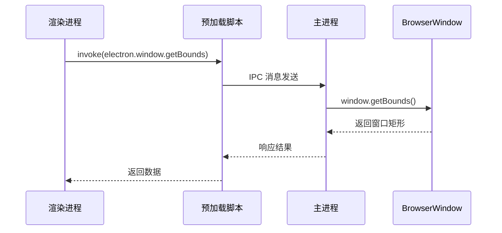
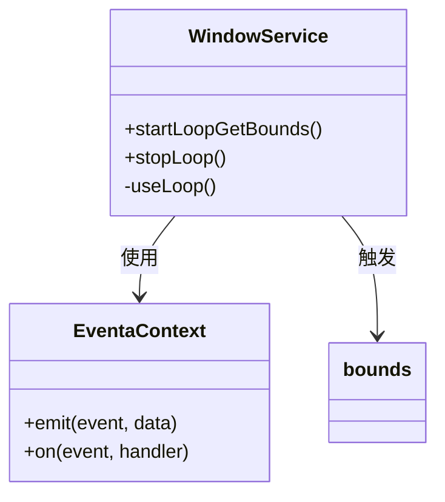
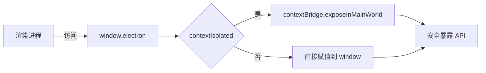
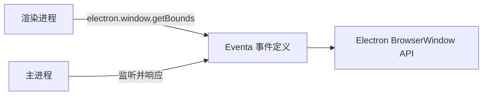

# 跨进程通信机制

<cite>
**本文档中引用的文件**  
- [window.ts](file://apps/stage-tamagotchi/src/main/services/electron/window.ts)
- [shared.ts](file://apps/stage-tamagotchi/src/preload/shared.ts)
- [window.ts](file://apps/stage-tamagotchi/src/shared/electron/window.ts)
- [index.ts](file://apps/stage-tamagotchi/src/main/services/electron/index.ts)
- [reusable.ts](file://apps/stage-tamagotchi/src/main/libs/electron/window-manager/reusable.ts)
- [eventa.ts](file://apps/stage-tamagotchi/src/shared/eventa.ts)
- [index.electron.ts](file://apps/stage-tamagotchi/src/main/windows/main/rpc/index.electron.ts)
</cite>

## 目录
1. [简介](#简介)
2. [项目结构](#项目结构)
3. [核心组件](#核心组件)
4. [架构概述](#架构概述)
5. [详细组件分析](#详细组件分析)
6. [依赖分析](#依赖分析)
7. [性能考虑](#性能考虑)
8. [故障排除指南](#故障排除指南)
9. [结论](#结论)

## 简介
本文档详细说明了基于 Electron 的主进程与渲染进程之间通过 IPC（进程间通信）实现窗口控制的通信机制。重点涵盖窗口操作指令、状态同步事件、自定义消息传递、IPC 通道命名规范、消息格式定义、异步响应处理和错误传播机制。同时强调安全性设计，如调用来源验证与权限控制。

## 项目结构
项目采用分层结构，将主进程、预加载脚本与共享模块分离，确保通信逻辑清晰且安全。核心 IPC 通信逻辑分布在主进程服务、共享定义与预加载桥接中。

```mermaid
graph TB
subgraph "主进程 (Main Process)"
A[WindowService] --> B[IPC Handler]
C[ScreenService] --> B
D[Context] --> B
end
subgraph "预加载脚本 (Preload)"
E[expose] --> F[contextBridge]
G[electronAPI] --> E
end
subgraph "渲染进程 (Renderer Process)"
H[Vue 组件] --> I[useElectronEventaInvoke]
I --> J[IPC Renderer]
end
B < --> J
F < --> J
```

**图示来源**  
- [window.ts](file://apps/stage-tamagotchi/src/main/services/electron/window.ts#L10-L42)
- [shared.ts](file://apps/stage-tamagotchi/src/preload/shared.ts#L7-L26)

**本节来源**  
- [window.ts](file://apps/stage-tamagotchi/src/main/services/electron/window.ts)
- [shared.ts](file://apps/stage-tamagotchi/src/preload/shared.ts)

## 核心组件
系统通过 `@unbird/eventa` 封装 IPC 通信，实现类型安全的跨进程调用。主进程通过 `defineInvokeHandler` 注册处理函数，渲染进程通过 `defineInvoke` 发起调用。通信通道基于命名事件，确保语义清晰。

**本节来源**  
- [window.ts](file://apps/stage-tamagotchi/src/main/services/electron/window.ts#L10-L42)
- [eventa.ts](file://apps/stage-tamagotchi/src/shared/eventa.ts#L4-L8)

## 架构概述
系统采用事件驱动架构，主进程暴露受控 API，渲染进程通过上下文桥接发起安全调用。所有窗口控制操作均通过异步 IPC 消息完成，主进程执行后返回结果或触发状态事件。



**图示来源**  
- [window.ts](file://apps/stage-tamagotchi/src/main/services/electron/window.ts#L30-L36)
- [shared.ts](file://apps/stage-tamagotchi/src/preload/shared.ts#L7-L26)

## 详细组件分析

### 窗口服务分析
`createWindowService` 是主进程中负责窗口 IPC 通信的核心服务。它注册多个调用处理器，允许渲染进程安全地获取窗口状态或执行操作。

#### 窗口操作调用处理
```mermaid
flowchart TD
A[渲染进程调用 getBounds] --> B{验证调用来源}
B --> |合法| C[执行 window.getBounds()]
B --> |非法| D[返回空矩形]
C --> E[返回实际窗口尺寸]
D --> E
E --> F[渲染进程接收结果]
```

**图示来源**  
- [window.ts](file://apps/stage-tamagotchi/src/main/services/electron/window.ts#L30-L36)

#### 状态同步事件
主进程通过事件机制向渲染进程推送窗口状态变化，如窗口位置更新。



**图示来源**  
- [window.ts](file://apps/stage-tamagotchi/src/main/services/electron/window.ts#L10-L20)
- [window.ts](file://apps/stage-tamagotchi/src/shared/electron/window.ts#L3)

**本节来源**  
- [window.ts](file://apps/stage-tamagotchi/src/main/services/electron/window.ts#L10-L42)
- [window.ts](file://apps/stage-tamagotchi/src/shared/electron/window.ts#L3-L8)

### 预加载桥接机制
`expose` 函数通过 `contextBridge` 安全地将 Electron API 暴露给渲染进程，防止直接访问 Node.js 环境。



**图示来源**  
- [shared.ts](file://apps/stage-tamagotchi/src/preload/shared.ts#L7-L26)

**本节来源**  
- [shared.ts](file://apps/stage-tamagotchi/src/preload/shared.ts#L7-L26)

## 依赖分析
系统依赖 `@unbird/eventa` 实现类型安全的 IPC 通信，结合 Electron 原生 API 完成窗口控制。各模块通过共享事件定义解耦，确保主进程与渲染进程使用一致的通信契约。



**图示来源**  
- [window.ts](file://apps/stage-tamagotchi/src/shared/electron/window.ts#L7)
- [window.ts](file://apps/stage-tamagotchi/src/main/services/electron/window.ts#L30)

**本节来源**  
- [window.ts](file://apps/stage-tamagotchi/src/shared/electron/window.ts)
- [window.ts](file://apps/stage-tamagotchi/src/main/services/electron/window.ts)

## 性能考虑
- 使用 `useLoop` 仅在需要时启动窗口位置监听，避免持续轮询。
- 所有 IPC 调用均为异步，不阻塞主线程。
- 通过 `webContents.id` 验证调用来源，防止跨窗口非法访问。

## 故障排除指南
- **IPC 调用无响应**：检查主进程是否正确注册 `defineInvokeHandler`。
- **权限拒绝错误**：确认预加载脚本已正确调用 `expose()`。
- **类型不匹配**：确保共享的 `eventa` 事件定义在主进程与渲染进程间一致。

**本节来源**  
- [window.ts](file://apps/stage-tamagotchi/src/main/services/electron/window.ts#L30-L36)
- [shared.ts](file://apps/stage-tamagotchi/src/preload/shared.ts#L7-L26)

## 结论
该系统通过结构化的 IPC 通信机制，实现了主进程与渲染进程间安全、高效的窗口控制。通过事件命名规范、调用验证与类型安全设计，确保了通信的可靠性与可维护性，适用于复杂 Electron 应用的窗口管理需求。