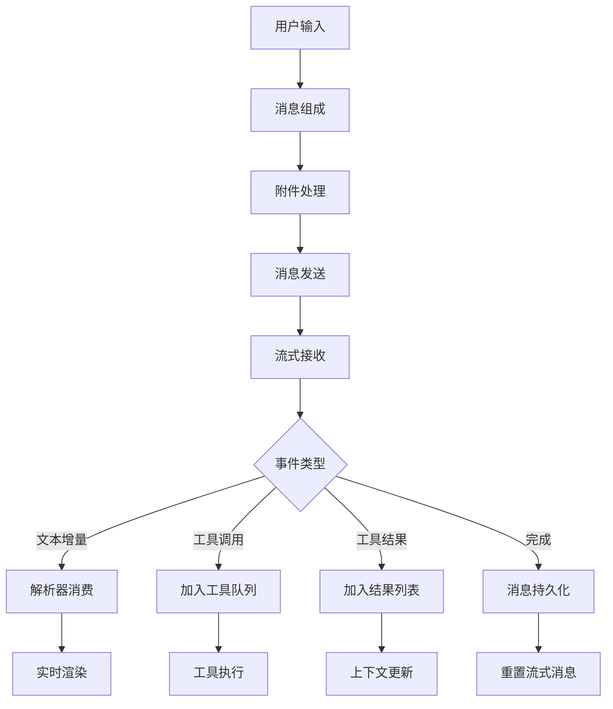
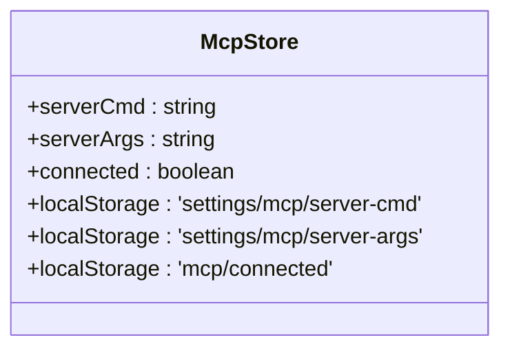

# AI状态管理

<cite>
**本文档中引用的文件**  
- [llm.ts](file://packages/stage-ui/src/stores/llm.ts)
- [chat.ts](file://packages/stage-ui/src/stores/chat.ts)
- [mcp.ts](file://packages/stage-ui/src/stores/mcp.ts)
- [types/chat.ts](file://packages/stage-ui/src/types/chat.ts)
</cite>

## 目录
1. [简介](#简介)
2. [LLM状态管理](#llm状态管理)
3. [聊天状态管理](#聊天状态管理)
4. [MCP协议状态管理](#mcp协议状态管理)
5. [生命周期与性能优化](#生命周期与性能优化)

## 简介
本文档详细说明了AI系统中语言模型（LLM）、聊天会话和MCP协议的状态管理机制。系统采用Pinia状态管理库实现跨组件的状态共享与持久化，通过模块化设计分离关注点，确保状态的一致性和可维护性。

## LLM状态管理

LLM状态管理模块负责维护语言模型的核心状态，包括模型兼容性、流式响应处理和工具调用支持。该模块通过`useLLM` Store提供统一的接口，封装了与底层AI服务的交互逻辑。

核心功能包括：
- 模型工具兼容性发现与缓存
- 流式文本生成与事件分发
- 模型列表获取与API连接管理

状态管理采用响应式设计，利用Map结构缓存模型工具兼容性结果，避免重复的网络请求。同时支持自定义HTTP头和流式事件回调，为上层应用提供灵活的扩展能力。

**Section sources**
- [llm.ts](file://packages/stage-ui/src/stores/llm.ts#L126-L168)

## 聊天状态管理

聊天状态管理模块通过`useChatStore`实现完整的对话生命周期管理。该模块维护聊天消息历史、流式响应处理和实时更新机制，确保用户交互的流畅性和数据一致性。

### 消息历史管理
聊天消息存储在localStorage中，实现跨会话持久化。消息数组包含用户输入、AI响应和系统消息，支持富媒体内容（如图片附件）。系统消息包含代码块和数学公式渲染的提示指令。

### 消息队列与实时更新
系统采用异步消息队列处理工具调用和结果响应：
- `toolCallQueue`管理工具调用的有序执行
- 流式解析器（llmmarkerParser）实时处理文本片段
- 钩子系统（hooks）支持消息处理各阶段的扩展

消息发送流程包含多个可扩展的钩子点：
1. 消息组成前（onBeforeMessageComposed）
2. 消息组成后（onAfterMessageComposed）
3. 发送前（onBeforeSend）
4. 发送后（onAfterSend）
5. 令牌处理（onTokenLiteral/onTokenSpecial）
6. 流结束（onStreamEnd）
7. 响应结束（onAssistantResponseEnd）

**Diagram sources**
- [chat.ts](file://packages/stage-ui/src/stores/chat.ts#L21-L292)
- [llm.ts](file://packages/stage-ui/src/stores/llm.ts#L126-L168)

**Section sources**
- [chat.ts](file://packages/stage-ui/src/stores/chat.ts#L21-L292)
- [types/chat.ts](file://packages/stage-ui/src/types/chat.ts#L0-L30)

## MCP协议状态管理

MCP协议状态管理模块通过`useMcpStore`实现MCP服务器连接状态的集中管理。该模块负责维护服务器命令、启动参数和连接状态，支持多窗口间的状态同步。

### 连接状态管理
- `serverCmd`: MCP服务器可执行文件路径
- `serverArgs`: 服务器启动参数
- `connected`: 连接状态标志（使用localStorage同步）

状态持久化机制确保用户设置在不同会话间保持一致，连接状态在多个应用窗口间实时同步，避免重复连接或状态不一致问题。

**Diagram sources**
- [mcp.ts](file://packages/stage-ui/src/stores/mcp.ts#L3-L13)

**Section sources**
- [mcp.ts](file://packages/stage-ui/src/stores/mcp.ts#L3-L13)

## 生命周期与性能优化

### 状态生命周期管理
系统采用分层的生命周期管理策略：
- **LLM层**: 模型兼容性缓存（Map结构），避免重复探测
- **聊天层**: 消息历史持久化（localStorage），支持会话恢复
- **MCP层**: 连接状态同步（跨窗口localStorage），确保一致性

### 缓存策略
- 工具兼容性缓存：基于模型URL和名称的复合键
- 消息历史缓存：全量持久化到localStorage
- 状态同步缓存：关键状态使用localStorage实现跨窗口同步

### 性能优化技巧
1. **流式处理优化**：设置`minLiteralEmitLength: 24`避免过于频繁的文本更新
2. **并发探测优化**：`promiseAllWithInterval`实现带间隔的并行兼容性探测
3. **内存优化**：使用`toRaw`避免响应式代理的额外开销
4. **错误处理**：URL构造失败等常见错误的优雅降级处理
5. **资源管理**：发送状态（sending）的精确控制，防止重复提交

系统通过合理的状态划分和优化策略，在保证功能完整性的同时，实现了良好的性能表现和用户体验。

**Section sources**
- [llm.ts](file://packages/stage-ui/src/stores/llm.ts#L126-L168)
- [chat.ts](file://packages/stage-ui/src/stores/chat.ts#L21-L292)
- [mcp.ts](file://packages/stage-ui/src/stores/mcp.ts#L3-L13)