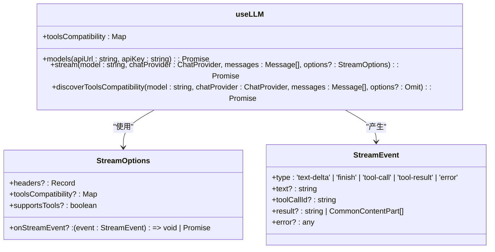
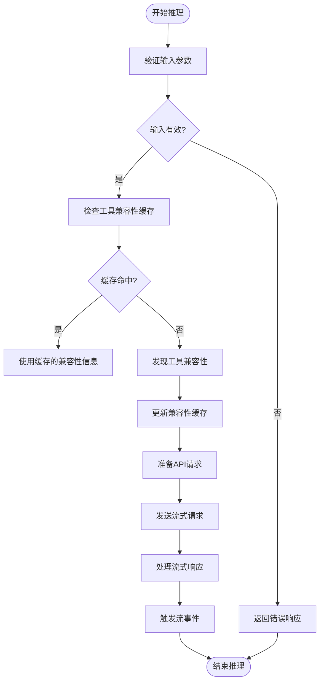
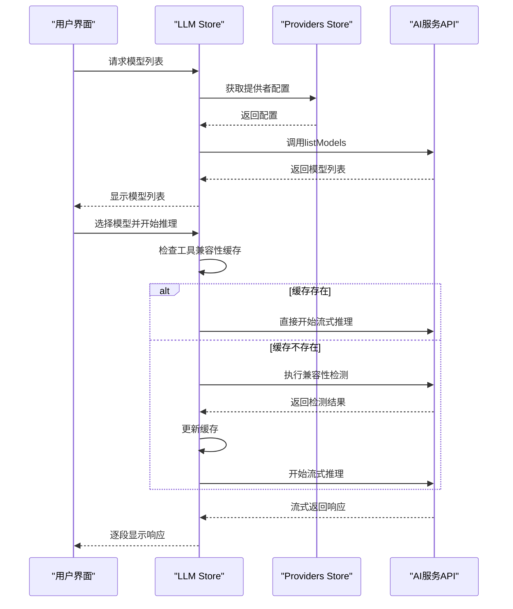
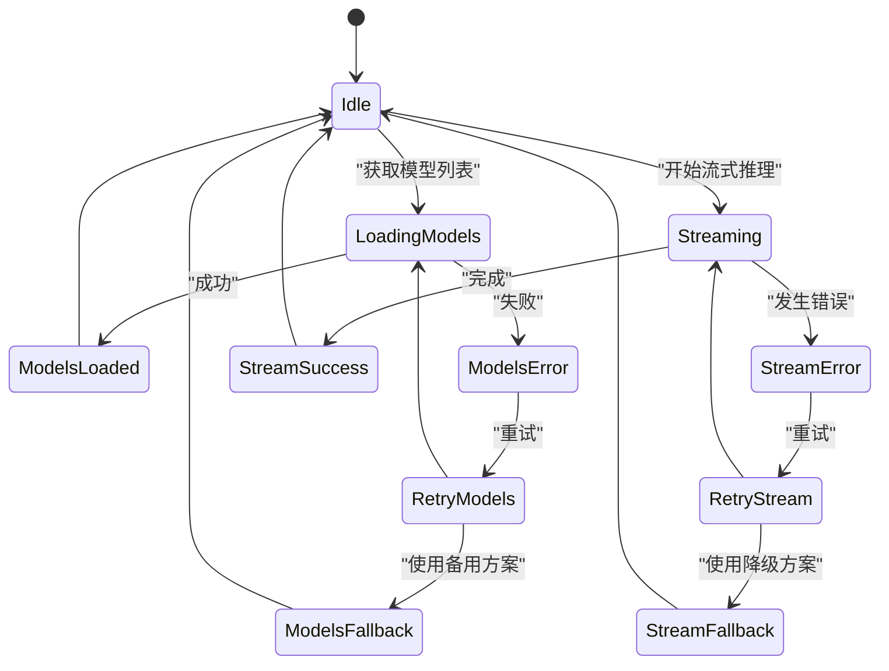
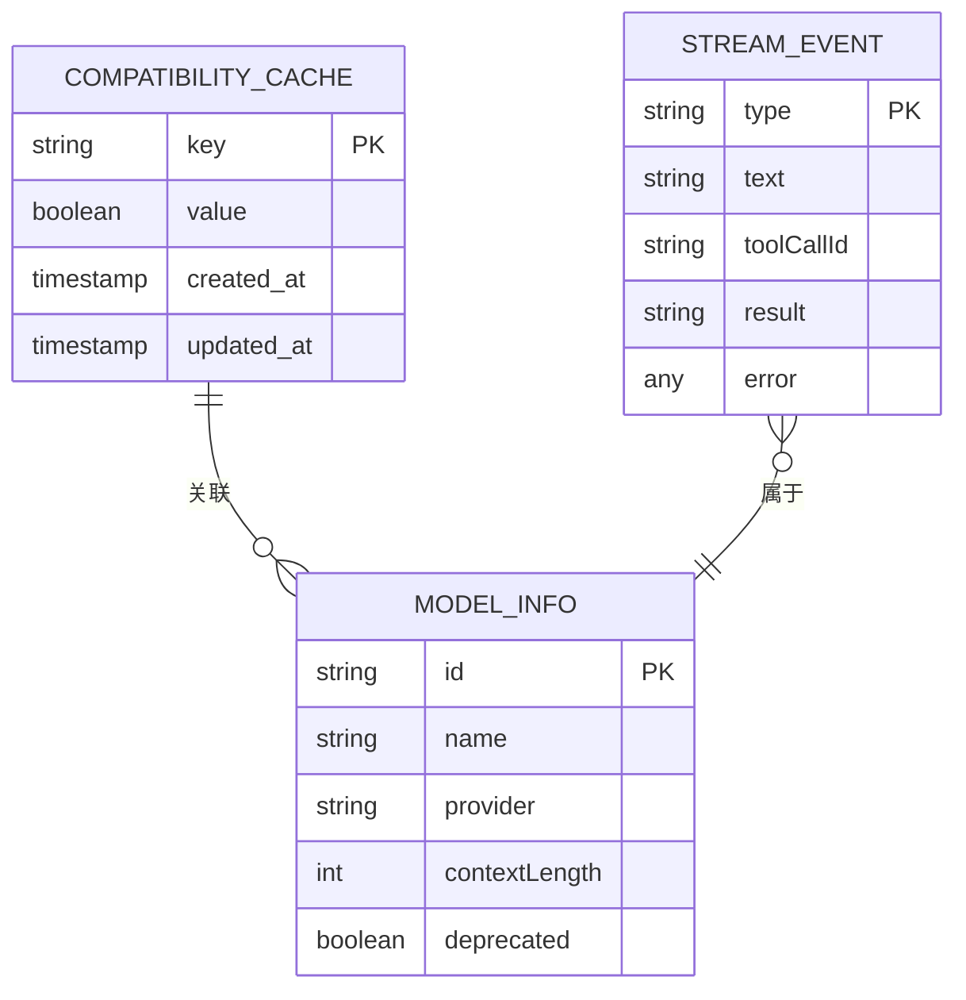
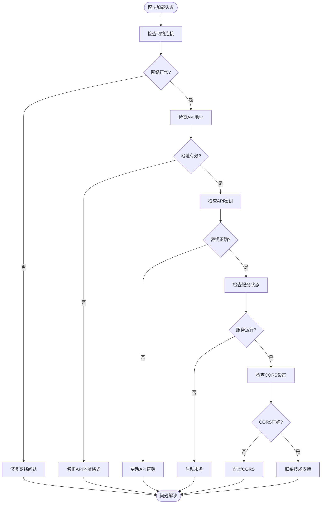

# LLM状态管理

<cite>
**本文档引用的文件**  
- [llm.ts](file://packages/stage-ui/src/stores/llm.ts)
- [configurator.ts](file://packages/stage-ui/src/stores/configurator.ts)
- [providers.ts](file://packages/stage-ui/src/stores/providers.ts)
</cite>

## 目录
1. [简介](#简介)
2. [LLM Store核心功能](#llm-store核心功能)
3. [会话上下文与推理参数管理](#会话上下文与推理参数管理)
4. [与Configurator Store和Providers Store的集成](#与configurator-store和providers-store的集成)
5. [模型生命周期管理](#模型生命周期管理)
6. [响应式更新与错误处理](#响应式更新与错误处理)
7. [性能优化与内存管理](#性能优化与内存管理)
8. [常见问题排查](#常见问题排查)
9. [总结](#总结)

## 简介
LLM状态管理是Airi学习系统中的核心组件，负责管理语言模型的状态、会话上下文和推理参数。该系统通过Pinia状态管理库实现，提供了模型选择、温度、top-p等参数的持久化与同步机制。LLM Store与Configurator Store和Providers Store紧密集成，实现了模型加载、卸载和切换的完整生命周期管理。

**Section sources**
- [llm.ts](file://packages/stage-ui/src/stores/llm.ts#L1-L170)
- [configurator.ts](file://packages/stage-ui/src/stores/configurator.ts#L1-L22)
- [providers.ts](file://packages/stage-ui/src/stores/providers.ts#L1-L2008)

## LLM Store核心功能
LLM Store通过`useLLM`定义的状态管理器提供核心功能，包括模型列表获取、流式推理和工具兼容性发现。该Store使用响应式数据结构来管理工具兼容性映射，确保状态变更能够自动触发UI更新。

Store的核心功能包括：
- **模型发现**：通过API端点获取可用模型列表
- **流式推理**：支持文本流式传输，实现实时响应
- **工具兼容性检测**：自动检测模型对工具调用的支持能力



**Diagram sources**
- [llm.ts](file://packages/stage-ui/src/stores/llm.ts#L1-L170)

**Section sources**
- [llm.ts](file://packages/stage-ui/src/stores/llm.ts#L1-L170)

## 会话上下文与推理参数管理
LLM Store通过消息数组管理会话上下文，每个消息包含角色、内容和可选的工具调用信息。推理参数如温度、top-p等通过流式选项进行管理，支持在推理过程中动态调整。

参数管理特性包括：
- **持久化存储**：关键参数在本地存储中持久化
- **动态更新**：支持运行时参数调整
- **默认值管理**：为未指定参数提供合理的默认值



**Diagram sources**
- [llm.ts](file://packages/stage-ui/src/stores/llm.ts#L1-L170)

**Section sources**
- [llm.ts](file://packages/stage-ui/src/stores/llm.ts#L1-L170)

## 与Configurator Store和Providers Store的集成
LLM Store与Configurator Store和Providers Store形成紧密的集成关系，共同管理AI服务的配置和状态。Configurator Store负责将配置变更通知到服务器，而Providers Store管理各种AI服务提供者的元数据和配置。

集成架构特点：
- **配置同步**：通过`updateFor`方法实现配置同步
- **提供者管理**：支持多种AI服务提供者，包括OpenAI、Anthropic、Ollama等
- **动态发现**：支持运行时发现可用的AI服务提供者

```mermaid
graph TB
subgraph "状态管理"
LLM[LLM Store]
Configurator[Configurator Store]
Providers[Providers Store]
end
subgraph "外部服务"
OpenAI[OpenAI]
Anthropic[Anthropic]
Ollama[Ollama]
end
LLM --> Providers : "获取提供者"
Configurator --> LLM : "更新配置"
Providers --> OpenAI : "连接"
Providers --> Anthropic : "连接"
Providers --> Ollama : "连接"
```

**Diagram sources**
- [llm.ts](file://packages/stage-ui/src/stores/llm.ts#L1-L170)
- [configurator.ts](file://packages/stage-ui/src/stores/configurator.ts#L1-L22)
- [providers.ts](file://packages/stage-ui/src/stores/providers.ts#L1-L2008)

**Section sources**
- [llm.ts](file://packages/stage-ui/src/stores/llm.ts#L1-L170)
- [configurator.ts](file://packages/stage-ui/src/stores/configurator.ts#L1-L22)
- [providers.ts](file://packages/stage-ui/src/stores/providers.ts#L1-L2008)

## 模型生命周期管理
LLM Store实现了完整的模型生命周期管理，包括模型加载、使用和卸载。通过`discoverToolsCompatibility`方法，系统能够自动检测模型的工具调用兼容性，并将结果缓存以提高后续请求的效率。

生命周期管理流程：
1. **模型选择**：从Providers Store获取可用模型列表
2. **兼容性检测**：检测所选模型的工具调用支持能力
3. **缓存管理**：将兼容性信息缓存在内存中
4. **推理执行**：使用检测后的配置执行流式推理
5. **状态清理**：在适当时候清理不再需要的缓存



**Diagram sources**
- [llm.ts](file://packages/stage-ui/src/stores/llm.ts#L1-L170)
- [providers.ts](file://packages/stage-ui/src/stores/providers.ts#L1-L2008)

**Section sources**
- [llm.ts](file://packages/stage-ui/src/stores/llm.ts#L1-L170)

## 响应式更新与错误处理
LLM Store利用Vue的响应式系统实现状态变更的自动传播。当模型状态或配置发生变化时，相关组件会自动更新。错误处理机制通过流事件系统实现，能够捕获和处理各种推理过程中的异常情况。

错误处理策略：
- **网络错误**：捕获连接失败、超时等网络相关错误
- **API错误**：处理服务端返回的错误响应
- **兼容性错误**：处理模型不支持特定功能的情况
- **降级处理**：在主要功能失败时提供备用方案



**Diagram sources**
- [llm.ts](file://packages/stage-ui/src/stores/llm.ts#L1-L170)

**Section sources**
- [llm.ts](file://packages/stage-ui/src/stores/llm.ts#L1-L170)

## 性能优化与内存管理
LLM Store通过多种策略优化性能和内存使用，包括工具兼容性缓存、流式处理和资源清理。缓存机制避免了重复的兼容性检测请求，显著提高了系统响应速度。

性能优化措施：
- **缓存策略**：使用Map数据结构缓存工具兼容性信息
- **流式处理**：逐块处理响应数据，减少内存占用
- **资源清理**：及时清理不再需要的缓存条目
- **并发控制**：合理管理并发请求，避免资源争用



**Diagram sources**
- [llm.ts](file://packages/stage-ui/src/stores/llm.ts#L1-L170)

**Section sources**
- [llm.ts](file://packages/stage-ui/src/stores/llm.ts#L1-L170)

## 常见问题排查
模型加载失败是常见的问题，可能由多种原因引起。本节提供系统性的排查方法和解决方案。

### 常见问题及解决方案
| 问题现象 | 可能原因 | 解决方案 |
|--------|--------|--------|
| 模型列表为空 | API地址错误或网络不通 | 检查API地址格式，确保以斜杠结尾 |
| 工具调用失败 | 模型不支持工具调用 | 检查模型文档，选择支持工具调用的模型 |
| 连接超时 | 服务未启动或防火墙阻止 | 确认服务正在运行，检查防火墙设置 |
| CORS错误 | 跨域资源共享限制 | 设置OLLAMA_ORIGINS环境变量 |
| 认证失败 | API密钥错误 | 检查API密钥是否正确 |

### 模型加载失败排查流程


**Section sources**
- [llm.ts](file://packages/stage-ui/src/stores/llm.ts#L1-L170)
- [providers.ts](file://packages/stage-ui/src/stores/providers.ts#L1-L2008)

## 总结
LLM状态管理系统通过精心设计的架构实现了语言模型的高效管理。系统采用模块化设计，将状态管理、配置管理和提供者管理分离，提高了代码的可维护性和扩展性。通过响应式更新、智能缓存和完善的错误处理机制，系统能够提供稳定可靠的AI服务。

关键优势包括：
- **统一管理**：集中管理所有LLM相关状态和配置
- **高性能**：通过缓存和流式处理优化性能
- **易扩展**：支持多种AI服务提供者，易于添加新服务
- **健壮性**：完善的错误处理和降级机制确保系统稳定性

**Section sources**
- [llm.ts](file://packages/stage-ui/src/stores/llm.ts#L1-L170)
- [configurator.ts](file://packages/stage-ui/src/stores/configurator.ts#L1-L22)
- [providers.ts](file://packages/stage-ui/src/stores/providers.ts#L1-L2008)