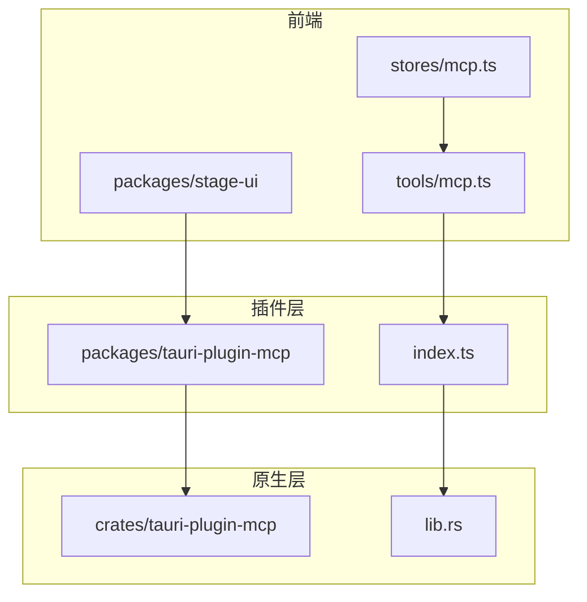
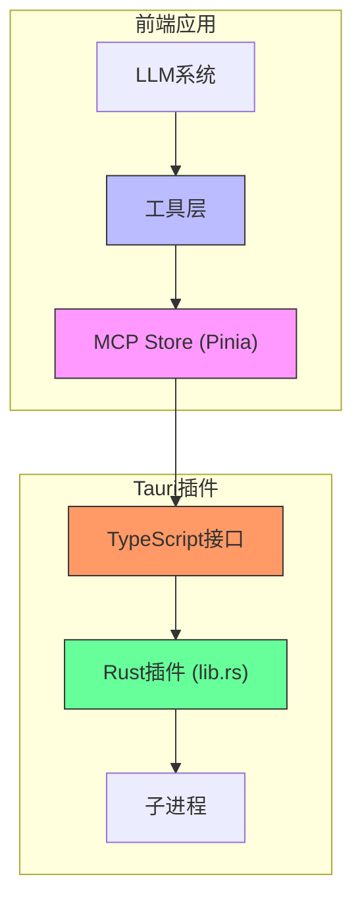
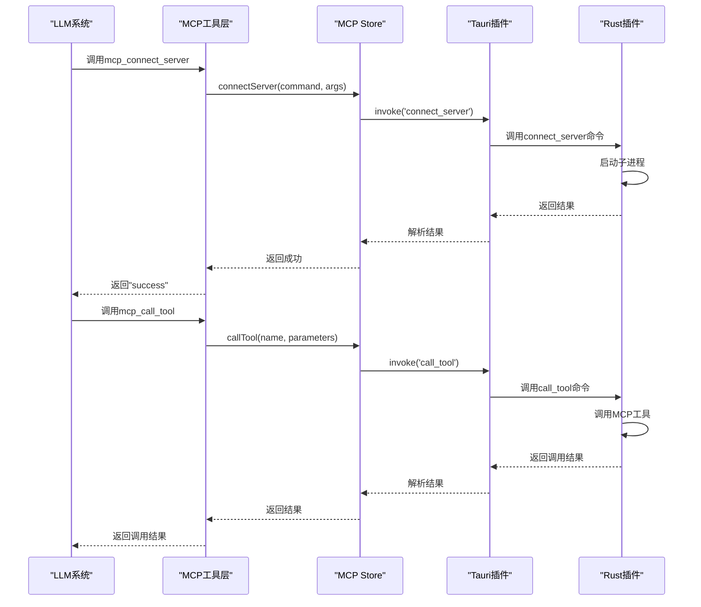
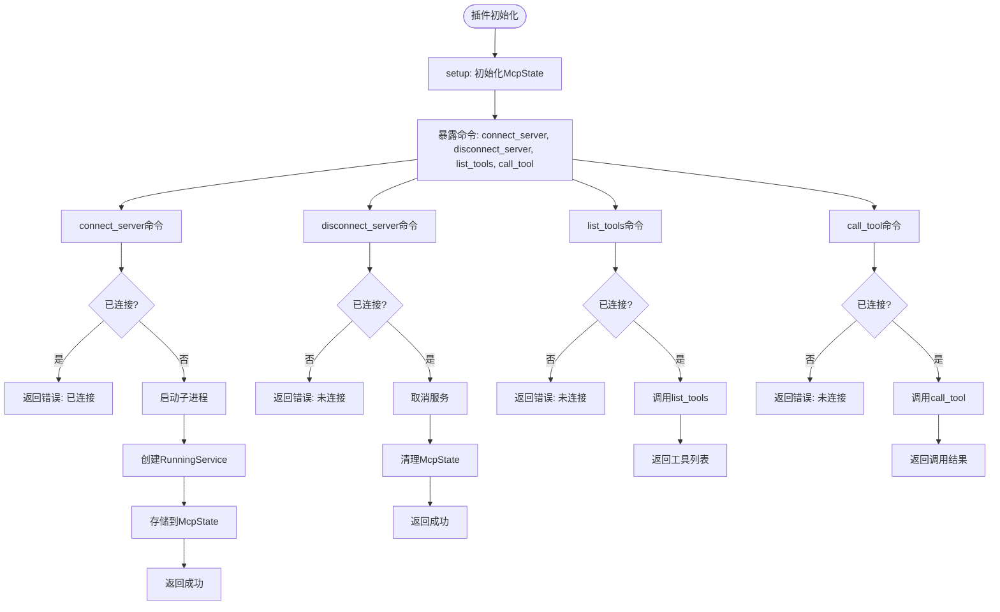
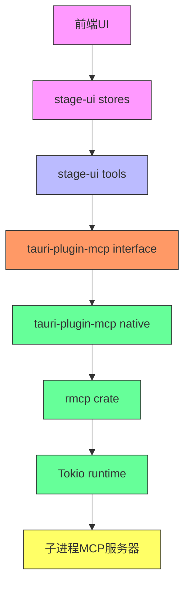

# MCP协议状态管理

<cite>
**本文档引用的文件**
- [mcp.ts](file://packages/stage-ui/src/stores/mcp.ts)
- [mcp.ts](file://packages/stage-ui/src/tools/mcp.ts)
- [lib.rs](file://crates/tauri-plugin-mcp/src/lib.rs)
- [index.ts](file://packages/tauri-plugin-mcp/src/index.ts)
</cite>

## 目录
1. [简介](#简介)
2. [项目结构](#项目结构)
3. [核心组件](#核心组件)
4. [架构概述](#架构概述)
5. [详细组件分析](#详细组件分析)
6. [依赖分析](#依赖分析)
7. [性能考虑](#性能考虑)
8. [故障排除指南](#故障排除指南)
9. [结论](#结论)

## 简介
本文档详细描述了MCP（Modular Control Protocol）协议的状态管理机制。重点分析了mcp store如何管理MCP协议的连接状态、工具调用和上下文同步，包括连接建立、心跳维护和异常恢复机制。文档还解释了其与llm store的集成方式，如何将LLM的工具调用请求转换为MCP协议消息。此外，文档涵盖了工具注册、发现和执行状态管理的实现细节，包括参数验证和错误传播。

## 项目结构
项目结构显示了MCP协议相关的组件分布在多个包和crates中。主要的MCP状态管理逻辑位于`packages/stage-ui/src/stores/mcp.ts`，而核心的Rust插件实现位于`crates/tauri-plugin-mcp/src/lib.rs`。前端工具集成在`packages/stage-ui/src/tools/mcp.ts`中，TypeScript接口定义在`packages/tauri-plugin-mcp/src/index.ts`。



**Diagram sources**
- [mcp.ts](file://packages/stage-ui/src/stores/mcp.ts)
- [mcp.ts](file://packages/stage-ui/src/tools/mcp.ts)
- [index.ts](file://packages/tauri-plugin-mcp/src/index.ts)
- [lib.rs](file://crates/tauri-plugin-mcp/src/lib.rs)

**Section sources**
- [mcp.ts](file://packages/stage-ui/src/stores/mcp.ts)
- [mcp.ts](file://packages/stage-ui/src/tools/mcp.ts)
- [index.ts](file://packages/tauri-plugin-mcp/src/index.ts)
- [lib.rs](file://crates/tauri-plugin-mcp/src/lib.rs)

## 核心组件
MCP协议状态管理的核心组件包括状态存储、工具集成和原生插件接口。状态存储使用Pinia管理连接状态和配置，工具集成将MCP功能暴露给LLM系统，原生插件通过Tauri提供Rust后端功能。

**Section sources**
- [mcp.ts](file://packages/stage-ui/src/stores/mcp.ts)
- [mcp.ts](file://packages/stage-ui/src/tools/mcp.ts)
- [index.ts](file://packages/tauri-plugin-mcp/src/index.ts)

## 架构概述
MCP协议状态管理采用分层架构，从前端UI到原生Rust插件形成清晰的调用链。前端通过Pinia store管理状态，通过工具层与LLM系统集成，通过Tauri插件接口调用原生功能。



**Diagram sources**
- [mcp.ts](file://packages/stage-ui/src/stores/mcp.ts)
- [mcp.ts](file://packages/stage-ui/src/tools/mcp.ts)
- [index.ts](file://packages/tauri-plugin-mcp/src/index.ts)
- [lib.rs](file://crates/tauri-plugin-mcp/src/lib.rs)

## 详细组件分析

### MCP状态存储分析
MCP状态存储使用Pinia实现，通过useLocalStorage在多个窗口间同步状态。存储包含服务器命令、参数和连接状态等关键信息。

```mermaid
classDiagram
class McpStore {
+serverCmd : string
+serverArgs : string
+connected : boolean
+connectServer(command : string, args : string[]) : Promise~void~
+disconnectServer() : Promise~void~
+listTools() : Promise~Tool[]~
+callTool(name : string, args : Record~string, unknown~) : Promise~CallToolResult~
}
class Tool {
+name : string
+description : string
+inputSchema : ToolInputSchema
}
class CallToolResult {
+content : {type : string, text : string}[]
+isError : boolean
}
class ToolInputSchema {
+required : string[]
+title : string
+type : 'object'
+properties : Record~string, Property~
}
class Property {
+title : string
+type : string
+default? : any
}
McpStore --> Tool : "列出"
McpStore --> CallToolResult : "调用返回"
Tool --> ToolInputSchema : "包含"
ToolInputSchema --> Property : "包含"
```

**Diagram sources**
- [mcp.ts](file://packages/stage-ui/src/stores/mcp.ts)

**Section sources**
- [mcp.ts](file://packages/stage-ui/src/stores/mcp.ts)

### MCP工具集成分析
MCP工具集成层将MCP功能包装为LLM可调用的工具。每个工具对应一个MCP操作，如连接服务器、断开连接、列出工具和调用工具。



**Diagram sources**
- [mcp.ts](file://packages/stage-ui/src/tools/mcp.ts)
- [index.ts](file://packages/tauri-plugin-mcp/src/index.ts)
- [lib.rs](file://crates/tauri-plugin-mcp/src/lib.rs)

**Section sources**
- [mcp.ts](file://packages/stage-ui/src/tools/mcp.ts)

### MCP原生插件分析
MCP原生插件使用Rust实现，通过Tauri框架暴露给前端。插件管理MCP客户端状态，处理与MCP服务器的通信。



**Diagram sources**
- [lib.rs](file://crates/tauri-plugin-mcp/src/lib.rs)

**Section sources**
- [lib.rs](file://crates/tauri-plugin-mcp/src/lib.rs)

## 依赖分析
MCP协议状态管理涉及多个层次的依赖关系，从前端到原生插件形成完整的调用链。



**Diagram sources**
- [mcp.ts](file://packages/stage-ui/src/stores/mcp.ts)
- [mcp.ts](file://packages/stage-ui/src/tools/mcp.ts)
- [index.ts](file://packages/tauri-plugin-mcp/src/index.ts)
- [lib.rs](file://crates/tauri-plugin-mcp/src/lib.rs)

**Section sources**
- [mcp.ts](file://packages/stage-ui/src/stores/mcp.ts)
- [mcp.ts](file://packages/stage-ui/src/tools/mcp.ts)
- [index.ts](file://packages/tauri-plugin-mcp/src/index.ts)
- [lib.rs](file://crates/tauri-plugin-mcp/src/lib.rs)

## 性能考虑
MCP协议状态管理的性能主要受子进程通信开销和序列化成本影响。建议复用连接以减少进程启动开销，批量处理工具调用以降低通信成本。

## 故障排除指南
常见问题包括连接失败、工具调用超时和参数验证错误。检查服务器命令和参数是否正确，确保MCP服务器可执行文件在路径中，验证工具参数符合schema要求。

**Section sources**
- [lib.rs](file://crates/tauri-plugin-mcp/src/lib.rs)
- [index.ts](file://packages/tauri-plugin-mcp/src/index.ts)

## 结论
MCP协议状态管理通过分层架构实现了从前端到原生代码的完整集成。状态存储、工具集成和原生插件协同工作，为LLM系统提供了可靠的工具调用能力。通过合理的错误处理和状态管理，系统能够稳定地处理MCP协议的连接和通信。