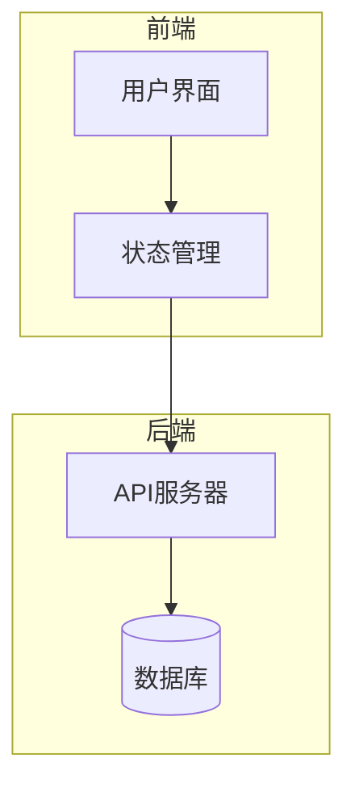
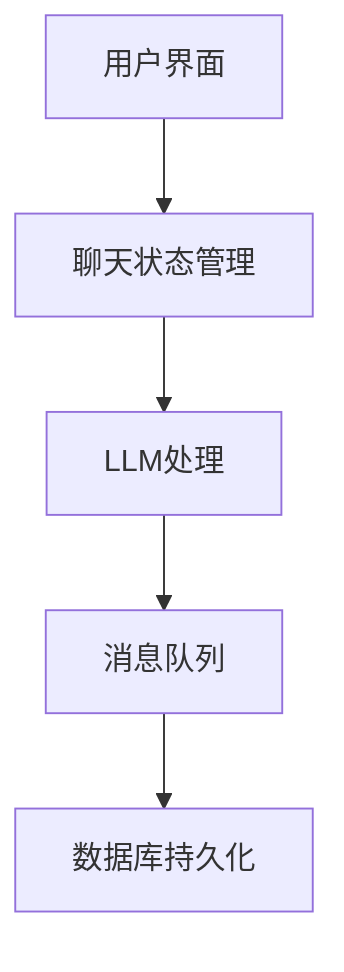
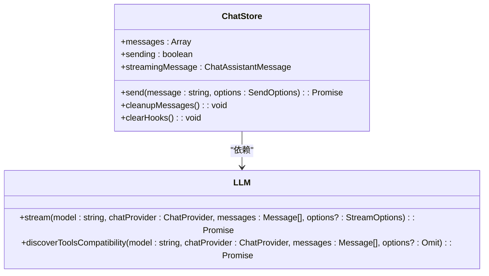
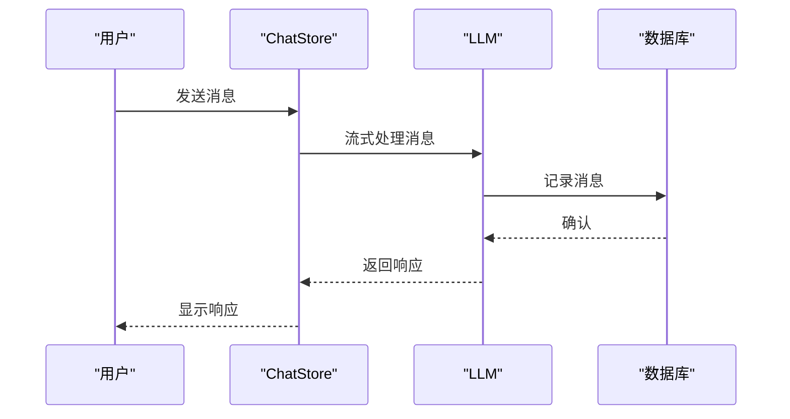
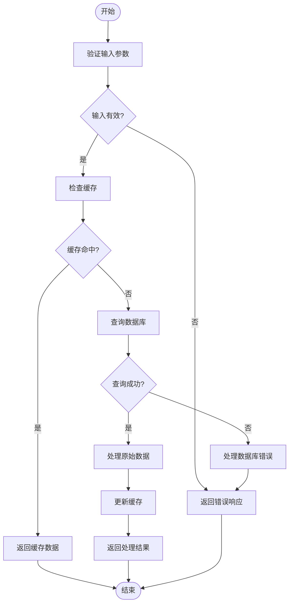
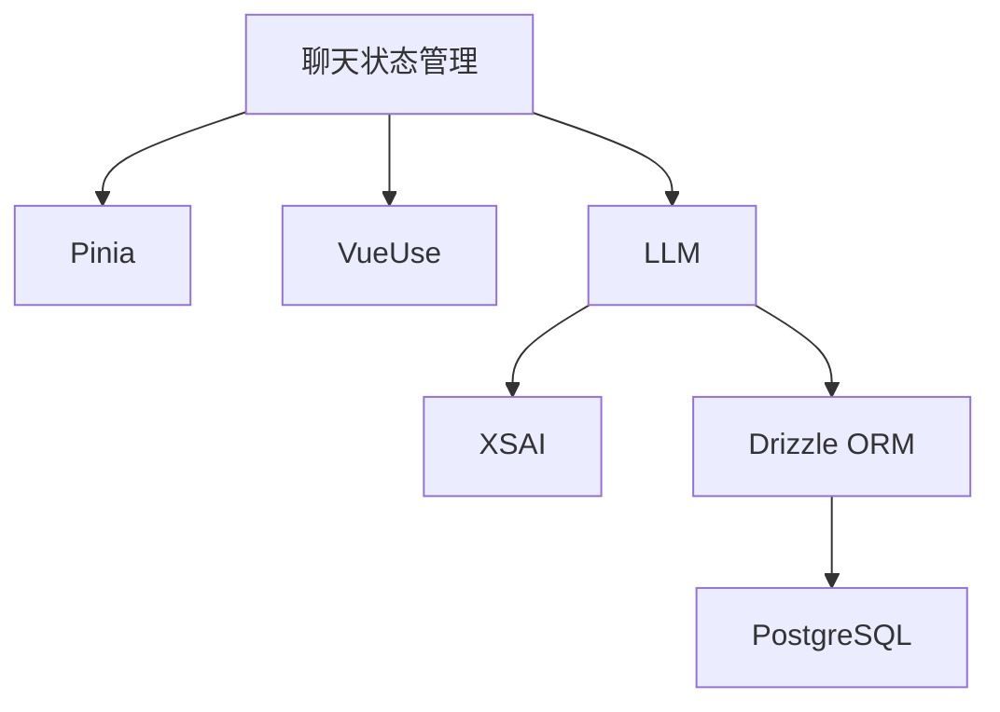

# 聊天状态管理

<cite>
**本文档中引用的文件**  
- [chat.ts](file://packages/stage-ui/src/stores/chat.ts)
- [llm.ts](file://packages/stage-ui/src/stores/llm.ts)
- [chat-message.ts](file://services/telegram-bot/src/models/chat-message.ts)
- [schema.ts](file://services/telegram-bot/src/db/schema.ts)
- [types/chat.ts](file://packages/stage-ui/src/types/chat.ts)
</cite>

## 目录
1. [简介](#简介)
2. [项目结构](#项目结构)
3. [核心组件](#核心组件)
4. [架构概述](#架构概述)
5. [详细组件分析](#详细组件分析)
6. [依赖分析](#依赖分析)
7. [性能考虑](#性能考虑)
8. [故障排除指南](#故障排除指南)
9. [结论](#结论)

## 简介
本文档深入探讨了聊天状态管理系统的实现细节，重点分析了聊天消息历史、消息队列和实时更新机制的管理方式。文档详细描述了消息的创建、更新和删除操作，以及与LLM store的协同工作模式。此外，还涵盖了聊天消息的数据模型定义、序列化/反序列化策略和本地持久化机制。

## 项目结构
项目结构清晰地展示了各个模块的组织方式，其中`packages/stage-ui`包含了核心的聊天状态管理逻辑，而`services/telegram-bot`则实现了具体的聊天消息处理和持久化。

**图表来源**
- [chat.ts](file://packages/stage-ui/src/stores/chat.ts#L1-L292)
- [schema.ts](file://services/telegram-bot/src/db/schema.ts#L2-L22)

**章节来源**
- [chat.ts](file://packages/stage-ui/src/stores/chat.ts#L1-L292)
- [schema.ts](file://services/telegram-bot/src/db/schema.ts#L1-L206)

## 核心组件
核心组件包括聊天状态管理(store)、LLM处理、消息队列和持久化机制。这些组件协同工作，确保聊天状态的实时更新和一致性。

**章节来源**
- [chat.ts](file://packages/stage-ui/src/stores/chat.ts#L21-L292)
- [llm.ts](file://packages/stage-ui/src/stores/llm.ts#L1-L169)

## 架构概述
系统架构采用分层设计，前端通过状态管理(store)与后端API通信，后端负责处理业务逻辑并与数据库交互。

**图表来源**
- [chat.ts](file://packages/stage-ui/src/stores/chat.ts#L21-L292)
- [chat-message.ts](file://services/telegram-bot/src/models/chat-message.ts#L1-L260)

## 详细组件分析

### 聊天状态管理分析
聊天状态管理组件负责维护聊天消息的历史记录、消息队列和实时更新机制。

#### 对象导向组件：

**图表来源**
- [chat.ts](file://packages/stage-ui/src/stores/chat.ts#L21-L292)
- [llm.ts](file://packages/stage-ui/src/stores/llm.ts#L1-L169)

#### API/服务组件：

**图表来源**
- [chat.ts](file://packages/stage-ui/src/stores/chat.ts#L21-L292)
- [chat-message.ts](file://services/telegram-bot/src/models/chat-message.ts#L1-L260)

### 复杂逻辑组件分析
复杂逻辑组件处理消息的创建、更新和删除操作，以及与LLM store的协同工作。

#### 算法实现流程图：

**图表来源**
- [chat-message.ts](file://services/telegram-bot/src/models/chat-message.ts#L73-L105)
- [schema.ts](file://services/telegram-bot/src/db/schema.ts#L2-L22)

**章节来源**
- [chat-message.ts](file://services/telegram-bot/src/models/chat-message.ts#L1-L260)
- [schema.ts](file://services/telegram-bot/src/db/schema.ts#L1-L206)

## 依赖分析
系统依赖于多个外部库和内部模块，包括状态管理、LLM处理、数据库操作等。

**图表来源**
- [chat.ts](file://packages/stage-ui/src/stores/chat.ts#L1-L292)
- [llm.ts](file://packages/stage-ui/src/stores/llm.ts#L1-L169)
- [schema.ts](file://services/telegram-bot/src/db/schema.ts#L1-L206)

**章节来源**
- [chat.ts](file://packages/stage-ui/src/stores/chat.ts#L1-L292)
- [llm.ts](file://packages/stage-ui/src/stores/llm.ts#L1-L169)
- [schema.ts](file://services/telegram-bot/src/db/schema.ts#L1-L206)

## 性能考虑
系统在处理大型聊天历史时采用了分页加载和内存优化策略，确保性能和用户体验。

**章节来源**
- [chat-message.ts](file://services/telegram-bot/src/models/chat-message.ts#L73-L105)
- [chat.ts](file://packages/stage-ui/src/stores/chat.ts#L21-L292)

## 故障排除指南
常见问题包括消息发送失败、LLM响应延迟等，可通过检查网络连接、API密钥和数据库状态来解决。

**章节来源**
- [chat.ts](file://packages/stage-ui/src/stores/chat.ts#L21-L292)
- [chat-message.ts](file://services/telegram-bot/src/models/chat-message.ts#L1-L260)

## 结论
本文档详细介绍了聊天状态管理系统的各个方面，从核心组件到架构设计，再到性能优化和故障排除。通过深入分析，我们能够更好地理解和维护这一复杂系统。