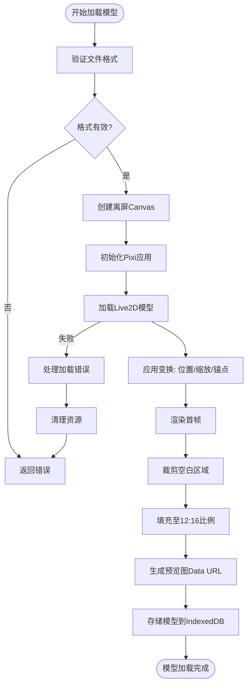
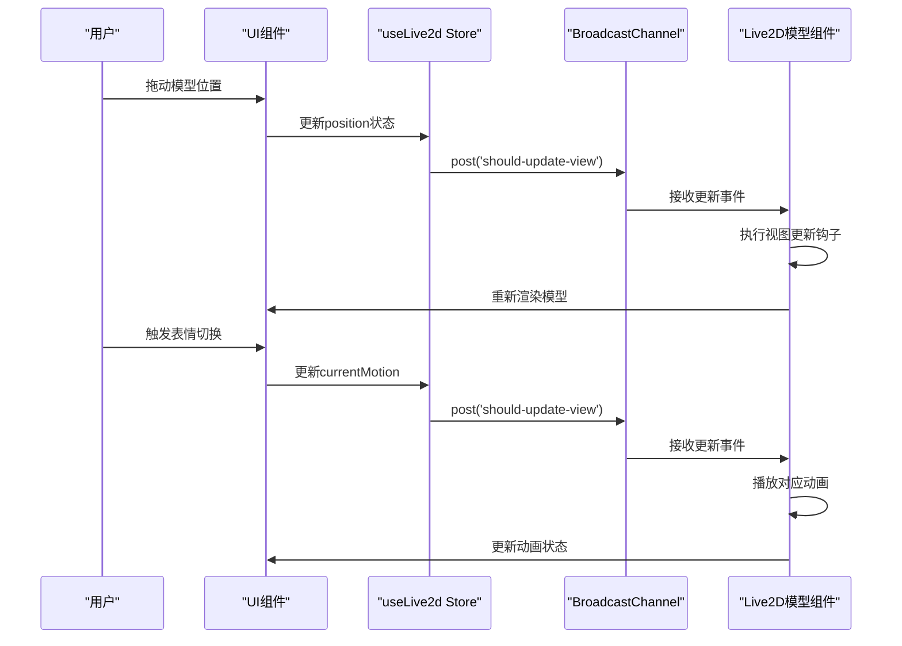
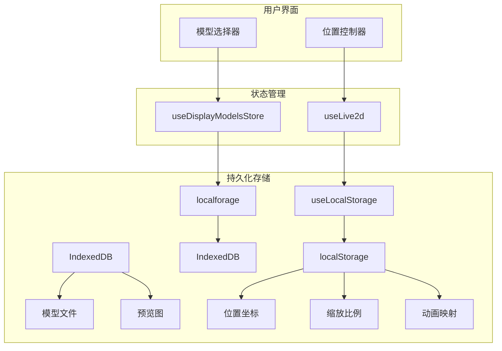

# UI状态管理

<cite>
**本文档引用的文件**
- [window.ts](file://apps/stage-tamagotchi/src/renderer/stores/window.ts)
- [display-models.ts](file://packages/stage-ui/src/stores/display-models.ts)
- [live2d.ts](file://packages/stage-ui/src/stores/live2d.ts)
- [use-electron-relative-mouse/index.ts](file://apps/stage-tamagotchi/src/renderer/composables/electron-vueuse/use-electron-relative-mouse/index.ts)
- [settings.ts](file://packages/stage-ui/src/stores/settings.ts)
</cite>

## 目录
1. [简介](#简介)
2. [窗口状态管理](#窗口状态管理)
3. [显示模型与Live2D状态协同](#显示模型与live2d状态协同)
4. [模型加载与渲染机制](#模型加载与渲染机制)
5. [用户交互与响应式更新](#用户交互与响应式更新)
6. [状态持久化与存储](#状态持久化与存储)

## 简介
本文档详细阐述了Airi项目中UI状态管理的核心机制，重点分析了窗口状态、3D模型和Live2D角色的管理方式。系统通过Pinia状态管理库实现响应式数据流，结合Electron原生能力，实现了跨平台的窗口控制、模型管理和用户交互响应。

## 窗口状态管理

窗口状态管理主要通过`useWindowStore`实现，该store负责跟踪窗口尺寸、位置和鼠标交互状态。系统利用VueUse提供的`useWindowSize`获取实时窗口宽高，并通过计算属性生成窗口中心坐标。

```mermaid
classDiagram
class useWindowStore {
+width : Ref<number>
+height : Ref<number>
+centerPos : ComputedRef<{x : number, y : number}>
+live2dLookAtX : ComputedRef<number>
+live2dLookAtY : ComputedRef<number>
}
useWindowStore --> useWindowSize : "依赖"
useWindowStore --> useElectronRelativeMouse : "依赖"
```

**图示来源**
- [window.ts](file://apps/stage-tamagotchi/src/renderer/stores/window.ts#L6-L21)

**本节来源**
- [window.ts](file://apps/stage-tamagotchi/src/renderer/stores/window.ts#L6-L21)
- [use-electron-relative-mouse/index.ts](file://apps/stage-tamagotchi/src/renderer/composables/electron-vueuse/use-electron-relative-mouse/index.ts#L7-L20)

## 显示模型与Live2D状态协同

显示模型(store: `useDisplayModelsStore`)与Live2D状态(store: `useLive2d`)通过预设机制和状态绑定实现协同工作。系统定义了多种模型格式枚举，包括Live2D压缩包、VRM模型等，并通过IndexedDB进行持久化存储。

```mermaid
classDiagram
class DisplayModelFormat {
+Live2dZip : 'live2d-zip'
+Live2dDirectory : 'live2d-directory'
+VRM : 'vrm'
+PMXZip : 'pmx-zip'
+PMXDirectory : 'pmx-directory'
+PMD : 'pmd'
}
class useDisplayModelsStore {
+displayModels : Ref<DisplayModel[]>
+loadDisplayModelsFromIndexedDB()
+getDisplayModel(id)
+addDisplayModel(format, file)
+removeDisplayModel(id)
}
class useLive2d {
+position : Ref<{x : number, y : number}>
+currentMotion : Ref<{group : string, index? : number}>
+availableMotions : Ref<Array>
+motionMap : Ref<Record<string, string>>
+scale : Ref<number>
+shouldUpdateView()
}
useDisplayModelsStore --> localforage : "数据存储"
useLive2d --> useBroadcastChannel : "跨上下文通信"
settings.ts --> useDisplayModelsStore : "模型选择"
settings.ts --> useLive2d : "位置与动画控制"
```

**图示来源**
- [display-models.ts](file://packages/stage-ui/src/stores/display-models.ts#L54-L207)
- [live2d.ts](file://packages/stage-ui/src/stores/live2d.ts#L0-L35)

**本节来源**
- [display-models.ts](file://packages/stage-ui/src/stores/display-models.ts#L54-L207)
- [live2d.ts](file://packages/stage-ui/src/stores/live2d.ts#L0-L35)
- [settings.ts](file://packages/stage-ui/src/stores/settings.ts#L38-L79)

## 模型加载与渲染机制

模型加载机制采用异步预加载和缓存策略。系统通过`loadLive2DModelPreview`方法创建离屏Canvas进行模型预览图生成，利用PixiJS渲染引擎实现高质量的2D渲染。模型加载过程包括资源解压、纹理处理和姿态调整等步骤。



**图示来源**
- [display-models.ts](file://packages/stage-ui/src/stores/display-models.ts#L100-L158)

**本节来源**
- [display-models.ts](file://packages/stage-ui/src/stores/display-models.ts#L100-L158)
- [Live2DModel.vue](file://packages/stage-ui/src/components/scenes/live2d/Model.vue#L116-L165)

## 用户交互与响应式更新

用户交互系统通过广播通道(BroadcastChannel)实现跨上下文的状态同步。当Live2D模型需要更新视图时，通过`shouldUpdateView`方法发布事件，所有注册的钩子函数将被调用。系统采用计算属性和监听器实现响应式更新，确保UI状态与用户操作实时同步。



**图示来源**
- [live2d.ts](file://packages/stage-ui/src/stores/live2d.ts#L0-L35)
- [Live2DModel.vue](file://packages/stage-ui/src/components/scenes/live2d/Model.vue#L294-L330)

**本节来源**
- [live2d.ts](file://packages/stage-ui/src/stores/live2d.ts#L0-L35)
- [Live2DModel.vue](file://packages/stage-ui/src/components/scenes/live2d/Model.vue#L294-L330)

## 状态持久化与存储

系统采用多层次的持久化策略。窗口位置、缩放比例等用户偏好设置通过`useLocalStorage`存储在本地；显示模型文件则使用`localforage`库存储在IndexedDB中，支持大文件存储和离线访问。系统还实现了版本化本地存储机制，确保配置的向前兼容性。



**图示来源**
- [live2d.ts](file://packages/stage-ui/src/stores/live2d.ts#L0-L35)
- [display-models.ts](file://packages/stage-ui/src/stores/display-models.ts#L54-L207)

**本节来源**
- [live2d.ts](file://packages/stage-ui/src/stores/live2d.ts#L0-L35)
- [display-models.ts](file://packages/stage-ui/src/stores/display-models.ts#L54-L207)
- [use-versioned-local-storage/index.ts](file://apps/stage-tamagotchi/src/renderer/composables/vueuse/use-versioned-local-storage/index.ts#L0-L28)