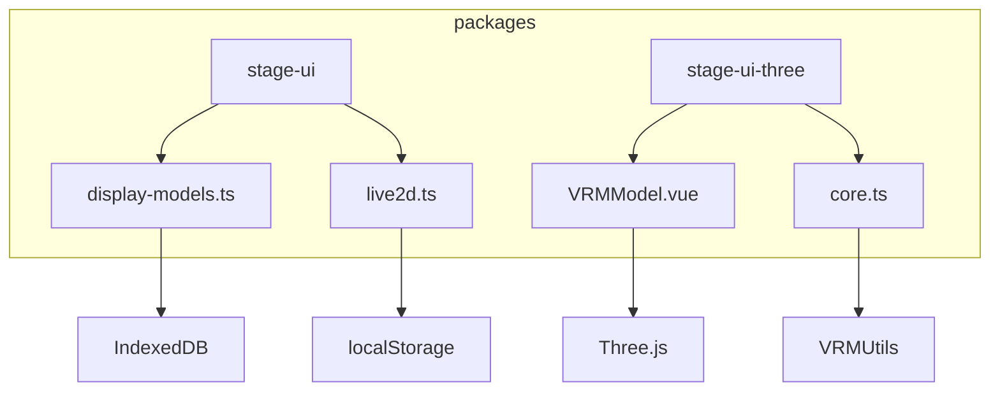
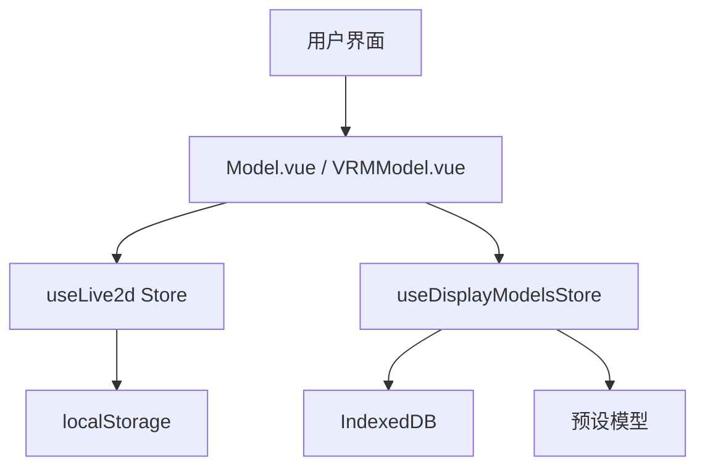
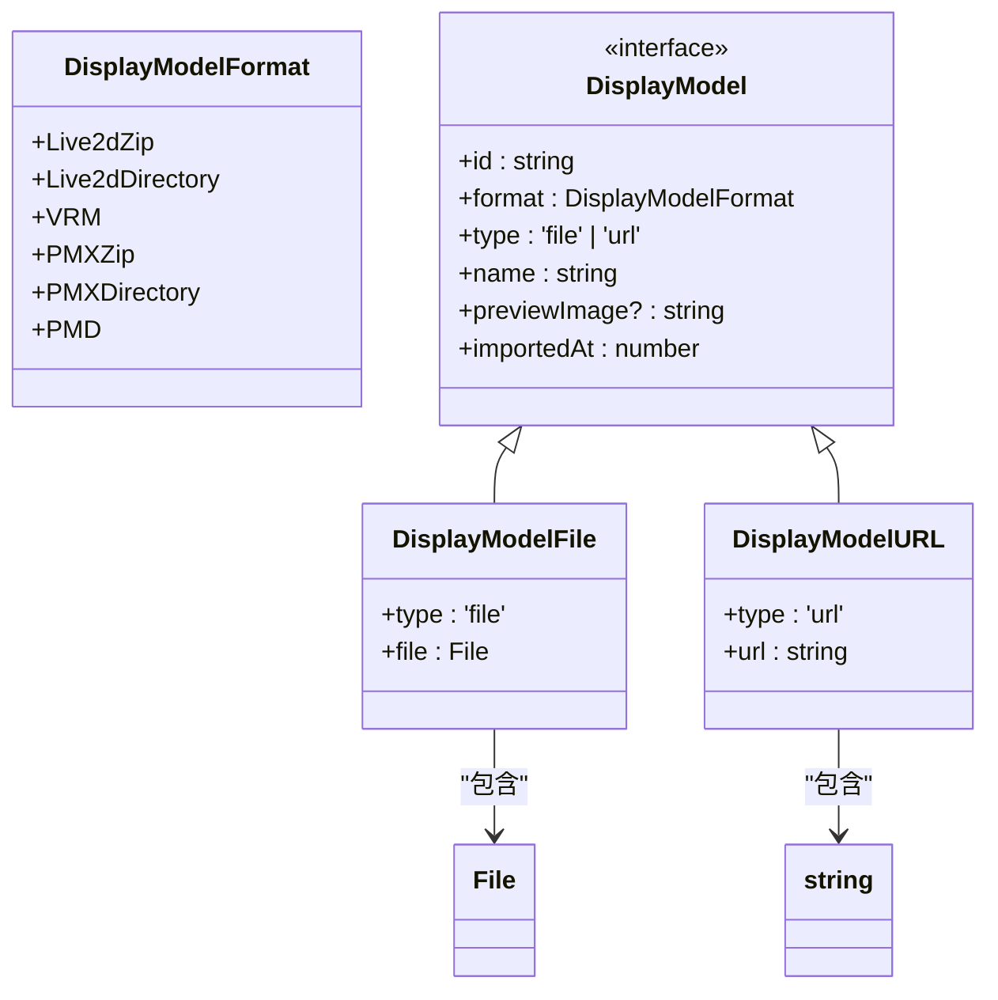
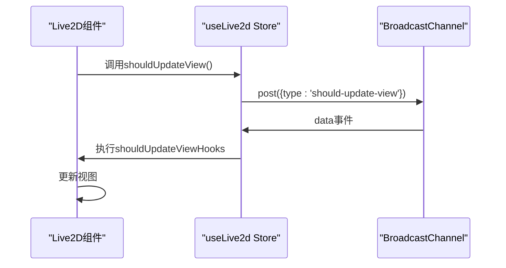
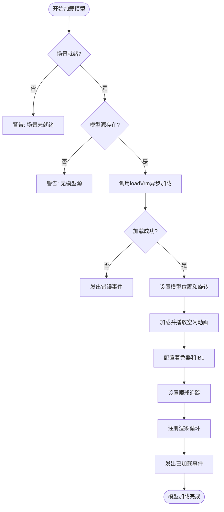

# 模型状态管理

<cite>
**本文档中引用的文件**  
- [display-models.ts](file://packages/stage-ui/src/stores/display-models.ts)
- [live2d.ts](file://packages/stage-ui/src/stores/live2d.ts)
- [Model.vue](file://packages/stage-ui/src/components/scenes/live2d/Model.vue)
- [VRMModel.vue](file://packages/stage-ui-three/src/components/Model/VRMModel.vue)
- [core.ts](file://packages/stage-ui-three/src/composables/vrm/core.ts)
</cite>

## 目录
1. [简介](#简介)
2. [项目结构](#项目结构)
3. [核心组件](#核心组件)
4. [架构概述](#架构概述)
5. [详细组件分析](#详细组件分析)
6. [依赖分析](#依赖分析)
7. [性能考虑](#性能考虑)
8. [故障排除指南](#故障排除指南)
9. [结论](#结论)

## 简介
本项目旨在实现3D模型（VRM）和Live2D角色的高效状态管理。系统通过`display-models`和`live2d`两个核心store协同工作，管理模型的加载、卸载、动画状态、表情切换和渲染参数。模型资源采用异步加载机制，结合IndexedDB进行持久化存储，确保快速访问和离线可用性。动画状态机支持空闲、说话、情绪变化等状态的平滑过渡，并与音频系统（TTS）同步，实现自然的交互体验。

## 项目结构
项目采用模块化设计，核心模型管理功能集中在`packages/stage-ui`和`packages/stage-ui-three`包中。`stage-ui`负责Live2D模型的管理和2D渲染，而`stage-ui-three`则利用Three.js处理VRM 3D模型。模型数据通过Pinia store进行集中管理，确保状态的一致性和可预测性。



**图表来源**
- [display-models.ts](file://packages/stage-ui/src/stores/display-models.ts#L1-L209)
- [live2d.ts](file://packages/stage-ui/src/stores/live2d.ts#L1-L53)
- [VRMModel.vue](file://packages/stage-ui-three/src/components/Model/VRMModel.vue#L1-L575)
- [core.ts](file://packages/stage-ui-three/src/composables/vrm/core.ts#L1-L134)

**章节来源**
- [display-models.ts](file://packages/stage-ui/src/stores/display-models.ts#L1-L209)
- [live2d.ts](file://packages/stage-ui/src/stores/live2d.ts#L1-L53)

## 核心组件
核心组件包括`useDisplayModelsStore`和`useLive2d`两个Pinia store。`useDisplayModelsStore`负责管理所有可显示模型的元数据和文件，支持Live2D ZIP和VRM格式。`useLive2d` store则专注于Live2D模型的运行时状态，如位置、缩放和当前动作。两个store通过清晰的API边界分离关注点，一个负责“拥有什么”，另一个负责“如何显示”。

**章节来源**
- [display-models.ts](file://packages/stage-ui/src/stores/display-models.ts#L54-L207)
- [live2d.ts](file://packages/stage-ui/src/stores/live2d.ts#L11-L51)

## 架构概述
系统架构分为数据层、状态层和视图层。数据层通过`localforage`与IndexedDB交互，持久化存储模型文件。状态层由Pinia store构成，提供统一的API来操作模型数据和状态。视图层的组件（如`Model.vue`和`VRMModel.vue`）订阅store状态，并负责实际的渲染和用户交互。这种分层架构确保了数据流的单向性和可维护性。



**图表来源**
- [display-models.ts](file://packages/stage-ui/src/stores/display-models.ts#L54-L207)
- [live2d.ts](file://packages/stage-ui/src/stores/live2d.ts#L11-L51)
- [Model.vue](file://packages/stage-ui/src/components/scenes/live2d/Model.vue#L1-L424)
- [VRMModel.vue](file://packages/stage-ui-three/src/components/Model/VRMModel.vue#L1-L575)

## 详细组件分析

### display-models Store 分析
`useDisplayModelsStore`是模型资源的管理中心。它定义了`DisplayModel`联合类型，区分文件和URL来源的模型。store通过`loadDisplayModelsFromIndexedDB`方法在初始化时从IndexedDB加载所有已保存的模型，并与预设模型合并。`addDisplayModel`方法允许用户添加新模型，对于Live2D ZIP文件，它会先生成一个预览图。所有模型按导入时间排序，确保最新添加的模型排在最前面。

#### 类图


**图表来源**
- [display-models.ts](file://packages/stage-ui/src/stores/display-models.ts#L8-L48)

**章节来源**
- [display-models.ts](file://packages/stage-ui/src/stores/display-models.ts#L54-L207)

### live2d Store 分析
`useLive2d` store管理Live2D模型的运行时状态。它使用`useLocalStorage`将位置和缩放等用户偏好持久化到localStorage。`currentMotion` ref跟踪当前播放的动作组，如“Idle”或“Talk”。store还通过BroadcastChannel实现跨组件通信，当状态更新时通知所有监听者重新渲染视图。

#### 序列图


**图表来源**
- [live2d.ts](file://packages/stage-ui/src/stores/live2d.ts#L11-L51)

**章节来源**
- [live2d.ts](file://packages/stage-ui/src/stores/live2d.ts#L11-L51)

### 模型加载与渲染分析
模型的加载和渲染由`Model.vue`和`VRMModel.vue`组件完成。`Model.vue`使用PixiJS渲染Live2D模型，通过`Live2DFactory.setupLive2DModel`异步加载模型文件。组件内部通过`motionManager.update`的hook实现自定义逻辑，如节拍同步和空闲时的眼球运动。`VRMModel.vue`则使用`@pixiv/three-vrm`库加载VRM模型，通过`loadVrm`函数处理模型的初始化，包括计算包围盒、设置初始相机位置和配置动画混合器。

#### 流程图


**图表来源**
- [VRMModel.vue](file://packages/stage-ui-three/src/components/Model/VRMModel.vue#L226-L370)
- [core.ts](file://packages/stage-ui-three/src/composables/vrm/core.ts#L0-L134)

**章节来源**
- [VRMModel.vue](file://packages/stage-ui-three/src/components/Model/VRMModel.vue#L226-L574)
- [core.ts](file://packages/stage-ui-three/src/composables/vrm/core.ts#L0-L134)

## 依赖分析
系统依赖于多个关键库：`pinia`用于状态管理，`localforage`用于IndexedDB的简化访问，`pixi-live2d-display`用于Live2D渲染，`@pixiv/three-vrm`用于VRM 3D模型处理。这些依赖通过`package.json`在`packages/stage-ui`和`packages/stage-ui-three`中声明，确保了版本的一致性和可复现的构建。

```mermaid
graph LR
A[display-models.ts] --> B[localforage]
A --> C[pixi-live2d-display]
D[live2d.ts] --> E[@vueuse/core]
F[VRMModel.vue] --> G[@pixiv/three-vrm]
F --> H[@tresjs/core]
```

**图表来源**
- [display-models.ts](file://packages/stage-ui/src/stores/display-models.ts#L1-L209)
- [live2d.ts](file://packages/stage-ui/src/stores/live2d.ts#L1-L53)
- [VRMModel.vue](file://packages/stage-ui-three/src/components/Model/VRMModel.vue#L1-L575)

**章节来源**
- [display-models.ts](file://packages/stage-ui/src/stores/display-models.ts#L1-L209)
- [live2d.ts](file://packages/stage-ui/src/stores/live2d.ts#L1-L53)
- [VRMModel.vue](file://packages/stage-ui-three/src/components/Model/VRMModel.vue#L1-L575)

## 性能考虑
为了优化性能，系统在多个层面进行了设计。在模型加载时，`loadVrm`函数调用`VRMUtils.removeUnnecessaryVertices`和`VRMUtils.combineSkeletons`来减少渲染开销。对于Live2D模型，`loadModel`方法通过hook `motionManager.update`，将节拍同步和眼球运动的计算合并到一次更新中，避免了多次遍历。此外，使用`shallowRef`和`computed`等Vue响应式API，确保了只有必要的组件才会在状态变化时重新渲染。

## 故障排除指南
常见问题包括模型加载失败和动画不播放。若模型加载失败，请检查`modelSrc`是否正确，并确认网络或文件路径可访问。若动画不播放，确保`vrmAnimationMixer`已正确初始化并调用了`clipAction(clip).play()`。对于Live2D模型，检查`motionManager.definitions`是否包含有效的动作定义。使用浏览器的开发者工具检查控制台错误和网络请求，是诊断问题的第一步。

**章节来源**
- [VRMModel.vue](file://packages/stage-ui-three/src/components/Model/VRMModel.vue#L270-L315)
- [Model.vue](file://packages/stage-ui/src/components/scenes/live2d/Model.vue#L116-L165)

## 结论
该模型状态管理系统通过清晰的分层架构和模块化设计，有效地管理了复杂的3D和2D角色模型。`display-models`和`live2d` store的协同工作，实现了从资源管理到运行时状态控制的完整生命周期。异步加载和IndexedDB持久化确保了良好的用户体验，而与音频系统的同步机制则为创建生动的虚拟角色奠定了基础。未来的工作可以集中在优化内存管理和扩展对更多模型格式的支持上。