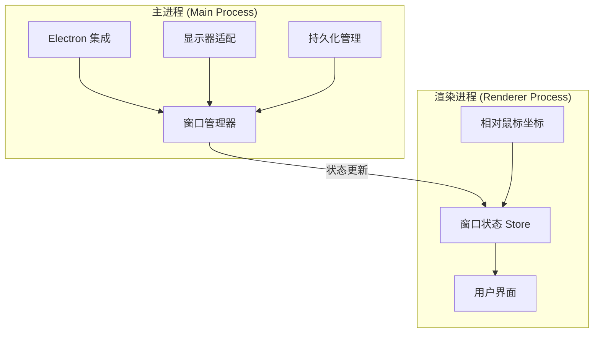
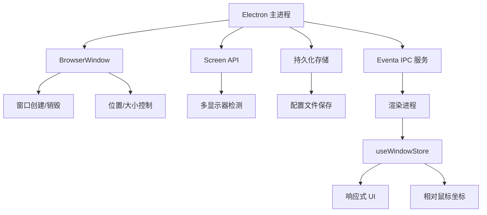
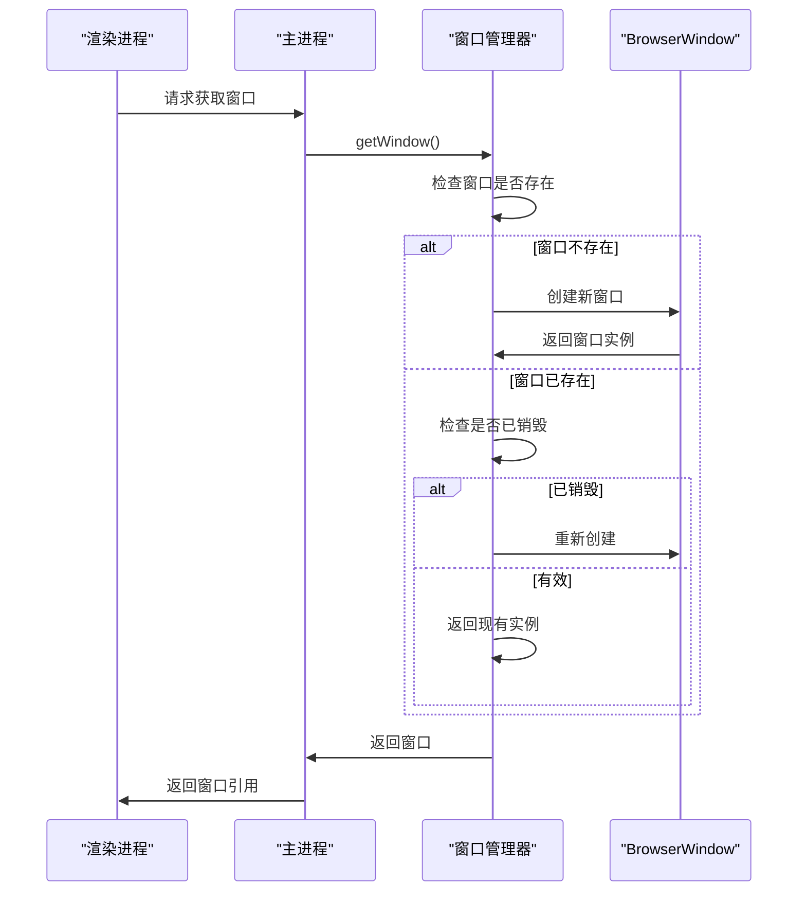
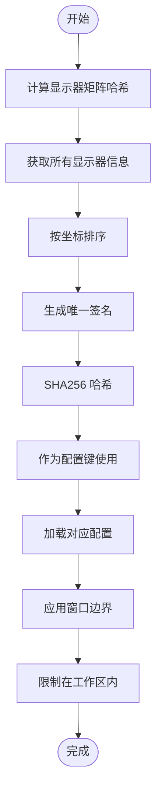
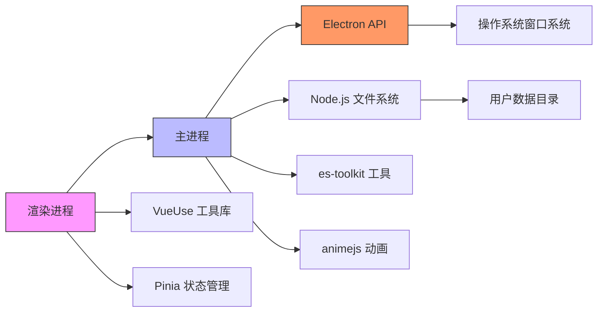

# 窗口状态管理

<cite>
**本文档中引用的文件**  
- [window.ts](file://apps/stage-tamagotchi/src/main/services/electron/window.ts)
- [screen.ts](file://apps/stage-tamagotchi/src/main/services/electron/screen.ts)
- [window.ts](file://packages/stage-shared/src/window.ts)
- [window-store.ts](file://apps/stage-tamagotchi/src/renderer/stores/window.ts)
- [use-electron-relative-mouse.ts](file://apps/stage-tamagotchi/src/renderer/composables/electron-vueuse/use-electron-relative-mouse/index.ts)
- [reusable.ts](file://apps/stage-tamagotchi/src/main/libs/electron/window-manager/reusable.ts)
- [persistence.ts](file://apps/stage-tamagotchi/src/main/windows/shared/persistence.ts)
- [caption.ts](file://apps/stage-tamagotchi/src/main/windows/caption/index.ts)
- [display.ts](file://apps/stage-tamagotchi/src/main/windows/shared/display.ts)
</cite>

## 目录
1. [项目结构](#项目结构)
2. [核心组件](#核心组件)
3. [架构概述](#架构概述)
4. [详细组件分析](#详细组件分析)
5. [依赖分析](#依赖分析)
6. [性能考虑](#性能考虑)
7. [故障排除指南](#故障排除指南)
8. [结论](#结论)

## 项目结构

本项目采用模块化分层架构，将窗口管理功能划分为主进程（main process）与渲染进程（renderer process）两个主要部分。主进程负责窗口生命周期控制、跨显示器适配和状态持久化，而渲染进程则通过响应式状态管理实现UI同步。



**图示来源**  
- [window.ts](file://apps/stage-tamagotchi/src/main/services/electron/window.ts#L1-L43)
- [window-store.ts](file://apps/stage-tamagotchi/src/renderer/stores/window.ts#L1-L22)

**本节来源**  
- [window.ts](file://apps/stage-tamagotchi/src/main/services/electron/window.ts#L1-L43)
- [window-store.ts](file://apps/stage-tamagotchi/src/renderer/stores/window.ts#L1-L22)

## 核心组件

系统通过 `useWindowStore` 实现响应式窗口状态管理，结合 Electron 的原生能力实现跨平台一致的行为控制。核心机制包括：

- **窗口位置与大小管理**：基于显示器工作区边界进行智能定位与尺寸计算
- **可见性与焦点控制**：集成 `toggleWindowShow` 方法统一处理显示/隐藏逻辑
- **多显示器适配**：通过 `computeDisplayMatrixHash` 检测显示配置变化并自动调整
- **状态持久化**：使用 `createConfig` 在用户数据目录中保存窗口布局
- **响应式更新**：利用 VueUse 的 `useWindowSize` 和 Pinia 实现自动状态同步

**本节来源**  
- [window-store.ts](file://apps/stage-tamagotchi/src/renderer/stores/window.ts#L6-L21)
- [caption.ts](file://apps/stage-tamagotchi/src/main/windows/caption/index.ts#L135-L383)

## 架构概述

系统采用分层架构设计，确保窗口状态管理的可维护性和可扩展性。主进程通过 Electron API 管理原生窗口对象，同时向渲染进程暴露安全的 IPC 接口。渲染进程则通过组合式 API 消费状态，实现解耦的 UI 更新机制。



**图示来源**  
- [window.ts](file://apps/stage-tamagotchi/src/main/services/electron/window.ts#L1-L43)
- [screen.ts](file://apps/stage-tamagotchi/src/main/services/electron/screen.ts#L1-L31)

## 详细组件分析

### 窗口状态存储分析

`useWindowStore` 是基于 Pinia 的响应式状态容器，负责管理渲染进程中的窗口相关状态。

```mermaid
classDiagram
class useWindowStore {
+width : ShallowRef<number>
+height : ShallowRef<number>
+centerPos : ComputedRef<{x, y}>
+live2dLookAtX : ComputedRef<number>
+live2dLookAtY : ComputedRef<number>
}
useWindowStore --> useWindowSize : "依赖"
useWindowStore --> useElectronRelativeMouse : "依赖"
```

**图示来源**  
- [window-store.ts](file://apps/stage-tamagotchi/src/renderer/stores/window.ts#L6-L21)
- [use-electron-relative-mouse.ts](file://apps/stage-tamagotchi/src/renderer/composables/electron-vueuse/use-electron-relative-mouse/index.ts#L7-L20)

**本节来源**  
- [window-store.ts](file://apps/stage-tamagotchi/src/renderer/stores/window.ts#L6-L21)

### 窗口生命周期管理分析

系统通过 `createReusableWindow` 实现窗口的可复用管理，确保单例窗口的正确生命周期控制。



**图示来源**  
- [reusable.ts](file://apps/stage-tamagotchi/src/main/libs/electron/window-manager/reusable.ts#L2-L19)
- [caption.ts](file://apps/stage-tamagotchi/src/main/windows/caption/index.ts#L93-L133)

**本节来源**  
- [reusable.ts](file://apps/stage-tamagotchi/src/main/libs/electron/window-manager/reusable.ts#L2-L19)

### 多显示器适配分析

系统通过 `computeDisplayMatrixHash` 实现多显示器环境下的布局持久化，确保显示器配置变化时窗口能正确恢复位置。



**图示来源**  
- [caption.ts](file://apps/stage-tamagotchi/src/main/windows/caption/index.ts#L135-L383)
- [display.ts](file://apps/stage-tamagotchi/src/main/windows/shared/display.ts#L1-L165)

**本节来源**  
- [caption.ts](file://apps/stage-tamagotchi/src/main/windows/caption/index.ts#L135-L383)

## 依赖分析

系统依赖关系清晰，各模块职责分明，通过明确的接口进行通信。



**图示来源**  
- [window.ts](file://apps/stage-tamagotchi/src/main/services/electron/window.ts#L1-L43)
- [persistence.ts](file://apps/stage-tamagotchi/src/main/windows/shared/persistence.ts#L1-L52)

**本节来源**  
- [window.ts](file://apps/stage-tamagotchi/src/main/services/electron/window.ts#L1-L43)
- [persistence.ts](file://apps/stage-tamagotchi/src/main/windows/shared/persistence.ts#L1-L52)

## 性能考虑

系统在窗口状态管理方面进行了多项性能优化：

- **节流与防抖**：对窗口移动和调整大小事件使用 `throttle` 和 `debounce`，避免频繁的配置保存
- **延迟加载**：仅在需要时创建窗口实例，减少启动时的资源消耗
- **动画优化**：使用 `animejs` 实现平滑的窗口位置过渡，提升用户体验
- **内存管理**：通过 `isDestroyed()` 检查避免对已销毁窗口的操作
- **事件清理**：在窗口关闭时正确移除事件监听器，防止内存泄漏

这些优化确保了即使在多显示器、高刷新率环境下也能保持流畅的窗口管理体验。

## 故障排除指南

### 常见问题及解决方案

1. **窗口位置未正确保存**
   - 检查用户数据目录是否有写入权限
   - 确认 `createConfig` 的命名空间和文件名是否正确
   - 验证 `updateConfig` 调用是否在正确的时机执行

2. **多显示器切换后窗口消失**
   - 确保 `clampBoundsWithinRect` 正确限制窗口在工作区内
   - 检查 `getDisplayMatching` 是否准确识别目标显示器
   - 验证 `computeDisplayMatrixHash` 是否正确反映显示器配置

3. **窗口动画卡顿**
   - 检查 `throttle` 的间隔是否设置合理（当前为 16.7ms，约 60fps）
   - 确认 `animejs` 动画配置的 `duration` 是否过长
   - 验证是否在主线程执行了耗时操作

4. **IPC 通信失败**
   - 确保 `defineInvokeHandler` 的上下文匹配
   - 检查 `ipcMain.setMaxListeners` 是否设置足够高的限制
   - 验证事件发射和监听的命名一致性

**本节来源**  
- [persistence.ts](file://apps/stage-tamagotchi/src/main/windows/shared/persistence.ts#L1-L52)
- [window.ts](file://apps/stage-tamagotchi/src/main/services/electron/window.ts#L1-L43)

## 结论

本窗口状态管理系统通过精心设计的架构实现了跨平台、响应式的窗口管理功能。系统成功整合了 Electron 的原生能力与现代前端响应式编程范式，提供了稳定可靠的窗口控制机制。关键优势包括：

- **响应式架构**：基于 Pinia 和 VueUse 的响应式状态流
- **智能布局**：自适应多显示器环境的智能定位算法
- **状态持久化**：可靠的配置保存与恢复机制
- **性能优化**：节流、防抖和动画优化确保流畅体验
- **跨平台兼容**：针对 macOS 特性的专门处理（如窗口按钮可见性）

该系统为复杂桌面应用的窗口管理提供了可复用的解决方案，具有良好的扩展性和维护性。