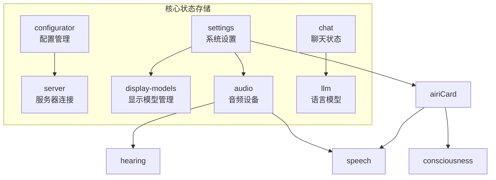
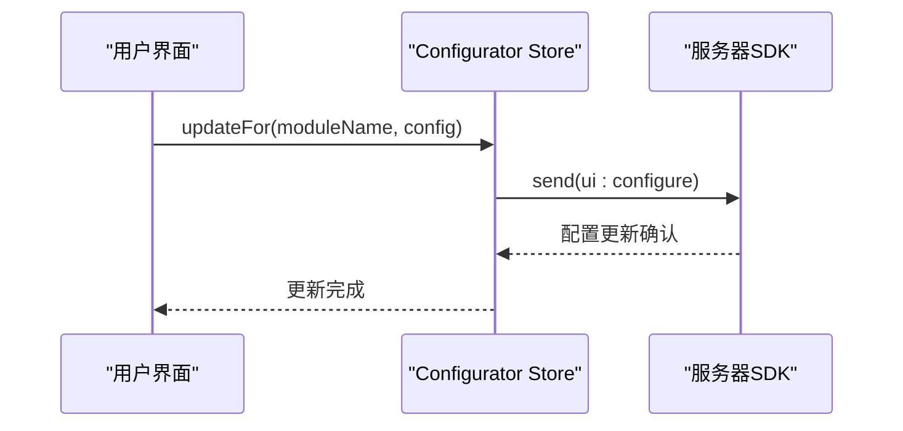
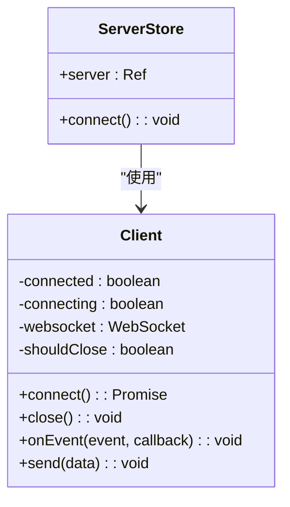
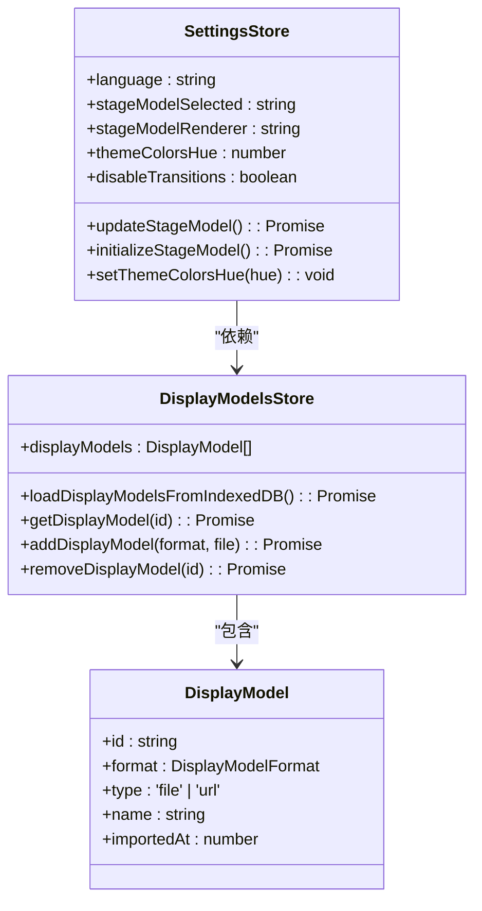
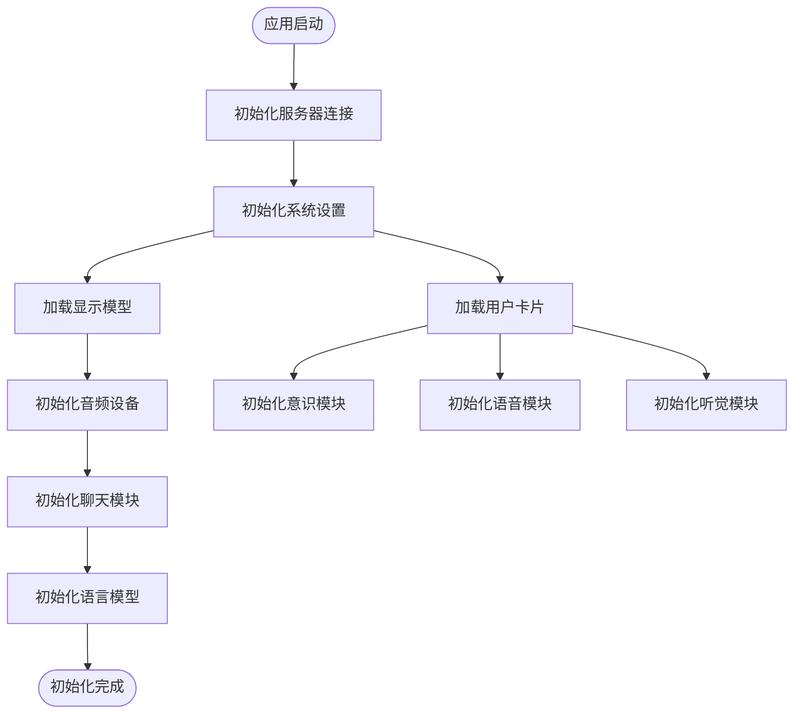
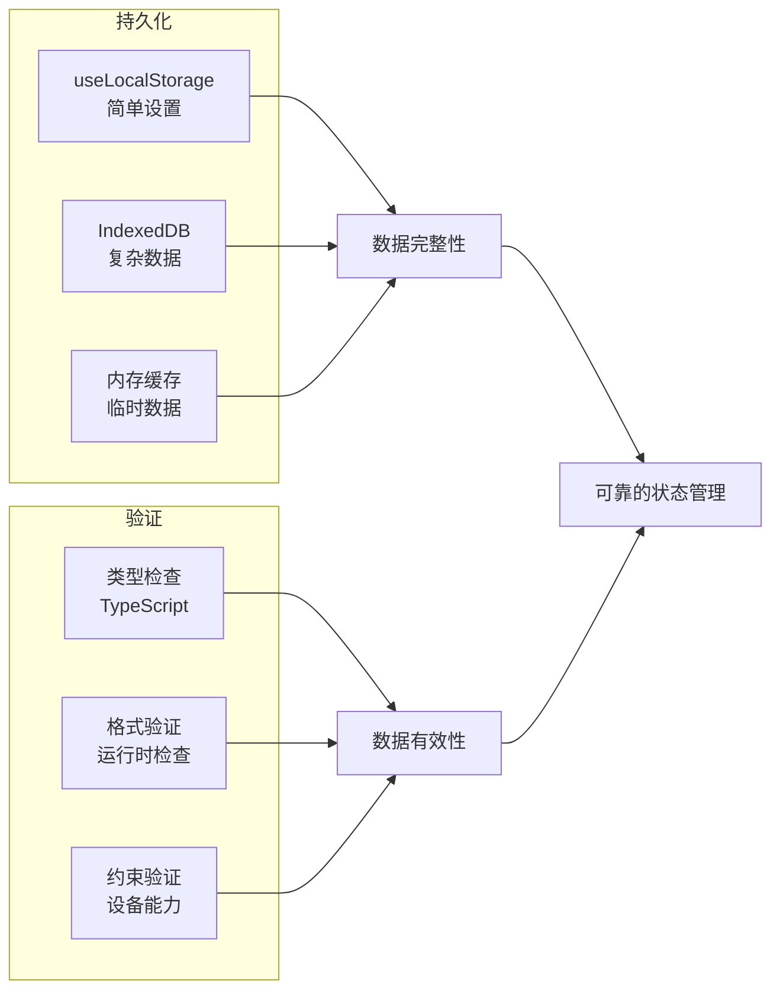
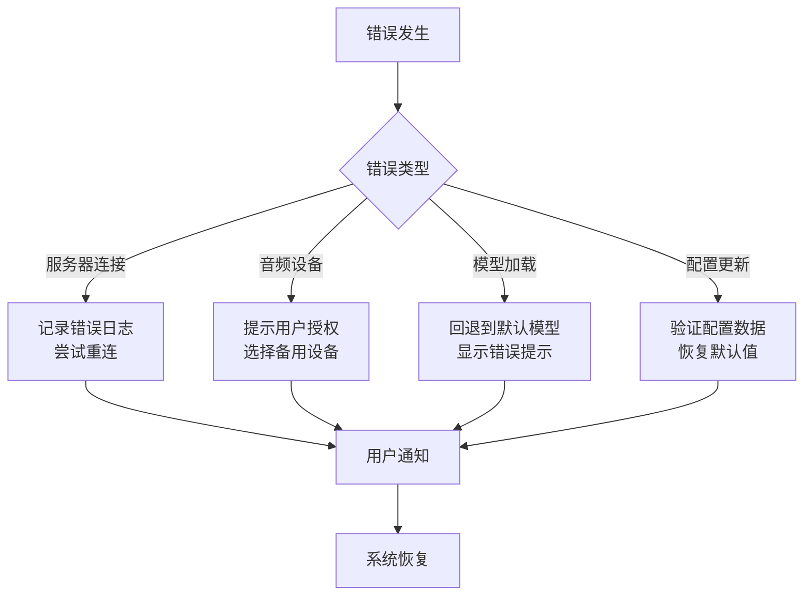

# 核心状态存储

<cite>
**本文档中引用的文件**  
- [configurator.ts](file://packages/stage-ui/src/stores/configurator.ts)
- [server.ts](file://packages/stage-ui/src/stores/server.ts)
- [settings.ts](file://packages/stage-ui/src/stores/settings.ts)
- [display-models.ts](file://packages/stage-ui/src/stores/display-models.ts)
- [airi-card.ts](file://packages/stage-ui/src/stores/modules/airi-card.ts)
- [consciousness.ts](file://packages/stage-ui/src/stores/modules/consciousness.ts)
- [speech.ts](file://packages/stage-ui/src/stores/modules/speech.ts)
- [hearing.ts](file://packages/stage-ui/src/stores/modules/hearing.ts)
- [audio.ts](file://packages/stage-ui/src/stores/audio.ts)
- [chat.ts](file://packages/stage-ui/src/stores/chat.ts)
- [llm.ts](file://packages/stage-ui/src/stores/llm.ts)
</cite>

## 目录
1. [简介](#简介)
2. [核心状态管理架构](#核心状态管理架构)
3. [配置管理](#配置管理)
4. [服务器连接状态](#服务器连接状态)
5. [系统设置与数据模型](#系统设置与数据模型)
6. [状态初始化与依赖关系](#状态初始化与依赖关系)
7. [状态持久化与数据验证](#状态持久化与数据验证)
8. [错误处理机制](#错误处理机制)
9. [结论](#结论)

## 简介
本文档详细阐述了基于Pinia的状态管理架构，重点分析了`configurator`和`server store`的核心职责。文档涵盖了配置管理、服务器连接状态、系统设置等核心数据模型的定义与操作方法，说明了这些store在应用启动时的初始化流程以及与其他模块的依赖关系。同时提供了状态持久化、数据验证和错误处理的具体实现细节。

## 核心状态管理架构
本项目采用Pinia作为状态管理解决方案，通过模块化store设计实现了关注点分离。核心状态存储主要由`configurator`、`server`、`settings`等store组成，每个store负责特定领域的状态管理。

**图示来源**  
- [configurator.ts](file://packages/stage-ui/src/stores/configurator.ts)
- [server.ts](file://packages/stage-ui/src/stores/server.ts)
- [settings.ts](file://packages/stage-ui/src/stores/settings.ts)

## 配置管理
`configurator` store负责管理应用的配置更新，通过`useConfiguratorByModsChannelServer`定义的store实现配置的动态更新。

### 核心职责
- 提供`updateFor`方法，用于更新指定模块的配置
- 通过`send`方法向服务器发送配置更新请求
- 使用`ui:configure`类型的消息进行配置同步

**图示来源**  
- [configurator.ts](file://packages/stage-ui/src/stores/configurator.ts#L4-L20)
- [channel-server.ts](file://packages/stage-ui/src/stores/mods/api/channel-server.ts#L68-L68)

**本节来源**  
- [configurator.ts](file://packages/stage-ui/src/stores/configurator.ts)

## 服务器连接状态
`server` store负责管理与后端服务器的连接状态，通过`useServerStore`定义的store实现连接的建立与维护。

### 连接管理
- 使用`@proj-airi/server-sdk`中的`Client`类创建服务器连接
- 支持自动重连机制，确保连接的稳定性
- 提供错误处理回调，便于监控连接状态

**图示来源**  
- [server.ts](file://packages/stage-ui/src/stores/server.ts#L4-L26)
- [index.d.ts](file://packages/server-sdk/dist/index.d.ts#L15-L36)

**本节来源**  
- [server.ts](file://packages/stage-ui/src/stores/server.ts)

## 系统设置与数据模型
`settings` store负责管理用户的各种系统设置，包括语言、显示模型、主题颜色等。

### 核心数据模型
#### 显示模型管理
- `stageModelSelected`: 当前选中的显示模型
- `stageModelRenderer`: 模型渲染器类型（live2d/vrm/disabled）
- `themeColorsHue`: 主题颜色色调
- `disableTransitions`: 是否禁用过渡效果

#### 音频设备管理
- `selectedAudioInput`: 选中的音频输入设备
- `deviceConstraints`: 音频设备约束条件
- `stream`: 音频流

**图示来源**  
- [settings.ts](file://packages/stage-ui/src/stores/settings.ts#L37-L183)
- [display-models.ts](file://packages/stage-ui/src/stores/display-models.ts#L54-L207)

**本节来源**  
- [settings.ts](file://packages/stage-ui/src/stores/settings.ts)
- [display-models.ts](file://packages/stage-ui/src/stores/display-models.ts)

## 状态初始化与依赖关系
核心状态存储在应用启动时通过`onMounted`生命周期钩子进行初始化，并建立与其他模块的依赖关系。

### 初始化流程
1. 服务器连接初始化
   - 创建`Client`实例
   - 设置连接选项（自动重连、错误处理）
2. 系统设置初始化
   - 从本地存储恢复设置
   - 初始化显示模型
3. 模块配置初始化
   - 加载用户卡片配置
   - 初始化语音、听觉等模块

**图示来源**  
- [server.ts](file://packages/stage-ui/src/stores/server.ts#L4-L26)
- [settings.ts](file://packages/stage-ui/src/stores/settings.ts#L37-L183)
- [airi-card.ts](file://packages/stage-ui/src/stores/modules/airi-card.ts)
- [consciousness.ts](file://packages/stage-ui/src/stores/modules/consciousness.ts)
- [speech.ts](file://packages/stage-ui/src/stores/modules/speech.ts)
- [hearing.ts](file://packages/stage-ui/src/stores/modules/hearing.ts)

**本节来源**  
- [server.ts](file://packages/stage-ui/src/stores/server.ts)
- [settings.ts](file://packages/stage-ui/src/stores/settings.ts)
- [airi-card.ts](file://packages/stage-ui/src/stores/modules/airi-card.ts)

## 状态持久化与数据验证
系统通过多种机制实现状态的持久化和数据验证，确保用户设置的持久性和数据的完整性。

### 持久化策略
- 使用`useLocalStorage`将关键设置持久化到浏览器本地存储
- 显示模型信息存储在IndexedDB中，支持大文件存储
- 用户卡片配置通过`nanoid`生成唯一ID进行管理

### 数据验证
- 在更新配置时进行类型检查
- 对音频设备约束进行有效性验证
- 对模型选择进行格式验证

**图示来源**  
- [settings.ts](file://packages/stage-ui/src/stores/settings.ts#L37-L183)
- [display-models.ts](file://packages/stage-ui/src/stores/display-models.ts#L54-L207)
- [airi-card.ts](file://packages/stage-ui/src/stores/modules/airi-card.ts)

**本节来源**  
- [settings.ts](file://packages/stage-ui/src/stores/settings.ts)
- [display-models.ts](file://packages/stage-ui/src/stores/display-models.ts)
- [airi-card.ts](file://packages/stage-ui/src/stores/modules/airi-card.ts)

## 错误处理机制
系统实现了多层次的错误处理机制，确保在各种异常情况下能够优雅地处理错误。

### 错误处理策略
- 服务器连接错误：通过`onError`回调记录错误信息
- 音频设备错误：捕获权限请求和设备访问异常
- 模型加载错误：处理显示模型加载失败的情况
- 配置更新错误：验证配置数据的完整性

**图示来源**  
- [server.ts](file://packages/stage-ui/src/stores/server.ts#L4-L26)
- [audio.ts](file://packages/stage-ui/src/stores/audio.ts#L82-L118)
- [display-models.ts](file://packages/stage-ui/src/stores/display-models.ts#L54-L207)
- [configurator.ts](file://packages/stage-ui/src/stores/configurator.ts#L4-L20)

**本节来源**  
- [server.ts](file://packages/stage-ui/src/stores/server.ts)
- [audio.ts](file://packages/stage-ui/src/stores/audio.ts)
- [display-models.ts](file://packages/stage-ui/src/stores/display-models.ts)
- [configurator.ts](file://packages/stage-ui/src/stores/configurator.ts)

## 结论
本文档详细介绍了核心状态存储的架构和实现。通过Pinia的模块化设计，系统实现了清晰的状态管理边界，`configurator`和`server store`分别负责配置管理和服务器连接，与其他模块形成了良好的依赖关系。状态持久化、数据验证和错误处理机制确保了系统的稳定性和可靠性。这种架构设计为应用的可维护性和可扩展性奠定了坚实的基础。