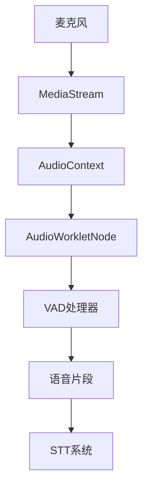

# 听觉模块状态管理

<cite>
**本文档中引用的文件**
- [audio-input.ts](file://apps/stage-web/src/composables/audio-input.ts)
- [vad.ts](file://apps/stage-web/src/workers/vad/vad.ts)
- [manager.ts](file://apps/stage-web/src/workers/vad/manager.ts)
- [vad.ts](file://packages/stage-ui/src/workers/vad/vad.ts)
- [vad.ts](file://packages/stage-ui/src/libs/audio/vad.ts)
</cite>

## 目录
1. [引言](#引言)
2. [核心状态属性](#核心状态属性)
3. [操作方法](#操作方法)
4. [Web Audio API与VAD工作线程集成](#web-audio-api与vad工作线程集成)
5. [性能优化与资源管理](#性能优化与资源管理)
6. [异常处理](#异常处理)
7. [结论](#结论)

## 引言
听觉模块负责管理语音活动检测（VAD）的完整生命周期，包括音频输入流的采集、增益控制、噪声抑制、语音片段缓冲等关键功能。该模块通过Web Audio API与浏览器底层音频系统交互，利用VAD工作线程进行实时语音检测，并将有效语音片段传递给后续的STT（语音转文本）系统。本模块设计注重实时性、低延迟和资源效率，确保在各种设备上都能稳定运行。

**Section sources**
- [audio-input.ts](file://apps/stage-web/src/composables/audio-input.ts#L3-L82)
- [vad.ts](file://apps/stage-web/src/workers/vad/vad.ts#L8-L267)

## 核心状态属性

### 麦克风输入流
麦克风输入流是听觉模块的数据源，通过`MediaStream` API获取。模块使用`useAudioInput`组合式函数管理输入流的生命周期，包括设备选择、权限请求和流的启动/停止。输入流的状态由`media.enabled`标志位控制，确保在不需要时及时释放资源。

### 音频增益控制
音频增益控制通过Web Audio API的`GainNode`实现，允许动态调整输入音频的音量。虽然当前代码未直接展示增益节点的创建，但`AudioContext`的配置（如采样率16000Hz）为后续的增益处理提供了基础。增益值可通过`audioContextOptions`进行配置。

### 噪声抑制配置
噪声抑制功能由VAD模型本身提供。`silero-vad`模型在推理过程中自动进行噪声过滤，通过设置`speechThreshold`（语音阈值）和`exitThreshold`（退出阈值）来区分语音和背景噪声。默认配置中，语音阈值为0.3，退出阈值为0.1，确保只有清晰的语音信号被检测为有效输入。

### 语音片段缓冲区
语音片段缓冲区是VAD处理的核心数据结构。`VAD`类维护一个`Float32Array`类型的缓冲区，用于累积检测到的语音数据。缓冲区大小由`maxBufferDuration`（最大缓冲持续时间）和`sampleRate`（采样率）决定，默认可存储30秒的音频数据。当检测到语音结束时，缓冲区内容连同前后`speechPadMs`（语音填充毫秒）的音频一起被封装为完整语音片段。

**Section sources**
- [vad.ts](file://apps/stage-web/src/workers/vad/vad.ts#L8-L267)
- [vad.ts](file://packages/stage-ui/src/workers/vad/vad.ts#L8-L267)

## 操作方法

### 开始/停止监听
开始监听通过调用`start()`方法实现，该方法首先请求麦克风权限，然后启动`MediaStream`。停止监听通过`stop()`方法实现，它会停止媒体流并释放相关资源。`useAudioInput`函数提供了这些方法的封装，确保操作的原子性和安全性。

### 灵敏度调节
灵敏度调节通过`updateConfig()`方法实现，允许动态修改VAD的配置参数。例如，可以通过调整`speechThreshold`来改变语音检测的灵敏度。较高的阈值意味着需要更清晰的语音才能被检测到，适用于嘈杂环境；较低的阈值则更敏感，适用于安静环境。

### 设备选择
设备选择通过`selectedAudioInputId`响应式变量管理。用户可以选择特定的麦克风设备，`useAudioInput`会根据选择更新`MediaStreamConstraints`，并在下次启动时应用新的设备配置。

**Section sources**
- [audio-input.ts](file://apps/stage-web/src/composables/audio-input.ts#L3-L82)
- [vad.ts](file://apps/stage-web/src/workers/vad/vad.ts#L250-L267)

## Web Audio API与VAD工作线程集成

### 集成架构
听觉模块通过`createVADStates`函数将VAD处理器与Web Audio API集成。该函数创建一个`AudioContext`，并加载一个名为`vad-audio-worklet-processor`的音频工作线程。工作线程负责从麦克风流中实时接收音频数据块，并将其传递给VAD处理器进行分析。

**Diagram sources**
- [vad.ts](file://packages/stage-ui/src/libs/audio/vad.ts#L58-L160)
- [vad.ts](file://apps/stage-web/src/workers/vad/vad.ts#L8-L267)

### 实时语音输入检测
实时检测通过音频工作线程的`onmessage`事件实现。每当工作线程接收到一个新的音频缓冲区，它就会通过`postMessage`将其发送到主线程，主线程的VAD处理器调用`processAudio()`方法进行分析。该方法使用`silero-vad`模型计算语音概率，并根据配置的阈值判断是否为有效语音。

### 有效语音传递
当VAD检测到语音结束且持续时间超过`minSpeechDurationMs`（默认250ms）时，会触发`speech-ready`事件。该事件携带一个包含完整语音数据的`Float32Array`和持续时间信息，供STT系统消费。语音数据已包含前后`speechPadMs`（默认80ms）的填充，确保语音的完整性和上下文连贯性。

**Section sources**
- [vad.ts](file://packages/stage-ui/src/libs/audio/vad.ts#L58-L160)
- [vad.ts](file://apps/stage-web/src/workers/vad/vad.ts#L150-L227)

## 性能优化与资源管理

### 性能优化建议
- **模型加载**：VAD模型（`silero-vad`）应在应用启动时预加载，避免在语音检测时产生延迟。
- **缓冲区大小**：合理设置`maxBufferDuration`和`newBufferSize`，平衡内存使用和处理延迟。
- **推理链**：使用`inferenceChain`确保模型推理按顺序执行，避免并发调用导致的状态混乱。

### 资源释放策略
模块提供了完善的资源释放机制。`dispose()`方法会断开所有音频节点连接，停止媒体流中的所有轨道，并关闭`AudioContext`。这确保了在模块销毁或页面卸载时，不会发生音频资源泄漏。

**Section sources**
- [vad.ts](file://apps/stage-web/src/workers/vad/vad.ts#L250-L267)
- [vad.ts](file://packages/stage-ui/src/libs/audio/vad.ts#L130-L160)

## 异常处理

### 权限拒绝
当用户拒绝麦克风权限时，`useAudioInput`的`request()`方法会捕获此状态，并通过`devices.permissionGranted`响应式变量暴露。应用应监听此状态并提示用户授予权限。

### 设备不可用
如果选定的音频设备不可用（例如被其他应用占用），`MediaStream`的创建会失败。`start()`方法会捕获此错误并安全退出，避免应用崩溃。建议在错误发生时提示用户检查设备连接或选择其他设备。

**Section sources**
- [audio-input.ts](file://apps/stage-web/src/composables/audio-input.ts#L20-L35)
- [vad.ts](file://packages/stage-ui/src/libs/audio/vad.ts#L70-L90)

## 结论
听觉模块通过精心设计的状态管理和高效的VAD集成，实现了稳定、低延迟的语音输入检测。其模块化架构和清晰的API使得集成和维护变得简单。通过遵循本文档中的最佳实践，可以确保模块在各种场景下都能提供可靠的语音输入服务。