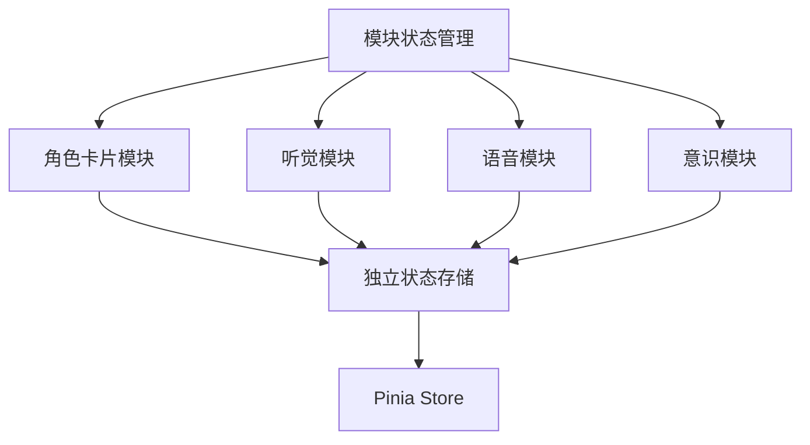
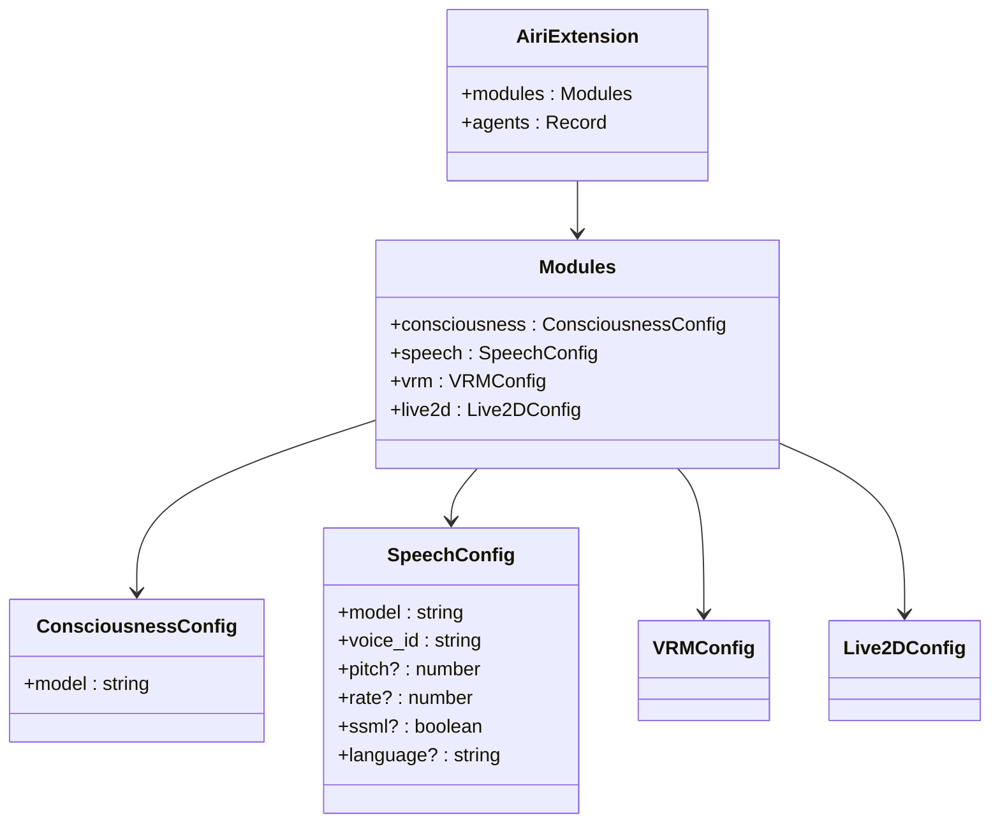
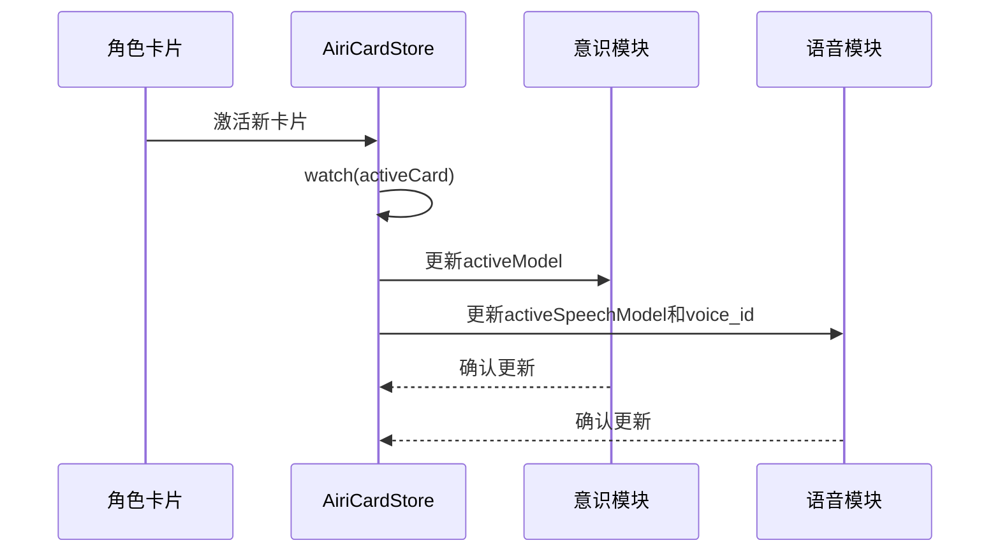
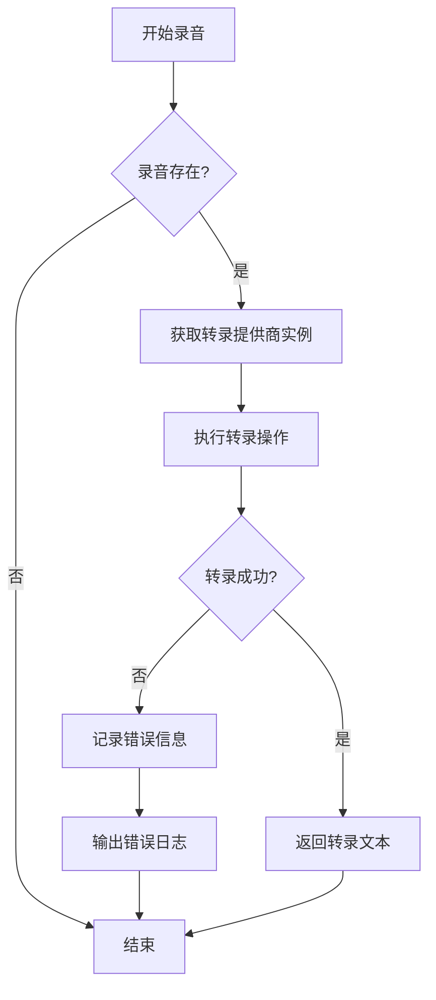
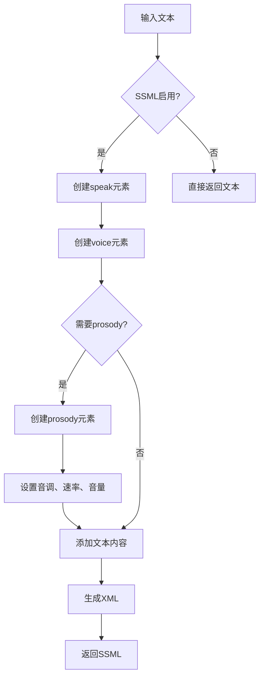
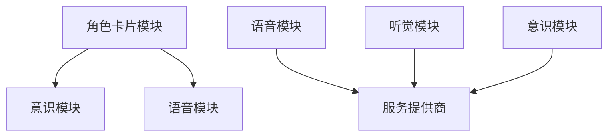
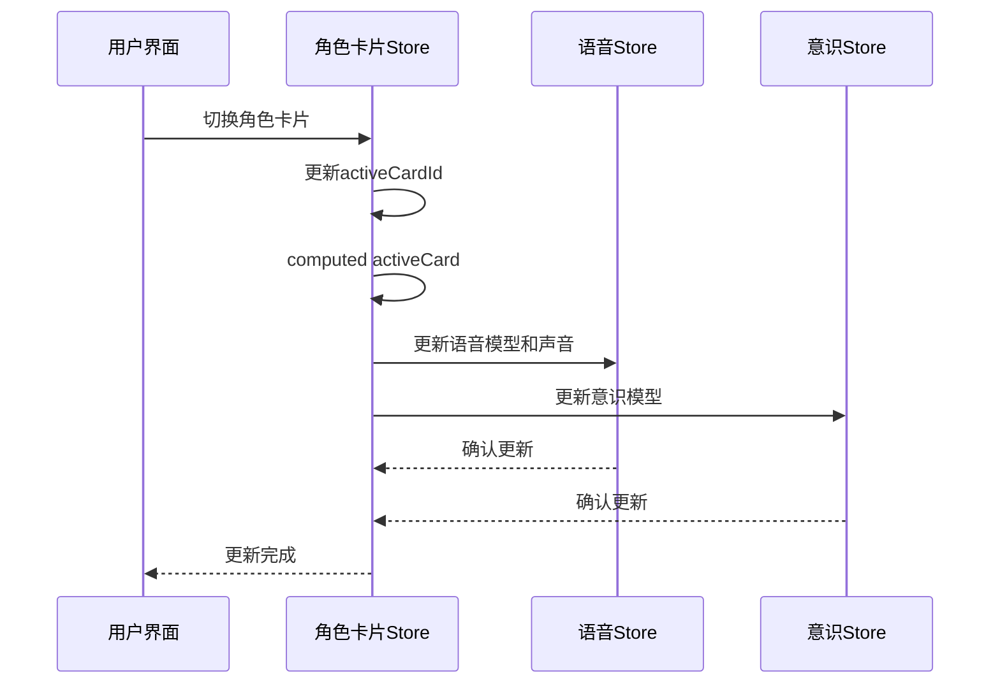
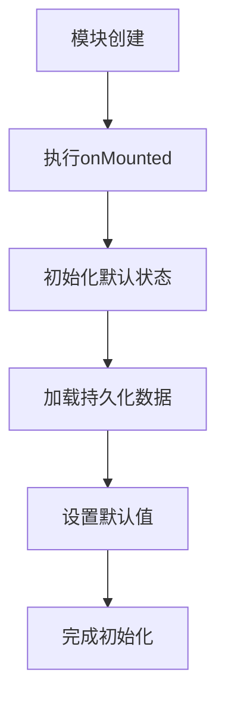
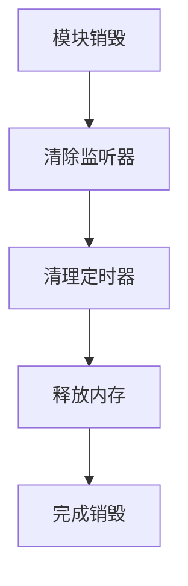
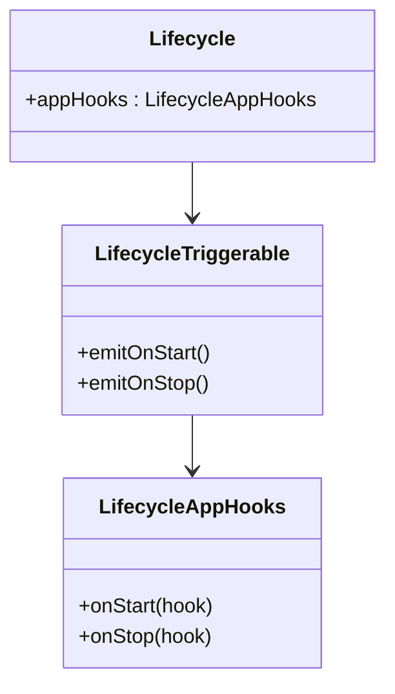

# 模块状态管理

<cite>
**本文档引用的文件**  
- [airi-card.ts](file://packages\stage-ui\src\stores\modules\airi-card.ts)
- [hearing.ts](file://packages\stage-ui\src\stores\modules\hearing.ts)
- [speech.ts](file://packages\stage-ui\src\stores\modules\speech.ts)
- [consciousness.ts](file://packages\stage-ui\src\stores\modules\consciousness.ts)
- [index.ts](file://packages\stage-ui\src\stores\modules\index.ts)
</cite>

## 目录
1. [简介](#简介)
2. [核心模块状态设计](#核心模块状态设计)
3. [角色卡片模块](#角色卡片模块)
4. [听觉模块](#听觉模块)
5. [语音模块](#语音模块)
6. [模块间状态交互](#模块间状态交互)
7. [状态生命周期管理](#状态生命周期管理)

## 简介
本文档详细阐述了Airi学习系统中各功能模块的状态管理机制。系统采用Pinia作为状态管理库，为不同功能模块（如airi-card、hearing、speech等）设计了独立的状态存储。每个模块通过定义独立的store来管理其特定的状态属性、操作方法和事件处理逻辑，实现了模块间的解耦和高内聚。

## 核心模块状态设计

系统中的功能模块通过独立的store进行状态管理，这些store位于`packages/stage-ui/src/stores/modules/`目录下。每个模块store都遵循统一的设计模式：定义状态(state)、计算属性(computed properties)、操作(actions)和生命周期钩子。

**Diagram sources**  
- [index.ts](file://packages\stage-ui\src\stores\modules\index.ts#L1-L8)

**Section sources**  
- [index.ts](file://packages\stage-ui\src\stores\modules\index.ts#L1-L8)

## 角色卡片模块

角色卡片模块(`airi-card`)负责管理Airi角色的配置信息和状态。该模块通过`useAiriCardStore`定义，实现了角色卡片的创建、删除、激活和配置管理功能。

### 状态属性
- `cards`: 使用localStorage持久化存储的角色卡片集合
- `activeCardId`: 当前激活的角色卡片ID
- `activeCard`: 基于activeCardId计算的当前激活卡片

### 扩展接口设计
模块定义了`AiriExtension`接口，用于描述角色卡片的扩展配置：

**Diagram sources**  
- [airi-card.ts](file://packages\stage-ui\src\stores\modules\airi-card.ts#L13-L47)

### 操作方法
- `addCard()`: 添加新角色卡片
- `removeCard()`: 删除指定ID的角色卡片
- `getCard()`: 获取指定ID的角色卡片
- `resolveAiriExtension()`: 解析并合并角色卡片的扩展配置
- `newAiriCard()`: 创建新的Airi角色卡片实例

### 事件处理机制
模块通过`watch`监听`activeCard`的变化，当角色卡片切换时，自动更新相关模块的配置：

**Diagram sources**  
- [airi-card.ts](file://packages\stage-ui\src\stores\modules\airi-card.ts#L200-L220)

**Section sources**  
- [airi-card.ts](file://packages\stage-ui\src\stores\modules\airi-card.ts#L55-L244)

## 听觉模块

听觉模块(`hearing`)负责管理语音输入和转录相关的状态。该模块通过`useHearingStore`定义，实现了语音转录服务的配置和管理。

### 状态属性
- `activeTranscriptionProvider`: 激活的语音转录服务提供商
- `activeTranscriptionModel`: 激活的语音转录模型
- `activeCustomModelName`: 自定义模型名称
- `transcriptionModelSearchQuery`: 模型搜索查询

### 计算属性
- `availableProvidersMetadata`: 可用的语音转录服务提供商元数据
- `supportsModelListing`: 当前提供商是否支持模型列表
- `providerModels`: 当前提供商的可用模型列表
- `isLoadingActiveProviderModels`: 是否正在加载当前提供商的模型
- `activeProviderModelError`: 当前提供商的模型加载错误

### 操作方法
- `loadModelsForProvider()`: 加载指定提供商的模型列表
- `getModelsForProvider()`: 获取指定提供商的模型列表
- `transcription()`: 执行语音转录操作

### 语音输入管道
模块还定义了`useHearingSpeechInputPipeline`，用于处理录音的转录流程：

**Diagram sources**  
- [hearing.ts](file://packages\stage-ui\src\stores\modules\hearing.ts#L94-L127)

**Section sources**  
- [hearing.ts](file://packages\stage-ui\src\stores\modules\hearing.ts#L9-L127)

## 语音模块

语音模块(`speech`)负责管理语音输出和合成相关的状态。该模块通过`useSpeechStore`定义，实现了文本转语音服务的配置和管理。

### 状态属性
- `activeSpeechProvider`: 激活的语音合成服务提供商
- `activeSpeechModel`: 激活的语音合成模型
- `activeSpeechVoiceId`: 激活的语音ID
- `activeSpeechVoice`: 激活的语音信息
- `pitch`: 语音音调
- `rate`: 语音速率
- `ssmlEnabled`: SSML支持状态

### 计算属性
- `availableSpeechProvidersMetadata`: 可用的语音合成服务提供商元数据
- `supportsSSML`: 当前提供商是否支持SSML
- `supportsModelListing`: 当前提供商是否支持模型列表
- `providerModels`: 当前提供商的可用模型列表
- `filteredModels`: 根据搜索查询过滤的模型列表

### 操作方法
- `speech()`: 生成语音
- `loadVoicesForProvider()`: 加载指定提供商的语音列表
- `getVoicesForProvider()`: 获取指定提供商的语音列表
- `generateSSML()`: 生成SSML标记语言

### SSML生成流程
当SSML启用时，模块会生成符合标准的语音合成标记语言：

**Diagram sources**  
- [speech.ts](file://packages\stage-ui\src\stores\modules\speech.ts#L180-L220)

**Section sources**  
- [speech.ts](file://packages\stage-ui\src\stores\modules\speech.ts#L13-L241)

## 模块间状态交互

各模块通过依赖注入和状态共享实现交互，形成了一个协调工作的系统。

### 依赖关系

### 数据共享策略
模块间通过以下方式共享数据：
1. **直接导入**: 模块直接导入其他模块的store
2. **状态引用**: 使用`storeToRefs`创建响应式引用
3. **事件驱动**: 通过watch监听状态变化并触发相应操作

### 交互示例
当用户切换角色卡片时，系统会自动更新相关模块的配置：

**Diagram sources**  
- [airi-card.ts](file://packages\stage-ui\src\stores\modules\airi-card.ts#L62-L63)
- [speech.ts](file://packages\stage-ui\src\stores\modules\speech.ts#L13-L241)
- [consciousness.ts](file://packages\stage-ui\src\stores\modules\consciousness.ts#L6-L92)

## 状态生命周期管理

系统实现了完整的状态生命周期管理，确保模块状态的正确初始化、更新和销毁。

### 初始化
模块在创建时通过`onMounted`钩子进行初始化：

### 更新机制
状态更新通过多种方式触发：
- **用户交互**: 用户操作触发状态变更
- **外部事件**: 其他模块的状态变化触发更新
- **定时任务**: 周期性任务更新状态

### 销毁处理
当模块不再需要时，系统会正确清理相关资源：

系统还实现了全局生命周期管理，通过`injecta`包提供的生命周期钩子确保服务的正确启动和停止：

**Diagram sources**  
- [airi-card.ts](file://packages\stage-ui\src\stores\modules\airi-card.ts#L225-L230)
- [injecta/builtin.ts](file://packages\injecta\src\builtin.ts#L0-L44)

**Section sources**  
- [airi-card.ts](file://packages\stage-ui\src\stores\modules\airi-card.ts#L225-L230)