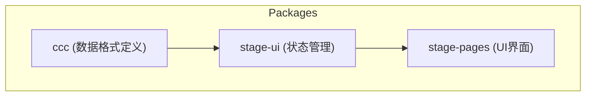
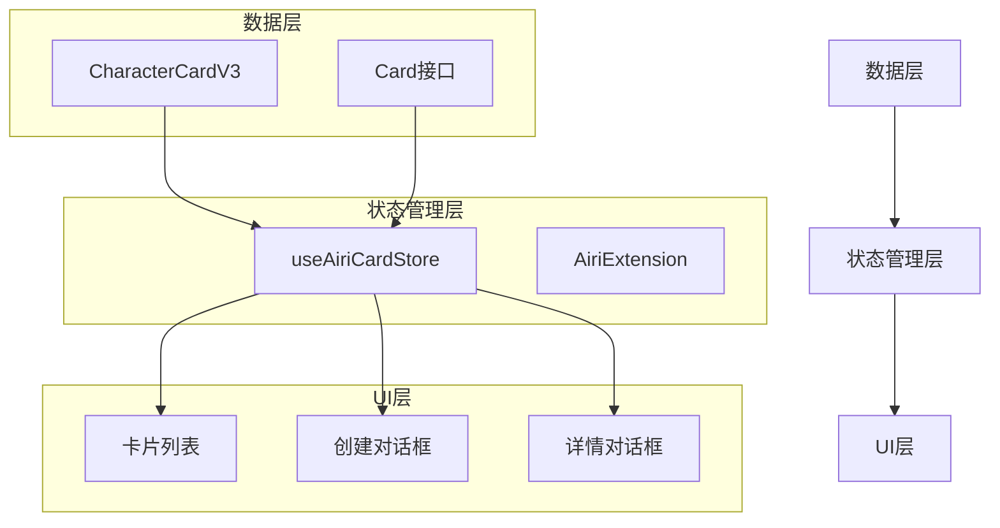
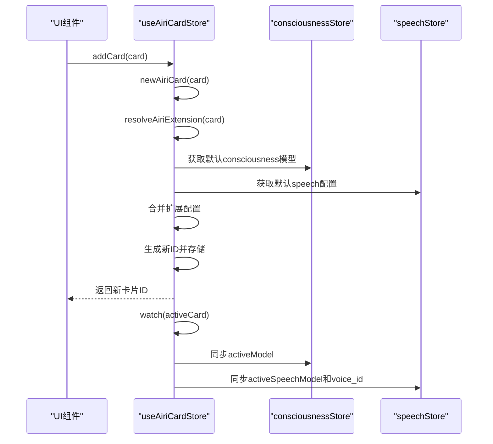
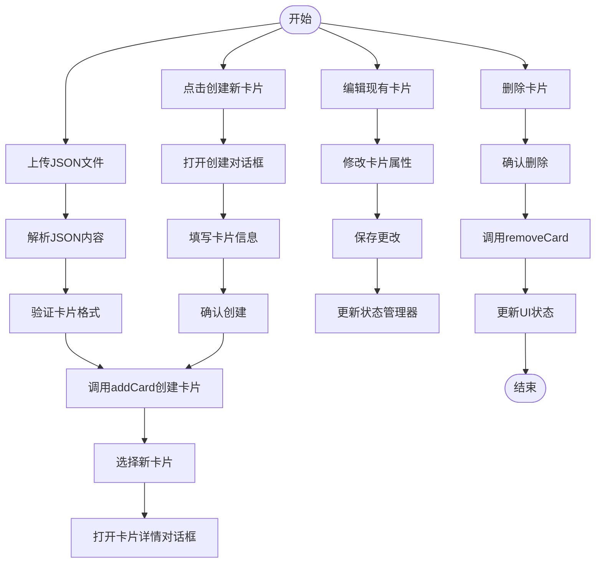
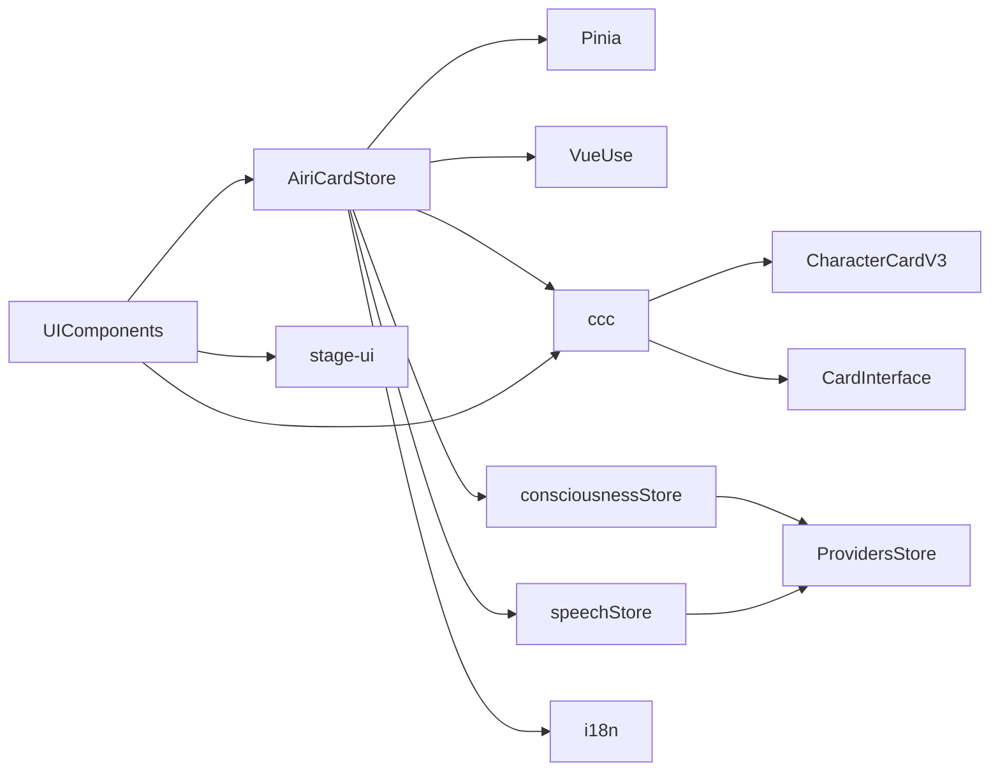

# 角色卡片模块状态管理

<cite>
**本文档引用文件**  
- [airi-card.ts](file://packages/stage-ui/src/stores/modules/airi-card.ts)
- [card.ts](file://packages/ccc/src/define/card.ts)
- [json.ts](file://packages/ccc/src/export/json.ts)
- [character_card_v3.ts](file://packages/ccc/src/export/types/character_card_v3.ts)
- [index.vue](file://packages/stage-pages/src/pages/settings/airi-card/index.vue)
- [consciousness.ts](file://packages/stage-ui/src/stores/modules/consciousness.ts)
- [speech.ts](file://packages/stage-ui/src/stores/modules/speech.ts)
</cite>

## 目录
1. [简介](#简介)
2. [项目结构](#项目结构)
3. [核心组件](#核心组件)
4. [架构概述](#架构概述)
5. [详细组件分析](#详细组件分析)
6. [依赖分析](#依赖分析)
7. [性能考虑](#性能考虑)
8. [故障排除指南](#故障排除指南)
9. [结论](#结论)

## 简介
本文档详细描述了Airi角色卡片模块的状态管理机制。该模块负责管理角色的元数据、个性化配置、持久化存储以及与其他系统模块的集成。核心功能包括角色卡片的创建、加载、编辑和删除，支持与ccc包的导入导出功能集成，并与LLM、Live2D等模块协同工作以实现角色的个性化表现。

## 项目结构
角色卡片模块分布在多个包中，主要包含状态管理、UI界面和数据格式定义三个部分。状态管理位于`stage-ui`包的stores模块中，UI界面位于`stage-pages`包的设置页面中，数据格式定义则在`ccc`包中统一管理。



**图示来源**  
- [airi-card.ts](file://packages/stage-ui/src/stores/modules/airi-card.ts)
- [card.ts](file://packages/ccc/src/define/card.ts)
- [index.vue](file://packages/stage-pages/src/pages/settings/airi-card/index.vue)

## 核心组件
角色卡片模块的核心组件包括AiriCard接口定义、useAiriCardStore状态管理器、卡片UI组件和ccc包的数据转换功能。这些组件共同实现了角色卡片的完整生命周期管理。

**章节来源**  
- [airi-card.ts](file://packages/stage-ui/src/stores/modules/airi-card.ts)
- [card.ts](file://packages/ccc/src/define/card.ts)

## 架构概述
角色卡片模块采用分层架构设计，从下到上分别为数据层、状态管理层和UI层。数据层定义了标准的角色卡片格式，状态管理层负责卡片的持久化和状态同步，UI层提供用户交互界面。



**图示来源**  
- [airi-card.ts](file://packages/stage-ui/src/stores/modules/airi-card.ts)
- [card.ts](file://packages/ccc/src/define/card.ts)
- [index.vue](file://packages/stage-pages/src/pages/settings/airi-card/index.vue)

## 详细组件分析

### AiriCard数据结构分析
AiriCard扩展了基础Card接口，增加了airi特定的扩展配置，用于管理角色的AI模块和代理设置。

```mermaid
classDiagram
class Card {
+string name
+string version
+string? creator
+string? description
+string? personality
+string? scenario
+string[]? greetings
+string? systemPrompt
+Record~string, any~? extensions
}
class AiriExtension {
+modules : ModulesConfig
+agents : Record~string, AgentConfig~
}
class ModulesConfig {
+consciousness : { model : string }
+speech : { model : string, voice_id : string, pitch? : number, rate? : number, ssml? : boolean, language? : string }
+vrm? : { source : 'file'|'url', file? : string, url? : string }
+live2d? : { source : 'file'|'url', file? : string, url? : string }
}
class AgentConfig {
+prompt : string
}
class AiriCard {
+extensions : { airi : AiriExtension } & Card['extensions']
}
AiriCard --> Card : "扩展"
AiriCard --> AiriExtension : "包含"
AiriExtension --> ModulesConfig : "包含"
AiriExtension --> AgentConfig : "包含"
```

**图示来源**  
- [airi-card.ts](file://packages/stage-ui/src/stores/modules/airi-card.ts)
- [card.ts](file://packages/ccc/src/define/card.ts)

### 状态管理流程分析
useAiriCardStore使用Pinia进行状态管理，通过localStorage实现持久化，并与consciousness和speech模块的状态同步。



**图示来源**  
- [airi-card.ts](file://packages/stage-ui/src/stores/modules/airi-card.ts)
- [consciousness.ts](file://packages/stage-ui/src/stores/modules/consciousness.ts)
- [speech.ts](file://packages/stage-ui/src/stores/modules/speech.ts)

### 卡片操作流程分析
角色卡片的创建、加载、编辑和删除操作通过UI组件与状态管理器交互，实现完整的用户工作流。



**图示来源**  
- [airi-card.ts](file://packages/stage-ui/src/stores/modules/airi-card.ts)
- [index.vue](file://packages/stage-pages/src/pages/settings/airi-card/index.vue)

## 依赖分析
角色卡片模块依赖多个其他模块和包，形成了复杂的依赖关系网络。



**图示来源**  
- [airi-card.ts](file://packages/stage-ui/src/stores/modules/airi-card.ts)
- [index.vue](file://packages/stage-pages/src/pages/settings/airi-card/index.vue)
- [ccc](file://packages/ccc)

## 性能考虑
角色卡片模块在性能方面主要考虑以下几点：
- 使用localStorage进行持久化，避免频繁的磁盘I/O操作
- 通过computed属性实现响应式数据，优化UI更新性能
- 采用懒加载策略，只在需要时加载语音提供商的语音列表
- 使用nanoid生成唯一卡片ID，确保性能和唯一性

## 故障排除指南
### 常见问题及解决方案
| 问题现象 | 可能原因 | 解决方案 |
|--------|--------|--------|
| 卡片无法导入 | JSON格式错误 | 验证JSON文件是否符合CharacterCardV3规范 |
| 新卡片不显示 | 状态未正确更新 | 检查addCard方法是否正确调用并返回ID |
| 语音配置未同步 | 扩展配置解析错误 | 检查AiriExtension的resolveAiriExtension方法 |
| 默认卡片未创建 | onMounted钩子未执行 | 确保组件正确挂载 |

**章节来源**  
- [airi-card.ts](file://packages/stage-ui/src/stores/modules/airi-card.ts)
- [index.vue](file://packages/stage-pages/src/pages/settings/airi-card/index.vue)

## 结论
角色卡片模块通过清晰的分层架构和模块化设计，实现了角色元数据的高效管理。该模块不仅提供了完整的CRUD操作，还通过扩展机制支持与各种AI服务的集成，为角色的个性化表现提供了坚实的基础。未来可以进一步优化导入导出功能，增加版本管理机制，并完善错误处理和用户反馈。