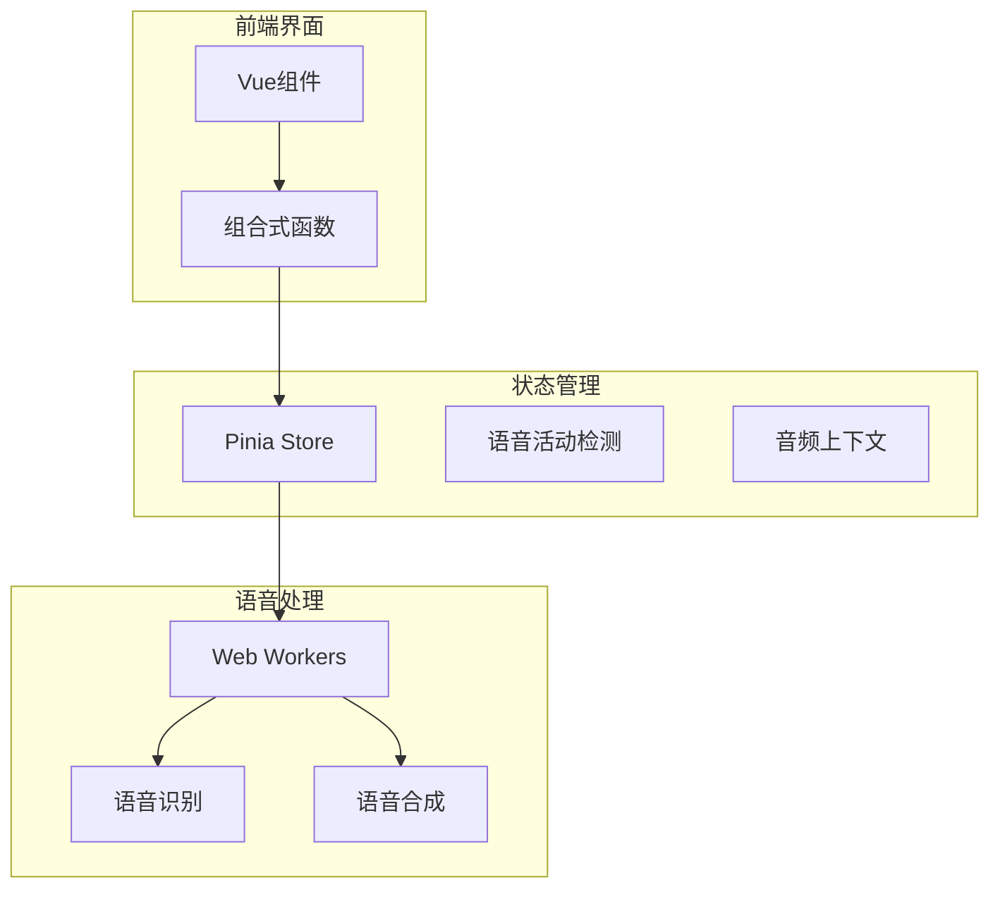
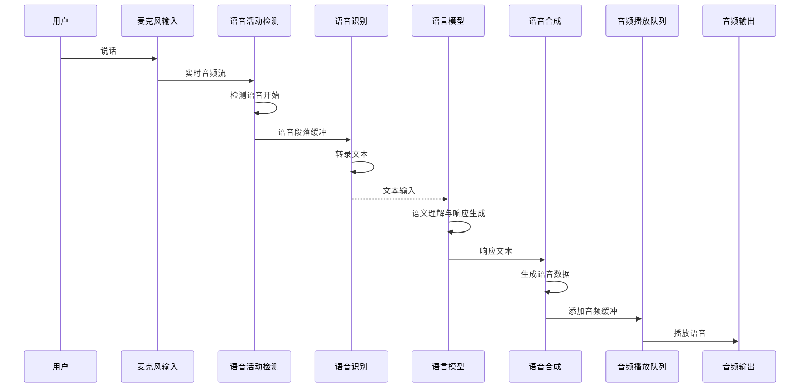
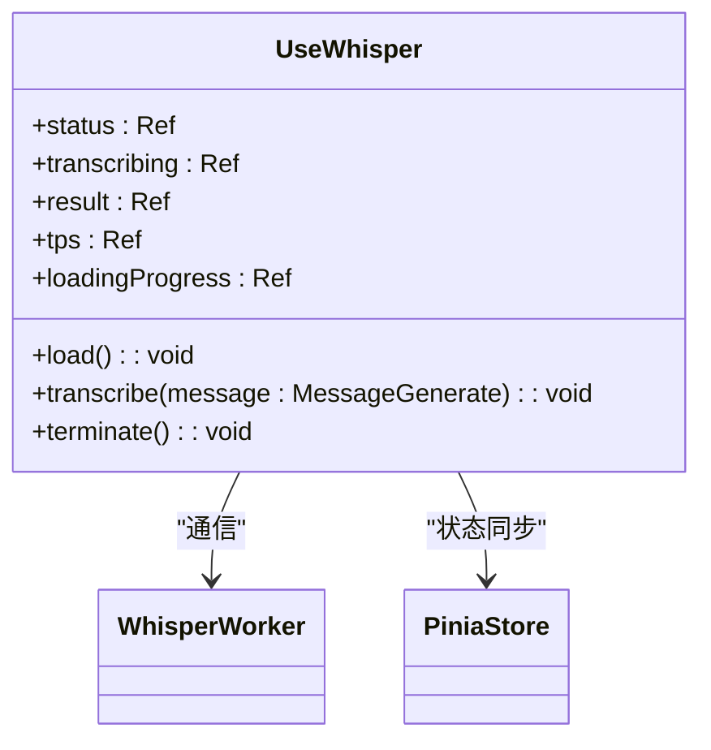
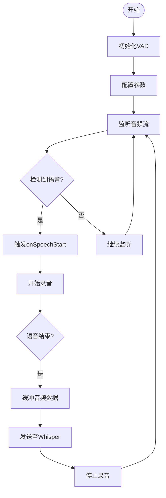
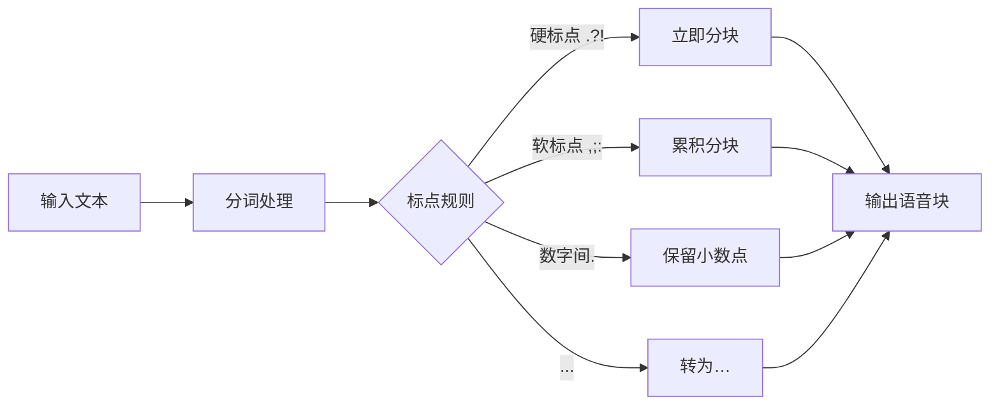

# 语音模块状态管理

<cite>
**本文档中引用的文件**  
- [whisper.ts](file://packages/stage-ui/src/composables/whisper.ts)
- [vad.ts](file://packages/stage-ui/src/stores/ai/models/vad.ts)
- [tts.ts](file://packages/stage-ui/src/utils/tts.ts)
- [audio.ts](file://packages/stage-ui/src/stores/audio.ts)
- [audio-input.ts](file://apps/stage-web/src/composables/audio-input.ts)
- [micvad.ts](file://packages/stage-ui/src/composables/micvad.ts)
- [worker.ts](file://packages/stage-ui/src/libs/workers/worker.ts)
- [types.ts](file://packages/stage-ui/src/libs/workers/types.ts)
</cite>

## 目录
1. [简介](#简介)
2. [项目结构](#项目结构)
3. [核心组件](#核心组件)
4. [架构概述](#架构概述)
5. [详细组件分析](#详细组件分析)
6. [依赖分析](#依赖分析)
7. [性能考虑](#性能考虑)
8. [故障排除指南](#故障排除指南)
9. [结论](#结论)

## 简介
本文档详细描述了语音模块的状态管理机制，涵盖语音识别（STT）与语音合成（TTS）功能的核心状态属性、操作方法、音频流控制、模型配置及与LLM的交互流程。系统通过Web Workers实现高性能语音处理，结合VAD（语音活动检测）与Whisper模型完成端到端语音交互闭环。

## 项目结构
语音模块分布在多个包中，形成分层架构：



**图源**  
- [whisper.ts](file://packages/stage-ui/src/composables/whisper.ts#L1-L110)
- [vad.ts](file://packages/stage-ui/src/stores/ai/models/vad.ts#L1-L140)
- [audio.ts](file://packages/stage-ui/src/stores/audio.ts#L1-L140)

**节源**  
- [whisper.ts](file://packages/stage-ui/src/composables/whisper.ts#L1-L110)
- [vad.ts](file://packages/stage-ui/src/stores/ai/models/vad.ts#L1-L140)

## 核心组件
本模块包含四大核心组件：语音识别（STT）、语音合成（TTS）、语音活动检测（VAD）和音频上下文管理。各组件通过Pinia状态管理器协调，使用Web Workers进行高性能计算，确保主线程流畅运行。

**节源**  
- [whisper.ts](file://packages/stage-ui/src/composables/whisper.ts#L1-L110)
- [tts.ts](file://packages/stage-ui/src/utils/tts.ts#L1-L214)
- [vad.ts](file://packages/stage-ui/src/stores/ai/models/vad.ts#L1-L140)

## 架构概述
系统采用分层架构设计，实现语音输入到语义理解再到语音输出的完整闭环：



**图源**  
- [micvad.ts](file://packages/stage-ui/src/composables/micvad.ts#L1-L74)
- [whisper.ts](file://packages/stage-ui/src/composables/whisper.ts#L1-L110)
- [tts.ts](file://packages/stage-ui/src/utils/tts.ts#L1-L214)

## 详细组件分析

### 语音识别（STT）分析
语音识别模块基于Whisper模型实现，通过Web Worker进行异步处理，避免阻塞主线程。

#### 状态属性
| 状态属性 | 类型 | 描述 |
|---------|------|------|
| status | string | 当前状态：loading/ready |
| transcribing | boolean | 是否正在转录 |
| result | string | 实时转录文本结果 |
| tps | number | 每秒处理的token数（性能指标） |
| loadingProgress | 数组 | 模型加载进度详情 |

#### 操作方法
- `load()`: 加载Whisper模型
- `transcribe(message)`: 开始语音识别
- `terminate()`: 终止识别过程



**图源**  
- [whisper.ts](file://packages/stage-ui/src/composables/whisper.ts#L1-L110)
- [worker.ts](file://packages/stage-ui/src/libs/workers/worker.ts#L1-L175)

**节源**  
- [whisper.ts](file://packages/stage-ui/src/composables/whisper.ts#L1-L110)

### 语音活动检测（VAD）分析
VAD模块负责检测用户何时开始和停止说话，是触发语音识别的关键前置组件。

#### 状态属性
| 状态属性 | 类型 | 描述 |
|---------|------|------|
| isSpeech | boolean | 当前是否有语音 |
| isSpeechProb | number | 语音概率（0-1） |
| isSpeechHistory | 数组 | 历史语音概率用于可视化 |
| loaded | boolean | VAD模型是否已加载 |
| loading | boolean | 是否正在加载 |

#### 配置参数
- `speechThreshold`: 语音检测阈值（默认0.6）
- `exitThreshold`: 退出语音阈值（默认0.18）
- `minSilenceDurationMs`: 最小静音时长（400ms）



**图源**  
- [vad.ts](file://packages/stage-ui/src/stores/ai/models/vad.ts#L1-L140)
- [micvad.ts](file://packages/stage-ui/src/composables/micvad.ts#L1-L74)

**节源**  
- [vad.ts](file://packages/stage-ui/src/stores/ai/models/vad.ts#L1-L140)

### 语音合成（TTS）分析
TTS模块负责将文本转换为语音输出，支持流式处理和情感表达同步。

#### 文本分块策略
系统使用智能分块算法将长文本分割为适合TTS处理的小段：



#### 状态管理
- `playbackQueue`: 音频播放队列
- `mouthOpenSize`: 嘴型开合度（用于动画同步）
- `nowSpeaking`: 是否正在说话状态

**图源**  
- [tts.ts](file://packages/stage-ui/src/utils/tts.ts#L1-L214)
- [audio.ts](file://packages/stage-ui/src/stores/audio.ts#L1-L140)

**节源**  
- [tts.ts](file://packages/stage-ui/src/utils/tts.ts#L1-L214)

## 依赖分析
语音模块依赖多个外部库和内部组件，形成复杂的依赖网络：

```mermaid
graph LR
A[语音模块] --> B[@huggingface/transformers]
A --> C[@ricky0123/vad-web]
A --> D[@vueuse/core]
A --> E[Pinia]
A --> F[Web Workers]
B --> G[Whisper模型]
C --> H[Silero VAD]
D --> I[设备访问]
E --> J[状态管理]
F --> K[后台计算]
```

**图源**  
- [package.json](file://packages/stage-ui/package.json)
- [worker.ts](file://packages/stage-ui/src/libs/workers/worker.ts#L1-L175)

**节源**  
- [worker.ts](file://packages/stage-ui/src/libs/workers/worker.ts#L1-L175)
- [types.ts](file://packages/stage-ui/src/libs/workers/types.ts#L1-L74)

## 性能考虑
系统在设计时充分考虑了性能优化：

1. **Web Workers**: 所有语音处理在后台线程进行，避免阻塞UI
2. **流式处理**: 支持流式TTS和STT，减少延迟
3. **模型量化**: 使用q4量化模型减少内存占用
4. **音频压缩**: 采用WAV编码优化传输效率
5. **缓存机制**: 音频播放队列实现平滑播放

建议在WebGPU环境下运行以获得最佳性能，系统默认配置为fp16精度以平衡速度与质量。

## 故障排除指南
常见问题及解决方案：

| 问题现象 | 可能原因 | 解决方案 |
|--------|--------|--------|
| 无法访问麦克风 | 权限未授予 | 调用`askPermission()`方法 |
| 语音识别无响应 | VAD未触发 | 检查`speechThreshold`设置 |
| 音频播放卡顿 | 队列积压 | 优化TTS分块大小 |
| 模型加载失败 | 网络问题 | 检查CDN连接或本地缓存 |
| 语音合成失真 | 采样率不匹配 | 确保音频上下文为16kHz |

**节源**  
- [audio-input.ts](file://apps/stage-web/src/composables/audio-input.ts#L1-L83)
- [vad.ts](file://packages/stage-ui/src/stores/ai/models/vad.ts#L1-L140)

## 结论
语音模块通过精心设计的状态管理机制，实现了高效、可靠的语音交互功能。系统采用现代化的Web技术栈，结合先进的AI模型，为用户提供自然流畅的语音体验。未来可扩展多语言支持、个性化语音模型和更精细的情感表达控制。