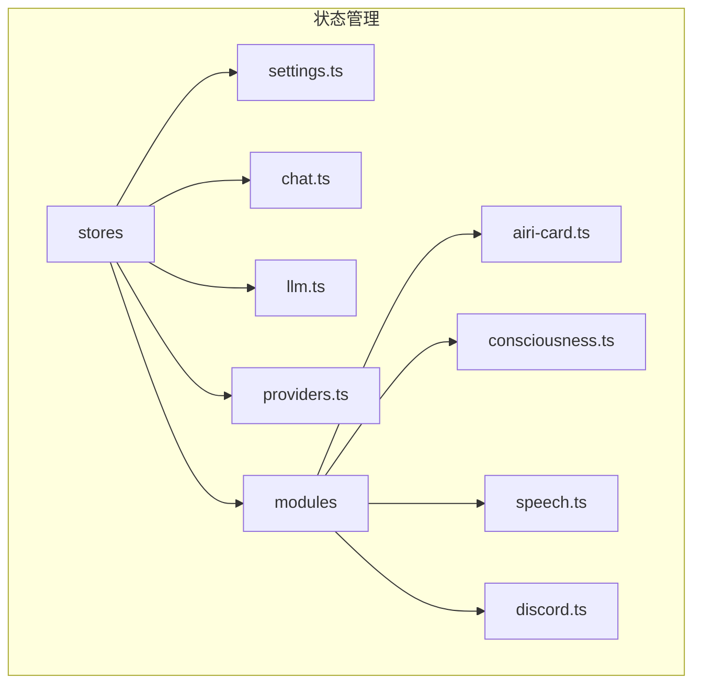
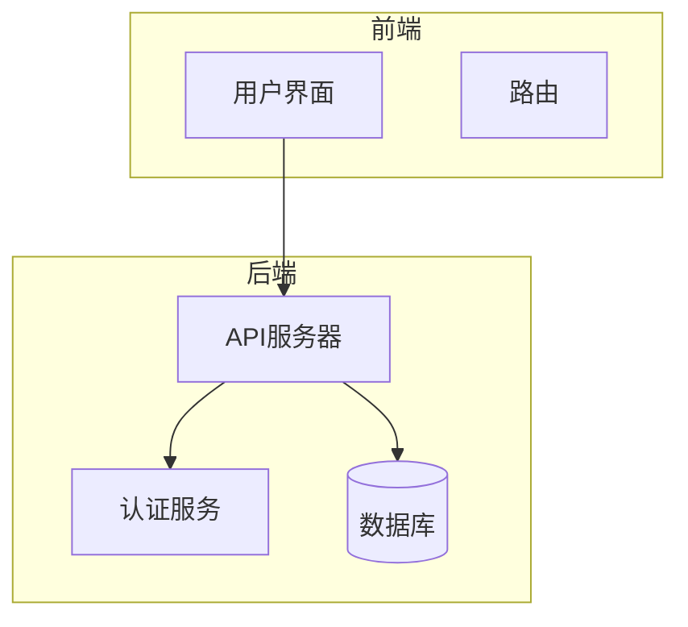
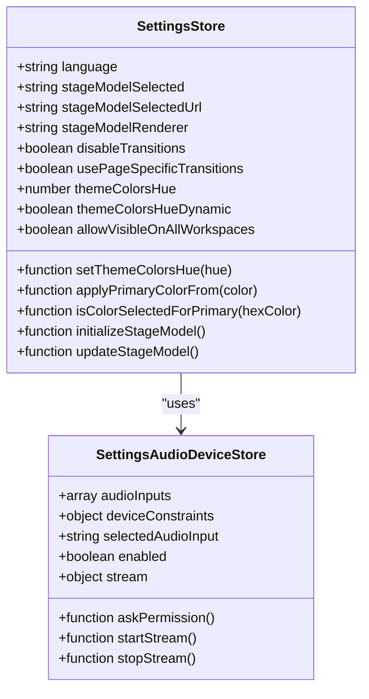
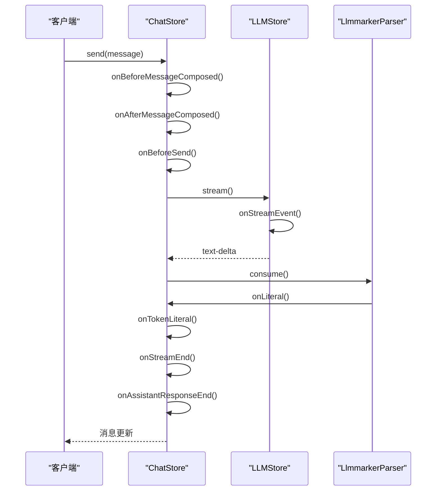
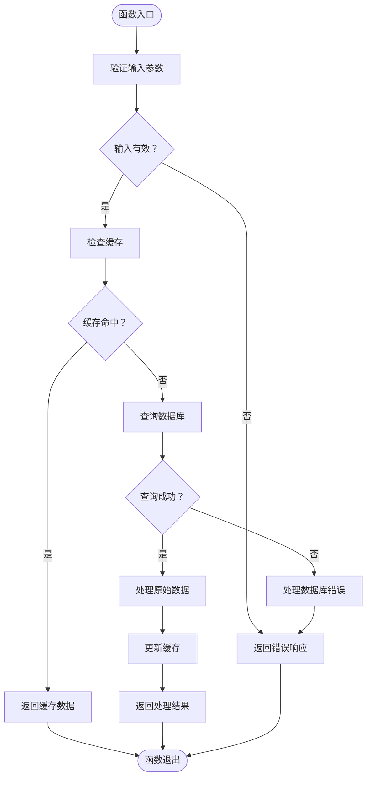
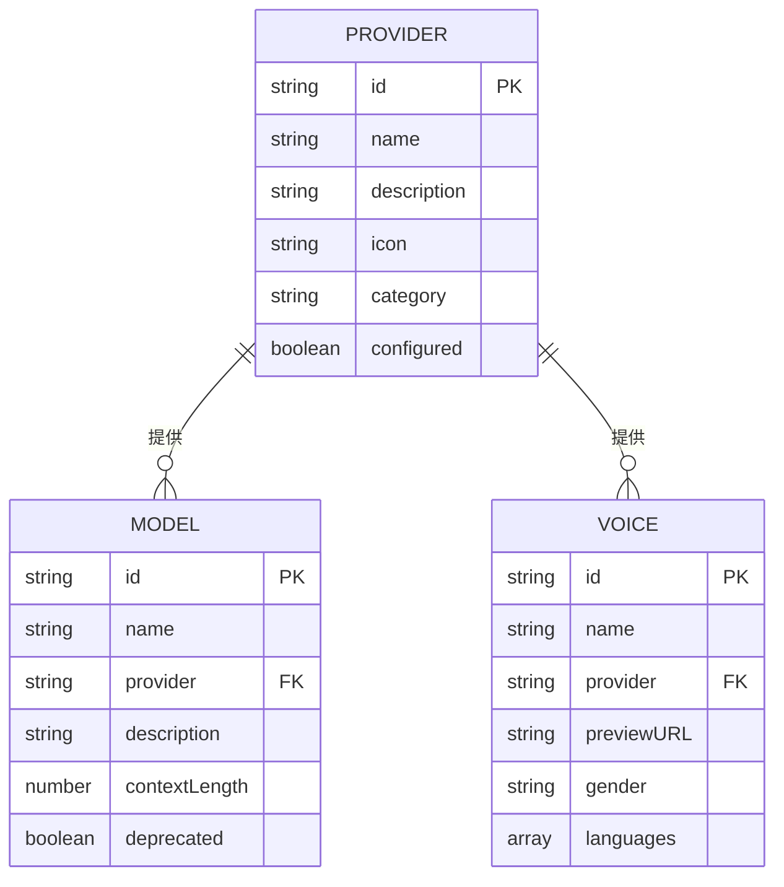
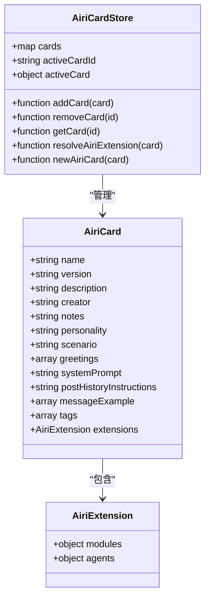
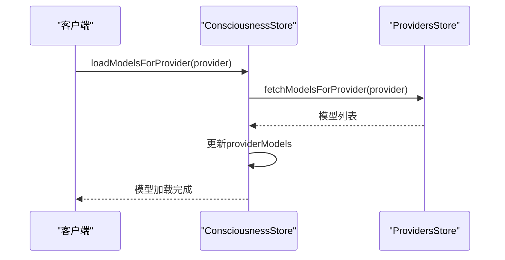
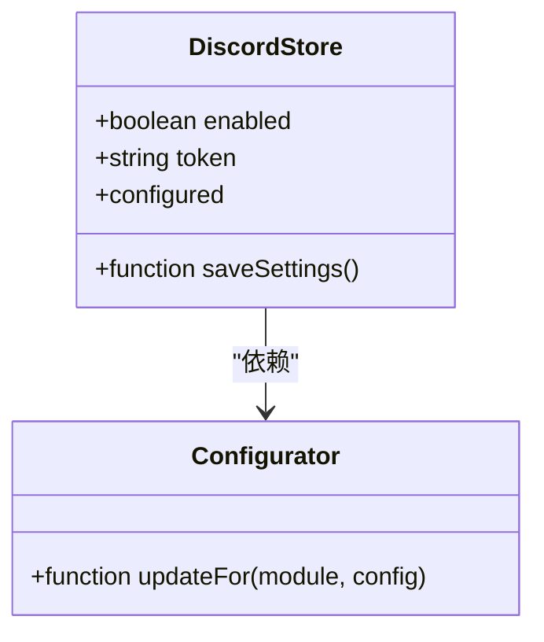
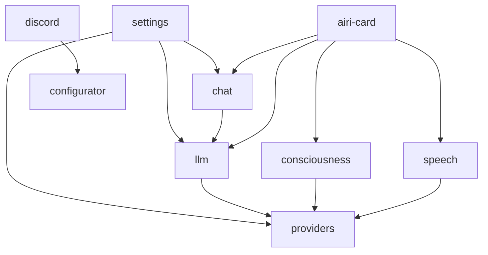

# 状态管理

<cite>
**本文档引用的文件**  
- [pwa.ts](file://apps/stage-web/src/stores/pwa.ts)
- [settings.ts](file://packages/stage-ui/src/stores/settings.ts)
- [chat.ts](file://packages/stage-ui/src/stores/chat.ts)
- [llm.ts](file://packages/stage-ui/src/stores/llm.ts)
- [providers.ts](file://packages/stage-ui/src/stores/providers.ts)
- [airi-card.ts](file://packages/stage-ui/src/stores/modules/airi-card.ts)
- [consciousness.ts](file://packages/stage-ui/src/stores/modules/consciousness.ts)
- [speech.ts](file://packages/stage-ui/src/stores/modules/speech.ts)
- [discord.ts](file://packages/stage-ui/src/stores/modules/discord.ts)
- [audio.ts](file://packages/stage-ui/src/stores/audio.ts)
- [mcp.ts](file://packages/stage-ui/src/stores/mcp.ts)
- [onboarding.ts](file://packages/stage-ui/src/stores/onboarding.ts)
- [server.ts](file://packages/stage-ui/src/stores/server.ts)
</cite>

## 目录
1. [引言](#引言)
2. [项目结构](#项目结构)
3. [核心组件](#核心组件)
4. [架构概述](#架构概述)
5. [详细组件分析](#详细组件分析)
6. [依赖分析](#依赖分析)
7. [性能考虑](#性能考虑)
8. [故障排除指南](#故障排除指南)
9. [结论](#结论)
10. [附录](#附录)（如有必要）

## 引言
本文档详细介绍了基于Pinia的状态管理设计模式、store结构和数据流。文档深入分析了各个store模块的功能、状态属性和操作方法，说明了如何在组件中使用store进行状态读取和更新，并提供了状态管理的最佳实践、性能优化技巧和常见问题解决方案。

## 项目结构
项目中的状态管理主要集中在`packages/stage-ui/src/stores`目录下，该目录包含了多个store模块，每个模块负责管理特定领域的状态。此外，`apps/stage-web/src/stores`目录下也包含了一些特定应用的状态管理文件。

**图表来源**
- [settings.ts](file://packages/stage-ui/src/stores/settings.ts)
- [chat.ts](file://packages/stage-ui/src/stores/chat.ts)
- [llm.ts](file://packages/stage-ui/src/stores/llm.ts)
- [providers.ts](file://packages/stage-ui/src/stores/providers.ts)
- [airi-card.ts](file://packages/stage-ui/src/stores/modules/airi-card.ts)
- [consciousness.ts](file://packages/stage-ui/src/stores/modules/consciousness.ts)
- [speech.ts](file://packages/stage-ui/src/stores/modules/speech.ts)
- [discord.ts](file://packages/stage-ui/src/stores/modules/discord.ts)

**章节来源**
- [settings.ts](file://packages/stage-ui/src/stores/settings.ts)
- [chat.ts](file://packages/stage-ui/src/stores/chat.ts)
- [llm.ts](file://packages/stage-ui/src/stores/llm.ts)
- [providers.ts](file://packages/stage-ui/src/stores/providers.ts)
- [airi-card.ts](file://packages/stage-ui/src/stores/modules/airi-card.ts)
- [consciousness.ts](file://packages/stage-ui/src/stores/modules/consciousness.ts)
- [speech.ts](file://packages/stage-ui/src/stores/modules/speech.ts)
- [discord.ts](file://packages/stage-ui/src/stores/modules/discord.ts)

## 核心组件
核心组件包括`settings`、`chat`、`llm`、`providers`等store模块，它们分别管理应用的设置、聊天、语言模型和提供者等状态。

**章节来源**
- [settings.ts](file://packages/stage-ui/src/stores/settings.ts)
- [chat.ts](file://packages/stage-ui/src/stores/chat.ts)
- [llm.ts](file://packages/stage-ui/src/stores/llm.ts)
- [providers.ts](file://packages/stage-ui/src/stores/providers.ts)

## 架构概述
系统架构采用模块化设计，每个store模块负责管理特定领域的状态。通过Pinia的storeToRefs和computed属性，实现了状态的响应式更新和计算。

**图表来源**
- [settings.ts](file://packages/stage-ui/src/stores/settings.ts)
- [chat.ts](file://packages/stage-ui/src/stores/chat.ts)
- [llm.ts](file://packages/stage-ui/src/stores/llm.ts)
- [providers.ts](file://packages/stage-ui/src/stores/providers.ts)

## 详细组件分析
### settings模块分析
`settings`模块负责管理应用的全局设置，包括语言、模型选择、音频设备等。

#### Class Diagram (for Code Analysis)

**图表来源**
- [settings.ts](file://packages/stage-ui/src/stores/settings.ts)

**章节来源**
- [settings.ts](file://packages/stage-ui/src/stores/settings.ts)

### chat模块分析
`chat`模块负责管理聊天相关的状态，包括消息列表、发送状态、流式响应等。

#### Sequence Diagram (for Code Flow Analysis)

**图表来源**
- [chat.ts](file://packages/stage-ui/src/stores/chat.ts)
- [llm.ts](file://packages/stage-ui/src/stores/llm.ts)

**章节来源**
- [chat.ts](file://packages/stage-ui/src/stores/chat.ts)

### llm模块分析
`llm`模块负责管理语言模型的状态，包括模型列表、流式响应、工具兼容性等。

#### Flowchart (for Algorithm Analysis)

**图表来源**
- [llm.ts](file://packages/stage-ui/src/stores/llm.ts)

**章节来源**
- [llm.ts](file://packages/stage-ui/src/stores/llm.ts)

### providers模块分析
`providers`模块负责管理各种AI服务提供者的配置和状态，包括聊天、嵌入、语音和转录服务。

#### Data Models Diagram

**图表来源**
- [providers.ts](file://packages/stage-ui/src/stores/providers.ts)

**章节来源**
- [providers.ts](file://packages/stage-ui/src/stores/providers.ts)

### airi-card模块分析
`airi-card`模块负责管理Airi卡片的状态，包括卡片列表、活动卡片、模型配置等。

#### Class Diagram (for Code Analysis)

**图表来源**
- [airi-card.ts](file://packages/stage-ui/src/stores/modules/airi-card.ts)

**章节来源**
- [airi-card.ts](file://packages/stage-ui/src/stores/modules/airi-card.ts)

### consciousness模块分析
`consciousness`模块负责管理意识相关的状态，包括活动提供者、活动模型、模型搜索等。

#### Sequence Diagram (for Code Flow Analysis)

**图表来源**
- [consciousness.ts](file://packages/stage-ui/src/stores/modules/consciousness.ts)
- [providers.ts](file://packages/stage-ui/src/stores/providers.ts)

**章节来源**
- [consciousness.ts](file://packages/stage-ui/src/stores/modules/consciousness.ts)

### speech模块分析
`speech`模块负责管理语音相关的状态，包括活动语音提供者、活动语音模型、语音列表等。

#### Flowchart (for Algorithm Analysis)

**图表来源**
- [speech.ts](file://packages/stage-ui/src/stores/modules/speech.ts)

**章节来源**
- [speech.ts](file://packages/stage-ui/src/stores/modules/speech.ts)

### discord模块分析
`discord`模块负责管理Discord相关的状态，包括启用状态、令牌等。

#### Class Diagram (for Code Analysis)

**图表来源**
- [discord.ts](file://packages/stage-ui/src/stores/modules/discord.ts)
- [configurator.ts](file://packages/stage-ui/src/stores/configurator.ts)

**章节来源**
- [discord.ts](file://packages/stage-ui/src/stores/modules/discord.ts)

## 依赖分析
各个store模块之间存在明确的依赖关系，通过`useStore`和`storeToRefs`实现状态的共享和响应式更新。

**图表来源**
- [settings.ts](file://packages/stage-ui/src/stores/settings.ts)
- [chat.ts](file://packages/stage-ui/src/stores/chat.ts)
- [llm.ts](file://packages/stage-ui/src/stores/llm.ts)
- [providers.ts](file://packages/stage-ui/src/stores/providers.ts)
- [airi-card.ts](file://packages/stage-ui/src/stores/modules/airi-card.ts)
- [consciousness.ts](file://packages/stage-ui/src/stores/modules/consciousness.ts)
- [speech.ts](file://packages/stage-ui/src/stores/modules/speech.ts)
- [discord.ts](file://packages/stage-ui/src/stores/modules/discord.ts)
- [configurator.ts](file://packages/stage-ui/src/stores/configurator.ts)

**章节来源**
- [settings.ts](file://packages/stage-ui/src/stores/settings.ts)
- [chat.ts](file://packages/stage-ui/src/stores/chat.ts)
- [llm.ts](file://packages/stage-ui/src/stores/llm.ts)
- [providers.ts](file://packages/stage-ui/src/stores/providers.ts)
- [airi-card.ts](file://packages/stage-ui/src/stores/modules/airi-card.ts)
- [consciousness.ts](file://packages/stage-ui/src/stores/modules/consciousness.ts)
- [speech.ts](file://packages/stage-ui/src/stores/modules/speech.ts)
- [discord.ts](file://packages/stage-ui/src/stores/modules/discord.ts)

## 性能考虑
- 使用`useLocalStorage`持久化状态，减少不必要的网络请求。
- 通过`computed`属性实现状态的响应式更新，避免重复计算。
- 使用`watch`监听状态变化，及时更新相关数据。

## 故障排除指南
- **状态未更新**：检查`useStore`和`storeToRefs`的使用是否正确。
- **依赖循环**：避免store模块之间的循环依赖，通过`useStore`按需引入。
- **性能问题**：使用`computed`和`watch`优化状态更新，避免不必要的计算。

**章节来源**
- [settings.ts](file://packages/stage-ui/src/stores/settings.ts)
- [chat.ts](file://packages/stage-ui/src/stores/chat.ts)
- [llm.ts](file://packages/stage-ui/src/stores/llm.ts)
- [providers.ts](file://packages/stage-ui/src/stores/providers.ts)
- [airi-card.ts](file://packages/stage-ui/src/stores/modules/airi-card.ts)
- [consciousness.ts](file://packages/stage-ui/src/stores/modules/consciousness.ts)
- [speech.ts](file://packages/stage-ui/src/stores/modules/speech.ts)
- [discord.ts](file://packages/stage-ui/src/stores/modules/discord.ts)

## 结论
本文档详细介绍了基于Pinia的状态管理设计模式、store结构和数据流。通过模块化设计和响应式更新，实现了高效的状态管理。建议在实际开发中遵循最佳实践，合理使用`computed`和`watch`，避免性能问题和依赖循环。

## 附录
- [Pinia官方文档](https://pinia.vuejs.org/)
- [Vue 3官方文档](https://v3.vuejs.org/)
- [TypeScript官方文档](https://www.typescriptlang.org/)