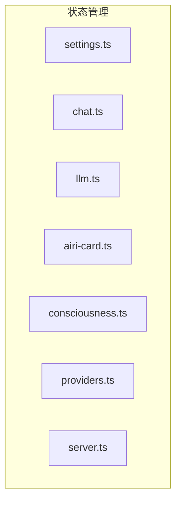
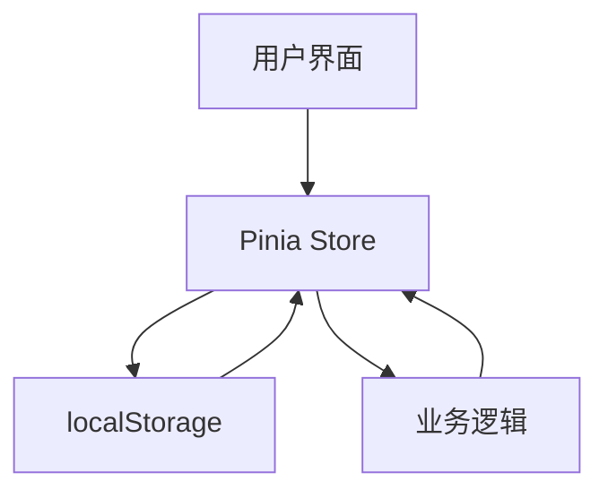
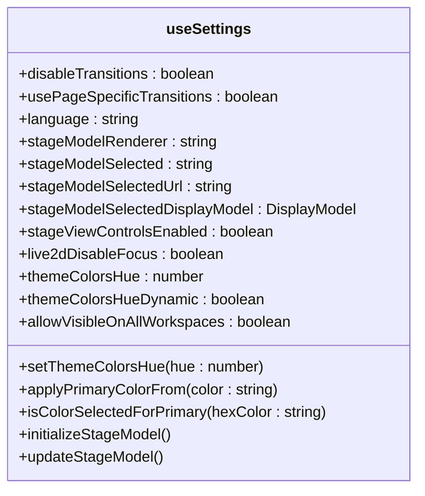
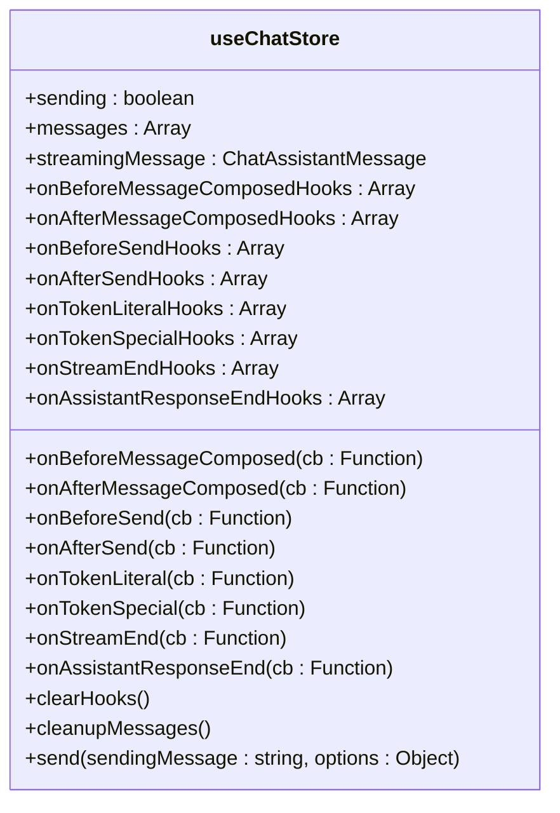
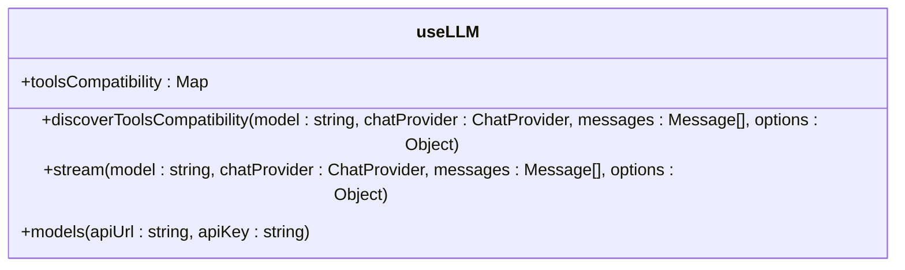
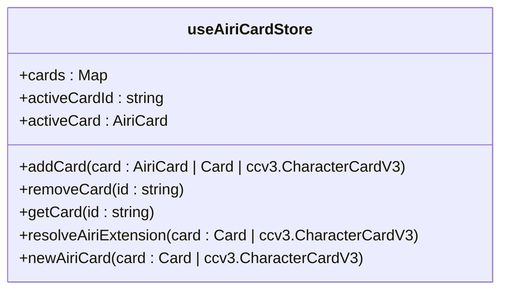
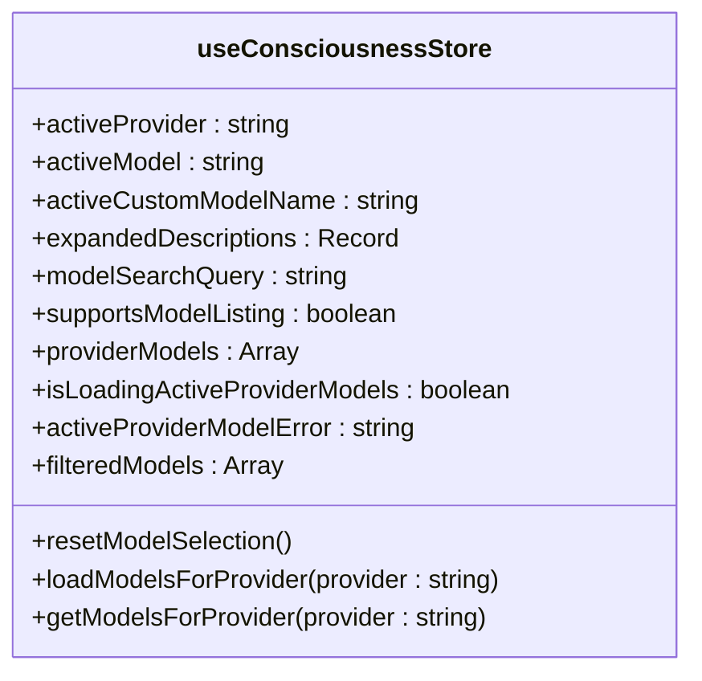
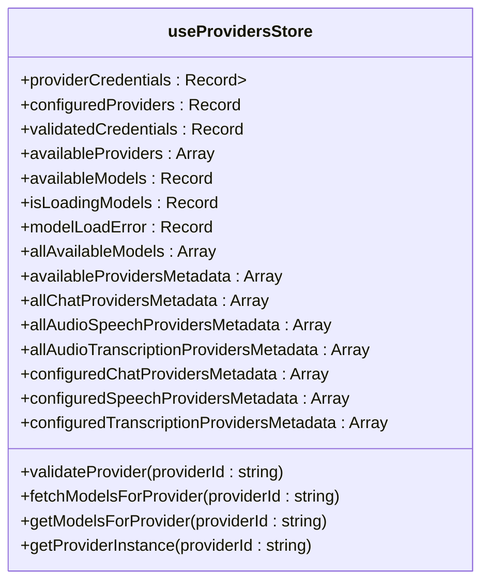
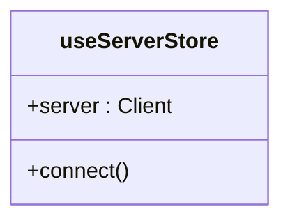

# 状态管理模式与最佳实践

<cite>
**本文档引用的文件**  
- [settings.ts](file://packages/stage-ui/src/stores/settings.ts)
- [chat.ts](file://packages/stage-ui/src/stores/chat.ts)
- [llm.ts](file://packages/stage-ui/src/stores/llm.ts)
- [airi-card.ts](file://packages/stage-ui/src/stores/modules/airi-card.ts)
- [consciousness.ts](file://packages/stage-ui/src/stores/modules/consciousness.ts)
- [providers.ts](file://packages/stage-ui/src/stores/providers.ts)
- [server.ts](file://packages/stage-ui/src/stores/server.ts)
</cite>

## 目录
1. [简介](#简介)
2. [项目结构](#项目结构)
3. [核心组件](#核心组件)
4. [架构概述](#架构概述)
5. [详细组件分析](#详细组件分析)
6. [依赖分析](#依赖分析)
7. [性能考虑](#性能考虑)
8. [故障排除指南](#故障排除指南)
9. [结论](#结论)

## 简介
本文档旨在全面总结项目中采用的状态管理模式与最佳实践。涵盖模块化store设计、响应式更新、状态持久化等核心设计模式。详细说明类型安全的状态定义、错误处理机制和性能优化策略。提供状态管理的测试方法、调试技巧和常见问题解决方案，并包括与其他系统的集成模式和扩展性考虑。

## 项目结构
项目采用模块化架构，状态管理主要集中在`packages/stage-ui/src/stores`目录下。每个store文件负责管理特定功能模块的状态，如聊天、音频、设置等。通过Pinia进行状态管理，实现模块化和可扩展性。



**图示来源**
- [settings.ts](file://packages/stage-ui/src/stores/settings.ts)
- [chat.ts](file://packages/stage-ui/src/stores/chat.ts)
- [llm.ts](file://packages/stage-ui/src/stores/llm.ts)
- [airi-card.ts](file://packages/stage-ui/src/stores/modules/airi-card.ts)
- [consciousness.ts](file://packages/stage-ui/src/stores/modules/consciousness.ts)
- [providers.ts](file://packages/stage-ui/src/stores/providers.ts)
- [server.ts](file://packages/stage-ui/src/stores/server.ts)

**章节来源**
- [settings.ts](file://packages/stage-ui/src/stores/settings.ts)
- [chat.ts](file://packages/stage-ui/src/stores/chat.ts)
- [llm.ts](file://packages/stage-ui/src/stores/llm.ts)

## 核心组件
核心组件包括设置、聊天、语言模型、角色卡、意识、提供者和服务器状态管理。这些组件通过Pinia store进行管理，确保状态的单一来源和可预测性。

**章节来源**
- [settings.ts](file://packages/stage-ui/src/stores/settings.ts)
- [chat.ts](file://packages/stage-ui/src/stores/chat.ts)
- [llm.ts](file://packages/stage-ui/src/stores/llm.ts)

## 架构概述
系统采用模块化状态管理架构，每个功能模块都有独立的store。通过Pinia实现状态的集中管理和响应式更新。状态持久化通过localStorage实现，确保用户设置和数据在页面刷新后仍然存在。



**图示来源**
- [settings.ts](file://packages/stage-ui/src/stores/settings.ts)
- [chat.ts](file://packages/stage-ui/src/stores/chat.ts)
- [llm.ts](file://packages/stage-ui/src/stores/llm.ts)

## 详细组件分析
### 设置状态管理
设置状态管理负责管理用户界面的各种设置，如语言、主题颜色、音频设备等。通过`useLocalStorage`实现状态持久化。



**图示来源**
- [settings.ts](file://packages/stage-ui/src/stores/settings.ts)

**章节来源**
- [settings.ts](file://packages/stage-ui/src/stores/settings.ts)

### 聊天状态管理
聊天状态管理负责管理聊天消息、流式响应和各种钩子函数。通过`useLocalStorage`实现消息持久化，确保聊天记录在页面刷新后仍然存在。



**图示来源**
- [chat.ts](file://packages/stage-ui/src/stores/chat.ts)

**章节来源**
- [chat.ts](file://packages/stage-ui/src/stores/chat.ts)

### 语言模型状态管理
语言模型状态管理负责管理语言模型的流式响应、工具兼容性发现和模型列表。通过`streamFrom`函数实现流式响应，通过`attemptForToolsCompatibilityDiscovery`函数实现工具兼容性发现。



**图示来源**
- [llm.ts](file://packages/stage-ui/src/stores/llm.ts)

**章节来源**
- [llm.ts](file://packages/stage-ui/src/stores/llm.ts)

### 角色卡状态管理
角色卡状态管理负责管理角色卡的创建、删除和获取。通过`newAiriCard`函数创建新的角色卡，通过`resolveAiriExtension`函数解析角色卡扩展。



**图示来源**
- [airi-card.ts](file://packages/stage-ui/src/stores/modules/airi-card.ts)

**章节来源**
- [airi-card.ts](file://packages/stage-ui/src/stores/modules/airi-card.ts)

### 意识状态管理
意识状态管理负责管理意识模块的活动提供者、活动模型和模型搜索查询。通过`loadModelsForProvider`函数加载提供者的模型列表。



**图示来源**
- [consciousness.ts](file://packages/stage-ui/src/stores/modules/consciousness.ts)

**章节来源**
- [consciousness.ts](file://packages/stage-ui/src/stores/modules/consciousness.ts)

### 提供者状态管理
提供者状态管理负责管理各种AI服务提供者的配置、验证和模型列表。通过`validateProvider`函数验证提供者配置，通过`fetchModelsForProvider`函数获取提供者的模型列表。



**图示来源**
- [providers.ts](file://packages/stage-ui/src/stores/providers.ts)

**章节来源**
- [providers.ts](file://packages/stage-ui/src/stores/providers.ts)

### 服务器状态管理
服务器状态管理负责管理与服务器的连接和通信。通过`connect`函数建立与服务器的连接。



**图示来源**
- [server.ts](file://packages/stage-ui/src/stores/server.ts)

**章节来源**
- [server.ts](file://packages/stage-ui/src/stores/server.ts)

## 依赖分析
项目依赖于多个外部库和内部模块，通过Pinia实现状态管理，通过VueUse实现各种实用功能，如`useLocalStorage`和`useEventListener`。通过`@xsai`系列库实现AI服务的集成。

```mermaid
graph TD
A[Pinia] --> B[状态管理]
C[VueUse] --> D[实用功能]
E[@xsai] --> F[AI服务集成]
G[@proj-airi] --> H[项目特定功能]
B --> I[核心组件]
D --> I
F --> I
H --> I
```

**图示来源**
- [settings.ts](file://packages/stage-ui/src/stores/settings.ts)
- [chat.ts](file://packages/stage-ui/src/stores/chat.ts)
- [llm.ts](file://packages/stage-ui/src/stores/llm.ts)
- [airi-card.ts](file://packages/stage-ui/src/stores/modules/airi-card.ts)
- [consciousness.ts](file://packages/stage-ui/src/stores/modules/consciousness.ts)
- [providers.ts](file://packages/stage-ui/src/stores/providers.ts)
- [server.ts](file://packages/stage-ui/src/stores/server.ts)

**章节来源**
- [settings.ts](file://packages/stage-ui/src/stores/settings.ts)
- [chat.ts](file://packages/stage-ui/src/stores/chat.ts)
- [llm.ts](file://packages/stage-ui/src/stores/llm.ts)
- [airi-card.ts](file://packages/stage-ui/src/stores/modules/airi-card.ts)
- [consciousness.ts](file://packages/stage-ui/src/stores/modules/consciousness.ts)
- [providers.ts](file://packages/stage-ui/src/stores/providers.ts)
- [server.ts](file://packages/stage-ui/src/stores/server.ts)

## 性能考虑
状态管理通过Pinia实现高效的响应式更新，避免不必要的重新渲染。通过`useLocalStorage`实现状态持久化，减少数据加载时间。通过模块化设计，确保每个store的独立性和可维护性。

## 故障排除指南
常见问题包括提供者配置验证失败、模型列表加载失败和服务器连接失败。通过检查配置参数、网络连接和API密钥解决这些问题。

**章节来源**
- [providers.ts](file://packages/stage-ui/src/stores/providers.ts)
- [server.ts](file://packages/stage-ui/src/stores/server.ts)

## 结论
本文档全面总结了项目中采用的状态管理模式与最佳实践。通过模块化store设计、响应式更新、状态持久化等核心设计模式，实现了高效、可维护的状态管理。详细说明了类型安全的状态定义、错误处理机制和性能优化策略，提供了状态管理的测试方法、调试技巧和常见问题解决方案，并包括与其他系统的集成模式和扩展性考虑。