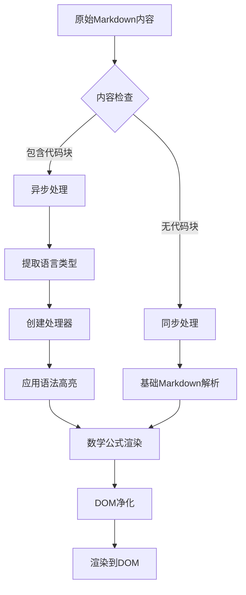
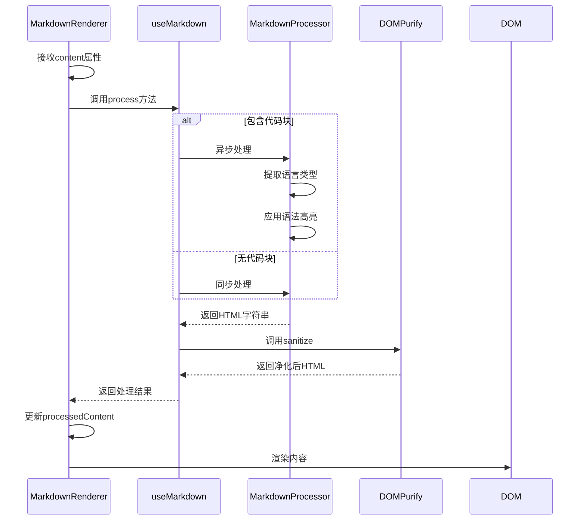

# Markdown渲染组件

<cite>
**Referenced Files in This Document**  
- [MarkdownRenderer.vue](file://packages/stage-ui/src/components/markdown/MarkdownRenderer.vue)
- [markdown.ts](file://packages/stage-ui/src/composables/markdown.ts)
- [index.ts](file://packages/stage-ui/src/components/markdown/index.ts)
- [MarkdownRenderer.story.vue](file://packages/stage-ui/src/components/markdown/MarkdownRenderer.story.vue)
</cite>

## 目录
1. [简介](#简介)
2. [核心功能](#核心功能)
3. [组件属性](#组件属性)
4. [内容处理流程](#内容处理流程)
5. [安全防护机制](#安全防护机制)
6. [代码高亮支持](#代码高亮支持)
7. [样式定制](#样式定制)
8. [使用示例](#使用示例)
9. [性能优化](#性能优化)
10. [可访问性](#可访问性)

## 简介

MarkdownRenderer组件是stage-ui库中的核心内容展示组件，专门用于安全地渲染Markdown格式的内容。该组件提供了完整的Markdown解析、语法高亮、数学公式支持和XSS防护功能，确保用户生成的内容能够安全、美观地展示。

**Section sources**  
- [MarkdownRenderer.vue](file://packages/stage-ui/src/components/markdown/MarkdownRenderer.vue#L1-L92)
- [markdown.ts](file://packages/stage-ui/src/composables/markdown.ts#L1-L106)

## 核心功能

MarkdownRenderer组件提供了一系列强大的功能来处理和展示Markdown内容：

- **完整的Markdown解析**：支持标准Markdown语法，包括标题、列表、引用等
- **语法高亮**：集成Shiki高亮引擎，支持多种编程语言的代码高亮
- **数学公式**：支持LaTeX数学公式渲染
- **XSS防护**：使用DOMPurify库防止跨站脚本攻击
- **响应式设计**：自动适应不同屏幕尺寸
- **暗色模式**：根据主题自动切换代码高亮主题



**Diagram sources**  
- [markdown.ts](file://packages/stage-ui/src/composables/markdown.ts#L1-L106)
- [MarkdownRenderer.vue](file://packages/stage-ui/src/components/markdown/MarkdownRenderer.vue#L1-L92)

**Section sources**  
- [markdown.ts](file://packages/stage-ui/src/composables/markdown.ts#L1-L106)

## 组件属性

MarkdownRenderer组件接受以下属性来控制其行为和外观：

### Props

| 属性名 | 类型 | 必需 | 默认值 | 描述 |
|-------|------|------|--------|------|
| content | string | 是 | - | 要渲染的Markdown内容 |
| class | string | 否 | - | 自定义CSS类名，用于样式扩展 |

**Section sources**  
- [MarkdownRenderer.vue](file://packages/stage-ui/src/components/markdown/MarkdownRenderer.vue#L7-L13)

## 内容处理流程

MarkdownRenderer组件采用分层处理策略来确保内容的安全性和渲染效率。

### 处理流程

1. **输入验证**：检查内容是否为空
2. **语言检测**：分析Markdown中的代码块语言
3. **处理器选择**：根据内容复杂度选择异步或同步处理器
4. **内容转换**：将Markdown转换为HTML
5. **安全净化**：清理潜在的恶意代码
6. **DOM渲染**：将处理后的内容插入页面



**Diagram sources**  
- [MarkdownRenderer.vue](file://packages/stage-ui/src/components/markdown/MarkdownRenderer.vue#L1-L92)
- [markdown.ts](file://packages/stage-ui/src/composables/markdown.ts#L1-L106)

**Section sources**  
- [MarkdownRenderer.vue](file://packages/stage-ui/src/components/markdown/MarkdownRenderer.vue#L1-L92)
- [markdown.ts](file://packages/stage-ui/src/composables/markdown.ts#L1-L106)

## 安全防护机制

MarkdownRenderer组件内置了多层次的安全防护机制，确保用户内容的安全性。

### XSS防护

组件使用DOMPurify库对生成的HTML进行净化处理，有效防止跨站脚本攻击：

- 自动清理script标签
- 移除on*事件处理器
- 过滤危险的URL协议
- 防止DOM-based XSS攻击

### 错误处理

组件实现了优雅的错误处理机制：

- 当异步处理失败时，自动降级到同步处理
- 记录警告信息但不影响整体渲染
- 确保即使在错误情况下也能显示基本内容

**Section sources**  
- [MarkdownRenderer.vue](file://packages/stage-ui/src/components/markdown/MarkdownRenderer.vue#L1-L92)

## 代码高亮支持

MarkdownRenderer组件通过Shiki引擎提供高质量的代码高亮支持。

### 支持的语言

组件能够自动检测并支持多种编程语言的高亮：

- Python（默认）
- JavaScript/TypeScript
- HTML/CSS
- Shell
- JSON/YAML
- 以及其他常见编程语言

### 主题配置

组件根据系统主题自动切换代码高亮主题：

- **浅色主题**：github-light
- **深色主题**：github-dark

```mermaid
classDiagram
class MarkdownProcessor {
+process(markdown : string) : Promise~string~
+processSync(markdown : string) : string
}
class ShikiHighlighter {
+themes : {light : string, dark : string}
+langs : string[]
+defaultLanguage : string
}
class DOMPurify {
+sanitize(html : string) : string
}
MarkdownProcessor --> ShikiHighlighter : "使用"
MarkdownProcessor --> DOMPurify : "使用"
MarkdownProcessor --> RemarkParse : "使用"
MarkdownProcessor --> remarkMath : "使用"
MarkdownProcessor --> RemarkRehype : "使用"
MarkdownProcessor --> rehypeKatex : "使用"
MarkdownProcessor --> RehypeStringify : "使用"
```

**Diagram sources**  
- [markdown.ts](file://packages/stage-ui/src/composables/markdown.ts#L1-L106)

**Section sources**  
- [markdown.ts](file://packages/stage-ui/src/composables/markdown.ts#L1-L106)

## 样式定制

MarkdownRenderer组件提供了灵活的样式定制选项。

### 内置样式

组件包含以下内置样式：

- 代码块：圆角边框、内边距、水平滚动
- 行内代码：等宽字体、小字号
- 数学公式：KaTeX渲染样式

### 自定义扩展

通过class属性可以轻松扩展样式：

```css
.custom-markdown {
  font-size: 16px;
  line-height: 1.6;
}

.custom-markdown :deep(h1) {
  color: #2c3e50;
}
```

**Section sources**  
- [MarkdownRenderer.vue](file://packages/stage-ui/src/components/markdown/MarkdownRenderer.vue#L70-L92)

## 使用示例

以下是MarkdownRenderer组件的典型使用方式。

### 基本用法

```vue
<template>
  <MarkdownRenderer :content="markdownContent" />
</template>

<script setup>
import MarkdownRenderer from '@stage-ui/markdown/MarkdownRenderer.vue'

const markdownContent = `
# 标题
这是**粗体**文本和*斜体*文本。

\`\`\`javascript
console.log('Hello World')
\`\`\`
`
</script>
```

### 带自定义样式的用法

```vue
<template>
  <MarkdownRenderer 
    :content="content" 
    class="custom-markdown"
  />
</template>
```

**Section sources**  
- [MarkdownRenderer.story.vue](file://packages/stage-ui/src/components/markdown/MarkdownRenderer.story.vue#L1-L28)

## 性能优化

MarkdownRenderer组件采用了多项性能优化策略。

### 处理器缓存

- 基于语言组合的处理器缓存
- 避免重复创建处理器实例
- 减少内存分配和初始化开销

### 智能处理选择

- 简单内容使用同步处理
- 复杂内容使用异步处理
- 平衡渲染速度和用户体验

### 资源预加载

- 默认预加载Python语言支持
- 按需加载其他语言语法
- 减少首次渲染时间

**Section sources**  
- [markdown.ts](file://packages/stage-ui/src/composables/markdown.ts#L1-L106)

## 可访问性

MarkdownRenderer组件遵循可访问性最佳实践。

### 语义化HTML

- 生成符合标准的HTML结构
- 正确使用标题层级
- 保持内容的语义完整性

### 键盘导航

- 支持键盘导航
- 代码块可水平滚动
- 确保所有功能可通过键盘访问

### 屏幕阅读器支持

- 适当的ARIA标签
- 清晰的内容结构
- 数学公式的可访问性支持

**Section sources**  
- [MarkdownRenderer.vue](file://packages/stage-ui/src/components/markdown/MarkdownRenderer.vue#L1-L92)
- [markdown.ts](file://packages/stage-ui/src/composables/markdown.ts#L1-L106)