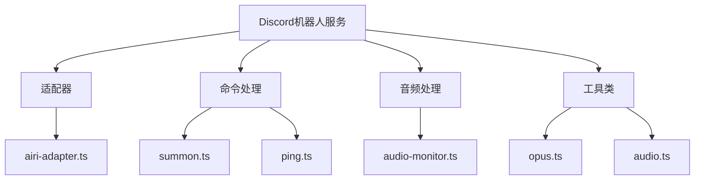
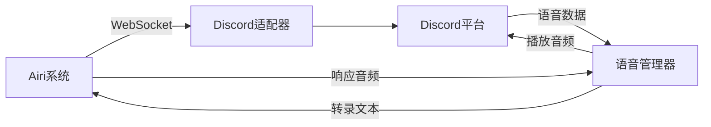
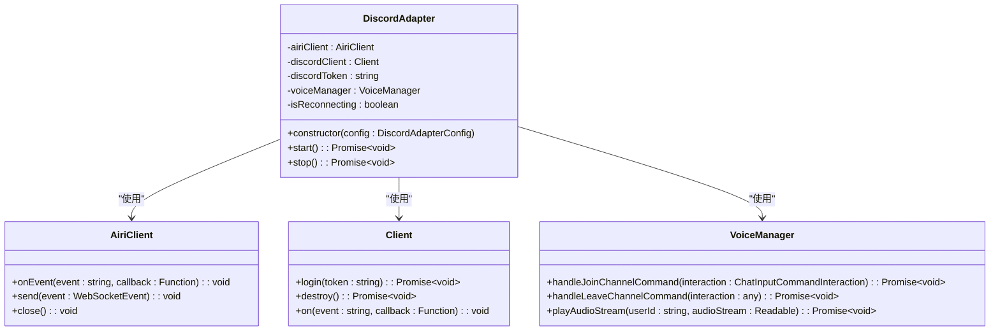
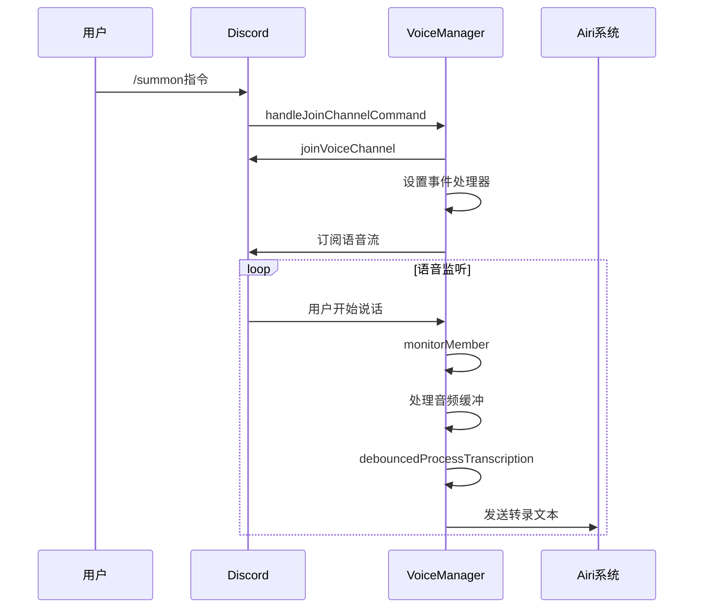
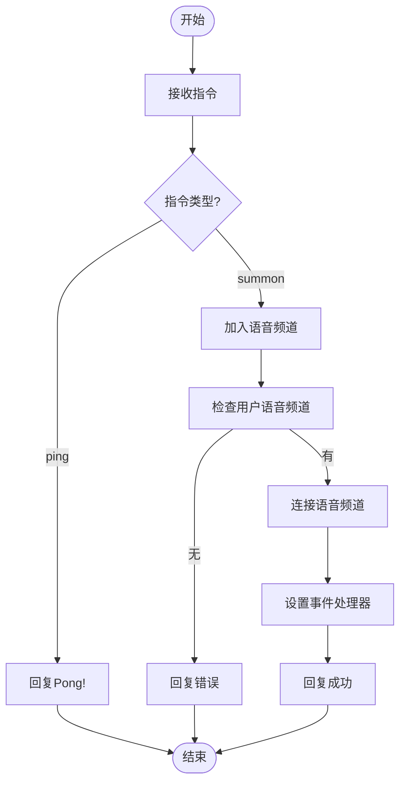

# Discord消息模块组件

<cite>
**本文档引用的文件**
- [airi-adapter.ts](file://services/discord-bot/src/adapters/airi-adapter.ts)
- [summon.ts](file://services/discord-bot/src/bots/discord/commands/summon.ts)
- [index.ts](file://services/discord-bot/src/bots/discord/commands/index.ts)
- [ping.ts](file://services/discord-bot/src/bots/discord/commands/ping.ts)
- [index.ts](file://services/discord-bot/src/index.ts)
- [audio-monitor.ts](file://services/discord-bot/src/utils/audio-monitor.ts)
- [README.md](file://services/discord-bot/README.md)
</cite>

## 目录
1. [简介](#简介)
2. [项目结构](#项目结构)
3. [核心组件](#核心组件)
4. [架构概述](#架构概述)
5. [详细组件分析](#详细组件分析)
6. [依赖分析](#依赖分析)
7. [性能考虑](#性能考虑)
8. [故障排除指南](#故障排除指南)
9. [结论](#结论)

## 简介
Discord消息模块组件实现了与Discord平台的双向通信功能，允许アイリ（Airi）在Discord语音频道中与用户进行交互。该组件通过WebSocket与后端Airi系统通信，支持语音转文本、文本转语音、消息监听和指令处理等功能。文档详细描述了其身份验证流程、消息监听机制和指令处理系统。

## 项目结构
Discord机器人服务位于`services/discord-bot`目录下，包含适配器、命令处理、音频处理等核心功能模块。



**图表来源**
- [airi-adapter.ts](file://services/discord-bot/src/adapters/airi-adapter.ts)
- [summon.ts](file://services/discord-bot/src/bots/discord/commands/summon.ts)
- [audio-monitor.ts](file://services/discord-bot/src/utils/audio-monitor.ts)

**章节来源**
- [airi-adapter.ts](file://services/discord-bot/src/adapters/airi-adapter.ts)
- [summon.ts](file://services/discord-bot/src/bots/discord/commands/summon.ts)

## 核心组件
核心组件包括Discord适配器、语音管理器和WebSocket客户端，实现了与Discord平台的双向通信功能。

**章节来源**
- [airi-adapter.ts](file://services/discord-bot/src/adapters/airi-adapter.ts)
- [summon.ts](file://services/discord-bot/src/bots/discord/commands/summon.ts)

## 架构概述
系统架构采用适配器模式，通过WebSocket与Airi系统通信，同时使用Discord.js与Discord平台交互。



**图表来源**
- [airi-adapter.ts](file://services/discord-bot/src/adapters/airi-adapter.ts)
- [summon.ts](file://services/discord-bot/src/bots/discord/commands/summon.ts)

## 详细组件分析
### Discord适配器分析
Discord适配器负责管理与Discord平台的连接和通信。

#### 类图


**图表来源**
- [airi-adapter.ts](file://services/discord-bot/src/adapters/airi-adapter.ts)

**章节来源**
- [airi-adapter.ts](file://services/discord-bot/src/adapters/airi-adapter.ts)

### 语音管理器分析
语音管理器负责处理语音频道的加入、离开和音频流管理。

#### 序列图


**图表来源**
- [summon.ts](file://services/discord-bot/src/bots/discord/commands/summon.ts)

**章节来源**
- [summon.ts](file://services/discord-bot/src/bots/discord/commands/summon.ts)

### 指令处理系统
指令处理系统支持ping和summon两个基本指令。

#### 流程图


**图表来源**
- [index.ts](file://services/discord-bot/src/bots/discord/commands/index.ts)
- [ping.ts](file://services/discord-bot/src/bots/discord/commands/ping.ts)
- [summon.ts](file://services/discord-bot/src/bots/discord/commands/summon.ts)

**章节来源**
- [index.ts](file://services/discord-bot/src/bots/discord/commands/index.ts)
- [ping.ts](file://services/discord-bot/src/bots/discord/commands/ping.ts)
- [summon.ts](file://services/discord-bot/src/bots/discord/commands/summon.ts)

## 依赖分析
组件依赖于多个外部库和内部模块。

```mermaid
graph TD
A[Discord适配器] --> B[discord.js]
A --> C[@proj-airi/server-sdk]
A --> D[@guiiai/logg]
A --> E[summon.ts]
E --> F[@discordjs/voice]
E --> G[opus.ts]
E --> H[audio-monitor.ts]
E --> I[tts.ts]
```

**图表来源**
- [airi-adapter.ts](file://services/discord-bot/src/adapters/airi-adapter.ts)
- [summon.ts](file://services/discord-bot/src/bots/discord/commands/summon.ts)

**章节来源**
- [airi-adapter.ts](file://services/discord-bot/src/adapters/airi-adapter.ts)
- [summon.ts](file://services/discord-bot/src/bots/discord/commands/summon.ts)

## 性能考虑
- 使用debounce机制处理语音转录，避免频繁处理
- 监控音频音量，当用户说话时自动停止机器人音频播放
- 使用流式处理音频数据，减少内存占用
- 设置合理的超时时间，避免连接挂起

## 故障排除指南
### 常见问题
1. **机器人无法连接**: 检查DISCORD_TOKEN是否正确配置
2. **语音无法转录**: 检查OPENAI_API_KEY是否正确配置
3. **音频播放中断**: 检查网络连接和音频流稳定性

### 调试方法
- 查看日志输出，定位错误信息
- 检查环境变量配置
- 验证Discord应用权限设置

**章节来源**
- [airi-adapter.ts](file://services/discord-bot/src/adapters/airi-adapter.ts)
- [summon.ts](file://services/discord-bot/src/bots/discord/commands/summon.ts)
- [README.md](file://services/discord-bot/README.md)

## 结论
Discord消息模块组件成功实现了与Discord平台的双向通信功能，支持语音交互、指令处理和实时通信。通过适配器模式和事件驱动架构，组件具有良好的可扩展性和稳定性。