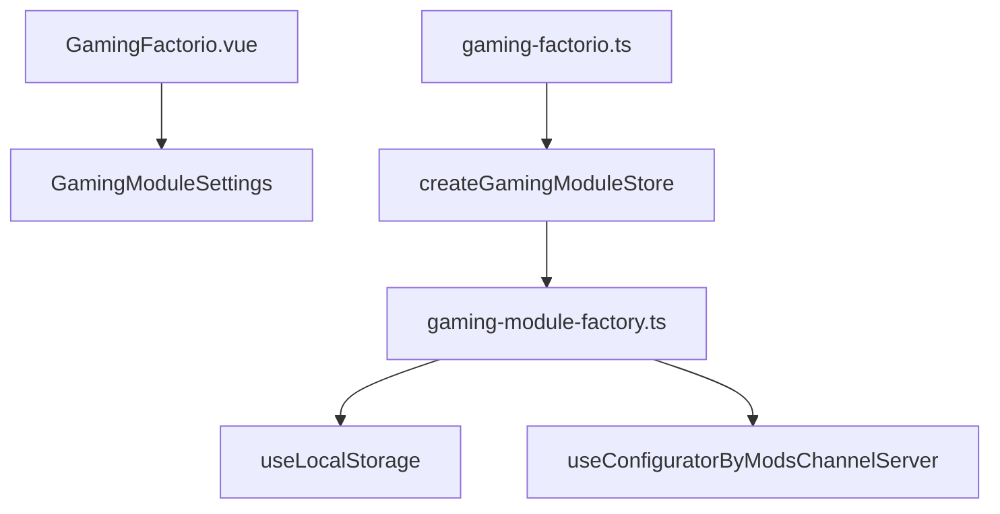
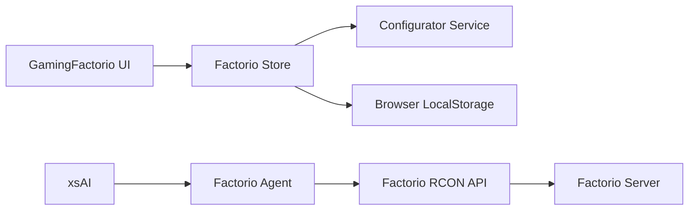
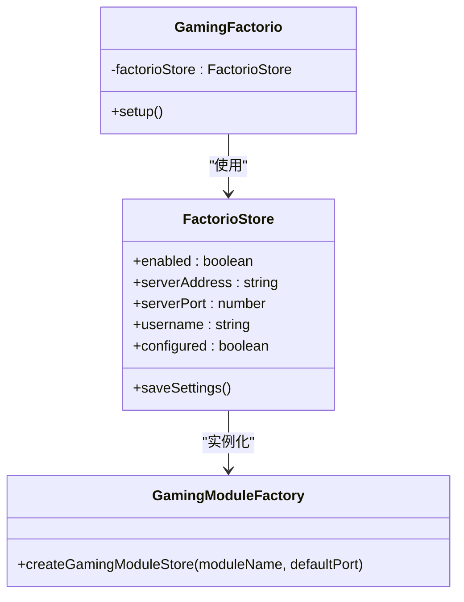
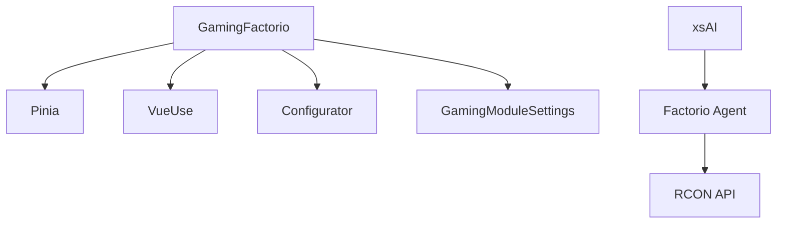

# Factorio游戏模块组件

<cite>
**本文档引用的文件**  
- [GamingFactorio.vue](file://packages/stage-ui/src/components/modules/GamingFactorio.vue)
- [gaming-factorio.ts](file://packages/stage-ui/src/stores/modules/gaming-factorio.ts)
- [gaming-module-factory.ts](file://packages/stage-ui/src/stores/modules/gaming-module-factory.ts)
- [README.md](file://README.md)
</cite>

## 目录
1. [介绍](#介绍)
2. [项目结构](#项目结构)
3. [核心组件](#核心组件)
4. [架构概述](#架构概述)
5. [详细组件分析](#详细组件分析)
6. [依赖分析](#依赖分析)
7. [性能考虑](#性能考虑)
8. [故障排除指南](#故障排除指南)
9. [结论](#结论)

## 介绍
Factorio游戏模块组件是Project AIRI生态系统中的关键部分，旨在实现AI代理与Factorio游戏服务器的深度集成。该组件允许AI角色（如AIRI）监控游戏进度、执行自动化操作并响应游戏内事件。通过RCON（远程控制）协议与Factorio服务器通信，结合MCP（Modular Control Protocol）服务进行协调，该模块实现了高度自动化的游戏交互能力。本文档详细说明了该组件的配置参数、状态同步机制、事件处理系统以及与游戏代理服务的集成方式。

## 项目结构
Factorio游戏模块组件位于`packages/stage-ui/src/components/modules/`目录下，其功能实现依赖于Pinia状态管理库和模块化工厂模式。组件通过Vue 3的组合式API构建，利用TypeScript确保类型安全。配置数据持久化存储在本地，同时通过`configurator`服务与其他系统模块同步。整个模块遵循可复用设计原则，与Minecraft模块共享相同的工厂模式基础架构。

**图示来源**  
- [GamingFactorio.vue](file://packages/stage-ui/src/components/modules/GamingFactorio.vue)
- [gaming-factorio.ts](file://packages/stage-ui/src/stores/modules/gaming-factorio.ts)
- [gaming-module-factory.ts](file://packages/stage-ui/src/stores/modules/gaming-module-factory.ts)

**本节来源**  
- [GamingFactorio.vue](file://packages/stage-ui/src/components/modules/GamingFactorio.vue)
- [gaming-factorio.ts](file://packages/stage-ui/src/stores/modules/gaming-factorio.ts)

## 核心组件
Factorio游戏模块的核心由三个主要部分构成：UI组件`GamingFactorio.vue`、状态存储`gaming-factorio.ts`和通用工厂函数`gaming-module-factory.ts`。UI组件负责渲染用户界面，状态存储管理模块的运行时状态，而工厂函数则提供可复用的模块创建逻辑。这种分层设计确保了代码的可维护性和可扩展性。

**本节来源**  
- [GamingFactorio.vue](file://packages/stage-ui/src/components/modules/GamingFactorio.vue)
- [gaming-factorio.ts](file://packages/stage-ui/src/stores/modules/gaming-factorio.ts)
- [gaming-module-factory.ts](file://packages/stage-ui/src/stores/modules/gaming-module-factory.ts)

## 架构概述
该组件采用模块化架构，通过Pinia状态管理实现数据流的单向绑定。UI层与逻辑层完全分离，确保了视图更新的响应性和一致性。配置数据通过`useLocalStorage`实现持久化，并通过`configurator`服务与系统其他部分同步。与Factorio服务器的通信由独立的代理服务处理，遵循关注点分离原则。

**图示来源**  
- [README.md](file://README.md#L276-L322)
- [gaming-factorio.ts](file://packages/stage-ui/src/stores/modules/gaming-factorio.ts)

## 详细组件分析

### Factorio模块分析
Factorio模块通过`useFactorioStore`组合式函数访问其状态，该函数由通用工厂函数`createGamingModuleStore`创建。工厂模式确保了不同游戏模块之间的代码复用，同时允许特定配置（如默认端口34197）的定制化。

#### 对象导向组件

**图示来源**  
- [GamingFactorio.vue](file://packages/stage-ui/src/components/modules/GamingFactorio.vue)
- [gaming-factorio.ts](file://packages/stage-ui/src/stores/modules/gaming-factorio.ts)
- [gaming-module-factory.ts](file://packages/stage-ui/src/stores/modules/gaming-module-factory.ts)

**本节来源**  
- [GamingFactorio.vue](file://packages/stage-ui/src/components/modules/GamingFactorio.vue)
- [gaming-factorio.ts](file://packages/stage-ui/src/stores/modules/gaming-factorio.ts)

## 依赖分析
Factorio模块依赖于多个核心系统组件，包括Pinia状态管理、VueUse工具库和系统配置器服务。这些依赖关系通过模块化设计进行管理，确保了松耦合和高内聚。与Factorio服务器的通信依赖于独立的代理服务，该服务通过MCP协议与主系统集成。

**图示来源**  
- [package.json](file://package.json)
- [gaming-module-factory.ts](file://packages/stage-ui/src/stores/modules/gaming-module-factory.ts)

**本节来源**  
- [gaming-module-factory.ts](file://packages/stage-ui/src/stores/modules/gaming-module-factory.ts)
- [README.md](file://README.md)

## 性能考虑
由于该组件主要负责UI状态管理和配置同步，其性能开销相对较低。本地存储操作经过优化，避免频繁的磁盘I/O。状态更新采用响应式设计，确保UI渲染的高效性。与Factorio服务器的通信由独立进程处理，不会阻塞主线程，保证了用户界面的流畅性。

## 故障排除指南
当Factorio模块无法连接到服务器时，应首先检查配置参数（服务器地址、端口、用户名）是否正确。确保Factorio服务器已启用RCON并配置了正确的密码。网络连接问题可能导致通信失败，需确认客户端与服务器之间的网络可达性。日志文件通常能提供详细的错误信息，有助于快速定位问题根源。

**本节来源**  
- [README.md](file://README.md)
- [gaming-factorio.ts](file://packages/stage-ui/src/stores/modules/gaming-factorio.ts)

## 结论
Factorio游戏模块组件通过优雅的模块化设计和工厂模式，实现了与Factorio游戏服务器的高效集成。其清晰的架构分离了UI、状态管理和业务逻辑，确保了代码的可维护性和可扩展性。通过RCON协议和MCP服务的结合，该组件为AI代理提供了强大的游戏交互能力，为实现全自动游戏玩法奠定了坚实基础。