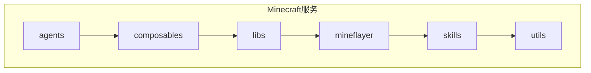
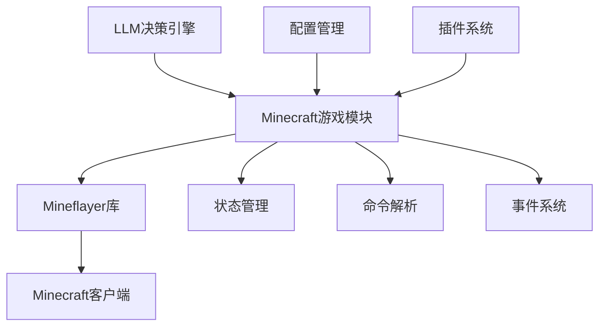
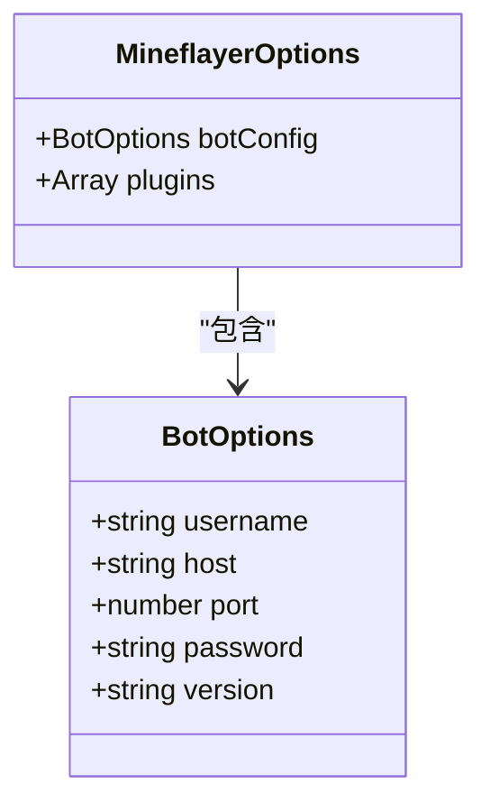
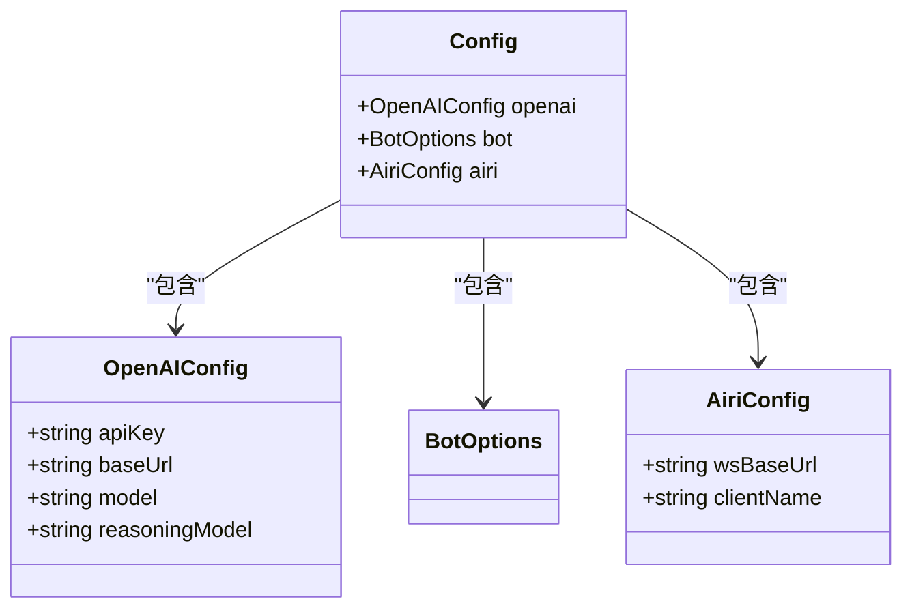
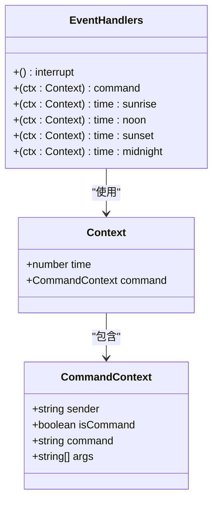
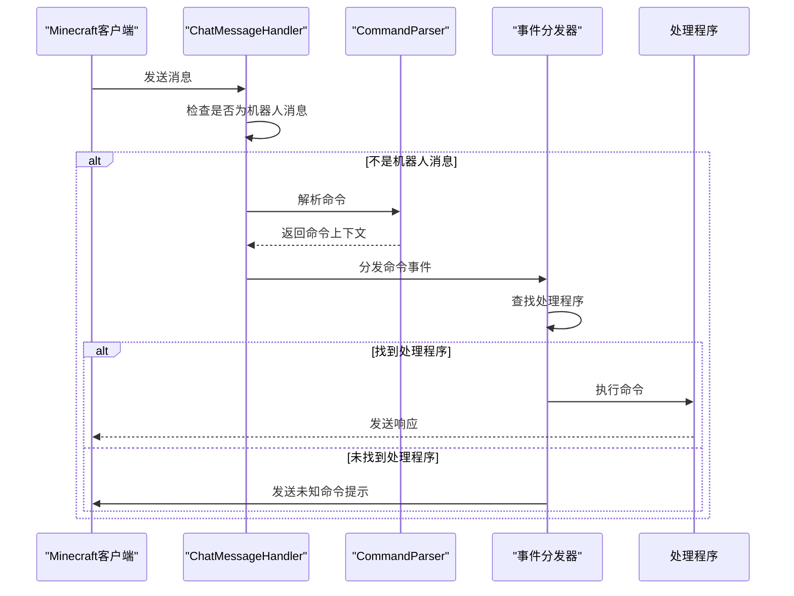
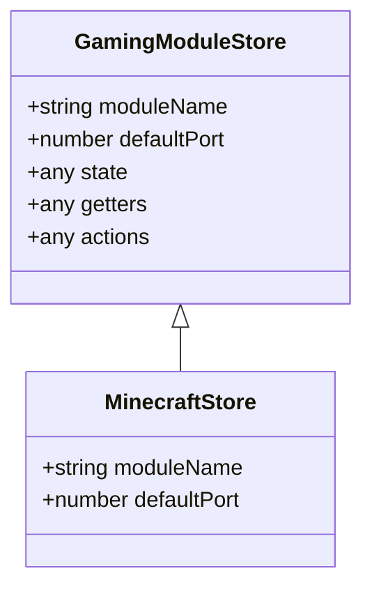

# Minecraft游戏模块组件

<cite>
**本文档引用的文件**  
- [core.ts](file://services/minecraft/src/libs/mineflayer/core.ts)
- [config.ts](file://services/minecraft/src/composables/config.ts)
- [bot.ts](file://services/minecraft/src/composables/bot.ts)
- [plugin.ts](file://services/minecraft/src/libs/mineflayer/plugin.ts)
- [command.ts](file://services/minecraft/src/libs/mineflayer/command.ts)
- [message.ts](file://services/minecraft/src/libs/mineflayer/message.ts)
- [ticker.ts](file://services/minecraft/src/libs/mineflayer/ticker.ts)
- [status.ts](file://services/minecraft/src/libs/mineflayer/status.ts)
- [gaming-minecraft.ts](file://packages/stage-ui/src/stores/modules/gaming-minecraft.ts)
- [README.md](file://services/minecraft/README.md)
</cite>

## 目录
1. [简介](#简介)
2. [项目结构](#项目结构)
3. [核心组件](#核心组件)
4. [架构概述](#架构概述)
5. [详细组件分析](#详细组件分析)
6. [依赖分析](#依赖分析)
7. [性能考虑](#性能考虑)
8. [故障排除指南](#故障排除指南)
9. [结论](#结论)

## 简介
Minecraft游戏模块组件是一个基于LLM驱动的智能Minecraft机器人系统，旨在实现自然语言理解、自动导航、方块操作、战斗能力、自动重连、物品管理、玩家跟随和世界探索等功能。该组件通过集成Mineflayer库与Minecraft客户端进行交互，支持通过自然语言命令控制游戏行为。

## 项目结构
Minecraft服务位于`services/minecraft`目录下，主要包含以下子目录：
- `agents`：AI代理实现
- `composables`：可复用的组合函数
- `libs`：核心库代码
- `mineflayer`：Mineflayer插件实现
- `skills`：机器人技能和动作
- `utils`：实用工具函数



**图示来源**
- [README.md](file://services/minecraft/README.md#L45-L55)

## 核心组件
该组件的核心是`Mineflayer`类，它封装了与Minecraft客户端的所有交互逻辑。组件通过单例模式确保同一时间只有一个机器人实例存在，并提供了初始化、命令处理、事件监听等关键功能。

**章节来源**
- [core.ts](file://services/minecraft/src/libs/mineflayer/core.ts#L25-L347)
- [bot.ts](file://services/minecraft/src/composables/bot.ts#L1-L33)

## 架构概述
系统采用分层架构设计，上层为AI代理和自然语言处理，中层为游戏逻辑和技能系统，底层为Mineflayer库和Minecraft协议交互。



**图示来源**
- [core.ts](file://services/minecraft/src/libs/mineflayer/core.ts#L25-L347)
- [config.ts](file://services/minecraft/src/composables/config.ts#L1-L87)

## 详细组件分析

### 组件属性分析
Minecraft游戏模块的主要属性包括连接配置、认证令牌和状态信息。

#### 连接配置
组件通过`BotOptions`接口定义连接参数，包括用户名、主机地址、端口、密码和游戏版本。



**图示来源**
- [core.ts](file://services/minecraft/src/libs/mineflayer/core.ts#L20-L23)
- [config.ts](file://services/minecraft/src/composables/config.ts#L30-L87)

#### 认证机制
系统使用环境变量进行认证配置，包括OpenAI API密钥和基础URL。



**图示来源**
- [config.ts](file://services/minecraft/src/composables/config.ts#L8-L29)

### 事件系统分析
组件实现了完整的事件监听和处理机制，用于响应游戏内各种事件。

#### 事件类型
系统定义了多种事件类型，包括命令、时间变化、中断等。



**图示来源**
- [types.ts](file://services/minecraft/src/libs/mineflayer/types.ts#L1-L23)
- [command.ts](file://services/minecraft/src/libs/mineflayer/command.ts#L1-L13)

#### 事件处理流程
当接收到聊天消息时，系统会解析命令并触发相应的处理程序。



**图示来源**
- [message.ts](file://services/minecraft/src/libs/mineflayer/message.ts#L1-L45)
- [core.ts](file://services/minecraft/src/libs/mineflayer/core.ts#L25-L347)

### 插槽与UI集成
组件通过状态存储与前端UI进行集成，实现游戏状态的可视化展示。

#### 状态存储
系统使用Pinia存储管理游戏状态，提供统一的访问接口。



**图示来源**
- [gaming-minecraft.ts](file://packages/stage-ui/src/stores/modules/gaming-minecraft.ts#L1-L2)

## 依赖分析
系统依赖多个外部库和插件来实现完整功能。

```mermaid
graph TD
A[Minecraft游戏模块] --> B[Mineflayer]
A --> C[OpenAI]
A --> D[EventEmitter3]
A --> E[@guiiai/logg]
B --> F[minecraft-protocol]
B --> G[prismarine-entity]
A --> H[LLM-Agent]
A --> I[Neuri]
subgraph "Mineflayer插件"
J[mineflayer-pathfinder]
K[mineflayer-auto-eat]
L[mineflayer-collectblock]
M[mineflayer-pvp]
N[mineflayer-tool]
O[mineflayer-armor-manager]
end
B --> J
B --> K
B --> L
B --> M
B --> N
B --> O
```

**图示来源**
- [package.json](file://services/minecraft/package.json)
- [core.ts](file://services/minecraft/src/libs/mineflayer/core.ts#L1-L347)

## 性能考虑
系统在设计时考虑了多个性能优化点：

1. **事件循环优化**：使用Ticker类确保更新循环的稳定性
2. **内存管理**：及时清理组件和监听器
3. **错误恢复**：实现自动重连策略
4. **资源管理**：合理管理插件生命周期

**章节来源**
- [ticker.ts](file://services/minecraft/src/libs/mineflayer/ticker.ts#L1-L57)
- [core.ts](file://services/minecraft/src/libs/mineflayer/core.ts#L25-L347)

## 故障排除指南
常见问题及解决方案：

1. **连接失败**：检查主机地址、端口和网络连接
2. **认证失败**：验证用户名和密码正确性
3. **命令无响应**：确认机器人已就绪并正确注册命令
4. **性能问题**：检查插件加载情况和事件监听器数量

**章节来源**
- [core.ts](file://services/minecraft/src/libs/mineflayer/core.ts#L25-L347)
- [README.md](file://services/minecraft/README.md#L60-L114)

## 结论
Minecraft游戏模块组件通过集成Mineflayer库和LLM技术，实现了智能化的游戏交互能力。系统架构清晰，组件职责明确，具有良好的扩展性和维护性。通过合理的配置和集成，可以实现丰富的游戏自动化功能。