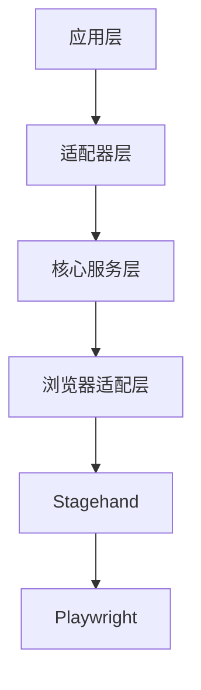
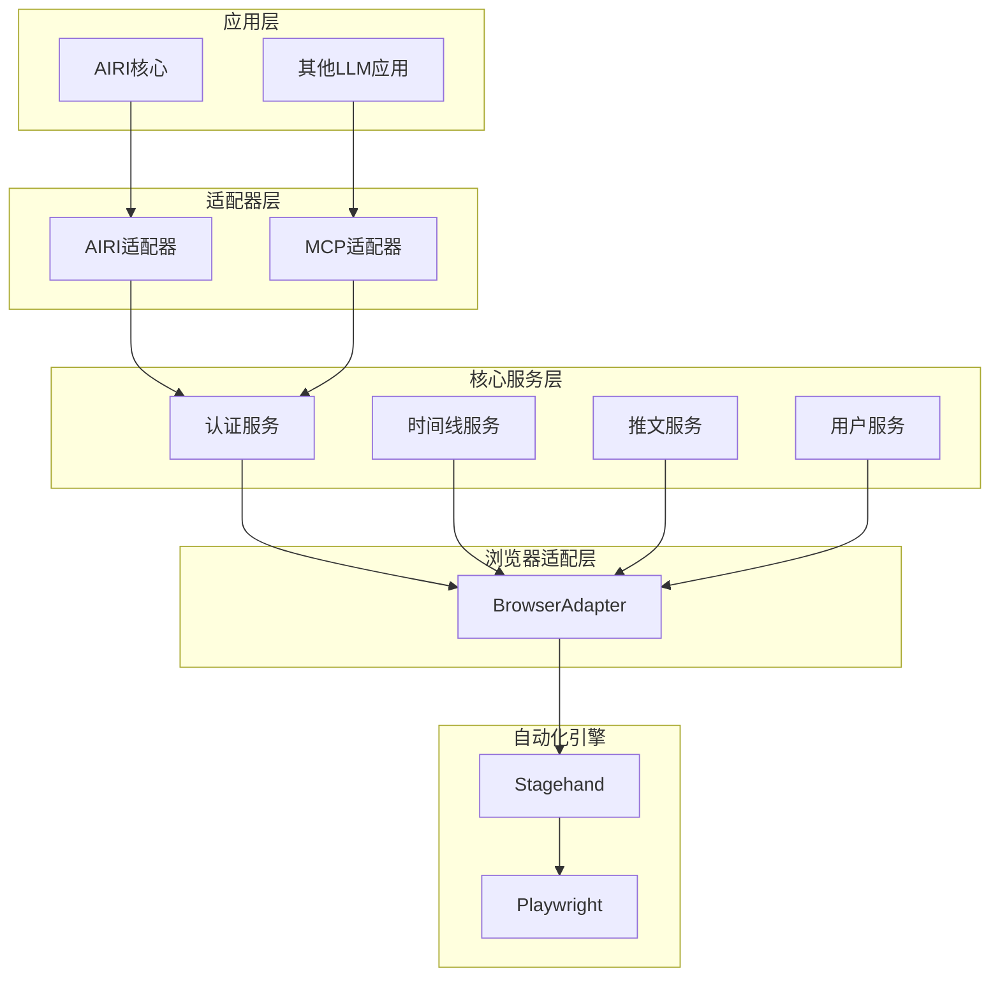
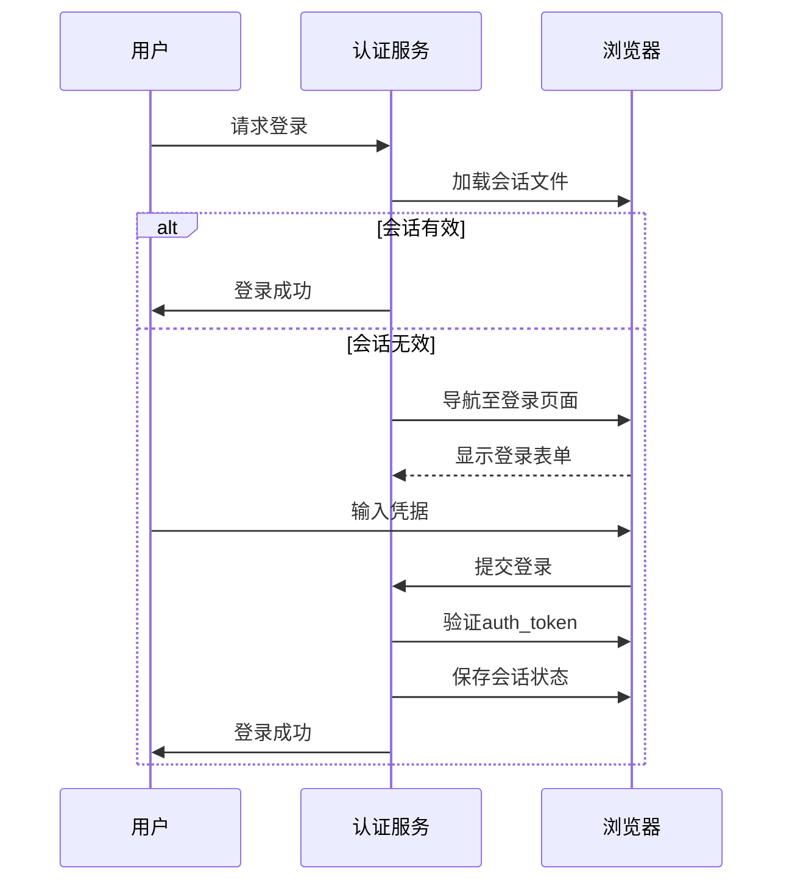
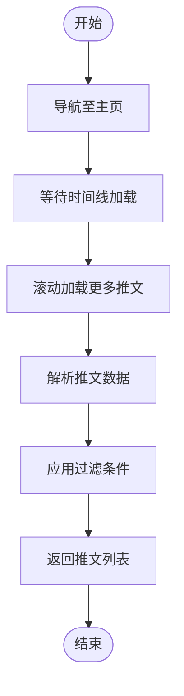
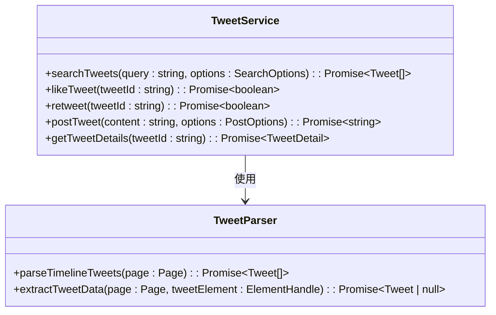

# X平台模块组件

<cite>
**本文档中引用的文件**  
- [auth.ts](file://services/twitter-services/src/core/services/auth.ts)
- [timeline.ts](file://services/twitter-services/src/core/services/timeline.ts)
- [tweet.ts](file://services/twitter-services/src/core/services/tweet.ts)
- [user.ts](file://services/twitter-services/src/core/services/user.ts)
- [tweet-parser.ts](file://services/twitter-services/src/parsers/tweet-parser.ts)
- [airi-adapter.ts](file://services/twitter-services/src/adapters/airi-adapter.ts)
- [mcp-adapter.ts](file://services/twitter-services/src/adapters/mcp-adapter.ts)
- [config.ts](file://services/twitter-services/src/config/index.ts)
- [main.ts](file://services/twitter-services/src/main.ts)
- [X.vue](file://packages/stage-ui/src/components/modules/X.vue)
- [architecture-20250304.md](file://services/twitter-services/docs/architecture-20250304.md)
</cite>

## 目录
1. [简介](#简介)
2. [项目结构](#项目结构)
3. [核心组件](#核心组件)
4. [架构概览](#架构概览)
5. [详细组件分析](#详细组件分析)
6. [依赖分析](#依赖分析)
7. [性能考虑](#性能考虑)
8. [故障排除指南](#故障排除指南)
9. [结论](#结论)

## 简介
X平台模块组件是一个基于浏览器自动化的服务，旨在提供对X平台（原Twitter）数据的结构化访问和交互能力。该组件通过分层架构设计，支持与不同应用程序的集成，包括AIRI核心系统和其他LLM应用。其主要功能包括用户认证、时间线获取、推文发布与互动等。系统采用Stagehand框架进行网页自动化，结合Playwright实现稳定可靠的浏览器操作。

## 项目结构
X平台模块组件位于`services/twitter-services`目录下，包含适配器层、核心服务层、解析器、类型定义和工具等关键部分。整体结构清晰，各模块职责分明，便于扩展和维护。



**图表来源**  
- [architecture-20250304.md](file://services/twitter-services/docs/architecture-20250304.md#L1-L397)

**本节来源**  
- [architecture-20250304.md](file://services/twitter-services/docs/architecture-20250304.md#L1-L397)

## 核心组件
该组件的核心功能由认证服务、时间线服务、推文服务和用户服务构成。这些服务通过浏览器上下文进行协调，利用Playwright直接操作DOM元素，并通过自然语言指令与Stagehand框架交互，从而实现高效的数据提取和用户行为模拟。

**本节来源**  
- [auth.ts](file://services/twitter-services/src/core/services/auth.ts#L8-L62)
- [timeline.ts](file://services/twitter-services/src/core/services/timeline.ts#L20-L68)
- [tweet.ts](file://services/twitter-services/src/core/services/tweet.ts#L50-L335)
- [user.ts](file://services/twitter-services/src/core/services/user.ts#L40-L96)

## 架构概览
系统采用分层架构，从上至下分别为应用层、适配器层、核心服务层、浏览器适配层和底层自动化引擎。适配器层支持多种集成方式，如AIRI适配器和MCP适配器，确保灵活性和兼容性。核心服务层封装了具体的业务逻辑，而浏览器适配层则负责与Stagehand和Playwright交互，执行实际的浏览器操作。



**图表来源**  
- [architecture-20250304.md](file://services/twitter-services/docs/architecture-20250304.md#L1-L397)

**本节来源**  
- [architecture-20250304.md](file://services/twitter-services/docs/architecture-20250304.md#L1-L397)

## 详细组件分析
### 认证机制分析
认证服务通过多阶段方法实现用户登录，首先尝试加载本地会话文件，若失败则检测浏览器中是否已有有效会话，最后引导用户手动登录。成功登录后，会话信息将被持久化存储，供后续使用。



**图表来源**  
- [auth.ts](file://services/twitter-services/src/core/services/auth.ts#L8-L62)

**本节来源**  
- [auth.ts](file://services/twitter-services/src/core/services/auth.ts#L8-L62)

### 数据获取方式分析
时间线服务通过导航至主页并等待内容加载来获取推文。系统支持滚动加载更多推文，并可根据选项过滤回复和转发。推文解析器直接从DOM中提取结构化数据，包括文本、作者信息、时间戳和互动统计。



**图表来源**  
- [timeline.ts](file://services/twitter-services/src/core/services/timeline.ts#L20-L68)
- [tweet-parser.ts](file://services/twitter-services/src/parsers/tweet-parser.ts#L1-L261)

**本节来源**  
- [timeline.ts](file://services/twitter-services/src/core/services/timeline.ts#L20-L68)
- [tweet-parser.ts](file://services/twitter-services/src/parsers/tweet-parser.ts#L1-L261)

### 操作功能分析
推文服务支持搜索、点赞、转发、发布和获取推文详情等操作。所有操作均通过Playwright模拟用户行为完成，例如点击按钮、填写表单和提交请求。系统还支持媒体上传和回复功能，能够处理复杂的交互场景。



**图表来源**  
- [tweet.ts](file://services/twitter-services/src/core/services/tweet.ts#L50-L335)
- [tweet-parser.ts](file://services/twitter-services/src/parsers/tweet-parser.ts#L1-L261)

**本节来源**  
- [tweet.ts](file://services/twitter-services/src/core/services/tweet.ts#L50-L335)

## 依赖分析
组件依赖于多个外部库和框架，包括Playwright用于浏览器自动化，Stagehand用于AI驱动的网页浏览，H3.js用于API服务器，以及zod用于类型验证。配置系统使用defu库进行深度合并，确保配置的灵活性和可扩展性。

```mermaid
graph LR
A[Twitter Services] --> B[Playwright]
A --> C[Stagehand]
A --> D[H3.js]
A --> E[zod]
A --> F[defu]
A --> G[@guiiai/logg]
```

**图表来源**  
- [architecture-20250304.md](file://services/twitter-services/docs/architecture-20250304.md#L1-L397)

**本节来源**  
- [architecture-20250304.md](file://services/twitter-services/docs/architecture-20250304.md#L1-L397)

## 性能考虑
为避免触发X平台的速率限制，系统实现了请求频率控制和会话管理优化。浏览器会话在后台保持活动状态，减少重复登录开销。同时，DOM解析采用分块处理策略，提升LLM性能表现。对于复杂页面结构，可启用视觉能力作为备用方案。

## 故障排除指南
常见问题包括登录失败、会话过期和元素定位错误。建议定期更新选择器配置以适应界面变化。监控日志输出有助于诊断问题根源。若遇到认证问题，可尝试清除会话文件并重新登录。对于网络波动导致的超时，适当调整操作超时时间可提高稳定性。

**本节来源**  
- [auth.ts](file://services/twitter-services/src/core/services/auth.ts#L8-L62)
- [error.ts](file://services/twitter-services/src/utils/error.ts#L1-L20)

## 结论
X平台模块组件通过先进的浏览器自动化技术，实现了对X平台数据的可靠访问和交互。其模块化设计和灵活的适配器支持使其易于集成到各种应用场景中。未来可进一步优化性能，增加更多高级功能，如实时流式数据处理和多账户管理。