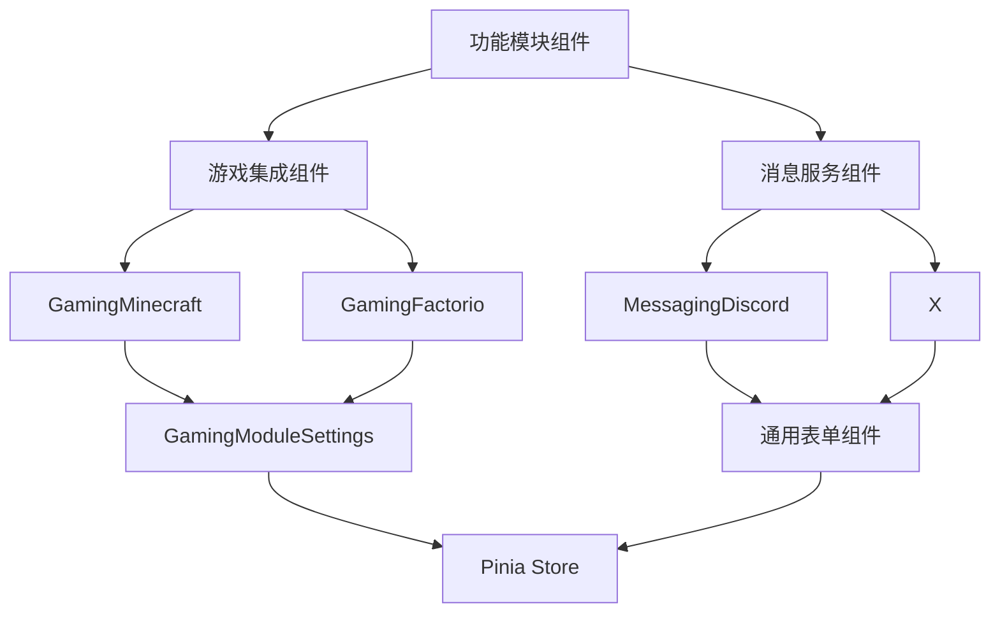
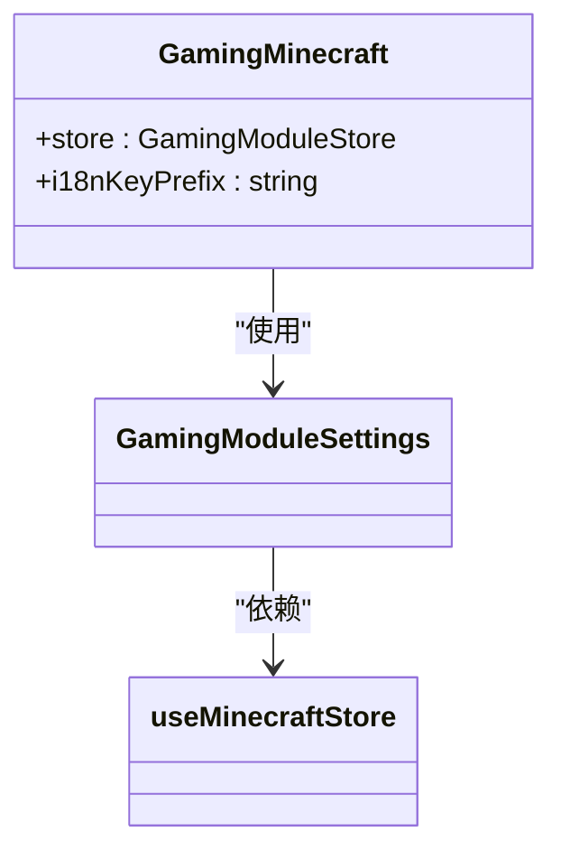
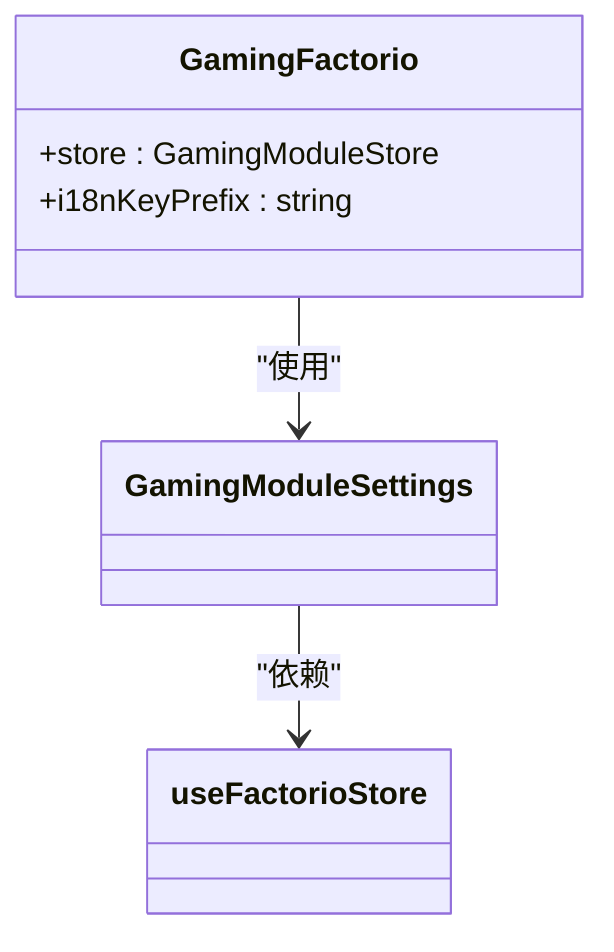
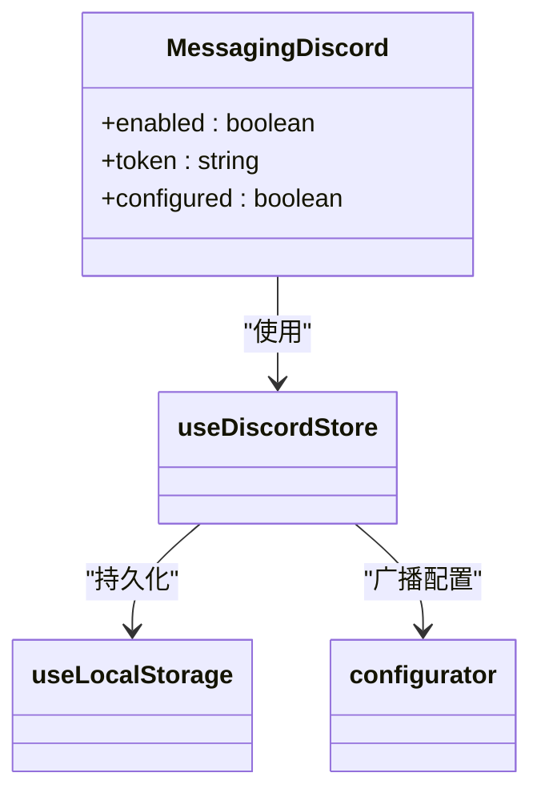
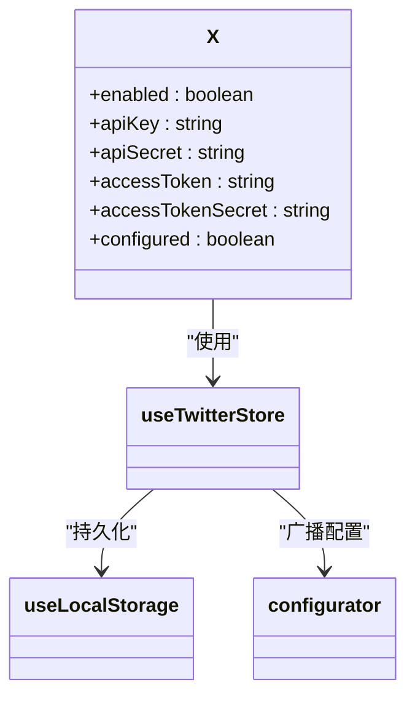
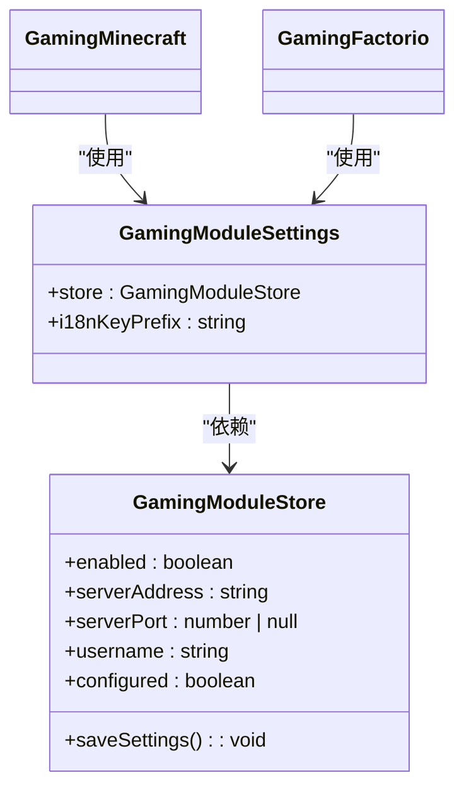
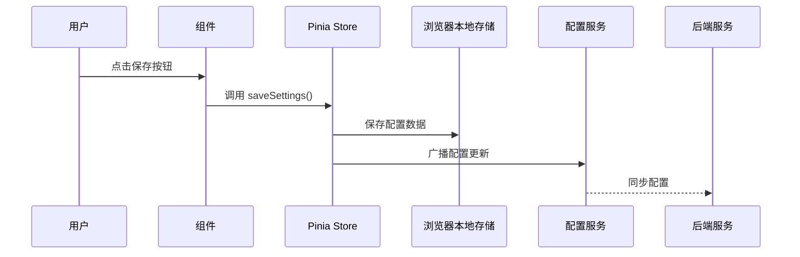

# 功能模块组件

<cite>
**本文档中引用的文件**  
- [GamingMinecraft.vue](file://packages/stage-ui/src/components/modules/GamingMinecraft.vue)
- [GamingFactorio.vue](file://packages/stage-ui/src/components/modules/GamingFactorio.vue)
- [MessagingDiscord.vue](file://packages/stage-ui/src/components/modules/MessagingDiscord.vue)
- [X.vue](file://packages/stage-ui/src/components/modules/X.vue)
- [GamingModuleSettings.vue](file://packages/stage-ui/src/components/modules/GamingModuleSettings.vue)
- [gaming-minecraft.ts](file://packages/stage-ui/src/stores/modules/gaming-minecraft.ts)
- [gaming-factorio.ts](file://packages/stage-ui/src/stores/modules/gaming-factorio.ts)
- [gaming-module-factory.ts](file://packages/stage-ui/src/stores/modules/gaming-module-factory.ts)
- [discord.ts](file://packages/stage-ui/src/stores/modules/discord.ts)
- [twitter.ts](file://packages/stage-ui/src/stores/modules/twitter.ts)
</cite>

## 目录
1. [简介](#简介)
2. [核心组件概览](#核心组件概览)
3. [游戏集成组件](#游戏集成组件)
   - [GamingMinecraft 组件](#gamingminecraft-组件)
   - [GamingFactorio 组件](#gamingfactorio-组件)
4. [消息服务组件](#消息服务组件)
   - [MessagingDiscord 组件](#messagingdiscord-组件)
   - [X 组件](#x-组件)
5. [共享配置逻辑](#共享配置逻辑)
6. [状态管理与存储](#状态管理与存储)
7. [实际使用示例](#实际使用示例)
8. [最佳实践](#最佳实践)
9. [结论](#结论)

## 简介
本文档详细介绍了 `stage-ui` 包中的功能模块组件，这些组件用于集成外部服务和游戏。文档重点分析了 `GamingMinecraft`、`GamingFactorio`、`MessagingDiscord` 和 `X` 组件的属性、事件和插槽，提供了实际使用示例，并阐述了认证集成、状态同步、错误恢复和性能监控的最佳实践。

**Section sources**
- [GamingMinecraft.vue](file://packages/stage-ui/src/components/modules/GamingMinecraft.vue)
- [GamingFactorio.vue](file://packages/stage-ui/src/components/modules/GamingFactorio.vue)
- [MessagingDiscord.vue](file://packages/stage-ui/src/components/modules/MessagingDiscord.vue)
- [X.vue](file://packages/stage-ui/src/components/modules/X.vue)

## 核心组件概览
`stage-ui` 包中的功能模块组件主要分为两大类：游戏集成组件和消息服务组件。这些组件通过统一的模式管理外部服务的配置和状态，利用 Pinia 进行状态管理，并通过 `useLocalStorage` 实现配置的持久化存储。



**Diagram sources**
- [GamingMinecraft.vue](file://packages/stage-ui/src/components/modules/GamingMinecraft.vue)
- [GamingFactorio.vue](file://packages/stage-ui/src/components/modules/GamingFactorio.vue)
- [MessagingDiscord.vue](file://packages/stage-ui/src/components/modules/MessagingDiscord.vue)
- [X.vue](file://packages/stage-ui/src/components/modules/X.vue)

**Section sources**
- [GamingMinecraft.vue](file://packages/stage-ui/src/components/modules/GamingMinecraft.vue)
- [GamingFactorio.vue](file://packages/stage-ui/src/components/modules/GamingFactorio.vue)
- [MessagingDiscord.vue](file://packages/stage-ui/src/components/modules/MessagingDiscord.vue)
- [X.vue](file://packages/stage-ui/src/components/modules/X.vue)

## 游戏集成组件

### GamingMinecraft 组件
`GamingMinecraft` 组件用于集成 Minecraft 游戏服务。它是一个轻量级的包装组件，主要职责是导入通用的 `GamingModuleSettings` 组件并提供特定于 Minecraft 的配置。

**Props**
- `store`: 传递 `useMinecraftStore` 创建的 Pinia store 实例
- `i18n-key-prefix`: 国际化键前缀，值为 `settings.pages.modules.gaming-minecraft`

该组件不包含任何插槽或自定义事件，其所有功能都通过 `GamingModuleSettings` 组件实现。



**Diagram sources**
- [GamingMinecraft.vue](file://packages/stage-ui/src/components/modules/GamingMinecraft.vue)
- [GamingModuleSettings.vue](file://packages/stage-ui/src/components/modules/GamingModuleSettings.vue)
- [gaming-minecraft.ts](file://packages/stage-ui/src/stores/modules/gaming-minecraft.ts)

**Section sources**
- [GamingMinecraft.vue](file://packages/stage-ui/src/components/modules/GamingMinecraft.vue)

### GamingFactorio 组件
`GamingFactorio` 组件用于集成 Factorio 游戏服务。其结构和功能与 `GamingMinecraft` 组件完全相同，仅在 store 实例和国际化前缀上有所不同。

**Props**
- `store`: 传递 `useFactorioStore` 创建的 Pinia store 实例
- `i18n-key-prefix`: 国际化键前缀，值为 `settings.pages.modules.gaming-factorio`

该组件同样不包含插槽或自定义事件，完全依赖 `GamingModuleSettings` 组件实现其功能。



**Diagram sources**
- [GamingFactorio.vue](file://packages/stage-ui/src/components/modules/GamingFactorio.vue)
- [GamingModuleSettings.vue](file://packages/stage-ui/src/components/modules/GamingModuleSettings.vue)
- [gaming-factorio.ts](file://packages/stage-ui/src/stores/modules/gaming-factorio.ts)

**Section sources**
- [GamingFactorio.vue](file://packages/stage-ui/src/components/modules/GamingFactorio.vue)

## 消息服务组件

### MessagingDiscord 组件
`MessagingDiscord` 组件用于集成 Discord 消息服务。与游戏组件不同，它直接实现了完整的配置界面，而不是使用通用的设置组件。

**Props**
- 无

**事件**
- 无

**插槽**
- 无

该组件提供了启用/禁用服务的复选框和输入 Discord 令牌的密码输入框。配置信息通过 `useDiscordStore` 进行管理，并在用户点击保存按钮时调用 `saveSettings` 方法。



**Diagram sources**
- [MessagingDiscord.vue](file://packages/stage-ui/src/components/modules/MessagingDiscord.vue)
- [discord.ts](file://packages/stage-ui/src/stores/modules/discord.ts)

**Section sources**
- [MessagingDiscord.vue](file://packages/stage-ui/src/components/modules/MessagingDiscord.vue)

### X 组件
`X` 组件用于集成 Twitter (现为 X) 服务。它与 `MessagingDiscord` 组件具有相似的结构，但需要更多的认证信息。

**Props**
- 无

**事件**
- 无

**插槽**
- 无

该组件管理 Twitter API 的四个关键认证参数：API Key、API Secret、Access Token 和 Access Token Secret。配置信息通过 `useTwitterStore` 进行管理。



**Diagram sources**
- [X.vue](file://packages/stage-ui/src/components/modules/X.vue)
- [twitter.ts](file://packages/stage-ui/src/stores/modules/twitter.ts)

**Section sources**
- [X.vue](file://packages/stage-ui/src/components/modules/X.vue)

## 共享配置逻辑
`GamingMinecraft` 和 `GamingFactorio` 组件通过 `GamingModuleSettings` 组件共享相同的配置界面。这种设计模式实现了代码复用，确保了游戏集成组件之间的一致性。

`GamingModuleSettings` 组件接受一个通用的 `GamingModuleStore` 接口，该接口定义了所有游戏模块所需的公共属性和方法。通过 `i18n-key-prefix` 属性，组件能够根据不同的游戏模块显示相应的国际化文本。



**Diagram sources**
- [GamingModuleSettings.vue](file://packages/stage-ui/src/components/modules/GamingModuleSettings.vue)

**Section sources**
- [GamingModuleSettings.vue](file://packages/stage-ui/src/components/modules/GamingModuleSettings.vue)

## 状态管理与存储
所有功能模块组件都使用 Pinia 进行状态管理。配置数据通过 `useLocalStorage` 钩子实现持久化存储，确保用户设置在页面刷新后仍然保留。

当用户保存设置时，组件会调用 store 中的 `saveSettings` 方法。该方法不仅保存数据到本地存储，还会通过 `configurator` 服务将配置广播到后端，实现前后端的状态同步。

对于游戏模块，`createGamingModuleStore` 工厂函数创建了具有默认端口的游戏模块 store。这种工厂模式避免了重复代码，使得添加新的游戏集成变得简单。



**Diagram sources**
- [gaming-module-factory.ts](file://packages/stage-ui/src/stores/modules/gaming-module-factory.ts)
- [gaming-minecraft.ts](file://packages/stage-ui/src/stores/modules/gaming-minecraft.ts)
- [gaming-factorio.ts](file://packages/stage-ui/src/stores/modules/gaming-factorio.ts)
- [discord.ts](file://packages/stage-ui/src/stores/modules/discord.ts)
- [twitter.ts](file://packages/stage-ui/src/stores/modules/twitter.ts)

**Section sources**
- [gaming-module-factory.ts](file://packages/stage-ui/src/stores/modules/gaming-module-factory.ts)

## 实际使用示例
以下是如何在应用中使用这些组件的示例：

```vue
<template>
  <div>
    <!-- 集成 Minecraft 游戏 -->
    <GamingMinecraft />
    
    <!-- 集成 Factorio 游戏 -->
    <GamingFactorio />
    
    <!-- 集成 Discord 消息服务 -->
    <MessagingDiscord />
    
    <!-- 集成 Twitter (X) 服务 -->
    <X />
  </div>
</template>

<script setup lang="ts">
import { GamingMinecraft, GamingFactorio, MessagingDiscord, X } from '@proj-airi/stage-ui/components'
</script>
```

**Section sources**
- [GamingMinecraft.vue](file://packages/stage-ui/src/components/modules/GamingMinecraft.vue)
- [GamingFactorio.vue](file://packages/stage-ui/src/components/modules/GamingFactorio.vue)
- [MessagingDiscord.vue](file://packages/stage-ui/src/components/modules/MessagingDiscord.vue)
- [X.vue](file://packages/stage-ui/src/components/modules/X.vue)

## 最佳实践

### 认证集成
- 所有敏感信息（如令牌、密钥）都应作为密码输入框处理，以防止在输入时显示明文
- 使用 `useLocalStorage` 确保认证信息在用户会话之间持久化
- 通过 `configurator` 服务实现前后端配置同步

### 状态同步
- 使用 Pinia store 集中管理组件状态
- 利用 `storeToRefs` 创建响应式引用，确保 UI 与状态同步
- 在保存设置时，同时更新本地存储和后端服务

### 错误恢复
- 实现 `configured` 计算属性，根据必要字段的完整性判断配置是否有效
- 在 UI 中显示配置状态（如绿色提示条），让用户清楚当前配置是否有效
- 对于网络请求，应实现适当的错误处理和重试机制

### 性能监控
- 避免在组件中直接进行复杂的计算，使用计算属性或 Pinia store 的 getter
- 对于频繁更新的状态，考虑使用防抖或节流技术
- 监控配置广播的性能，确保不会因频繁的配置更新而影响应用性能

**Section sources**
- [GamingModuleSettings.vue](file://packages/stage-ui/src/components/modules/GamingModuleSettings.vue)
- [discord.ts](file://packages/stage-ui/src/stores/modules/discord.ts)
- [twitter.ts](file://packages/stage-ui/src/stores/modules/twitter.ts)

## 结论
`stage-ui` 包中的功能模块组件提供了一套统一且可扩展的机制来集成外部服务和游戏。通过共享的配置组件和工厂模式创建的 store，这些组件实现了高度的代码复用和一致性。文档中介绍的最佳实践有助于确保这些组件在实际应用中的安全性、可靠性和性能。