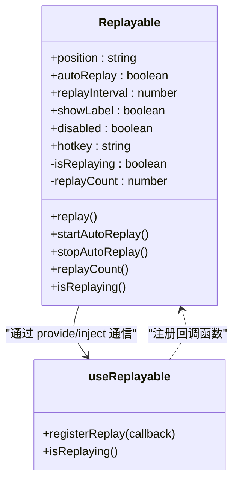
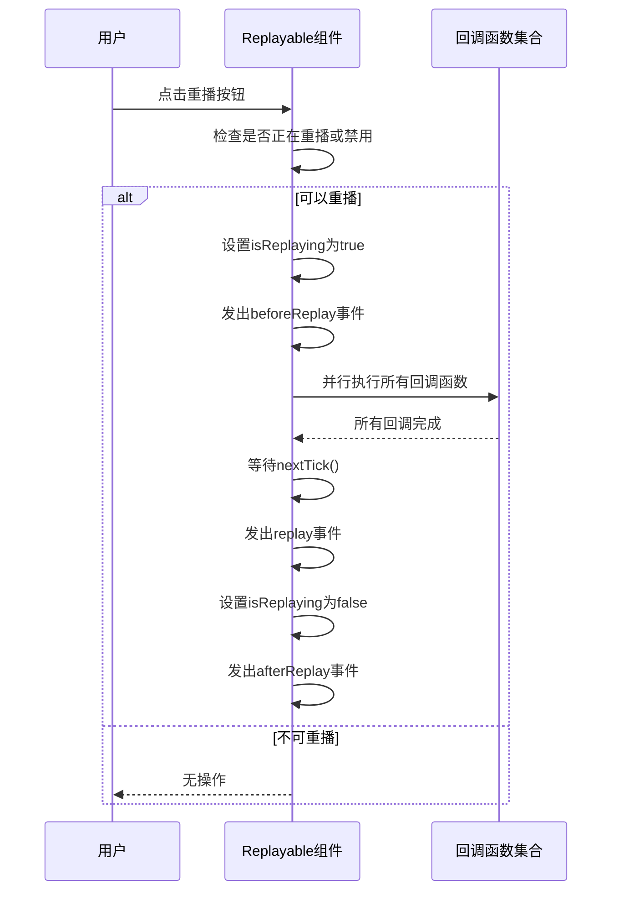
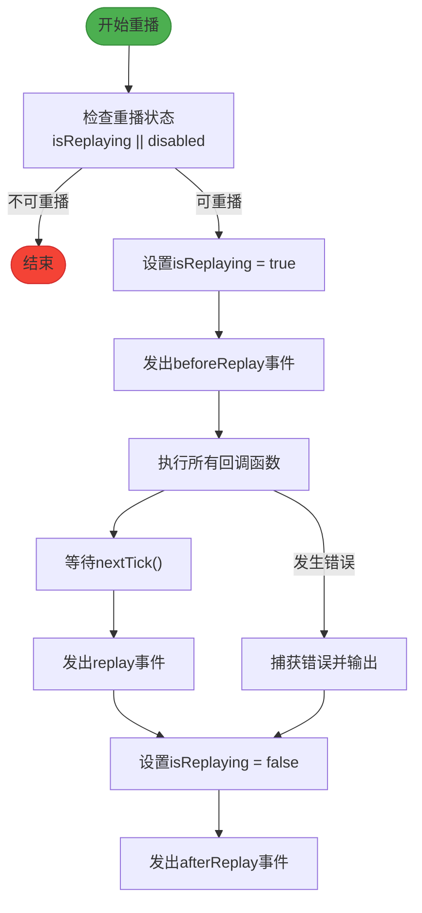

# 动画组件

<cite>
**Referenced Files in This Document**   
- [Replayable.vue](file://packages/stage-ui/src/components/animations/Replayable.vue)
- [use-replayable.ts](file://packages/stage-ui/src/components/animations/use-replayable.ts)
</cite>

## 目录
1. [简介](#简介)
2. [核心组件](#核心组件)
3. [API 详细说明](#api-详细说明)
4. [使用示例](#使用示例)
5. [性能优化与最佳实践](#性能优化与最佳实践)
6. [错误处理](#错误处理)
7. [结论](#结论)

## 简介
`stage-ui` 动画组件提供了一套完整的动画控制解决方案，其中 `Replayable` 组件和 `use-replayable` 组合式函数是核心功能模块。该系统允许开发者创建可重播的动画，提供精细的时间轴控制、动画状态管理和同步机制。组件设计遵循 Vue 3 的组合式 API 原则，通过依赖注入实现父子组件间的通信，确保了良好的封装性和可复用性。

## 核心组件

`Replayable` 组件和 `use-replayable` 组合式函数共同构成了动画控制的核心。`Replayable` 作为容器组件，提供动画重播的用户界面和基础控制逻辑，而 `use-replayable` 则为子组件提供了接入动画控制系统的 API。

**Section sources**
- [Replayable.vue](file://packages/stage-ui/src/components/animations/Replayable.vue#L1-L190)
- [use-replayable.ts](file://packages/stage-ui/src/components/animations/use-replayable.ts#L1-L38)

## API 详细说明

### Replayable 组件

`Replayable` 组件是一个可重播动画的容器，它通过提供按钮和键盘快捷键来触发动画重播。

#### Props
| 属性 | 类型 | 默认值 | 说明 |
|------|------|--------|------|
| position | `'top-right' \| 'top-left' \| 'bottom-right' \| 'bottom-left' \| 'center'` | `'top-right'` | 重播按钮的位置 |
| autoReplay | `boolean` | `false` | 是否自动重播动画 |
| replayInterval | `number` | `3000` | 自动重播的时间间隔（毫秒） |
| showLabel | `boolean` | `false` | 是否显示按钮标签 |
| disabled | `boolean` | `false` | 是否禁用重播功能 |
| hotkey | `string` | `'r'` | 触发重播的键盘快捷键 |

#### 事件
| 事件 | 参数 | 说明 |
|------|------|------|
| replay | 无 | 动画重播完成时触发 |
| beforeReplay | 无 | 动画重播开始前触发 |
| afterReplay | 无 | 动画重播结束后触发 |

#### 插槽
- **默认插槽**：用于放置需要被控制的动画内容。

#### 暴露方法
组件通过 `defineExpose` 暴露了以下方法供外部调用：
- `replay()`：手动触发动画重播
- `startAutoReplay()`：启动自动重播
- `stopAutoReplay()`：停止自动重播
- `replayCount()`：获取重播次数
- `isReplaying()`：检查是否正在重播



**Diagram sources**
- [Replayable.vue](file://packages/stage-ui/src/components/animations/Replayable.vue#L1-L190)
- [use-replayable.ts](file://packages/stage-ui/src/components/animations/use-replayable.ts#L1-L38)

### use-replayable 组合式函数

`use-replayable` 是一个组合式函数，允许子组件注册动画重播的回调函数。

#### 函数签名
```typescript
function useReplayable(replayFn?: () => void | Promise<void>): {
  registerReplay: (callback: () => void | Promise<void>) => () => void
  isReplaying: () => boolean
}
```

#### 参数
- `replayFn` (可选)：一个回调函数，会在动画重播时自动执行。

#### 返回值
| 属性 | 类型 | 说明 |
|------|------|------|
| registerReplay | `(callback: () => void \| Promise<void>) => () => void` | 注册重播回调函数，返回一个取消注册的函数 |
| isReplaying | `() => boolean` | 返回一个函数，调用后可检查当前是否正在重播 |

**Section sources**
- [use-replayable.ts](file://packages/stage-ui/src/components/animations/use-replayable.ts#L1-L38)
- [Replayable.vue](file://packages/stage-ui/src/components/animations/Replayable.vue#L1-L190)

## 使用示例

### 基本用法
```vue
<Replayable>
  <div class="animated-element">
    <!-- 动画内容 -->
  </div>
</Replayable>
```

### 高级用法
```vue
<Replayable 
  position="center" 
  autoReplay 
  replayInterval="5000" 
  showLabel 
  hotkey="space">
  <div ref="animatedElement" class="animated-content">
    {{ animatedText }}
  </div>
</Replayable>

<script setup>
import { ref } from 'vue'
import { useReplayable } from '@stage-ui/animations'

const animatedElement = ref(null)
const animatedText = ref('Hello')

// 使用 use-replayable 注册重播逻辑
useReplayable(() => {
  // 重播时的动画逻辑
  animatedText.value = 'Replaying...'
  animatedElement.value.classList.add('animate-pulse')
  
  return new Promise(resolve => {
    setTimeout(() => {
      animatedText.value = 'Hello'
      animatedElement.value.classList.remove('animate-pulse')
      resolve()
    }, 1000)
  })
})
</script>
```

### 外部控制
```vue
<template>
  <div>
    <Replayable ref="replayableComponent">
      <!-- 动画内容 -->
    </Replayable>
    <button @click="manualReplay">手动重播</button>
    <button @click="toggleAutoReplay">
      {{ autoReplayEnabled ? '停止自动' : '开始自动' }}重播
    </button>
  </div>
</template>

<script setup>
import { ref } from 'vue'

const replayableComponent = ref(null)
const autoReplayEnabled = ref(false)

function manualReplay() {
  replayableComponent.value?.replay()
}

function toggleAutoReplay() {
  if (autoReplayEnabled.value) {
    replayableComponent.value?.stopAutoReplay()
  } else {
    replayableComponent.value?.startAutoReplay()
  }
  autoReplayEnabled.value = !autoReplayEnabled.value
}
</script>
```

**Section sources**
- [Replayable.vue](file://packages/stage-ui/src/components/animations/Replayable.vue#L1-L190)
- [use-replayable.ts](file://packages/stage-ui/src/components/animations/use-replayable.ts#L1-L38)

## 性能优化与最佳实践

### 内存泄漏预防
- `use-replayable` 函数内部使用 `onUnmounted` 钩子自动清理注册的回调函数，防止内存泄漏。
- 回调函数注册时返回取消注册函数，允许手动清理。

### 动画同步
- 所有注册的回调函数通过 `Promise.all()` 并行执行，确保动画同步。
- 使用 `nextTick()` 确保 DOM 更新完成后再触发 `replay` 事件。

### 性能考虑
- 自动重播使用 `setInterval` 实现，避免频繁的定时器创建和销毁。
- 按钮的 `disabled` 状态和样式通过 Vue 的响应式系统高效更新。



**Diagram sources**
- [Replayable.vue](file://packages/stage-ui/src/components/animations/Replayable.vue#L50-L113)

**Section sources**
- [Replayable.vue](file://packages/stage-ui/src/components/animations/Replayable.vue#L1-L190)

## 错误处理

系统内置了完善的错误处理机制：
- 在 `replay` 函数中使用 `try-catch` 捕获回调函数执行中的错误。
- 错误信息通过 `console.error` 输出，便于调试。
- 使用 `finally` 块确保无论成功或失败，`isReplaying` 状态都能正确重置。



**Diagram sources**
- [Replayable.vue](file://packages/stage-ui/src/components/animations/Replayable.vue#L60-L85)

**Section sources**
- [Replayable.vue](file://packages/stage-ui/src/components/animations/Replayable.vue#L1-L190)

## 结论
`Replayable` 组件和 `use-replayable` 组合式函数提供了一套强大而灵活的动画控制解决方案。通过清晰的 API 设计、完善的错误处理和性能优化，开发者可以轻松实现复杂的动画交互。该系统充分体现了 Vue 3 组合式 API 的优势，通过依赖注入实现了组件间的松耦合通信，同时保持了良好的可测试性和可维护性。