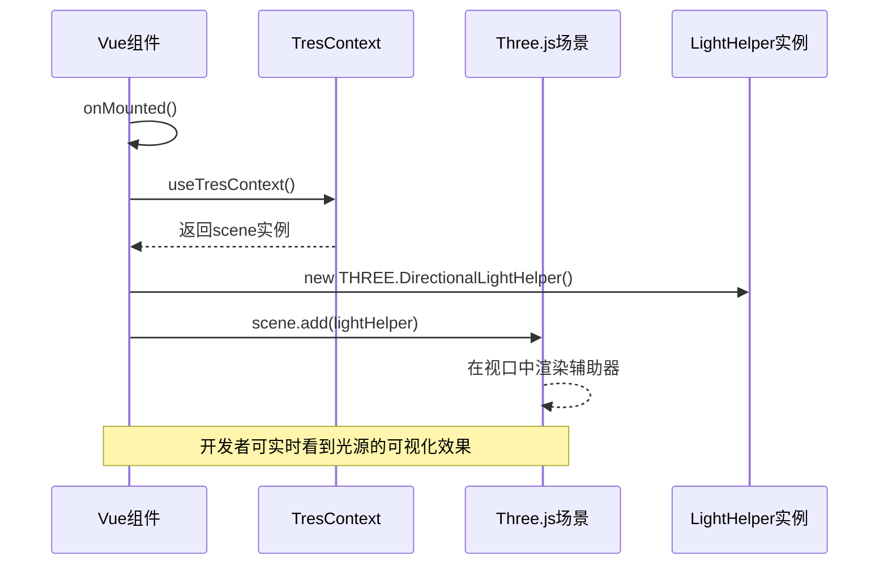
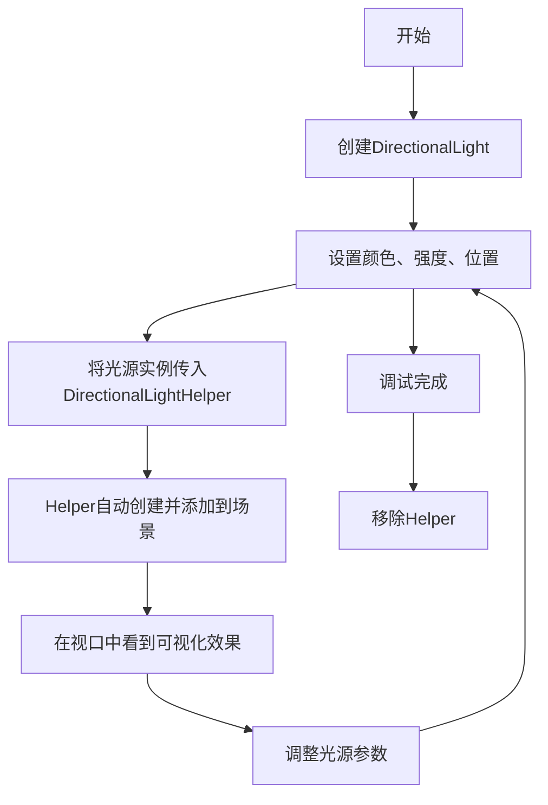

# 3D 辅助组件

<cite>
**Referenced Files in This Document**  
- [DirectionalLightHelper.vue](file://packages\stage-ui\src\components\scenes\tres\DirectionalLightHelper.vue)
- [HemisphereLightHelper.vue](file://packages\stage-ui\src\components\scenes\tres\HemisphereLightHelper.vue)
- [ThreeScene.vue](file://packages\stage-ui-three\src\components\ThreeScene.vue)
- [model-store.ts](file://packages\stage-ui-three\src\stores\model-store.ts)
- [EffectComposerPmndrs.vue](file://packages\tresjs\src\post-processing\components\EffectComposerPmndrs.vue)
</cite>

## 目录
1. [简介](#简介)
2. [核心组件分析](#核心组件分析)
3. [架构集成与使用场景](#架构集成与使用场景)
4. [属性配置与调试实践](#属性配置与调试实践)
5. [开发环境集成示例](#开发环境集成示例)
6. [结论](#结论)

## 简介
本文档详细介绍了在Three.js场景中用于调试VRM模型光照效果的两个关键3D辅助组件：DirectionalLightHelper（方向光辅助器）和HemisphereLightHelper（半球光辅助器）。这些组件是TresJS生态系统的一部分，旨在通过可视化光源的方向、位置和环境光分布，帮助开发者直观地调试和优化3D场景的光照。文档将阐述其工作原理、与TresJS的集成方式，并强调其仅限于开发阶段使用的定位。

## 核心组件分析

### DirectionalLightHelper 分析
`DirectionalLightHelper` 组件用于可视化场景中的方向光。它通过创建一个Three.js的`DirectionalLightHelper`实例，将抽象的光源参数（如位置和目标点）转化为可视化的几何体，通常表现为一个包含箭头和圆锥的图形，清晰地指示光线的照射方向和范围。

```mermaid
classDiagram
class DirectionalLightHelper {
+props : { directionalLight? : THREE.DirectionalLight }
+scene : TresContext.scene
+lightHelper : Ref<THREE.DirectionalLightHelper>
+onMounted() : void
+cleanup() : void
}
DirectionalLightHelper --> "1" TresContext : "uses"
DirectionalLightHelper --> "1" THREE.DirectionalLightHelper : "creates"
```

**Diagram sources**
- [DirectionalLightHelper.vue](file://packages\stage-ui\src\components\scenes\tres\DirectionalLightHelper.vue#L1-L40)

**Section sources**
- [DirectionalLightHelper.vue](file://packages\stage-ui\src\components\scenes\tres\DirectionalLightHelper.vue#L1-L40)

### HemisphereLightHelper 分析
`HemisphereLightHelper` 组件用于可视化半球光。半球光模拟了天空和地面的漫反射环境光，`HemisphereLightHelper` 通过一个球体或半球体的图形来表示，其上半部分颜色代表天空光，下半部分颜色代表地面光，使开发者能够直观地理解环境光的色彩分布。

```mermaid
classDiagram
class HemisphereLightHelper {
+props : { hemisphereLight? : THREE.HemisphereLight }
+scene : TresContext.scene
+lightHelper : Ref<THREE.HemisphereLightHelper>
+onMounted() : void
+cleanup() : void
}
HemisphereLightHelper --> "1" TresContext : "uses"
HemisphereLightHelper --> "1" THREE.HemisphereLightHelper : "creates"
```

**Diagram sources**
- [HemisphereLightHelper.vue](file://packages\stage-ui\src\components\scenes\tres\HemisphereLightHelper.vue#L1-L40)

**Section sources**
- [HemisphereLightHelper.vue](file://packages\stage-ui\src\components\scenes\tres\HemisphereLightHelper.vue#L1-L40)

## 架构集成与使用场景

### 与TresJS生态的集成
这两个辅助组件深度集成于TresJS（一个基于Vue的Three.js库）的响应式架构中。它们通过`useTresContext()` Hook获取当前的Three.js场景实例，并在组件挂载时（`onMounted`）动态地将创建的Helper对象添加到场景中。这种设计确保了Helper与场景生命周期的同步。



**Diagram sources**
- [DirectionalLightHelper.vue](file://packages\stage-ui\src\components\scenes\tres\DirectionalLightHelper.vue#L1-L40)
- [HemisphereLightHelper.vue](file://packages\stage-ui\src\components\scenes\tres\HemisphereLightHelper.vue#L1-L40)

**Section sources**
- [DirectionalLightHelper.vue](file://packages\stage-ui\src\components\scenes\tres\DirectionalLightHelper.vue#L1-L40)
- [HemisphereLightHelper.vue](file://packages\stage-ui\src\components\scenes\tres\HemisphereLightHelper.vue#L1-L40)

### 主要使用场景
这些辅助组件的核心使用场景是**VRM模型的光照调试**。在开发阶段，开发者需要精确调整光源以达到理想的渲染效果。通过启用这些Helper，开发者可以：
1.  **验证方向光**：确认方向光是否从预期的角度照射到模型上，避免出现不自然的阴影。
2.  **调试半球光**：直观地看到天空光和地面光的颜色与强度设置是否合理，确保模型的漫反射效果自然。
3.  **快速迭代**：在调整光源参数（如位置、颜色）时，能够立即在视口中看到变化，极大地提高了调试效率。

## 属性配置与调试实践

### 属性配置
组件的核心配置通过其Props传递，主要依赖于外部传入的光源实例。

- **`directionalLight` (DirectionalLightHelper)**: 一个可选的`THREE.DirectionalLight`对象引用。组件会等待此引用变为真值后，才创建并添加其Helper。
- **`hemisphereLight` (HemisphereLightHelper)**: 一个可选的`THREE.HemisphereLight`对象引用。逻辑同上。

实际的光源属性（如颜色、强度）通常在创建光源时定义，并通过Pinia状态管理（如`model-store.ts`）进行持久化。



**Diagram sources**
- [ThreeScene.vue](file://packages\stage-ui-three\src\components\ThreeScene.vue#L297-L337)
- [model-store.ts](file://packages\stage-ui-three\src\stores\model-store.ts#L104-L148)

**Section sources**
- [ThreeScene.vue](file://packages\stage-ui-three\src\components\ThreeScene.vue#L297-L337)
- [model-store.ts](file://packages\stage-ui-three\src\stores\model-store.ts#L104-L148)

### 调试实践
在`ThreeScene.vue`中，当环境选择为`hemisphere`时，会使用`TresHemisphereLight`组件。此时，开发者可以同时启用`HemisphereLightHelper`来可视化这个光源。方向光的调试同理。通过`model-store.ts`中的`useLocalStorage`，这些调试配置可以在开发会话之间保持。

## 开发环境集成示例
在开发环境中，集成这些辅助组件非常简单。只需在相应的光源组件之后，添加对应的Helper组件，并传入光源的引用即可。例如，在`ThreeScene.vue`中，可以在`TresDirectionalLight`组件后添加`DirectionalLightHelper`。

**重要提示**：这些辅助组件**仅用于开发阶段**。它们会增加额外的渲染开销，并且其可视化元素不应出现在最终的生产环境中。通常，可以通过条件编译或环境变量来控制它们的加载。

## 结论
`DirectionalLightHelper`和`HemisphereLightHelper`是调试Three.js场景中光照效果的有力工具。它们通过与TresJS的无缝集成，为开发者提供了直观、实时的光源可视化能力，极大地简化了VRM模型光照的调试过程。通过理解其工作原理和正确的集成方式，开发者可以更高效地创建出视觉效果出色的3D应用。务必记住，这些工具应仅在开发环境中使用，以确保生产环境的性能和视觉纯净度。