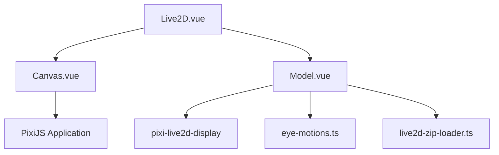
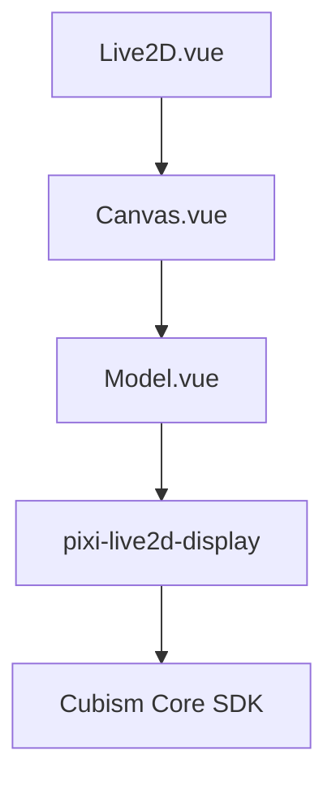
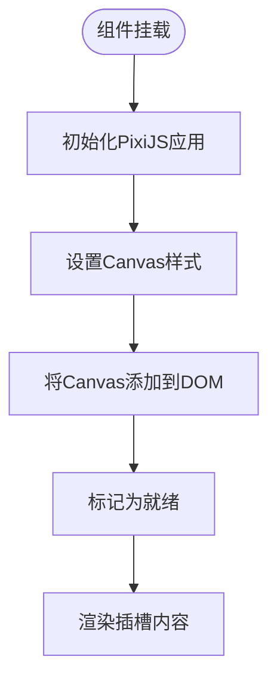
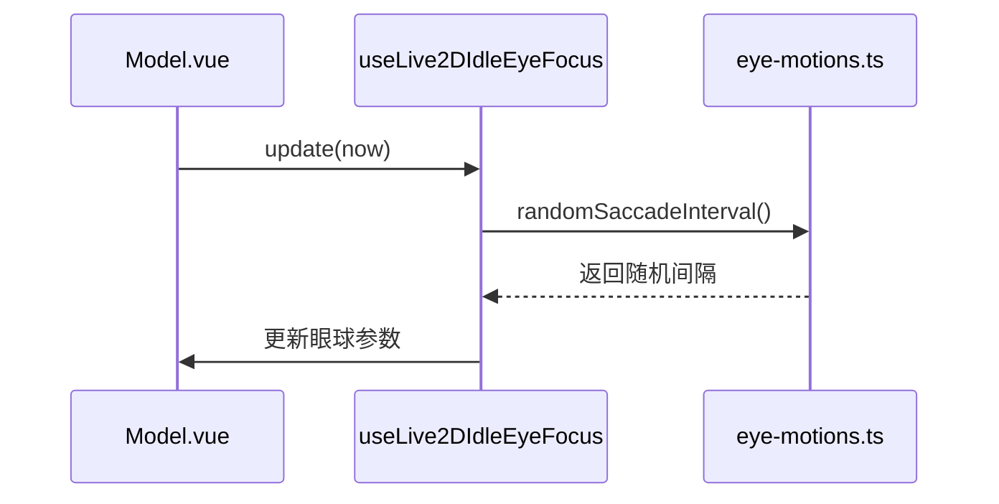

# Live2D 组件

<cite>
**本文档中引用的文件**  
- [Live2D.vue](file://packages/stage-ui/src/components/scenes/Live2D.vue)
- [Canvas.vue](file://packages/stage-ui/src/components/scenes/live2d/Canvas.vue)
- [Model.vue](file://packages/stage-ui/src/components/scenes/live2d/Model.vue)
- [eye-motions.ts](file://packages/stage-ui/src/utils/eye-motions.ts)
- [live2d-zip-loader.ts](file://packages/stage-ui/src/utils/live2d-zip-loader.ts)
- [animation.ts](file://packages/stage-ui/src/composables/live2d/animation.ts)
</cite>

## 目录
1. [简介](#简介)
2. [项目结构](#项目结构)
3. [核心组件](#核心组件)
4. [架构概述](#架构概述)
5. [详细组件分析](#详细组件分析)
6. [依赖分析](#依赖分析)
7. [性能考虑](#性能考虑)
8. [故障排除指南](#故障排除指南)
9. [结论](#结论)

## 简介
本文档详细介绍了Live2D组件的设计与实现，重点聚焦于虚拟角色2D模型的渲染与交互机制。文档将解析`Live2D.vue`作为容器组件的核心作用，以及`Canvas.vue`和`Model.vue`在模型加载、纹理渲染和动画播放中的职责分工。同时，文档将深入说明组件支持的props（如模型路径、表情配置）、事件（如加载完成、动画结束）和插槽用法，并提供从本地或远程加载Live2D模型的实际代码示例。此外，文档还将涵盖WebGL上下文管理、性能优化（如帧率控制、内存释放）和错误处理（如模型加载失败）等关键主题。最后，结合项目中使用的眼动动画（eye-motions.ts）和表情同步机制，说明如何实现自然的角色表现。

## 项目结构
Live2D相关组件位于`packages/stage-ui`包中，采用分层结构组织。`Live2D.vue`作为顶层容器组件，负责协调`Canvas.vue`和`Model.vue`的工作。`Canvas.vue`封装了PixiJS应用实例，提供WebGL渲染上下文。`Model.vue`则负责具体的Live2D模型实例化、加载和动画控制。工具类文件`eye-motions.ts`和`live2d-zip-loader.ts`分别处理眼动逻辑和ZIP模型文件的解析。



**图示来源**
- [Live2D.vue](file://packages/stage-ui/src/components/scenes/Live2D.vue)
- [Canvas.vue](file://packages/stage-ui/src/components/scenes/live2d/Canvas.vue)
- [Model.vue](file://packages/stage-ui/src/components/scenes/live2d/Model.vue)
- [eye-motions.ts](file://packages/stage-ui/src/utils/eye-motions.ts)
- [live2d-zip-loader.ts](file://packages/stage-ui/src/utils/live2d-zip-loader.ts)

**本节来源**
- [Live2D.vue](file://packages/stage-ui/src/components/scenes/Live2D.vue)
- [Canvas.vue](file://packages/stage-ui/src/components/scenes/live2d/Canvas.vue)
- [Model.vue](file://packages/stage-ui/src/components/scenes/live2d/Model.vue)

## 核心组件
核心组件包括`Live2D.vue`、`Canvas.vue`和`Model.vue`。`Live2D.vue`通过`Screen`组件获取容器尺寸，并将这些尺寸传递给`Canvas.vue`以初始化渲染画布。`Canvas.vue`创建并管理PixiJS应用实例，为Live2D模型提供渲染环境。`Model.vue`是功能最复杂的组件，它负责加载模型文件、解析模型数据、设置动画参数，并通过`pixi-live2d-display`库与底层Cubism SDK进行交互。

**本节来源**
- [Live2D.vue](file://packages/stage-ui/src/components/scenes/Live2D.vue)
- [Canvas.vue](file://packages/stage-ui/src/components/scenes/live2d/Canvas.vue)
- [Model.vue](file://packages/stage-ui/src/components/scenes/live2d/Model.vue)

## 架构概述
系统采用分层架构，`Live2D.vue`作为视图层的入口，`Canvas.vue`作为渲染层，`Model.vue`作为模型控制层。这种分层设计实现了关注点分离，使得每个组件的职责清晰明确。`Model.vue`通过`pixi-live2d-display`库与Cubism Core SDK进行交互，实现模型的渲染和动画控制。



**图示来源**
- [Live2D.vue](file://packages/stage-ui/src/components/scenes/Live2D.vue)
- [Canvas.vue](file://packages/stage-ui/src/components/scenes/live2d/Canvas.vue)
- [Model.vue](file://packages/stage-ui/src/components/scenes/live2d/Model.vue)

## 详细组件分析
### Live2D.vue 分析
`Live2D.vue`是一个容器组件，它不直接处理模型渲染，而是协调`Canvas.vue`和`Model.vue`的工作。它通过`Screen`组件获取父容器的尺寸，并将这些尺寸作为`props`传递给`Canvas.vue`。同时，它定义了`state`、`canvasState`和`modelState`三个模型，用于跟踪组件的加载状态。当`canvasState`和`modelState`都为`mounted`时，`state`才会变为`mounted`，表示整个Live2D系统已准备就绪。

**本节来源**
- [Live2D.vue](file://packages/stage-ui/src/components/scenes/Live2D.vue)

### Canvas.vue 分析
`Canvas.vue`负责创建和管理PixiJS应用实例。它在`onMounted`生命周期钩子中调用`initLive2DPixiStage`函数，该函数会初始化`Application`实例，并将其`view`（即`<canvas>`元素）插入到DOM中。`Canvas.vue`还处理了分辨率缩放和窗口大小调整的逻辑，确保渲染画布能正确响应容器尺寸的变化。



**图示来源**
- [Canvas.vue](file://packages/stage-ui/src/components/scenes/live2d/Canvas.vue)

**本节来源**
- [Canvas.vue](file://packages/stage-ui/src/components/scenes/live2d/Canvas.vue)

### Model.vue 分析
`Model.vue`是整个Live2D系统的核心。它通过`loadModel`函数加载模型，支持从URL或Blob URL加载。加载过程中，它会处理ZIP文件的解析，并通过`Live2DFactory.setupLive2DModel`方法创建模型实例。`Model.vue`还实现了眼动、口型同步和表情动画等高级功能。

#### 眼动与表情同步
眼动逻辑由`useLive2DIdleEyeFocus`组合式函数实现。该函数利用`randomSaccadeInterval`函数生成随机的眼跳间隔，并在`update`函数中更新模型的眼球参数（`ParamEyeBallX`和`ParamEyeBallY`），从而实现自然的眼动效果。



**图示来源**
- [Model.vue](file://packages/stage-ui/src/components/scenes/live2d/Model.vue)
- [animation.ts](file://packages/stage-ui/src/composables/live2d/animation.ts)
- [eye-motions.ts](file://packages/stage-ui/src/utils/eye-motions.ts)

**本节来源**
- [Model.vue](file://packages/stage-ui/src/components/scenes/live2d/Model.vue)
- [animation.ts](file://packages/stage-ui/src/composables/live2d/animation.ts)
- [eye-motions.ts](file://packages/stage-ui/src/utils/eye-motions.ts)

## 依赖分析
Live2D组件依赖于多个外部库。`pixi-live2d-display`是核心依赖，它封装了Cubism SDK for Web，提供了基于PixiJS的Live2D模型渲染能力。`@pixi/app`和`@pixi/ticker`是PixiJS的核心模块，用于创建和管理渲染应用。`JSZip`用于解析ZIP格式的模型文件。这些依赖关系通过`package.json`文件进行管理。

```mermaid
graph TD
A[Live2D.vue] --> B[pixi-live2d-display]
B --> C[Cubism Core SDK]
A --> D[@pixi/app]
A --> E[@pixi/ticker]
A --> F[JSZip]
```

**图示来源**
- [go.mod](file://packages/stage-ui/package.json)

**本节来源**
- [package.json](file://packages/stage-ui/package.json)

## 性能考虑
为了优化性能，`Canvas.vue`允许通过`resolution`属性控制渲染分辨率，较低的分辨率可以显著提升性能。`Model.vue`中的`setScaleAndPosition`函数使用了防抖（debounce）技术，避免在窗口大小频繁变化时进行过多的重绘。此外，`Model.vue`在模型加载和卸载时会正确地销毁和重建PixiJS对象，防止内存泄漏。

## 故障排除指南
常见的问题包括模型加载失败和动画不播放。模型加载失败通常是由于模型文件路径错误或ZIP文件格式不正确。`live2d-zip-loader.ts`中的`createFakeSettings`函数可以帮助处理缺少`model3.json`文件的ZIP包。动画不播放可能是由于`motionManager.update`方法被错误地钩子化，导致眼动逻辑与动画逻辑冲突。

**本节来源**
- [Model.vue](file://packages/stage-ui/src/components/scenes/live2d/Model.vue)
- [live2d-zip-loader.ts](file://packages/stage-ui/src/utils/live2d-zip-loader.ts)

## 结论
Live2D组件通过分层设计和组合式API，提供了一个强大而灵活的虚拟角色渲染解决方案。`Live2D.vue`、`Canvas.vue`和`Model.vue`的职责分离使得代码易于维护和扩展。通过集成眼动和表情同步机制，该组件能够实现高度自然的角色表现。未来的工作可以集中在优化性能和增强错误处理上。