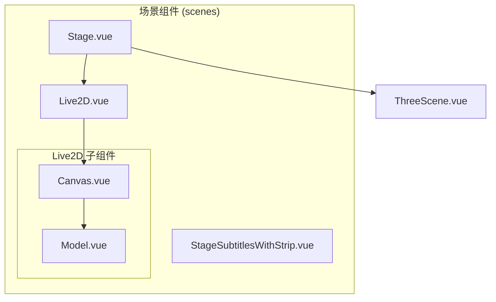
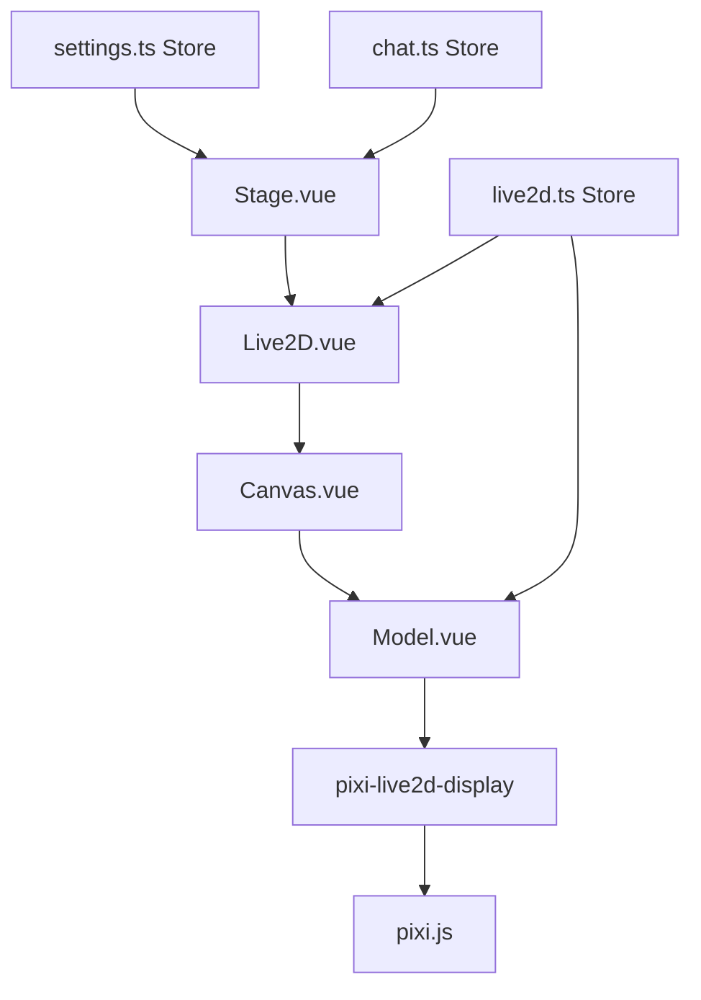
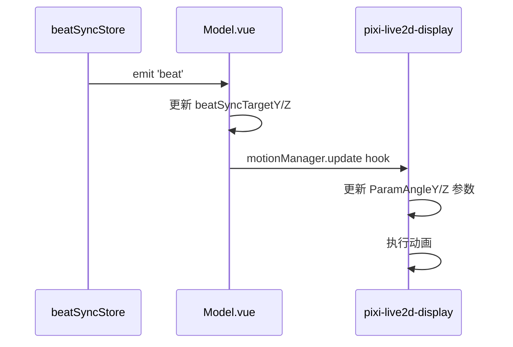
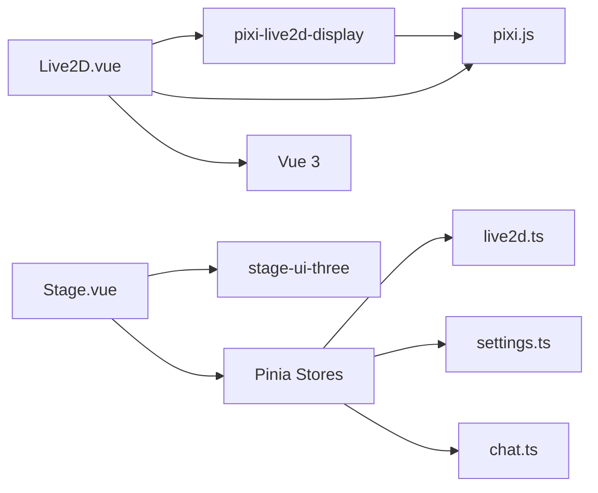

# 场景与模型组件

<cite>
**本文档中引用的文件**  
- [Live2D.vue](file://packages/stage-ui/src/components/scenes/Live2D.vue)
- [Stage.vue](file://packages/stage-ui/src/components/scenes/Stage.vue)
- [Model.vue](file://packages/stage-ui/src/components/scenes/live2d/Model.vue)
- [Canvas.vue](file://packages/stage-ui/src/components/scenes/live2d/Canvas.vue)
- [animation.ts](file://packages/stage-ui/src/composables/live2d/animation.ts)
- [live2d.ts](file://packages/stage-ui/src/stores/live2d.ts)
- [emotions.ts](file://packages/stage-ui/src/constants/emotions.ts)
</cite>

## 目录
1. [简介](#简介)
2. [项目结构](#项目结构)
3. [核心组件](#核心组件)
4. [架构概述](#架构概述)
5. [详细组件分析](#详细组件分析)
6. [依赖分析](#依赖分析)
7. [性能考虑](#性能考虑)
8. [故障排除指南](#故障排除指南)
9. [结论](#结论)

## 简介
本文档详细介绍了 `stage-ui` 项目中用于虚拟角色展示的场景与模型组件。重点分析了 Live2D 模型渲染、舞台控制（Stage）及其相关子组件的设计与实现。文档涵盖组件的属性（props）、事件（events）和插槽（slots），并提供集成 Live2D 模型到应用中的实际示例，包括模型加载、动画控制和交互响应。同时，还探讨了模型性能优化、内存管理、动画同步和错误处理的最佳实践。

## 项目结构
`stage-ui` 组件库的场景与模型相关功能主要集中在 `src/components/scenes` 目录下。该目录包含用于渲染 Live2D 模型的核心组件和用于管理 3D 模型（如 VRM）的组件。

**图示来源**
- [Live2D.vue](file://packages/stage-ui/src/components/scenes/Live2D.vue)
- [Stage.vue](file://packages/stage-ui/src/components/scenes/Stage.vue)
- [Canvas.vue](file://packages/stage-ui/src/components/scenes/live2d/Canvas.vue)
- [Model.vue](file://packages/stage-ui/src/components/scenes/live2d/Model.vue)

**章节来源**
- [Live2D.vue](file://packages/stage-ui/src/components/scenes/Live2D.vue)
- [Stage.vue](file://packages/stage-ui/src/components/scenes/Stage.vue)

## 核心组件
`stage-ui` 的核心场景组件包括 `Stage` 和 `Live2D`。`Stage` 组件是虚拟角色展示的顶层容器，它根据用户设置决定使用 Live2D 还是 VRM 渲染器。`Live2D` 组件则封装了整个 Live2D 模型的渲染流程，包括画布初始化、模型加载和状态管理。

**章节来源**
- [Stage.vue](file://packages/stage-ui/src/components/scenes/Stage.vue)
- [Live2D.vue](file://packages/stage-ui/src/components/scenes/Live2D.vue)

## 架构概述
系统的架构采用分层设计，`Stage` 组件作为入口，协调全局状态和事件。`Live2D` 组件负责构建渲染上下文，并通过 `Canvas` 和 `Model` 组件与底层的 `pixi.js` 和 `pixi-live2d-display` 库进行交互。状态管理通过 Pinia Store（如 `live2d.ts`）实现，确保组件间的数据同步。

**图示来源**
- [Stage.vue](file://packages/stage-ui/src/components/scenes/Stage.vue)
- [Live2D.vue](file://packages/stage-ui/src/components/scenes/Live2D.vue)
- [Canvas.vue](file://packages/stage-ui/src/components/scenes/live2d/Canvas.vue)
- [Model.vue](file://packages/stage-ui/src/components/scenes/live2d/Model.vue)
- [live2d.ts](file://packages/stage-ui/src/stores/live2d.ts)
- [settings.ts](file://packages/stage-ui/src/stores/settings.ts)
- [chat.ts](file://packages/stage-ui/src/stores/chat.ts)

## 详细组件分析

### Live2D 组件分析
`Live2D.vue` 组件是 Live2D 模型渲染的协调者。它使用 `Screen` 组件获取容器尺寸，并创建一个 `Live2DCanvas` 来承载模型。

#### 属性 (Props)
- `modelSrc`: 字符串，指定 Live2D 模型文件（.model3.json 或 .zip）的 URL。
- `paused`: 布尔值，控制模型动画是否暂停。
- `mouthOpenSize`: 数值，控制模型嘴巴张开的程度（0-100）。
- `focusAt`: 对象 `{x, y}`，控制模型的注视焦点。
- `disableFocusAt`: 布尔值，禁用自动焦点移动。
- `xOffset`, `yOffset`: 数值或字符串，控制模型在舞台上的偏移量。
- `scale`: 数值，控制模型的整体缩放比例。

#### 事件 (Events)
该组件主要通过 `v-model:state` 暴露内部状态（'pending', 'loading', 'mounted'），用于外部监控加载过程。

#### 插槽 (Slots)
该组件不直接暴露插槽，其内部通过 `v-slot` 将 `app` 实例传递给子组件 `Live2DModel`。

**章节来源**
- [Live2D.vue](file://packages/stage-ui/src/components/scenes/Live2D.vue)

### Canvas 组件分析
`Canvas.vue` 组件负责初始化 `pixi.js` 应用程序和渲染画布。

#### 属性 (Props)
- `width`, `height`: 数值，定义画布的尺寸。
- `resolution`: 数值，默认为 2，用于提高高分辨率屏幕的渲染质量。

#### 方法 (Methods)
- `canvasElement()`: 返回底层的 HTMLCanvasElement，可用于截图等操作。
- `captureFrame()`: 异步方法，返回当前画布的截图 Blob。

**章节来源**
- [Canvas.vue](file://packages/stage-ui/src/components/scenes/live2d/Canvas.vue)

### Model 组件分析
`Model.vue` 组件是 Live2D 模型的核心，负责加载、渲染和控制模型的动画与交互。

#### 属性 (Props)
继承自 `Live2D.vue` 的大部分属性，如 `modelSrc`, `mouthOpenSize`, `focusAt` 等。

#### 事件 (Events)
- `modelLoaded`: 当模型成功加载并挂载后触发。

#### 方法 (Methods)
- `setMotion(motionName, index)`: 用于手动触发特定的动画。
- `listMotionGroups()`: 返回模型可用的所有动画组列表。

#### 动画与交互
该组件通过 `useLive2DIdleEyeFocus` 组合式函数实现模型的空闲状态下的眼球和头部随机移动（模拟注视）。它还通过监听 `beat` 事件，利用物理模拟（弹簧阻尼系统）实现模型随音乐节拍的摆动。

**图示来源**
- [Model.vue](file://packages/stage-ui/src/components/scenes/live2d/Model.vue)
- [animation.ts](file://packages/stage-ui/src/composables/live2d/animation.ts)

**章节来源**
- [Model.vue](file://packages/stage-ui/src/components/scenes/live2d/Model.vue)
- [animation.ts](file://packages/stage-ui/src/composables/live2d/animation.ts)

## 依赖分析
`stage-ui` 的场景组件依赖于多个外部库和内部模块。

**图示来源**
- [Live2D.vue](file://packages/stage-ui/src/components/scenes/Live2D.vue)
- [Stage.vue](file://packages/stage-ui/src/components/scenes/Stage.vue)
- [live2d.ts](file://packages/stage-ui/src/stores/live2d.ts)
- [settings.ts](file://packages/stage-ui/src/stores/settings.ts)
- [chat.ts](file://packages/stage-ui/src/stores/chat.ts)

**章节来源**
- [Live2D.vue](file://packages/stage-ui/src/components/scenes/Live2D.vue)
- [Stage.vue](file://packages/stage-ui/src/components/scenes/Stage.vue)
- [live2d.ts](file://packages/stage-ui/src/stores/live2d.ts)

## 性能考虑
为了优化性能，组件采用了多种策略：
1.  **防抖 (Debounce)**: `handleResize` 函数使用 `useDebounceFn`，避免在窗口频繁调整大小时进行过多的重绘。
2.  **条件渲染**: `Stage` 组件根据 `stageModelRenderer` 的值动态选择渲染 `Live2DScene` 或 `ThreeScene`，避免不必要的组件挂载。
3.  **资源管理**: `onUnmounted` 钩子中会调用 `pixiApp.value?.destroy()`，确保在组件销毁时释放 Pixi.js 应用占用的资源。
4.  **动画优化**: 通过 `requestAnimationFrame` 循环来更新动态阴影，确保动画流畅且与浏览器刷新率同步。

## 故障排除指南
- **模型无法加载**: 检查 `modelSrc` 是否正确指向有效的 `.model3.json` 文件或包含必要文件的 `.zip` 包。确保网络请求没有被阻止。
- **动画不同步**: 确保 `beatSyncStore` 正确地触发了 `beat` 事件。检查 `motionManager.update` 的钩子函数是否被正确执行。
- **内存泄漏**: 如果发现内存持续增长，检查是否在 `onUnmounted` 钩子中正确地销毁了 Pixi.js 应用和移除了事件监听器。
-   **阴影颜色不更新**: 如果启用了动态主题色 (`themeColorsHueDynamic`)，确保 `updateDropShadowFilterLoop` 循环正在运行，并且 `dropShadowColorComputer` 元素的背景色能正确反映主题色。

**章节来源**
- [Canvas.vue](file://packages/stage-ui/src/components/scenes/live2d/Canvas.vue)
- [Model.vue](file://packages/stage-ui/src/components/scenes/live2d/Model.vue)
- [Stage.vue](file://packages/stage-ui/src/components/scenes/Stage.vue)

## 结论
`stage-ui` 的场景与模型组件提供了一个强大且灵活的框架，用于在 Web 应用中展示交互式虚拟角色。通过清晰的组件分层、有效的状态管理和对性能的细致优化，该系统能够流畅地渲染 Live2D 模型，并实现丰富的动画和交互效果。开发者可以基于此框架，轻松集成和定制自己的虚拟角色体验。