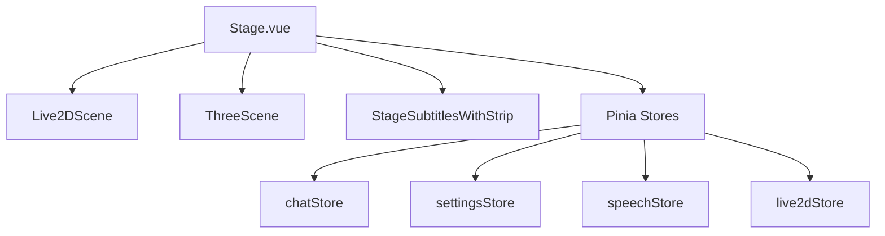
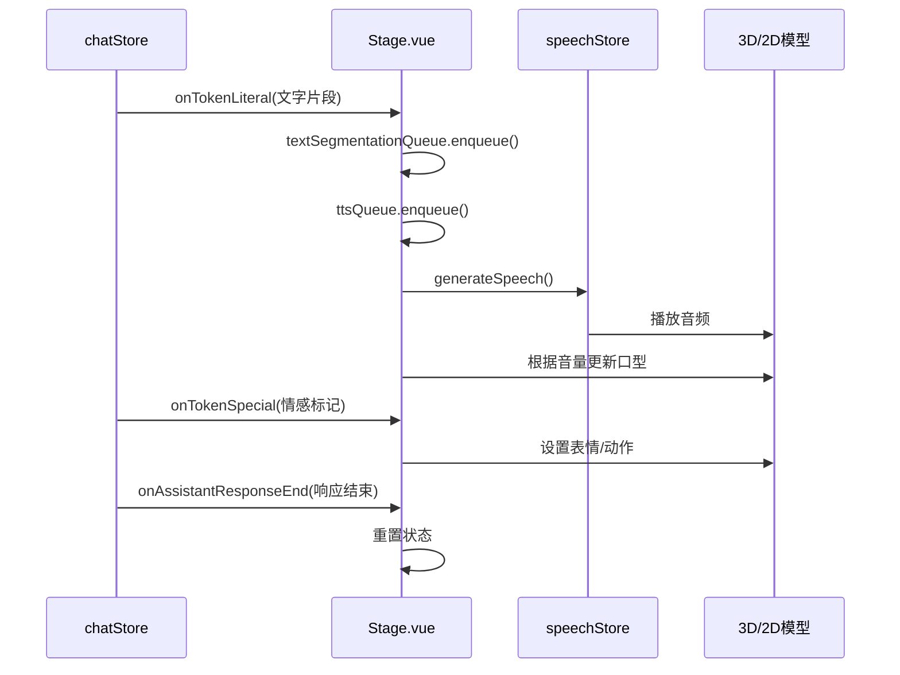
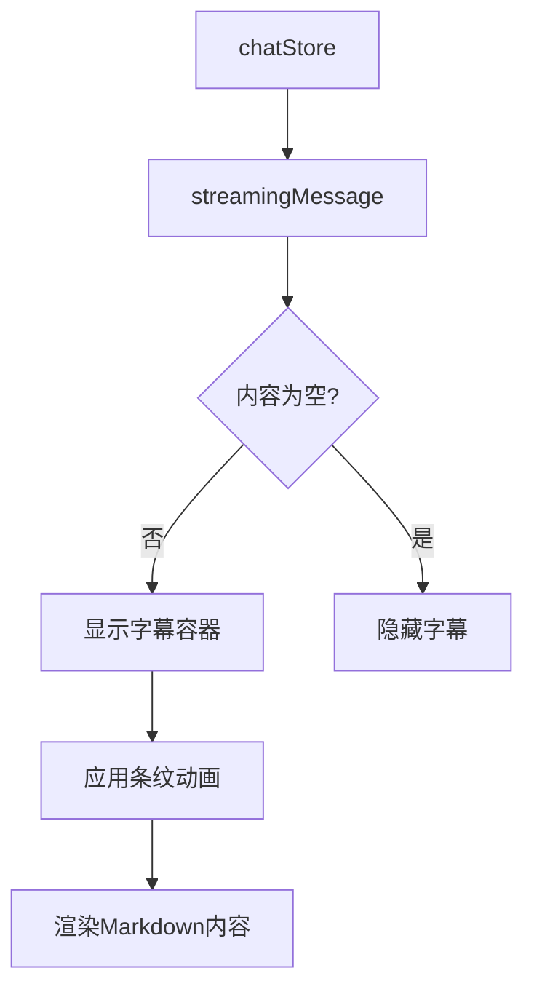
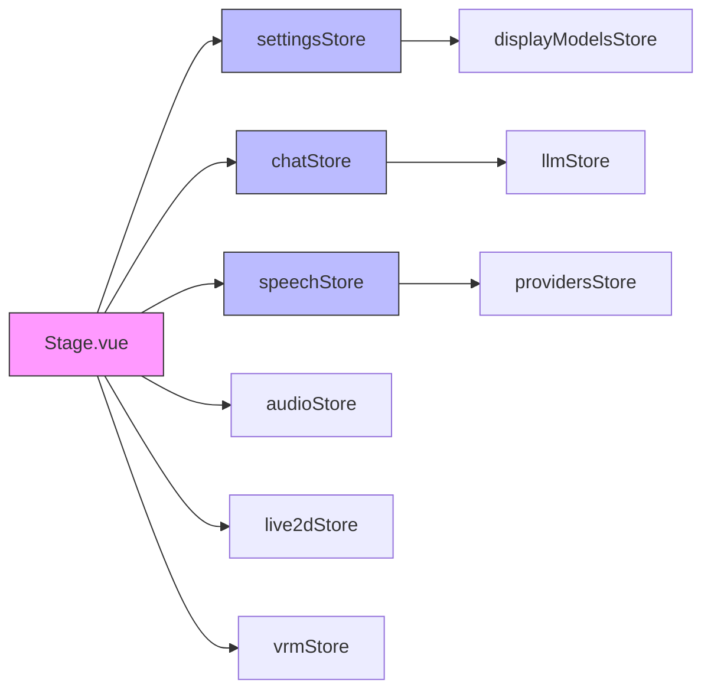

# 舞台组件 (Stage)

<cite>
**本文档引用文件**  
- [Stage.vue](file://packages/stage-ui/src/components/scenes/Stage.vue)
- [StageSubtitlesWithStrip.vue](file://packages/stage-ui/src/components/scenes/StageSubtitlesWithStrip.vue)
- [settings.ts](file://packages/stage-ui/src/stores/settings.ts)
- [chat.ts](file://packages/stage-ui/src/stores/chat.ts)
- [ThreeScene.vue](file://packages/stage-ui-three/src/components/ThreeScene.vue)
</cite>

## 目录
1. [简介](#简介)
2. [项目结构](#项目结构)
3. [核心组件](#核心组件)
4. [架构概述](#架构概述)
5. [详细组件分析](#详细组件分析)
6. [依赖分析](#依赖分析)
7. [性能考虑](#性能考虑)
8. [故障排除指南](#故障排除指南)
9. [结论](#结论)

## 简介
舞台组件（Stage.vue）是虚拟角色展示的核心容器，负责协调Live2D/VRM模型、字幕系统、灯光与背景的集成。该组件作为虚拟角色交互的主舞台，实现了复杂的动画控制、情感表达和实时语音同步功能。

## 项目结构
舞台组件位于`packages/stage-ui/src/components/scenes/`目录下，是舞台UI系统的核心部分。该组件通过Pinia状态管理与系统其他模块进行交互，并依赖`stage-ui-three`包实现3D渲染功能。



**图示来源**
- [Stage.vue](file://packages/stage-ui/src/components/scenes/Stage.vue)
- [settings.ts](file://packages/stage-ui/src/stores/settings.ts)

## 核心组件
舞台组件作为虚拟角色展示的主容器，协调多个子系统的工作。它根据设置中的模型格式动态选择渲染器（Live2D或VRM），并管理动画、语音同步和字幕显示。

**组件来源**
- [Stage.vue](file://packages/stage-ui/src/components/scenes/Stage.vue)

## 架构概述
舞台组件采用模块化架构，通过条件渲染机制支持2D（Live2D）和3D（VRM）两种模型格式。组件通过Pinia状态管理与系统其他部分进行通信，实现了模型切换、动画控制和语音同步功能。

```mermaid
classDiagram
class Stage {
+stageModelRenderer : 'live2d'|'vrm'|'disabled'
+showStage : boolean
+componentState : 'pending'|'loading'|'mounted'
+vrmViewerRef : ThreeScene
+live2dSceneRef : Live2DScene
+setupLipSync() : void
+setupAnalyser() : void
}
class Live2DScene {
+modelSrc : string
+focusAt : {x : number, y : number}
+mouthOpenSize : number
+paused : boolean
}
class ThreeScene {
+modelSrc : string
+idleAnimation : string
+currentAudioSource : AudioBufferSourceNode
+setExpression(expression : string) : void
}
class StageSubtitlesWithStrip {
+streamingMessage : ChatAssistantMessage
}
Stage --> Live2DScene : "条件渲染"
Stage --> ThreeScene : "条件渲染"
Stage --> StageSubtitlesWithStrip : "包含"
Stage --> chatStore : "订阅"
Stage --> settingsStore : "读取"
Stage --> speechStore : "读取"
```

**图示来源**
- [Stage.vue](file://packages/stage-ui/src/components/scenes/Stage.vue)
- [StageSubtitlesWithStrip.vue](file://packages/stage-ui/src/components/scenes/StageSubtitlesWithStrip.vue)
- [ThreeScene.vue](file://packages/stage-ui-three/src/components/ThreeScene.vue)

## 详细组件分析

### 舞台组件分析
舞台组件是虚拟角色展示的核心，负责协调模型渲染、语音同步和字幕显示。组件通过`stageModelRenderer`状态决定使用Live2D还是VRM渲染器，并通过事件钩子与聊天系统集成。

#### 组件交互流程


**图示来源**
- [Stage.vue](file://packages/stage-ui/src/components/scenes/Stage.vue)
- [chat.ts](file://packages/stage-ui/src/stores/chat.ts)

#### 布局与Z轴层级管理
舞台组件采用绝对定位和z-index层级管理，确保正确的视觉层次：
- 背景层（z-index: 1）
- 模型层（z-index: 10）
- 字幕层（z-index: 20）
- 控制层（z-index: 30）

响应式设计通过Tailwind CSS的断点系统实现，在移动设备上自动调整布局。

**组件来源**
- [Stage.vue](file://packages/stage-ui/src/components/scenes/Stage.vue)

### 字幕系统分析
字幕组件（StageSubtitlesWithStrip.vue）显示实时生成的对话内容，与主舞台组件分离以提高性能和可维护性。



**图示来源**
- [StageSubtitlesWithStrip.vue](file://packages/stage-ui/src/components/scenes/StageSubtitlesWithStrip.vue)
- [chat.ts](file://packages/stage-ui/src/stores/chat.ts)

## 依赖分析
舞台组件依赖多个Pinia存储和外部库来实现其功能。



**图示来源**
- [settings.ts](file://packages/stage-ui/src/stores/settings.ts)
- [chat.ts](file://packages/stage-ui/src/stores/chat.ts)
- [Stage.vue](file://packages/stage-ui/src/components/scenes/Stage.vue)

## 性能考虑
舞台组件实现了多种性能优化策略，确保在低资源环境下流畅运行。

### 懒加载与资源管理
- 模型资源按需加载，避免初始加载时的性能瓶颈
- 使用`URL.createObjectURL()`管理文件模型的内存
- 通过`onUnmounted`钩子清理资源引用

### 动画帧节流
- 口型同步采用`requestAnimationFrame`进行优化
- 眼球运动和焦点控制使用间隔更新策略
- 音频分析器与渲染循环分离，避免阻塞主线程

### GPU渲染优化
- 3D场景使用TresJS（Three.js的Vue封装）进行WebGL渲染
- 后期处理效果（如色调饱和度）通过着色器在GPU上执行
- 纹理和模型数据直接传递给GPU，减少CPU-GPU数据传输

**组件来源**
- [Stage.vue](file://packages/stage-ui/src/components/scenes/Stage.vue)
- [ThreeScene.vue](file://packages/stage-ui-three/src/components/ThreeScene.vue)

## 故障排除指南
### 模型加载失败
检查`stageModelSelectedUrl`是否正确设置，确保模型文件路径有效。对于文件模型，确认`URL.createObjectURL()`调用成功。

### 口型不同步
验证音频上下文是否正确连接，检查`calculateVolume`函数的实现。确保`audioAnalyser`节点已正确创建并连接到音频图。

### 字幕不显示
确认`streamingMessage.content`不为空，检查`chatStore`的`onTokenLiteral`事件是否正常触发。

**组件来源**
- [Stage.vue](file://packages/stage-ui/src/components/scenes/Stage.vue)
- [chat.ts](file://packages/stage-ui/src/stores/chat.ts)

## 结论
舞台组件作为虚拟角色展示的核心，成功整合了2D/3D模型渲染、实时语音同步和动态字幕系统。通过合理的架构设计和性能优化，组件能够在各种设备上提供流畅的用户体验。未来可进一步优化模型切换动画和跨平台兼容性。