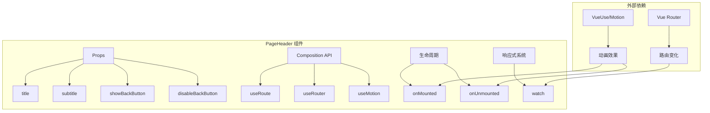
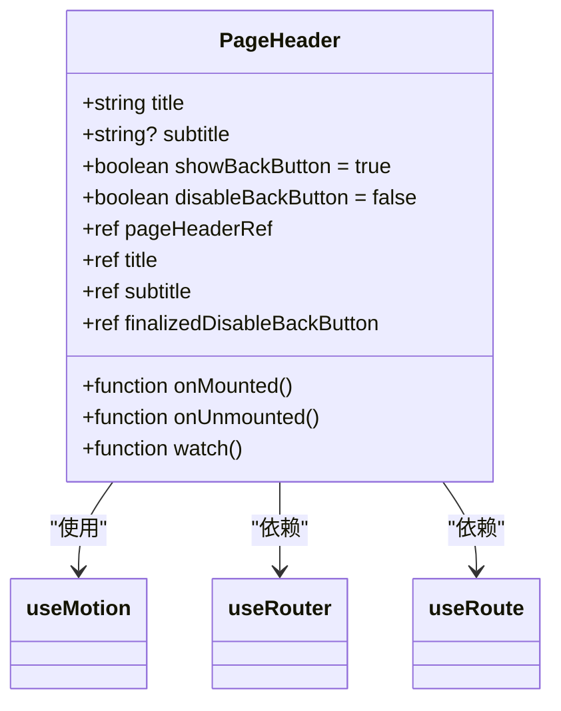
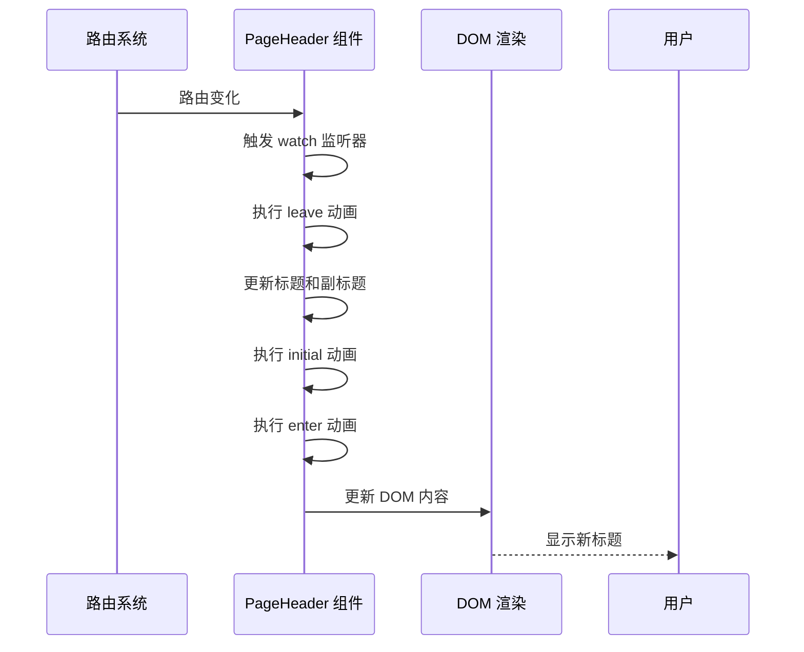
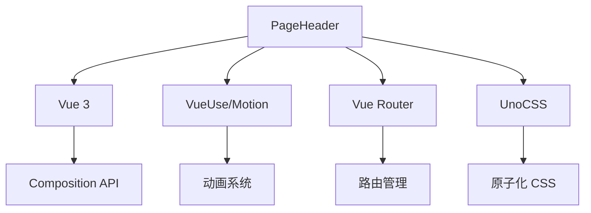

# PageHeader 布局

<cite>
**Referenced Files in This Document **   
- [PageHeader.vue](file://packages/stage-ui/src/components/layouts/PageHeader.vue)
- [settings.vue](file://apps/stage-web/src/layouts/settings.vue)
</cite>

## 目录
1. [简介](#简介)
2. [核心组件](#核心组件)
3. [架构概述](#架构概述)
4. [详细组件分析](#详细组件分析)
5. [依赖分析](#依赖分析)
6. [性能考虑](#性能考虑)
7. [故障排除指南](#故障排除指南)
8. [结论](#结论)

## 简介
PageHeader 布局组件是应用程序中用于展示页面顶部区域的核心组件。它提供了一致的页面标题、副标题和导航功能，确保用户界面的统一性和可预测性。该组件在页面导航和用户体验中扮演着关键角色，为用户提供清晰的上下文信息。

**Section sources**
- [PageHeader.vue](file://packages/stage-ui/src/components/layouts/PageHeader.vue#L1-L83)

## 核心组件
PageHeader 组件通过其简洁的设计和强大的功能，实现了页面头部的标准化。它支持动态标题和副标题更新，并集成了页面过渡动画，提升了用户体验。组件利用 Vue 的响应式系统和路由功能，确保在页面切换时能够平滑地更新内容。

**Section sources**
- [PageHeader.vue](file://packages/stage-ui/src/components/layouts/PageHeader.vue#L1-L83)

## 架构概述
PageHeader 组件采用现代化的 Vue 3 Composition API 构建，结合了 VueUse 的 motion 功能实现流畅的动画效果。组件与 Vue Router 紧密集成，能够响应路由变化并相应地更新标题内容。其架构设计注重性能和用户体验，通过优化的动画序列和响应式更新机制，确保了高效的渲染性能。

**Diagram sources **
- [PageHeader.vue](file://packages/stage-ui/src/components/layouts/PageHeader.vue#L1-L83)

## 详细组件分析

### PageHeader 分析
PageHeader 组件通过其精心设计的结构和功能，为应用程序提供了统一的页面头部体验。组件的核心功能包括标题管理、导航控制和动画效果。

#### Props 分析
PageHeader 组件接受多个 props 来配置其行为和外观：
- **title**: 主标题文本，必填项
- **subtitle**: 副标题文本，可选项
- **showBackButton**: 控制返回按钮的显示，默认为 true
- **disableBackButton**: 禁用返回按钮功能，用于特定场景

这些 props 通过 `withDefaults` 进行定义，确保了组件的灵活性和易用性。

**Diagram sources **
- [PageHeader.vue](file://packages/stage-ui/src/components/layouts/PageHeader.vue#L1-L83)

#### 事件与响应式更新
组件通过 `watch` 监听器监控标题、副标题和路由的变化，实现动态内容更新。当检测到变化时，组件会执行一系列动画序列：首先淡出当前内容，然后更新数据，最后淡入新内容。这种机制确保了用户界面的流畅性和一致性。

**Section sources**
- [PageHeader.vue](file://packages/stage-ui/src/components/layouts/PageHeader.vue#L1-L83)

### 实际使用示例
在实际应用中，PageHeader 组件被集成到布局中，用于显示动态的页面标题信息。例如，在 settings 布局中，组件通过绑定路由元数据来显示相应的标题和副标题。

**Diagram sources **
- [PageHeader.vue](file://packages/stage-ui/src/components/layouts/PageHeader.vue#L1-L83)
- [settings.vue](file://apps/stage-web/src/layouts/settings.vue#L111-L148)

## 依赖分析
PageHeader 组件依赖于多个外部库和框架功能，形成了一个紧密集成的生态系统。

**Diagram sources **
- [PageHeader.vue](file://packages/stage-ui/src/components/layouts/PageHeader.vue#L1-L83)

**Section sources**
- [PageHeader.vue](file://packages/stage-ui/src/components/layouts/PageHeader.vue#L1-L83)

## 性能考虑
PageHeader 组件在设计时充分考虑了性能因素。通过使用 Vue 的响应式系统和优化的动画序列，组件能够在保持流畅用户体验的同时，最小化对系统资源的消耗。动画的持续时间经过精心调整，确保既不会过于突兀，也不会造成用户等待。

## 故障排除指南
当 PageHeader 组件出现问题时，可以检查以下几个方面：
1. 确保 Vue Router 正确配置和初始化
2. 检查 props 传递是否正确
3. 验证 VueUse/Motion 库是否正确安装和导入
4. 确认 CSS 类名和样式是否正确应用

**Section sources**
- [PageHeader.vue](file://packages/stage-ui/src/components/layouts/PageHeader.vue#L1-L83)

## 结论
PageHeader 布局组件通过其简洁的设计和强大的功能，为应用程序提供了统一且高效的页面头部解决方案。组件的响应式更新机制和流畅的动画效果，显著提升了用户体验。通过与 Vue 生态系统的紧密集成，PageHeader 成为了构建现代化 Web 应用程序的重要组成部分。