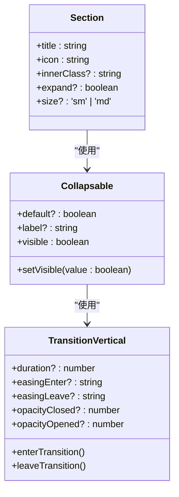

# Section 布局

<cite>
**Referenced Files in This Document**   
- [Section.vue](file://packages/stage-ui/src/components/layouts/Section.vue)
- [Section.story.vue](file://packages/stage-ui/src/components/layouts/Section.story.vue)
- [Collapsable.vue](file://packages/stage-ui/src/components/misc/Collapsable.vue)
- [TransitionVertical.vue](file://packages/ui/src/components/Animations/TransitionVertical.vue)
</cite>

## 目录
1. [简介](#简介)
2. [核心功能与属性](#核心功能与属性)
3. [事件与插槽](#事件与插槽)
4. [使用示例](#使用示例)
5. [可折叠行为实现](#可折叠行为实现)
6. [状态管理集成](#状态管理集成)
7. [性能考量](#性能考量)
8. [嵌套使用模式](#嵌套使用模式)

## 简介
Section 组件是一个用于组织和分组内容的布局容器，特别适用于设置页面、表单或任何需要结构化信息展示的场景。它通过提供标题、图标和可折叠功能，帮助用户更好地组织和管理界面内容。该组件设计简洁，易于使用，并且具有良好的可扩展性。

**Section sources**
- [Section.vue](file://packages/stage-ui/src/components/layouts/Section.vue#L1-L41)

## 核心功能与属性
Section 组件提供了多个属性来配置其外观和行为。主要属性包括：
- **title**: 设置组件的标题文本。
- **icon**: 指定显示在标题前的图标。
- **innerClass**: 允许为内容区域添加自定义 CSS 类。
- **expand**: 控制组件初始状态是否展开，默认为 `true`。
- **size**: 定义组件的尺寸，支持 `'sm'` 和 `'md'` 两种选项。

这些属性使得 Section 组件能够灵活地适应不同的设计需求。

**Section sources**
- [Section.vue](file://packages/stage-ui/src/components/layouts/Section.vue#L2-L14)

## 事件与插槽
Section 组件利用了 `Collapsable` 组件来实现可折叠功能，并通过插槽机制提供了高度的自定义能力。
- **事件**: 通过 `Collapsable` 组件的 `setVisible` 方法触发折叠/展开状态的变化。
- **插槽**: 
  - `trigger` 插槽允许自定义触发按钮的内容。
  - 默认插槽用于放置需要被折叠/展开的内容。

这种设计模式增强了组件的灵活性和复用性。

**Section sources**
- [Section.vue](file://packages/stage-ui/src/components/layouts/Section.vue#L16-L41)
- [Collapsable.vue](file://packages/stage-ui/src/components/misc/Collapsable.vue#L1-L39)

## 使用示例
以下是 Section 组件的一些典型使用场景：

### 基本用法
```vue
<Section title="基本部分" icon="i-solar:settings-line-duotone">
  <div>这是基本部分的内容</div>
</Section>
```

### 初始折叠
```vue
<Section title="折叠部分" icon="i-solar:folder-line-duotone" :expand="false">
  <div>此内容初始时是隐藏的</div>
</Section>
```

### 复杂内容
```vue
<Section title="复杂内容" icon="i-solar:document-line-duotone">
  <div class="flex flex-col gap-4">
    <div class="flex items-center gap-2">
      <div i-solar:info-circle-line-duotone />
      <span>重要信息</span>
    </div>
    <div class="border border-neutral-200 rounded-md p-3 dark:border-neutral-700">
      <p>这是一个包含更复杂嵌套内容的部分</p>
    </div>
  </div>
</Section>
```

**Section sources**
- [Section.story.vue](file://packages/stage-ui/src/components/layouts/Section.story.vue#L1-L77)

## 可折叠行为实现
Section 组件的可折叠功能依赖于 `Collapsable` 组件，而 `Collapsable` 组件又使用了 `TransitionVertical` 组件来实现平滑的垂直过渡动画。
- `Collapsable` 组件通过 `v-model` 管理可见性状态。
- `TransitionVertical` 组件利用 Web Animations API 实现了高度变化的动画效果，确保了流畅的用户体验。



**Diagram sources**
- [Section.vue](file://packages/stage-ui/src/components/layouts/Section.vue#L1-L41)
- [Collapsable.vue](file://packages/stage-ui/src/components/misc/Collapsable.vue#L1-L39)
- [TransitionVertical.vue](file://packages/ui/src/components/Animations/TransitionVertical.vue#L1-L158)

## 状态管理集成
虽然 Section 组件本身不直接与 Pinia 等状态管理库集成，但可以通过外部状态来控制其 `expand` 属性。例如，可以将某个模块的展开状态存储在 Pinia store 中，并通过计算属性或动作来更新 Section 的展开状态。

**Section sources**
- [Section.vue](file://packages/stage-ui/src/components/layouts/Section.vue#L2-L14)

## 性能考量
- **懒加载内容**: 对于包含大量内容的 Section，建议在 `visible` 状态变为 `true` 时才加载具体内容，以减少初始渲染负担。
- **动画优化**: `TransitionVertical` 组件使用了高效的 Web Animations API，避免了不必要的重排和重绘，保证了动画的流畅性。

**Section sources**
- [TransitionVertical.vue](file://packages/ui/src/components/Animations/TransitionVertical.vue#L1-L158)

## 嵌套使用模式
Section 组件支持嵌套使用，可以在一个 Section 内部再包含多个 Section，形成层次化的信息结构。这种模式非常适合构建复杂的设置页面或表单。

```vue
<div class="flex flex-col gap-4">
  <Section title="第一部分" icon="i-solar:user-line-duotone">
    <div>第一部分的内容</div>
  </Section>
  <Section title="第二部分" icon="i-solar:chart-line-duotone">
    <div>第二部分的内容</div>
  </Section>
  <Section title="第三部分" icon="i-solar:bell-line-duotone" :expand="false">
    <div>第三部分的内容（初始折叠）</div>
  </Section>
</div>
```

**Section sources**
- [Section.story.vue](file://packages/stage-ui/src/components/layouts/Section.story.vue#L63-L77)