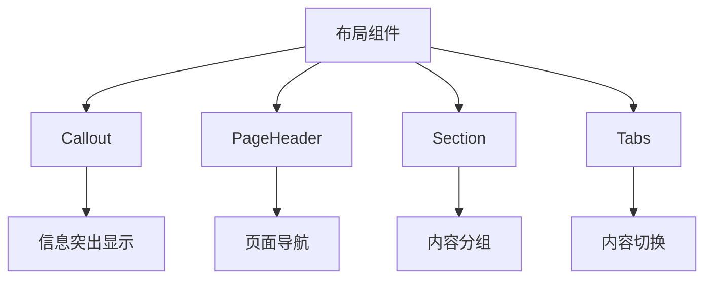

# 布局组件

<cite>
**本文档中引用的文件**  
- [Callout.vue](file://packages/stage-ui/src/components/layouts/Callout.vue)
- [PageHeader.vue](file://packages/stage-ui/src/components/layouts/PageHeader.vue)
- [Section.vue](file://packages/stage-ui/src/components/layouts/Section.vue)
- [Tabs.vue](file://packages/stage-ui/src/components/layouts/Tabs.vue)
</cite>

## 目录
1. [简介](#简介)
2. [核心布局组件](#核心布局组件)
3. [Callout 组件](#callout-组件)
4. [PageHeader 组件](#pageheader-组件)
5. [Section 组件](#section-组件)
6. [Tabs 组件](#tabs-组件)
7. [布局模式最佳实践](#布局模式最佳实践)
8. [响应式设计考虑](#响应式设计考虑)
9. [可访问性指南](#可访问性指南)
10. [与其他组件的集成方法](#与其他组件的集成方法)

## 简介

布局组件是构建清晰、结构化用户界面的基础。这些组件提供了一致的视觉层次和交互模式，帮助用户理解和导航应用程序。本文档详细介绍了 stage-ui 库中的四个核心布局组件：Callout、PageHeader、Section 和 Tabs，它们共同构成了应用程序的骨架结构。

**Section sources**
- [Callout.vue](file://packages/stage-ui/src/components/layouts/Callout.vue)
- [PageHeader.vue](file://packages/stage-ui/src/components/layouts/PageHeader.vue)
- [Section.vue](file://packages/stage-ui/src/components/layouts/Section.vue)
- [Tabs.vue](file://packages/stage-ui/src/components/layouts/Tabs.vue)

## 核心布局组件

stage-ui 提供了一套完整的布局组件，用于构建现代、响应式的用户界面。这些组件遵循一致的设计原则，包括清晰的视觉层次、一致的间距系统和可预测的交互模式。每个组件都经过精心设计，以确保在不同设备和屏幕尺寸上都能提供良好的用户体验。

**Diagram sources**
- [Callout.vue](file://packages/stage-ui/src/components/layouts/Callout.vue)
- [PageHeader.vue](file://packages/stage-ui/src/components/layouts/PageHeader.vue)
- [Section.vue](file://packages/stage-ui/src/components/layouts/Section.vue)
- [Tabs.vue](file://packages/stage-ui/src/components/layouts/Tabs.vue)

**Section sources**
- [Callout.vue](file://packages/stage-ui/src/components/layouts/Callout.vue)
- [PageHeader.vue](file://packages/stage-ui/src/components/layouts/PageHeader.vue)
- [Section.vue](file://packages/stage-ui/src/components/layouts/Section.vue)
- [Tabs.vue](file://packages/stage-ui/src/components/layouts/Tabs.vue)

## Callout 组件

Callout 组件用于突出显示重要信息或提供上下文相关的提示。它通过视觉样式和图标来吸引用户的注意力，同时保持界面的整洁性。

### Props

- `theme`: 主题变体，可选值为 'primary'、'violet'、'lime'、'orange'，默认值为 'primary'
- `label`: 标签文本，显示在 Callout 的顶部

### 插槽

- `label`: 自定义标签内容的插槽
- 默认插槽：Callout 的主要内容区域

### 设计原则

Callout 组件采用半透明背景和模糊效果，使其在视觉上突出但不干扰主要内容。左侧的垂直条纹提供了额外的视觉引导，帮助用户快速识别重要信息。

**Section sources**
- [Callout.vue](file://packages/stage-ui/src/components/layouts/Callout.vue)

## PageHeader 组件

PageHeader 组件用于显示页面的标题和副标题，同时提供导航返回功能。它固定在页面顶部，确保用户始终知道当前所处的位置。

### Props

- `title`: 页面主标题
- `subtitle`: 页面副标题（可选）
- `showBackButton`: 是否显示返回按钮，默认值为 true
- `disableBackButton`: 是否禁用返回按钮，默认值为 false

### 事件

- 无自定义事件，但会响应浏览器的返回操作

### 设计原则

PageHeader 组件采用粘性定位，始终显示在视口顶部。它使用平滑的动画效果来增强用户体验，当页面内容变化时，标题会优雅地过渡到新状态。

**Section sources**
- [PageHeader.vue](file://packages/stage-ui/src/components/layouts/PageHeader.vue)

## Section 组件

Section 组件用于将相关内容分组，并提供可折叠的交互功能。它帮助组织复杂的内容结构，使用户能够专注于特定部分。

### Props

- `title`: 部分标题
- `icon`: 显示在标题前的图标
- `innerClass`: 内容区域的自定义 CSS 类
- `expand`: 是否默认展开，默认值为 true
- `size`: 大小变体，可选值为 'sm' 或 'md'

### 插槽

- 默认插槽：Section 的主要内容区域

### 设计原则

Section 组件采用卡片式设计，通过背景色和阴影来区分不同的内容区域。折叠/展开功能通过平滑的动画效果实现，提供直观的交互反馈。

**Section sources**
- [Section.vue](file://packages/stage-ui/src/components/layouts/Section.vue)

## Tabs 组件

Tabs 组件用于在同一个界面中切换不同的内容视图。它提供了一种节省空间的方式来组织相关但不同的信息。

### Props

- `modelValue`: 当前激活的标签值
- `tabs`: 标签项数组，每个项包含 value、label、icon 和 disabled 属性
- `theme`: 主题变体，可选值为 'primary'、'violet'、'lime'、'orange'，默认值为 'primary'
- `size`: 大小变体，可选值为 'xs'、'sm'、'md'，默认值为 'sm'
- `label`: 标签组的标题（可选）

### 事件

- `update:modelValue`: 当标签切换时触发，传递新的标签值
- `change`: 当标签切换时触发，传递新的标签值

### 插槽

- `default`: 传递当前激活的标签值，用于条件渲染内容

### 设计原则

Tabs 组件采用清晰的视觉反馈来指示当前激活的标签。未激活的标签保持较低的视觉权重，而激活的标签则通过背景色、阴影和边框来突出显示。

**Section sources**
- [Tabs.vue](file://packages/stage-ui/src/components/layouts/Tabs.vue)

## 布局模式最佳实践

1. **层次结构**: 使用 PageHeader 作为页面的顶级标题，然后使用 Section 和 Tabs 来组织主要内容。
2. **信息优先级**: 使用 Callout 来突出显示关键信息或警告。
3. **一致性**: 在整个应用程序中保持相同的布局模式和交互行为。
4. **空白空间**: 合理利用空白空间，避免内容过于拥挤。

## 响应式设计考虑

所有布局组件都经过响应式设计，能够在不同屏幕尺寸上正常工作：

- 在移动设备上，PageHeader 的返回按钮更加突出
- Section 和 Tabs 组件在小屏幕上会自动调整大小和间距
- Callout 组件的文本会自动换行以适应窄屏幕

## 可访问性指南

1. **键盘导航**: 所有交互式组件都支持键盘导航
2. **屏幕阅读器**: 使用适当的 ARIA 属性来增强可访问性
3. **对比度**: 确保文本和背景之间有足够的对比度
4. **焦点管理**: 提供清晰的焦点指示器

## 与其他组件的集成方法

布局组件可以与其他 UI 组件无缝集成：

- 在 Section 内部使用表单组件来组织输入字段
- 在 Tabs 的每个标签页中使用数据表格或图表
- 在 Callout 中使用按钮来提供操作选项
- 在 PageHeader 旁边添加操作按钮或搜索框

通过合理组合这些布局组件，可以创建出既美观又实用的用户界面。