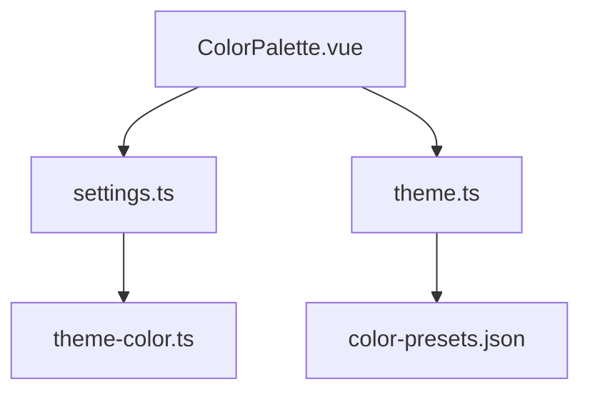
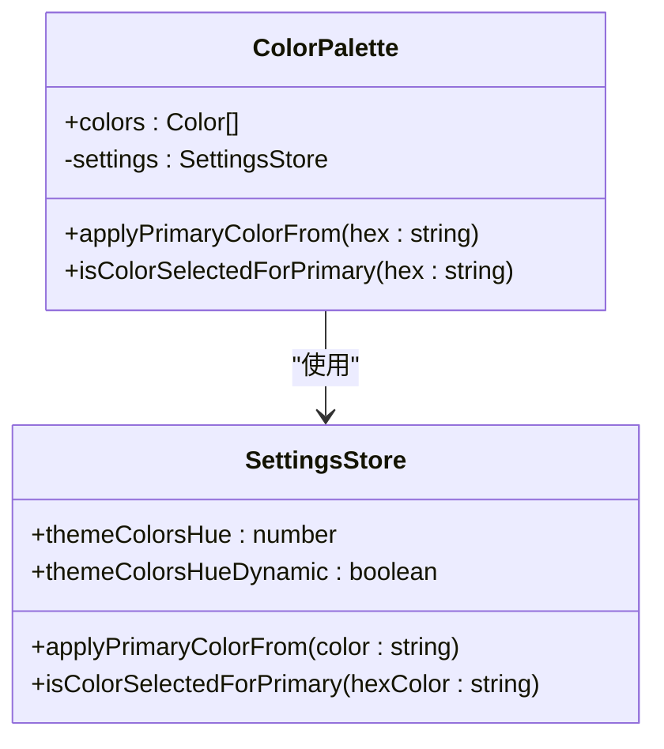
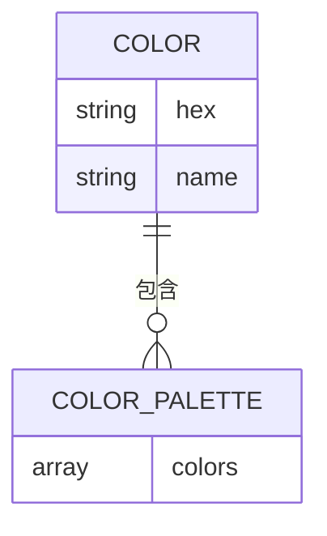
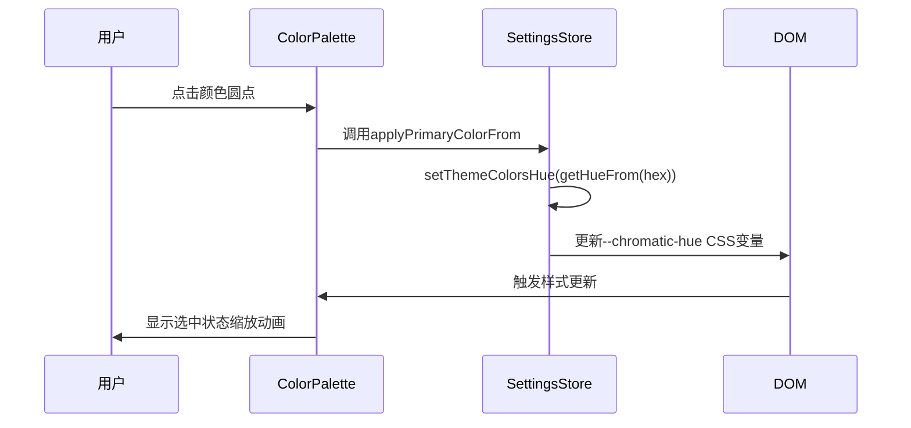
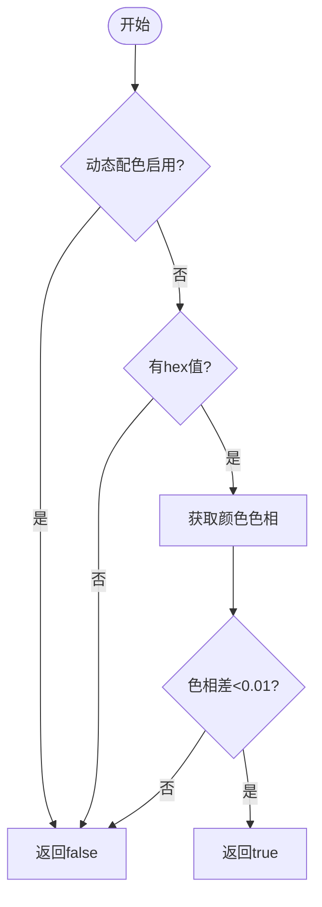
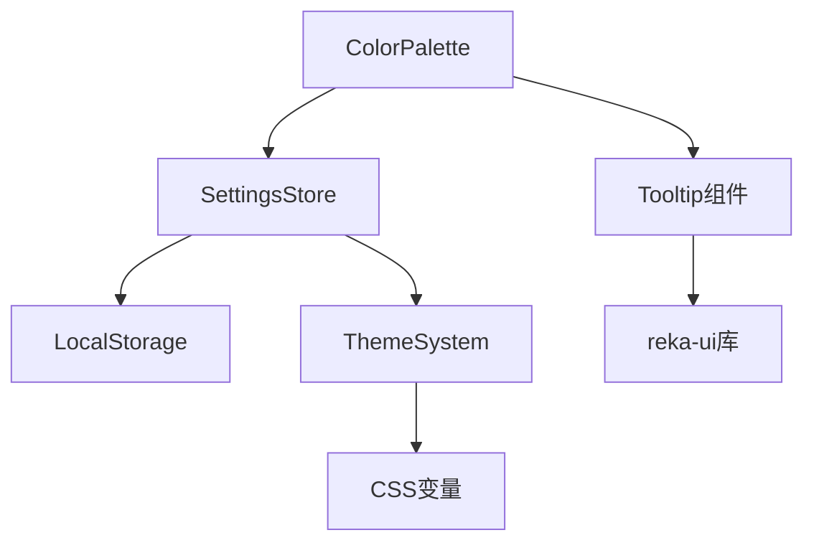

# ColorPalette组件

<cite>
**本文档引用文件**  
- [ColorPalette.vue](file://packages/stage-ui/src/components/widgets/ColorPalette.vue)
- [settings.ts](file://packages/stage-ui/src/stores/settings.ts)
- [theme.ts](file://packages/stage-ui/src/constants/theme.ts)
- [color-scheme.vue](file://packages/stage-ui/src/pages/settings/system/color-scheme.vue)
- [color-presets.json](file://packages/stage-pages/src/pages/settings/system/color-presets.json)
- [theme-color.ts](file://apps/stage-web/src/composables/theme-color.ts)
</cite>

## 目录
1. [简介](#简介)
2. [项目结构](#项目结构)
3. [核心组件](#核心组件)
4. [架构概述](#架构概述)
5. [详细组件分析](#详细组件分析)
6. [依赖分析](#依赖分析)
7. [性能考虑](#性能考虑)
8. [故障排除指南](#故障排除指南)
9. [结论](#结论)

## 简介
ColorPalette组件是一个用于主题颜色选择和视觉配置的交互式UI组件。它支持多种颜色格式，提供可配置的调色板类型和选择模式，并集成到全局主题系统中。该组件广泛应用于系统设置、角色外观定制等场景，具备无障碍访问支持、键盘导航功能和颜色对比度合规性。

## 项目结构
ColorPalette组件位于`packages/stage-ui/src/components/widgets/`目录下，作为UI库的一部分。其设计遵循模块化原则，与全局主题系统和设置存储紧密集成。

**Diagram sources**
- [ColorPalette.vue](file://packages/stage-ui/src/components/widgets/ColorPalette.vue)
- [settings.ts](file://packages/stage-ui/src/stores/settings.ts)
- [theme.ts](file://packages/stage-ui/src/constants/theme.ts)

**Section sources**
- [ColorPalette.vue](file://packages/stage-ui/src/components/widgets/ColorPalette.vue)
- [settings.ts](file://packages/stage-ui/src/stores/settings.ts)

## 核心组件
ColorPalette组件的核心功能包括颜色选择、主题应用和状态管理。它通过`useSettings`存储管理主题颜色状态，并支持动态和静态颜色模式。

**Section sources**
- [ColorPalette.vue](file://packages/stage-ui/src/components/widgets/ColorPalette.vue#L1-L36)
- [settings.ts](file://packages/stage-ui/src/stores/settings.ts#L37-L183)

## 架构概述
组件采用Vue 3组合式API架构，通过Pinia存储进行状态管理。颜色选择逻辑与UI分离，确保可维护性和可测试性。

**Diagram sources**
- [ColorPalette.vue](file://packages/stage-ui/src/components/widgets/ColorPalette.vue)
- [settings.ts](file://packages/stage-ui/src/stores/settings.ts)

## 详细组件分析

### ColorPalette组件分析
该组件接收颜色数组作为属性，每个颜色对象包含十六进制值和名称。用户点击颜色圆点时，触发主题颜色应用。

#### 组件属性

**Diagram sources**
- [ColorPalette.vue](file://packages/stage-ui/src/components/widgets/ColorPalette.vue#L7-L12)

#### 交互流程

**Diagram sources**
- [ColorPalette.vue](file://packages/stage-ui/src/components/widgets/ColorPalette.vue#L22-L28)
- [settings.ts](file://packages/stage-ui/src/stores/settings.ts#L134-L136)

#### 颜色选择状态判断

**Diagram sources**
- [settings.ts](file://packages/stage-ui/src/stores/settings.ts#L143-L156)

## 依赖分析
ColorPalette组件依赖于多个核心模块，形成完整的主题管理系统。

**Diagram sources**
- [ColorPalette.vue](file://packages/stage-ui/src/components/widgets/ColorPalette.vue)
- [settings.ts](file://packages/stage-ui/src/stores/settings.ts)

**Section sources**
- [ColorPalette.vue](file://packages/stage-ui/src/components/widgets/ColorPalette.vue)
- [settings.ts](file://packages/stage-ui/src/stores/settings.ts)

## 性能考虑
组件通过以下方式优化性能：
- 使用CSS变量进行主题切换，避免重排重绘
- 采用防抖和节流处理频繁的颜色变化
- 仅在必要时更新DOM

## 故障排除指南
### 常见问题
- **颜色不更新**：检查`--chromatic-hue` CSS变量是否正确设置
- **选中状态不显示**：确认`isColorSelectedForPrimary`逻辑正确执行
- **动态配色失效**：验证`themeColorsHueDynamic`存储状态

**Section sources**
- [settings.ts](file://packages/stage-ui/src/stores/settings.ts#L143-L156)
- [App.vue](file://apps/stage-web/src/App.vue#L29-L58)

## 结论
ColorPalette组件提供了一个完整、可访问的主题颜色选择解决方案。它与全局主题系统无缝集成，支持多种使用场景，并具备良好的性能和可维护性。