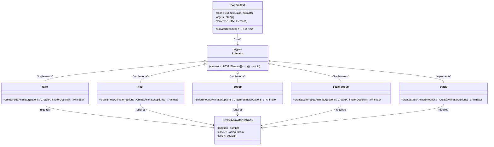

# PoppinText组件

<cite>
**Referenced Files in This Document**  
- [PoppinText.web.vue](file://packages/stage-ui/src/components/widgets/poppin-text/PoppinText.web.vue)
- [fade.ts](file://packages/stage-ui/src/components/widgets/poppin-text/animators/fade.ts)
- [float.ts](file://packages/stage-ui/src/components/widgets/poppin-text/animators/float.ts)
- [popup.ts](file://packages/stage-ui/src/components/widgets/poppin-text/animators/popup.ts)
- [scale-popup.ts](file://packages/stage-ui/src/components/widgets/poppin-text/animators/scale-popup.ts)
- [stack.ts](file://packages/stage-ui/src/components/widgets/poppin-text/animators/stack.ts)
- [index.ts](file://packages/stage-ui/src/components/widgets/poppin-text/animators/index.ts)
</cite>

## 目录
1. [简介](#简介)
2. [核心功能](#核心功能)
3. [Props 详解](#props-详解)
4. [动画器（Animator）系统](#动画器animator-系统)
5. [事件与插槽](#事件与插槽)
6. [动画效果配置示例](#动画效果配置示例)
7. [性能优化与最佳实践](#性能优化与最佳实践)
8. [扩展自定义动画行为](#扩展自定义动画行为)

## 简介

PoppinText组件是一个专为动态文本展示设计的Vue组件，旨在通过丰富的动画效果让文本呈现“kirakira dokidoki”（闪闪发光、怦然心动）的视觉体验。该组件能够将输入的文本分解为Unicode字素簇（Grapheme Clusters），并对每个字符独立应用动画，从而实现流畅、细腻的逐字动画效果。它特别适用于需要吸引用户注意力的场景，如欢迎语、提示信息或关键内容的高亮展示。

**Section sources**
- [PoppinText.web.vue](file://packages/stage-ui/src/components/widgets/poppin-text/PoppinText.web.vue#L1-L87)

## 核心功能

PoppinText组件的核心功能在于其能够处理两种类型的文本输入：静态字符串和可读流（ReadableStream）。对于静态字符串，组件会立即进行解析和渲染。对于来自后端流式API的文本流，组件能够实时接收并逐字显示数据，实现类似打字机的流式输出效果。这种设计使得组件既能用于常规的UI展示，也能无缝集成到实时AI对话等流式数据场景中。

**Section sources**
- [PoppinText.web.vue](file://packages/stage-ui/src/components/widgets/poppin-text/PoppinText.web.vue#L15-L54)

## Props 详解

PoppinText组件通过props接收配置，主要包含以下三个属性：

- **`text`**: 接收一个字符串或`ReadableStream<Uint8Array>`。当传入流时，组件会监听流的输出并动态更新文本，但该流不应被重复使用。
- **`textClass`**: 一个字符串或字符串数组，用于为每个字符的`<span>`元素添加自定义CSS类，以控制字体、颜色等样式。
- **`animator`**: 一个动画器函数，定义了字符出现时的动画行为。该函数由`animators`目录下的工厂函数创建。

**Section sources**
- [PoppinText.web.vue](file://packages/stage-ui/src/components/widgets/poppin-text/PoppinText.web.vue#L15-L26)

## 动画器（Animator）系统

PoppinText的动画系统基于一个灵活的`Animator`接口。所有动画器都遵循统一的设计模式：接收一个DOM元素数组作为参数，并返回一个清理函数。`animators`目录提供了多种预设动画，它们都依赖于`animejs`库来实现高性能的动画。

### 动画器配置选项

所有动画器共享一个`CreateAnimatorOptions`接口，包含以下通用配置：
- **`duration`**: 动画总时长（毫秒）。
- **`ease`**: 缓动函数，控制动画的速度曲线。
- **`loop`**: 布尔值，指示动画是否循环播放。

**Section sources**
- [index.ts](file://packages/stage-ui/src/components/widgets/poppin-text/animators/index.ts#L3-L15)

### 内置动画效果

#### Fade（淡入）
`fade`动画器使字符从完全透明（opacity: 0）平滑过渡到完全不透明（opacity: 1）。字符按顺序依次淡入，延迟时间根据字符在序列中的位置计算。

**Diagram sources**
- [fade.ts](file://packages/stage-ui/src/components/widgets/poppin-text/animators/fade.ts#L1-L27)

#### Float（漂浮）
`float`动画器模拟字符从右下角“漂浮”到原位的效果。字符初始时偏移并旋转，然后平滑地移动到目标位置，同时旋转回正，营造出轻盈的动态感。

**Diagram sources**
- [float.ts](file://packages/stage-ui/src/components/widgets/poppin-text/animators/float.ts#L1-L35)

#### Popup（弹出）
`popup`动画器让字符从下方“弹出”到视图中。字符从下方偏移位置开始，向上移动到原位，同时从透明变为不透明，效果简洁明快。

**Diagram sources**
- [popup.ts](file://packages/stage-ui/src/components/widgets/poppin-text/animators/popup.ts#L1-L31)

#### Scale-Popup（缩放弹出）
`scale-popup`动画器（在代码中名为`createCutePopupAnimator`）结合了缩放和弹出效果。字符从一个很小的尺寸（scale: 0）开始，放大到正常尺寸的同时从下方弹出。它使用了`animejs`的弹簧缓动（`createSpring()`），使动画更具弹性和“可爱”感。

**Diagram sources**
- [scale-popup.ts](file://packages/stage-ui/src/components/widgets/poppin-text/animators/scale-popup.ts#L1-L34)

#### Stack（堆叠）
`stack`动画器让字符从右侧“堆叠”进入。字符从右侧偏移位置开始，水平移动到原位，同时从透明变为不透明，适合营造累积或叠加的视觉效果。

**Diagram sources**
- [stack.ts](file://packages/stage-ui/src/components/widgets/poppin-text/animators/stack.ts#L1-L31)



**Diagram sources**
- [PoppinText.web.vue](file://packages/stage-ui/src/components/widgets/poppin-text/PoppinText.web.vue#L1-L87)
- [index.ts](file://packages/stage-ui/src/components/widgets/poppin-text/animators/index.ts#L1-L15)
- [fade.ts](file://packages/stage-ui/src/components/widgets/poppin-text/animators/fade.ts#L1-L27)
- [float.ts](file://packages/stage-ui/src/components/widgets/poppin-text/animators/float.ts#L1-L35)
- [popup.ts](file://packages/stage-ui/src/components/widgets/poppin-text/animators/popup.ts#L1-L31)
- [scale-popup.ts](file://packages/stage-ui/src/components/widgets/poppin-text/animators/scale-popup.ts#L1-L34)
- [stack.ts](file://packages/stage-ui/src/components/widgets/poppin-text/animators/stack.ts#L1-L31)

## 事件与插槽

PoppinText组件提供了一个名为`textSplit`的事件。每当一个新的字素簇（字符）被成功解析并添加到显示列表中时，该事件就会被触发，并将该字符作为参数传递。这允许父组件监听文本的逐字生成过程，可用于同步其他UI元素或进行分析。

该组件目前未使用插槽（slots），其内容完全由`text` prop驱动。

**Section sources**
- [PoppinText.web.vue](file://packages/stage-ui/src/components/widgets/poppin-text/PoppinText.web.vue#L28-L29)

## 动画效果配置示例

要使用PoppinText组件，首先需要从`animators`目录导入所需的动画器工厂函数。然后，通过调用工厂函数并传入`CreateAnimatorOptions`对象来创建一个动画器实例，并将其作为`animator` prop传递给组件。

例如，要创建一个持续1000毫秒、非循环的`scale-popup`动画，可以这样配置：
```typescript
import { createCutePopupAnimator } from 'path/to/poppin-text/animators/scale-popup';

const myAnimator = createCutePopupAnimator({
  duration: 1000,
  loop: false
});
```

**Section sources**
- [PoppinText.web.vue](file://packages/stage-ui/src/components/widgets/poppin-text/PoppinText.web.vue#L66-L80)
- [scale-popup.ts](file://packages/stage-ui/src/components/widgets/poppin-text/animators/scale-popup.ts#L1-L34)

## 性能优化与最佳实践

PoppinText组件在设计上已考虑性能：
1. **高效文本分割**：使用`Intl.Segmenter` API和`clustr`库来正确分割Unicode字素簇，避免了因复杂字符（如表情符号）导致的渲染错误。
2. **内存管理**：当`text` prop更新或组件卸载时，会调用动画器返回的清理函数（`animatorCleanupFn`），及时移除动画并释放资源，防止内存泄漏。
3. **流式处理优化**：对于文本流，组件使用`AbortController`来管理流的读取。当`text` prop发生变化时，旧的流读取会被中止，确保不会处理过时的数据。

**最佳实践**：
- 对于长文本，建议使用较短的`duration`以保持动画的轻快感。
- 在移动设备上，考虑使用更简单的动画（如`fade`）以确保流畅的帧率。
- 避免在同一个页面上同时运行过多的PoppinText实例，以免造成性能瓶颈。

**Section sources**
- [PoppinText.web.vue](file://packages/stage-ui/src/components/widgets/poppin-text/PoppinText.web.vue#L38-L54)
- [PoppinText.web.vue](file://packages/stage-ui/src/components/widgets/poppin-text/PoppinText.web.vue#L66-L70)
- [PoppinText.web.vue](file://packages/stage-ui/src/components/widgets/poppin-text/PoppinText.web.vue#L80-L85)

## 扩展自定义动画行为

PoppinText组件的架构高度可扩展。开发者可以轻松创建自定义动画器。只需定义一个符合`Animator`类型签名的函数：接收一个`HTMLElement[]`，返回一个清理函数。在函数内部，可以使用`animejs`或其他动画库来操作这些DOM元素。

例如，可以创建一个`bounce`（弹跳）动画器，让字符在到达目标位置后产生弹跳效果，或者创建一个`colorShift`动画器，让字符的颜色在出现时发生渐变。通过这种方式，PoppinText组件可以适应各种独特的设计需求。

**Section sources**
- [index.ts](file://packages/stage-ui/src/components/widgets/poppin-text/animators/index.ts#L13-L15)
- [PoppinText.web.vue](file://packages/stage-ui/src/components/widgets/poppin-text/PoppinText.web.vue#L66-L70)