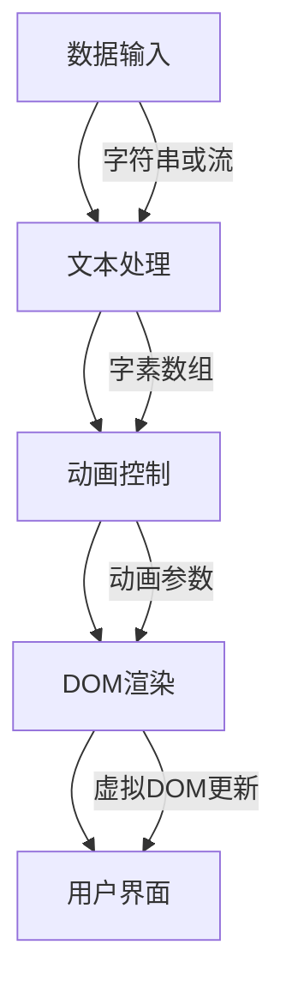
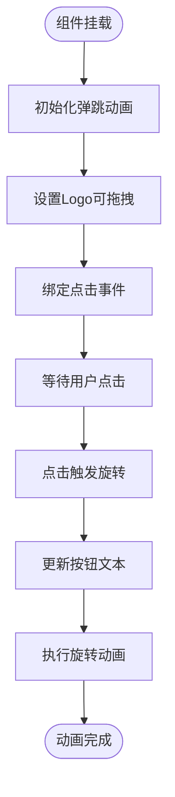
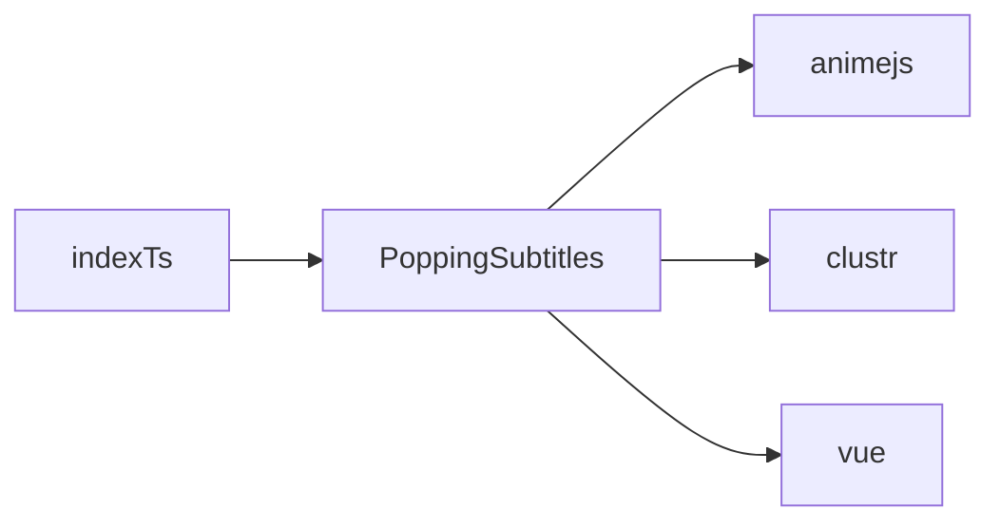

# PoppingSubtitles组件

<cite>
**本文档中引用的文件**  
- [PoppingSubtitles.web.vue](file://packages/stage-ui/src/components/widgets/PoppingSubtitles.web.vue)
- [PoppingSubtitles.web.story.vue](file://packages/stage-ui/src/components/widgets/PoppingSubtitles.web.story.vue)
- [PoppinText.web.vue](file://packages/stage-ui/src/components/widgets/poppin-text/PoppinText.web.vue)
- [index.ts](file://packages/stage-ui/src/components/widgets/index.ts)
</cite>

## 目录
1. [简介](#简介)
2. [项目结构](#项目结构)
3. [核心组件](#核心组件)
4. [架构概述](#架构概述)
5. [详细组件分析](#详细组件分析)
6. [依赖分析](#依赖分析)
7. [性能考虑](#性能考虑)
8. [故障排除指南](#故障排除指南)
9. [结论](#结论)

## 简介
PoppingSubtitles组件是Airi项目中用于实现动态字幕弹出效果的核心UI组件。该组件专为直播、语音交互等实时场景设计，能够与LLM输出流无缝集成，支持高频率字幕更新下的流畅渲染。通过结合文本分段、动画时序控制和状态管理机制，PoppingSubtitles实现了类似“kirakira dokidoki”的视觉效果，增强用户交互体验。

## 项目结构
PoppingSubtitles组件位于`packages/stage-ui`包的`src/components/widgets/`目录下，作为可复用的Vue 3组件实现。其结构遵循模块化设计原则，依赖于`animejs`进行动画控制，并通过`clustr`库处理复杂文本的字素分割。

```mermaid
graph TB
subgraph "UI组件"
PoppingSubtitles["PoppingSubtitles.web.vue"]
StoryFile["PoppingSubtitles.web.story.vue"]
IndexFile["index.ts"]
end
subgraph "依赖库"
AnimeJS["animejs"]
Clustr["clustr"]
end
PoppingSubtitles --> AnimeJS : "动画控制"
PoppingSubtitles --> Clustr : "文本分段"
StoryFile --> PoppingSubtitles : "故事书预览"
IndexFile --> PoppingSubtitles : "组件导出"
```

**Diagram sources**  
- [PoppingSubtitles.web.vue](file://packages/stage-ui/src/components/widgets/PoppingSubtitles.web.vue)
- [PoppingSubtitles.web.story.vue](file://packages/stage-ui/src/components/widgets/PoppingSubtitles.web.story.vue)
- [index.ts](file://packages/stage-ui/src/components/widgets/index.ts)

**Section sources**  
- [PoppingSubtitles.web.vue](file://packages/stage-ui/src/components/widgets/PoppingSubtitles.web.vue)
- [PoppingSubtitles.web.story.vue](file://packages/stage-ui/src/components/widgets/PoppingSubtitles.web.story.vue)

## 核心组件
PoppingSubtitles组件的核心功能依赖于其对文本流的处理能力与动画系统的集成。组件通过接收字符串或`ReadableStream<Uint8Array>`类型的输入，实现对实时字幕流的动态渲染。其内部状态管理机制确保在高频率更新下仍能保持性能稳定。

**Section sources**  
- [PoppingSubtitles.web.vue](file://packages/stage-ui/src/components/widgets/PoppingSubtitles.web.vue)
- [PoppinText.web.vue](file://packages/stage-ui/src/components/widgets/poppin-text/PoppinText.web.vue)

## 架构概述
PoppingSubtitles组件采用分层架构设计，分为数据输入层、文本处理层、动画控制层和渲染层。数据输入层支持静态文本和流式文本两种模式；文本处理层利用`Intl.Segmenter`和`clustr`库进行精确的字素（grapheme cluster）分割；动画控制层基于`animejs`实现可配置的弹出动画；渲染层则通过Vue的响应式系统驱动DOM更新。



**Diagram sources**  
- [PoppingSubtitles.web.vue](file://packages/stage-ui/src/components/widgets/PoppingSubtitles.web.vue)
- [PoppinText.web.vue](file://packages/stage-ui/src/components/widgets/poppin-text/PoppinText.web.vue)

## 详细组件分析
### PoppingSubtitles组件分析
PoppingSubtitles组件目前的实现主要作为占位符存在，其实际功能可能依赖于`PoppinText`组件。从现有代码结构来看，该组件计划实现拖拽、旋转和缩放等交互式动画效果，使用`animejs`的`animate`、`createDraggable`和`createSpring`功能。

#### 对于复杂逻辑组件：


**Diagram sources**  
- [PoppingSubtitles.web.vue](file://packages/stage-ui/src/components/widgets/PoppingSubtitles.web.vue)

**Section sources**  
- [PoppingSubtitles.web.vue](file://packages/stage-ui/src/components/widgets/PoppingSubtitles.web.vue)
- [PoppingSubtitles.web.story.vue](file://packages/stage-ui/src/components/widgets/PoppingSubtitles.web.story.vue)

### 与LLM输出流的集成
PoppingSubtitles组件设计上支持与LLM输出流的直接集成。通过接收`ReadableStream<Uint8Array>`类型的文本输入，组件能够在数据到达时逐步解析并显示字幕，实现“打字机”式的效果。此机制已在`PoppinText`组件中验证，PoppingSubtitles预期采用相同模式。

**Section sources**  
- [PoppinText.web.vue](file://packages/stage-ui/src/components/widgets/poppin-text/PoppinText.web.vue)

## 依赖分析
PoppingSubtitles组件依赖于多个外部库和内部模块。主要外部依赖包括`animejs`用于动画控制，`clustr`用于处理Unicode字素分割。内部依赖则通过`index.ts`统一导出，便于在其他模块中导入使用。



**Diagram sources**  
- [PoppingSubtitles.web.vue](file://packages/stage-ui/src/components/widgets/PoppingSubtitles.web.vue)
- [index.ts](file://packages/stage-ui/src/components/widgets/index.ts)

**Section sources**  
- [PoppingSubtitles.web.vue](file://packages/stage-ui/src/components/widgets/PoppingSubtitles.web.vue)
- [index.ts](file://packages/stage-ui/src/components/widgets/index.ts)

## 性能考虑
在高频率字幕更新场景下，PoppingSubtitles组件需采用性能优化策略。虽然当前实现未直接展示虚拟滚动或DOM复用机制，但其基于`PoppinText`的设计暗示了对增量更新的支持。通过仅对新增字素应用动画，避免全量重绘，可有效减少DOM操作开销。

此外，使用`AbortController`管理流读取生命周期，确保在组件卸载或文本更新时及时终止异步操作，防止内存泄漏。

**Section sources**  
- [PoppinText.web.vue](file://packages/stage-ui/src/components/widgets/poppin-text/PoppinText.web.vue)

## 故障排除指南
若PoppingSubtitles组件未正常显示动画效果，请检查以下几点：
1. 确保`animejs`和`clustr`已正确安装并导入。
2. 验证传入的文本流是否为有效的UTF-8编码字节流。
3. 检查浏览器是否支持`ReadableStream`和`Intl.Segmenter` API。
4. 确认组件未被重复使用同一`ReadableStream`实例，因流只能消费一次。

**Section sources**  
- [PoppingSubtitles.web.vue](file://packages/stage-ui/src/components/widgets/PoppingSubtitles.web.vue)
- [PoppinText.web.vue](file://packages/stage-ui/src/components/widgets/poppin-text/PoppinText.web.vue)

## 结论
PoppingSubtitles组件作为Airi项目中的动态字幕解决方案，具备与LLM流式输出集成的潜力。尽管当前实现较为基础，但其架构设计借鉴了成熟的`PoppinText`组件模式，支持文本分段、动画控制和流式处理。未来可通过引入虚拟滚动、CSS动画优化和Web Worker文本解析进一步提升性能，满足直播和语音交互等高实时性场景的需求。