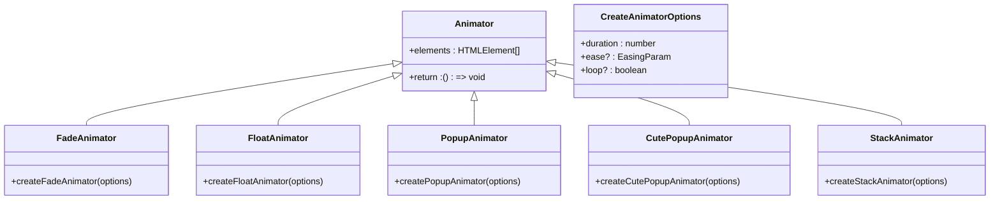

# 弹出式组件

<cite>
**Referenced Files in This Document**   
- [PoppinText.web.vue](file://packages/stage-ui/src/components/widgets/poppin-text/PoppinText.web.vue)
- [PoppingSubtitles.web.vue](file://packages/stage-ui/src/components/widgets/PoppingSubtitles.web.vue)
- [ColorPalette.vue](file://packages/stage-ui/src/components/widgets/ColorPalette.vue)
- [animators/index.ts](file://packages/stage-ui/src/components/widgets/poppin-text/animators/index.ts)
- [animators/fade.ts](file://packages/stage-ui/src/components/widgets/poppin-text/animators/fade.ts)
- [animators/float.ts](file://packages/stage-ui/src/components/widgets/poppin-text/animators/float.ts)
- [animators/popup.ts](file://packages/stage-ui/src/components/widgets/poppin-text/animators/popup.ts)
- [animators/scale-popup.ts](file://packages/stage-ui/src/components/widgets/poppin-text/animators/scale-popup.ts)
- [animators/stack.ts](file://packages/stage-ui/src/components/widgets/poppin-text/animators/stack.ts)
</cite>

## 目录
1. [简介](#简介)
2. [核心组件](#核心组件)
3. [动画配置与最佳实践](#动画配置与最佳实践)
4. [文本渲染优化](#文本渲染优化)
5. [Z-index管理与平滑过渡](#z-index管理与平滑过渡)

## 简介
弹出式组件是stage-ui库中的重要组成部分，用于创建动态、引人注目的内容展示效果。这些组件通过动画和视觉效果增强用户体验，特别适用于动态字幕、浮动文本和颜色选择器等场景。本文档详细介绍了PoppinText、PoppingSubtitles和ColorPalette三个核心组件的使用方法、属性配置和最佳实践。

## 核心组件

### PoppinText组件
PoppinText组件用于创建动态浮动文本效果，支持多种动画类型和流式文本输入。

**Props**
- `text`: 字符串或UTF-8编码的字节ReadableStream。如果提供流，不应重复使用。
- `textClass`: 应用于文本的CSS类，可以是字符串或字符串数组。
- `animator`: 动画函数，用于定义文本元素的动画行为。

**事件**
- `textSplit`: 当文本被分割成字素簇时触发，参数为分割后的字素。

**插槽**
- 无插槽，文本内容通过`text`属性传入。

**使用示例**
```vue
<PoppinText 
  :text="dynamicTextStream" 
  :animator="createFloatAnimator({ duration: 750 })"
/>
```

**Section sources**
- [PoppinText.web.vue](file://packages/stage-ui/src/components/widgets/poppin-text/PoppinText.web.vue)

### PoppingSubtitles组件
PoppingSubtitles组件用于创建弹出式字幕效果，通过动画库animejs实现复杂的动画序列。

**Props**
- 无特定props，组件内部包含预设的动画逻辑。

**事件**
- 无自定义事件。

**插槽**
- 无插槽。

**使用示例**
```vue
<PoppingSubtitles />
```

**Section sources**
- [PoppingSubtitles.web.vue](file://packages/stage-ui/src/components/widgets/PoppingSubtitles.web.vue)

### ColorPalette组件
ColorPalette组件用于展示颜色调色板，允许用户选择主题颜色。

**Props**
- `colors`: 颜色对象数组，每个对象包含`hex`（十六进制颜色值）和`name`（颜色名称）属性。

**事件**
- 无自定义事件。

**插槽**
- 无插槽。

**使用示例**
```vue
<ColorPalette :colors="themeColors" />
```

**Section sources**
- [ColorPalette.vue](file://packages/stage-ui/src/components/widgets/ColorPalette.vue)

## 动画配置与最佳实践

### 动画类型
PoppinText组件支持多种内置动画类型，通过导入相应的动画创建函数实现：



**Diagram sources**
- [animators/index.ts](file://packages/stage-ui/src/components/widgets/poppin-text/animators/index.ts)
- [animators/fade.ts](file://packages/stage-ui/src/components/widgets/poppin-text/animators/fade.ts)
- [animators/float.ts](file://packages/stage-ui/src/components/widgets/poppin-text/animators/float.ts)
- [animators/popup.ts](file://packages/stage-ui/src/components/widgets/poppin-text/animators/popup.ts)
- [animators/scale-popup.ts](file://packages/stage-ui/src/components/widgets/poppin-text/animators/scale-popup.ts)
- [animators/stack.ts](file://packages/stage-ui/src/components/widgets/poppin-text/animators/stack.ts)

### 动画配置选项
所有动画创建函数接受`CreateAnimatorOptions`对象作为参数：

- `duration`: 动画持续时间（毫秒）
- `ease`: 缓动函数
- `loop`: 是否循环播放

### 最佳实践
1. **性能优化**: 对于长文本，考虑使用流式输入而非一次性字符串，以实现渐进式渲染。
2. **动画选择**: 根据内容类型选择合适的动画：
   - `fade`: 适用于平滑出现效果
   - `float`: 适用于轻盈浮动效果
   - `popup`: 适用于弹出效果
   - `cute-popup`: 适用于可爱风格的弹出效果
   - `stack`: 适用于堆叠出现效果
3. **资源管理**: 动画创建函数返回清理函数，确保在组件销毁时正确清理动画资源。

## 文本渲染优化

### 字素簇分割
PoppinText组件使用`Intl.Segmenter` API和`clustr`库正确分割Unicode字素簇，确保复杂文本（如表情符号、组合字符）被正确处理。


**Diagram sources**
- [PoppinText.web.vue](file://packages/stage-ui/src/components/widgets/poppin-text/PoppinText.web.vue)

### 流式处理
对于动态生成的文本内容，推荐使用ReadableStream实现流式处理，提供更流畅的用户体验。

## Z-index管理与平滑过渡

### Z-index策略
虽然这些组件本身不直接管理Z-index，但在使用时应注意：
1. 确保弹出式内容位于其他UI元素之上
2. 使用CSS变量和主题系统统一管理层级关系
3. 避免过度使用高Z-index值，保持层级结构清晰

### 平滑过渡
通过animejs库实现的动画确保了平滑的视觉过渡效果：


**Diagram sources**
- [PoppinText.web.vue](file://packages/stage-ui/src/components/widgets/poppin-text/PoppinText.web.vue)
- [PoppingSubtitles.web.vue](file://packages/stage-ui/src/components/widgets/PoppingSubtitles.web.vue)

### 最佳实践
1. **动画协调**: 当多个弹出式组件同时出现时，使用适当的延迟创建协调的动画效果。
2. **资源清理**: 确保在组件销毁或属性变化时正确清理之前的动画。
3. **性能监控**: 对于复杂的动画序列，监控性能并根据需要调整动画参数。