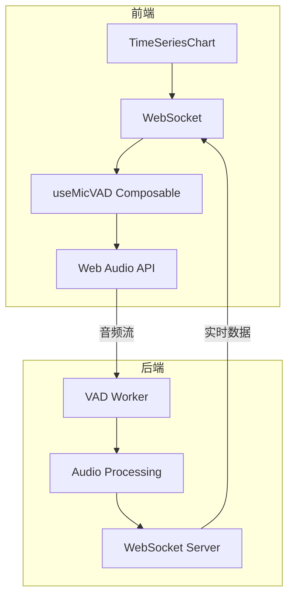
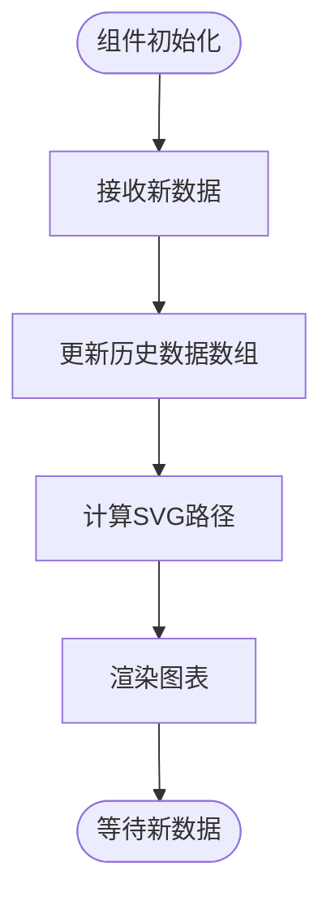
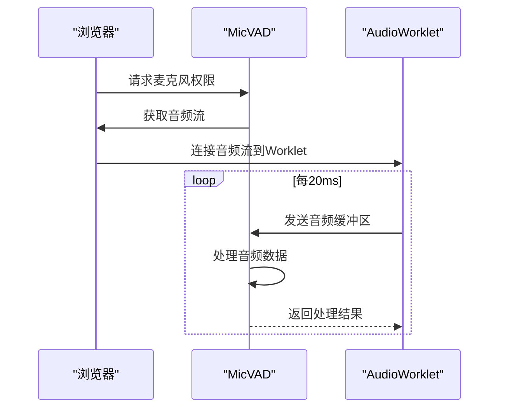
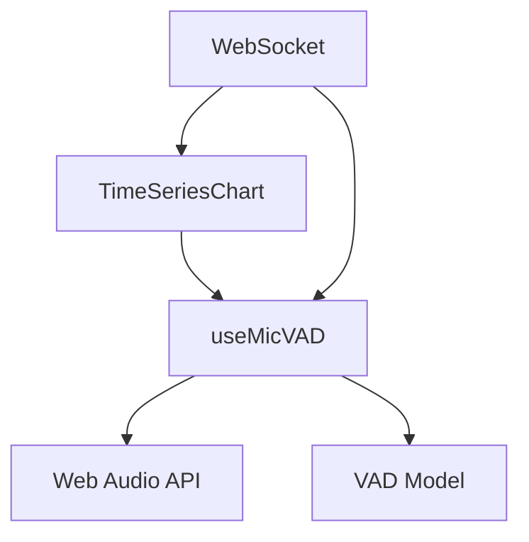

# 时序数据图表

<cite>
**Referenced Files in This Document**   
- [TimeSeriesChart.vue](file://packages/stage-ui/src/components/gadgets/TimeSeriesChart.vue)
- [micvad.ts](file://packages/stage-ui/src/composables/micvad.ts)
- [vad.ts](file://packages/stage-ui/src/libs/audio/vad.ts)
- [events.ts](file://packages/server-shared/src/types/websocket/events.ts)
- [index.ts](file://packages/stage-ui/src/workers/vad/index.ts)
- [manager.ts](file://packages/stage-ui/src/workers/vad/manager.ts)
</cite>

## 目录
1. [简介](#简介)
2. [核心组件](#核心组件)
3. [架构概述](#架构概述)
4. [详细组件分析](#详细组件分析)
5. [依赖分析](#依赖分析)
6. [性能考虑](#性能考虑)
7. [故障排除指南](#故障排除指南)
8. [结论](#结论)

## 简介
本文档详细介绍了时序数据图表组件的实现与使用，重点关注`TimeSeriesChart`组件。该组件专为可视化随时间变化的数据流而设计，适用于语音活动检测（VAD）结果、情绪波动、系统资源使用趋势等场景。文档将深入探讨其配置选项、数据绑定机制、渲染性能优化策略，并提供实际应用示例，展示如何将VAD输出、LLM响应延迟或游戏代理行为日志进行可视化。

## 核心组件

`TimeSeriesChart`组件是本系统的核心，负责将时间序列数据以直观的图表形式呈现。它通过接收历史数据数组和当前值，动态渲染出平滑的曲线图，并支持阈值线、活动状态指示器和数据区域填充等视觉元素。该组件利用SVG进行渲染，确保了在不同分辨率下的清晰度和性能。

**Section sources**
- [TimeSeriesChart.vue](file://packages/stage-ui/src/components/gadgets/TimeSeriesChart.vue#L27-L68)

## 架构概述

整个系统围绕实时数据采集、处理和可视化构建。语音活动检测（VAD）模块负责从麦克风流中实时检测语音活动，将原始音频数据转换为0到1之间的概率值。这些值通过WebSocket实时传输到前端，由`TimeSeriesChart`组件接收并更新其历史数据，从而实现动态图表更新。

**Diagram sources **
- [TimeSeriesChart.vue](file://packages/stage-ui/src/components/gadgets/TimeSeriesChart.vue)
- [micvad.ts](file://packages/stage-ui/src/composables/micvad.ts)
- [events.ts](file://packages/server-shared/src/types/websocket/events.ts)

## 详细组件分析

### TimeSeriesChart 组件分析

`TimeSeriesChart`是一个Vue组件，通过props接收配置和数据。其主要功能包括：
- **数据绑定**：通过`history`和`currentValue` props接收时间序列数据。
- **视觉配置**：支持自定义标题、子标题、颜色、线条宽度、阈值线等。
- **动态渲染**：使用SVG路径元素绘制平滑曲线，并根据数据动态更新。

#### 配置项
| 配置项 | 类型 | 描述 |
| --- | --- | --- |
| `history` | `Readonly<number[]>` | 历史数据数组（归一化0-1） |
| `currentValue` | `number` | 当前值（0-1） |
| `threshold` | `number \| null` | 阈值（0-1） |
| `isActive` | `boolean` | 当前状态是否为“活动” |
| `title` | `string` | 图表标题 |
| `height` | `number` | 图表高度（像素） |

#### 数据绑定机制
组件通过Vue的响应式系统监听`history`数组的变化。当新数据点被添加到数组中时，组件会重新计算SVG路径，并触发视图更新。为了优化性能，组件使用了防抖和节流技术，避免在高频数据更新时造成不必要的重绘。

**Diagram sources **
- [TimeSeriesChart.vue](file://packages/stage-ui/src/components/gadgets/TimeSeriesChart.vue#L27-L68)

**Section sources**
- [TimeSeriesChart.vue](file://packages/stage-ui/src/components/gadgets/TimeSeriesChart.vue#L0-L345)

### 语音活动检测（VAD）模块分析

VAD模块负责实时检测语音活动，是数据源的关键部分。它利用Web Audio API和机器学习模型来分析音频流，输出语音活动的概率。

#### 实现细节
- **音频采集**：通过`navigator.mediaDevices.getUserMedia`获取麦克风权限和音频流。
- **音频处理**：使用AudioWorklet在独立线程中处理音频数据，避免阻塞主线程。
- **模型推理**：集成预训练的VAD模型，对音频帧进行实时推理。

**Diagram sources **
- [micvad.ts](file://packages/stage-ui/src/composables/micvad.ts#L9-L73)
- [vad.ts](file://packages/stage-ui/src/libs/audio/vad.ts#L0-L161)

**Section sources**
- [micvad.ts](file://packages/stage-ui/src/composables/micvad.ts#L0-L74)
- [vad.ts](file://packages/stage-ui/src/libs/audio/vad.ts#L0-L161)

## 依赖分析

系统各组件之间存在紧密的依赖关系。`TimeSeriesChart`组件依赖于`useMicVAD` composable来获取实时数据，而`useMicVAD`又依赖于Web Audio API和VAD模型。WebSocket作为数据传输的桥梁，连接了前端和后端。

**Diagram sources **
- [TimeSeriesChart.vue](file://packages/stage-ui/src/components/gadgets/TimeSeriesChart.vue)
- [micvad.ts](file://packages/stage-ui/src/composables/micvad.ts)
- [events.ts](file://packages/server-shared/src/types/websocket/events.ts)

**Section sources**
- [TimeSeriesChart.vue](file://packages/stage-ui/src/components/gadgets/TimeSeriesChart.vue)
- [micvad.ts](file://packages/stage-ui/src/composables/micvad.ts)
- [events.ts](file://packages/server-shared/src/types/websocket/events.ts)

## 性能考虑

为了确保在大数据量下的流畅性能，系统采用了多种优化策略：
- **Canvas帧率优化**：使用requestAnimationFrame确保图表更新与屏幕刷新率同步。
- **动态缩放与平移**：支持用户交互式缩放和平移，仅渲染可见区域的数据。
- **数据采样**：对于长时间跨度的数据，采用降采样技术减少渲染负担。

## 故障排除指南

常见问题及解决方案：
- **图表不更新**：检查WebSocket连接状态，确保数据流正常。
- **音频采集失败**：确认用户已授予麦克风权限，检查设备ID是否正确。
- **性能下降**：减少数据更新频率，或启用数据采样。

**Section sources**
- [micvad.ts](file://packages/stage-ui/src/composables/micvad.ts#L0-L74)
- [vad.ts](file://packages/stage-ui/src/libs/audio/vad.ts#L0-L161)

## 结论

`TimeSeriesChart`组件提供了一个强大而灵活的解决方案，用于可视化随时间变化的数据流。通过与VAD模块和WebSocket的集成，它能够实现实时、高性能的数据展示。未来的工作可以包括支持更多图表类型、增强交互功能和优化移动端体验。