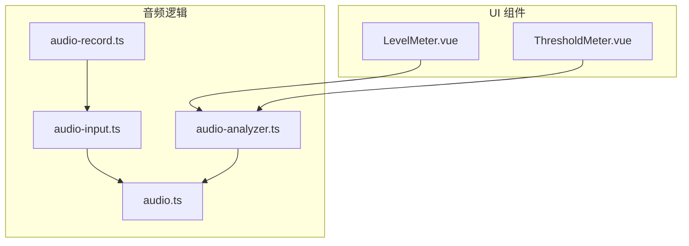
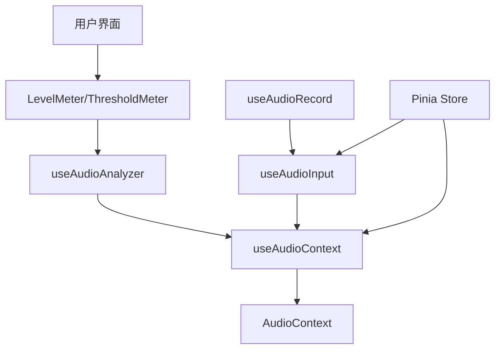
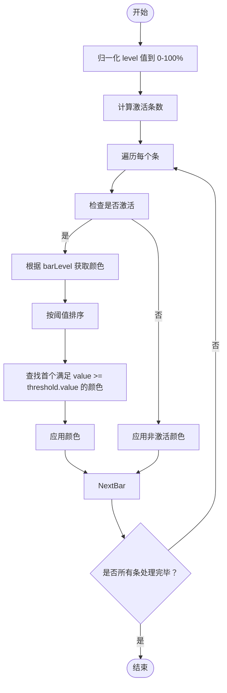
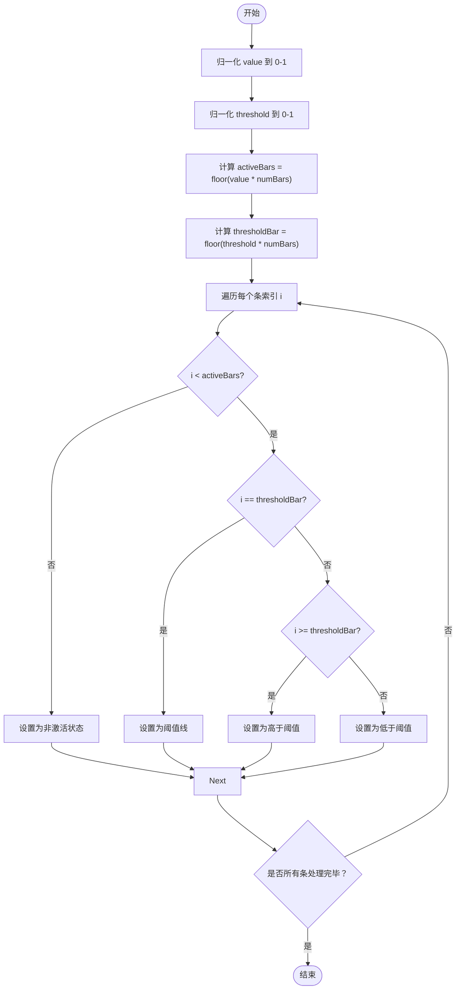
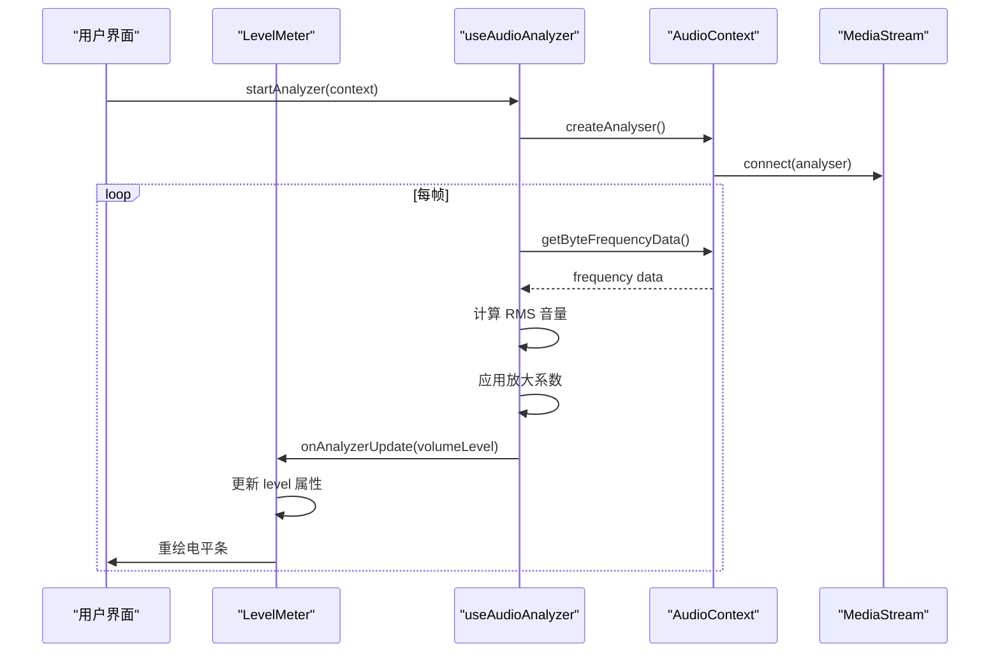
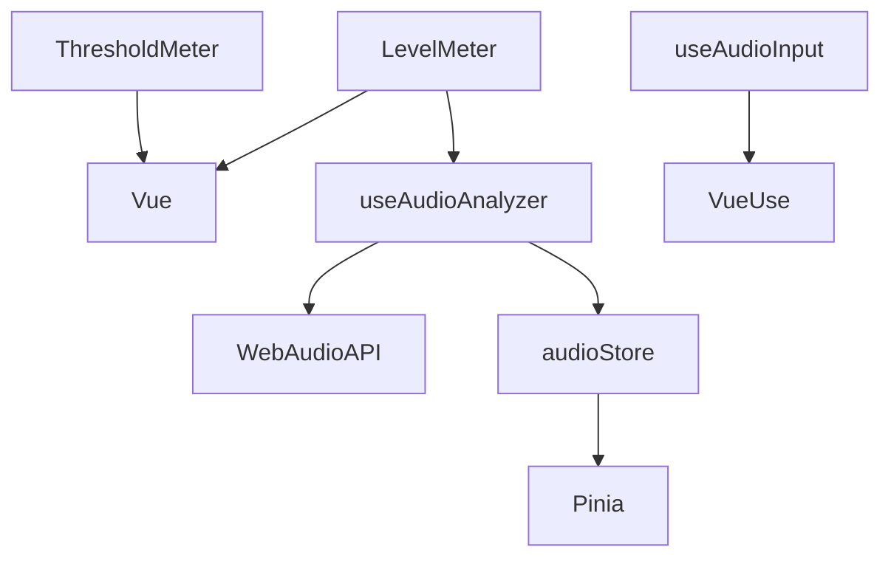

# 电平指示器组件

<cite>
**本文档中引用的文件**  
- [LevelMeter.vue](file://packages/stage-ui/src/components/gadgets/LevelMeter.vue)
- [ThresholdMeter.vue](file://packages/stage-ui/src/components/gadgets/ThresholdMeter.vue)
- [audio.ts](file://packages/stage-ui/src/stores/audio.ts)
- [audio-analyzer.ts](file://packages/stage-ui/src/composables/audio/audio-analyzer.ts)
- [audio-input.ts](file://apps/stage-web/src/composables/audio-input.ts)
- [audio-record.ts](file://apps/stage-web/src/composables/audio-record.ts)
</cite>

## 目录
1. [简介](#简介)
2. [项目结构](#项目结构)
3. [核心组件](#核心组件)
4. [架构概述](#架构概述)
5. [详细组件分析](#详细组件分析)
6. [依赖分析](#依赖分析)
7. [性能考虑](#性能考虑)
8. [故障排除指南](#故障排除指南)
9. [结论](#结论)

## 简介
本文档详细介绍了电平指示器组件 `LevelMeter` 和 `ThresholdMeter` 的设计与实现，重点阐述其在系统状态监控和音频信号强度可视化中的应用。文档涵盖组件属性、事件机制、样式定制、响应式设计、动画配置、阈值逻辑实现以及与 Pinia 状态管理的集成方式，适用于桌面应用和 Web 界面开发。

## 项目结构
电平指示器组件位于 `packages/stage-ui` 包的 `gadgets` 目录下，作为可复用 UI 组件提供。音频数据采集与处理逻辑分布在 `composables` 和 `stores` 模块中，通过组合式 API 实现跨组件状态共享。

**Diagram sources**
- [LevelMeter.vue](file://packages/stage-ui/src/components/gadgets/LevelMeter.vue)
- [ThresholdMeter.vue](file://packages/stage-ui/src/components/gadgets/ThresholdMeter.vue)
- [audio-analyzer.ts](file://packages/stage-ui/src/composables/audio/audio-analyzer.ts)
- [audio.ts](file://packages/stage-ui/src/stores/audio.ts)
- [audio-input.ts](file://apps/stage-web/src/composables/audio-input.ts)

**Section sources**
- [LevelMeter.vue](file://packages/stage-ui/src/components/gadgets/LevelMeter.vue)
- [ThresholdMeter.vue](file://packages/stage-ui/src/components/gadgets/ThresholdMeter.vue)
- [audio-analyzer.ts](file://packages/stage-ui/src/composables/audio/audio-analyzer.ts)

## 核心组件
`LevelMeter` 和 `ThresholdMeter` 是用于可视化数值变化的 UI 组件，广泛应用于音量显示、资源使用率监控和情绪强度反馈等场景。两者均支持动态数据绑定、颜色阈值配置和动画过渡效果。

**Section sources**
- [LevelMeter.vue](file://packages/stage-ui/src/components/gadgets/LevelMeter.vue)
- [ThresholdMeter.vue](file://packages/stage-ui/src/components/gadgets/ThresholdMeter.vue)

## 架构概述
系统采用分层架构，UI 组件层负责渲染电平指示器，组合式函数层处理音频分析与设备管理，状态管理层（Pinia）统一管理音频上下文和用户设备状态。组件通过事件回调和响应式数据实现与外部系统的集成。

**Diagram sources**
- [audio-analyzer.ts](file://packages/stage-ui/src/composables/audio/audio-analyzer.ts)
- [audio.ts](file://packages/stage-ui/src/stores/audio.ts)
- [audio-input.ts](file://apps/stage-web/src/composables/audio-input.ts)

## 详细组件分析

### LevelMeter 组件分析
`LevelMeter` 组件通过条形图形式显示当前电平值，支持自定义最小值、最大值、条数、单位、颜色阈值和动画速度。

#### 属性说明
- **level**: 当前电平值
- **min/max**: 数值范围
- **numBars**: 显示的条数
- **label/unit**: 标签与单位
- **colorThresholds**: 颜色阈值数组，定义不同区间的显示颜色
- **formatValue**: 自定义数值格式化函数

#### 颜色逻辑
组件根据 `colorThresholds` 配置动态计算每个条的颜色，优先匹配首个满足条件的阈值。

**Diagram sources**
- [LevelMeter.vue](file://packages/stage-ui/src/components/gadgets/LevelMeter.vue)

**Section sources**
- [LevelMeter.vue](file://packages/stage-ui/src/components/gadgets/LevelMeter.vue)

### ThresholdMeter 组件分析
`ThresholdMeter` 在 `LevelMeter` 基础上增加了阈值指示功能，可区分低于阈值、高于阈值和阈值线本身的状态。

#### 属性说明
- **value**: 当前值（0-1 或自定义范围）
- **threshold**: 阈值（0-1 或自定义范围）
- **belowThresholdClass/aboveThresholdClass**: 阈值下/上区域的 CSS 类
- **thresholdBarClass**: 阈值线的 CSS 类
- **showLegend**: 是否显示图例

#### 状态逻辑
组件计算归一化后的值和阈值，确定每个条的状态：低于阈值、高于阈值或为阈值线。

**Diagram sources**
- [ThresholdMeter.vue](file://packages/stage-ui/src/components/gadgets/ThresholdMeter.vue)

**Section sources**
- [ThresholdMeter.vue](file://packages/stage-ui/src/components/gadgets/ThresholdMeter.vue)

### 音频分析与集成
电平指示器通常与音频输入结合使用，通过 `useAudioAnalyzer` 实现音量实时监测。

#### 音频分析流程

**Diagram sources**
- [audio-analyzer.ts](file://packages/stage-ui/src/composables/audio/audio-analyzer.ts)
- [LevelMeter.vue](file://packages/stage-ui/src/components/gadgets/LevelMeter.vue)

**Section sources**
- [audio-analyzer.ts](file://packages/stage-ui/src/composables/audio/audio-analyzer.ts)

## 依赖分析
电平指示器组件依赖 Vue 3 组合式 API 和 Pinia 状态管理，通过 `@vueuse/core` 提供设备访问能力，音频处理基于 Web Audio API。

**Diagram sources**
- [go.mod](file://package.json)
- [LevelMeter.vue](file://packages/stage-ui/src/components/gadgets/LevelMeter.vue)
- [audio-analyzer.ts](file://packages/stage-ui/src/composables/audio/audio-analyzer.ts)
- [audio.ts](file://packages/stage-ui/src/stores/audio.ts)

**Section sources**
- [package.json](file://package.json)

## 性能考虑
- **动画性能**: 使用 CSS `transition-all` 和 `duration-*` 类实现平滑动画，避免频繁 DOM 操作。
- **音频分析**: 通过 `requestAnimationFrame` 控制分析频率，避免过度计算。
- **内存管理**: 组件卸载时自动清理 `AudioContext` 和动画帧，防止内存泄漏。
- **数据归一化**: 提供线性与 Min-Max 两种归一化模式，适应不同音频特征。

## 故障排除指南
常见问题及解决方案：

| 问题现象 | 可能原因 | 解决方案 |
|--------|--------|--------|
| 电平无反应 | 未启动音频分析 | 调用 `startAnalyzer(audioContext)` |
| 音频权限未获取 | 浏览器阻止麦克风访问 | 调用 `askPermission()` 并确保用户授权 |
| 显示值异常 | 归一化范围不匹配 | 检查 `min`/`max` 与实际数据范围 |
| 内存泄漏 | 组件销毁后分析仍在运行 | 确保 `onUnmounted` 正确清理资源 |

**Section sources**
- [audio-analyzer.ts](file://packages/stage-ui/src/composables/audio/audio-analyzer.ts)
- [audio.ts](file://packages/stage-ui/src/stores/audio.ts)
- [audio-input.ts](file://apps/stage-web/src/composables/audio-input.ts)

## 结论
`LevelMeter` 和 `ThresholdMeter` 组件提供了灵活、可定制的电平可视化解决方案，适用于多种监控场景。通过与音频分析模块和 Pinia 状态管理的深度集成，能够实现高性能、响应式的实时数据展示。建议在使用时结合具体业务需求配置阈值和样式，并注意音频权限管理和资源释放。