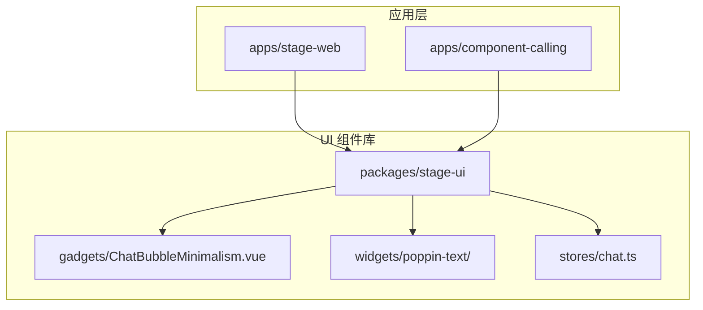
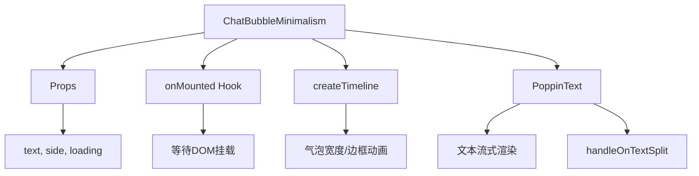
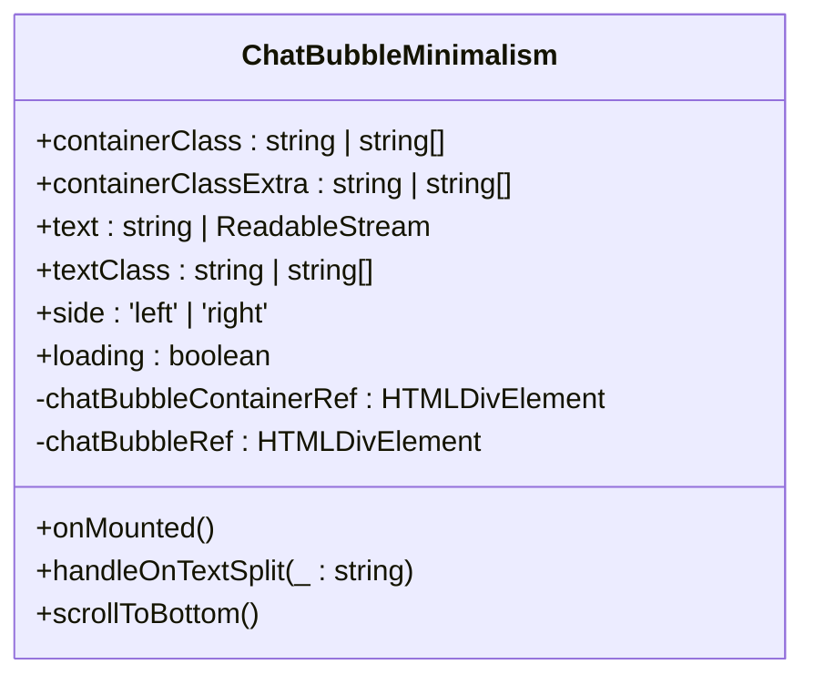
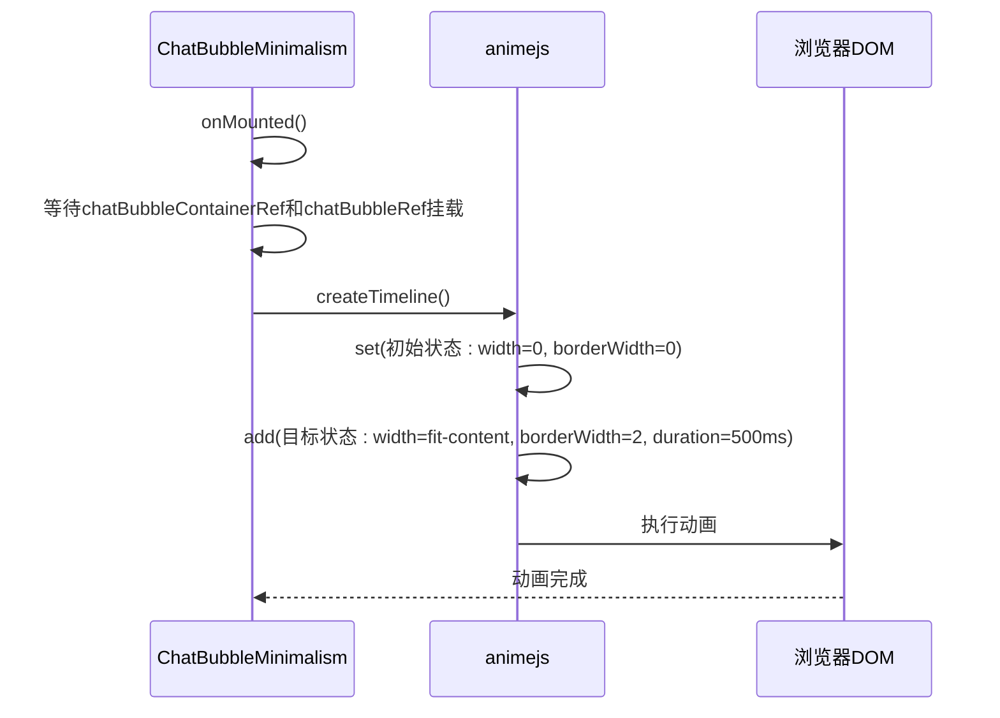

# 聊天交互可视化

<cite>
**本文档引用文件**  
- [ChatBubbleMinimalism.vue](file://packages/stage-ui/src/components/gadgets/ChatBubbleMinimalism.vue)
- [ChatBubbleMinimalism.story.vue](file://packages/stage-ui/src/components/gadgets/ChatBubbleMinimalism.story.vue)
- [chat.ts](file://packages/stage-ui/src/types/chat.ts)
- [queues.ts](file://packages/stage-ui/src/composables/queues.ts)
- [chat.ts](file://packages/ccc/src/utils/chat.ts)
- [mcp.ts](file://packages/stage-ui/src/tools/mcp.ts)
- [index.ts](file://packages/tauri-plugin-mcp/src/index.ts)
- [lib.rs](file://crates/tauri-plugin-mcp/src/lib.rs)
- [chat-message.ts](file://services/telegram-bot/src/models/chat-message.ts)
</cite>

## 目录
1. [简介](#简介)
2. [项目结构](#项目结构)
3. [核心组件](#核心组件)
4. [架构概述](#架构概述)
5. [详细组件分析](#详细组件分析)
6. [依赖分析](#依赖分析)
7. [性能考虑](#性能考虑)
8. [故障排除指南](#故障排除指南)
9. [结论](#结论)

## 简介
本文件详细介绍了轻量化聊天界面中的核心可视化组件——`ChatBubbleMinimalism`。该组件专为实现简洁高效的聊天展示而设计，适用于Discord/Telegram机器人界面及虚拟角色对话系统。文档涵盖其属性配置、动画效果、主题定制能力、可访问性支持、多语言处理、表情符号渲染，以及与消息队列和实时通信协议（如MCP）的集成方式。

## 项目结构
`ChatBubbleMinimalism` 组件位于 `packages/stage-ui` 包的 `src/components/gadgets/` 目录下，是 `stage-ui` 库中众多可视化小工具之一。该库被多个上层应用（如 `apps/stage-web` 和 `apps/component-calling`）所引用，体现了其作为共享UI组件的设计理念。



**Diagram sources**
- [ChatBubbleMinimalism.vue](file://packages/stage-ui/src/components/gadgets/ChatBubbleMinimalism.vue)
- [index.ts](file://packages/stage-ui/src/components/index.ts)

**Section sources**
- [ChatBubbleMinimalism.vue](file://packages/stage-ui/src/components/gadgets/ChatBubbleMinimalism.vue)

## 核心组件
`ChatBubbleMinimalism` 组件是轻量化聊天界面的核心，其设计重点在于极简的视觉风格和流畅的用户体验。它通过属性控制消息内容、发送者方向、加载状态，并利用动画库实现气泡的平滑展开效果。

**Section sources**
- [ChatBubbleMinimalism.vue](file://packages/stage-ui/src/components/gadgets/ChatBubbleMinimalism.vue)
- [ChatBubbleMinimalism.story.vue](file://packages/stage-ui/src/components/gadgets/ChatBubbleMinimalism.story.vue)

## 架构概述
该组件的架构遵循Vue 3的组合式API设计，将UI渲染、动画逻辑和生命周期管理分离。其核心依赖于 `animejs` 库来创建时间线动画，并通过 `PoppinText` 组件处理文本的流式渲染和分割。



**Diagram sources**
- [ChatBubbleMinimalism.vue](file://packages/stage-ui/src/components/gadgets/ChatBubbleMinimalism.vue)

## 详细组件分析

### ChatBubbleMinimalism 分析
`ChatBubbleMinimalism` 组件通过其简洁的API和强大的动画效果，为开发者提供了构建现代聊天界面的基础。

#### 属性与配置
该组件通过 `defineProps` 定义了其可配置属性，支持高度定制化。



**Diagram sources**
- [ChatBubbleMinimalism.vue](file://packages/stage-ui/src/components/gadgets/ChatBubbleMinimalism.vue)

#### 动画效果
组件的动画效果是其核心亮点。在 `onMounted` 钩子中，它使用 `animejs` 的 `createTimeline` 创建了一个动画时间线。当组件首次渲染时，气泡会从宽度为0的状态平滑地展开到其最终尺寸，同时边框和内边距也同步出现，创造出一种“生长”的视觉效果。



**Diagram sources**
- [ChatBubbleMinimalism.vue](file://packages/stage-ui/src/components/gadgets/ChatBubbleMinimalism.vue)

#### 主题定制与可访问性
组件通过 `UnoCSS` 的原子化CSS类实现了主题定制，支持通过 `containerClass` 和 `textClass` 属性覆盖默认样式。其结构化的HTML标签（如 `div` 和 `ref`）为屏幕阅读器提供了清晰的语义信息，确保了良好的可访问性。

**Section sources**
- [ChatBubbleMinimalism.vue](file://packages/stage-ui/src/components/gadgets/ChatBubbleMinimalism.vue)
- [ChatBubbleMinimalism.story.vue](file://packages/stage-ui/src/components/gadgets/ChatBubbleMinimalism.story.vue)

### 消息处理与队列系统
`ChatBubbleMinimalism` 通常与消息队列系统协同工作，以处理复杂的对话逻辑。

#### 情感与延迟处理
`useEmotionsMessageQueue` 和 `useDelayMessageQueue` 这两个组合式函数，展示了如何处理包含情感标记（如 `<|EMOTION:happy|>`）或延迟指令（如 `<|DELAY:2|>`）的特殊消息。它们通过正则表达式解析消息内容，并在消息队列中插入相应的处理逻辑。

```mermaid
flowchart TD
Start([接收消息]) --> Parse{"解析消息内容"}
Parse --> |包含<|DELAY:...|>| Delay["等待指定秒数"]
Parse --> |包含情感标记| EnqueueEmotion["将情感加入情绪队列"]
Parse --> |普通文本| ProcessText["正常处理文本"]
Delay --> ProcessText
EnqueueEmotion --> ProcessText
ProcessText --> EmitText["触发文本输出事件"]
EmitText --> End([结束])
```

**Diagram sources**
- [queues.ts](file://packages/stage-ui/src/composables/queues.ts#L13-L103)

#### 多语言与表情符号
项目中的 `i18n` 包提供了完整的多语言支持，而 `ChatBubbleMinimalism` 通过直接渲染文本内容，天然支持Unicode字符，包括各种语言文字和表情符号。`chat-message.ts` 文件中的 `recordMessage` 函数展示了如何处理Telegram中的文本、图片和贴纸消息，确保了不同类型内容的正确解析和存储。

**Section sources**
- [queues.ts](file://packages/stage-ui/src/composables/queues.ts)
- [chat-message.ts](file://services/telegram-bot/src/models/chat-message.ts)

## 依赖分析
`ChatBubbleMinimalism` 组件的依赖关系清晰，主要依赖于 `stage-ui` 内部的其他组件和工具。

```mermaid
graph TD
A[ChatBubbleMinimalism] --> B[PoppinText]
A --> C[animejs]
A --> D[@vueuse/core]
B --> E[createFadeAnimator]
C --> F[createTimeline]
D --> G[until, nextTick]
```

**Diagram sources**
- [ChatBubbleMinimalism.vue](file://packages/stage-ui/src/components/gadgets/ChatBubbleMinimalism.vue)

**Section sources**
- [ChatBubbleMinimalism.vue](file://packages/stage-ui/src/components/gadgets/ChatBubbleMinimalism.vue)

## 性能考虑
组件的性能优化体现在动画的使用上。通过 `will-change-max-height` 和 `will-change-max-width` CSS属性，提示浏览器对这些属性进行硬件加速，从而确保动画的流畅性。同时，`overflow-y-auto` 和 `scrollbar-none` 确保了长消息的可滚动性，而不会出现滚动条干扰视觉。

## 故障排除指南
若 `ChatBubbleMinimalism` 的动画未生效，请检查：
1.  `animejs` 库是否已正确安装并导入。
2.  `onMounted` 钩子是否成功获取了 `chatBubbleRef` 的DOM引用。
3.  浏览器控制台是否有JavaScript错误。

**Section sources**
- [ChatBubbleMinimalism.vue](file://packages/stage-ui/src/components/gadgets/ChatBubbleMinimalism.vue)

## 结论
`ChatBubbleMinimalism` 是一个设计精良、功能强大的轻量化聊天气泡组件。它不仅提供了美观的视觉效果和流畅的动画，还通过与消息队列、MCP协议和多语言系统的深度集成，展现了其在复杂对话系统中的强大适应能力。其模块化的设计使其易于在Discord、Telegram机器人或虚拟角色对话系统中复用，是构建现代聊天界面的理想选择。