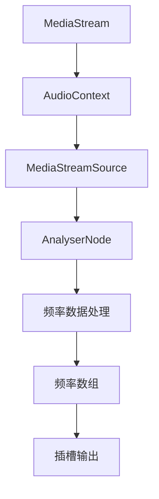
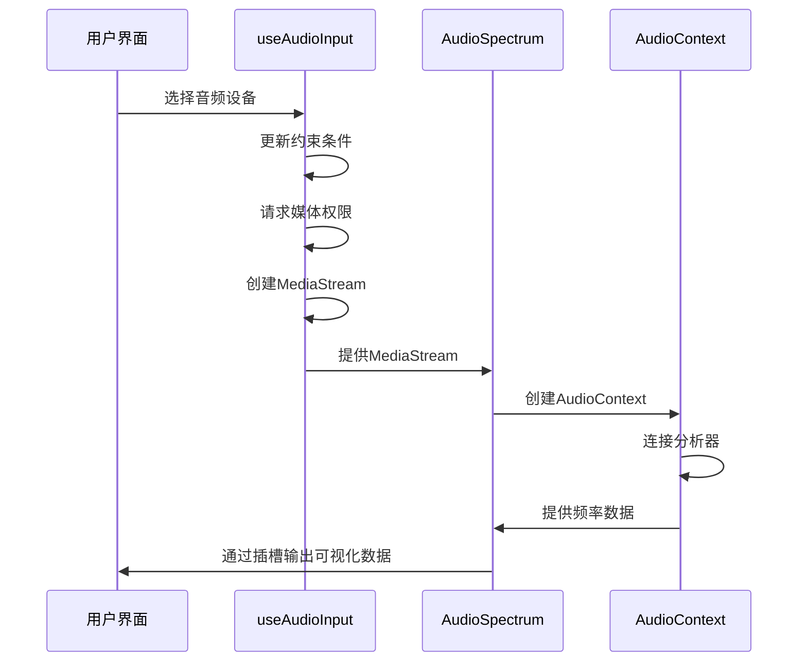
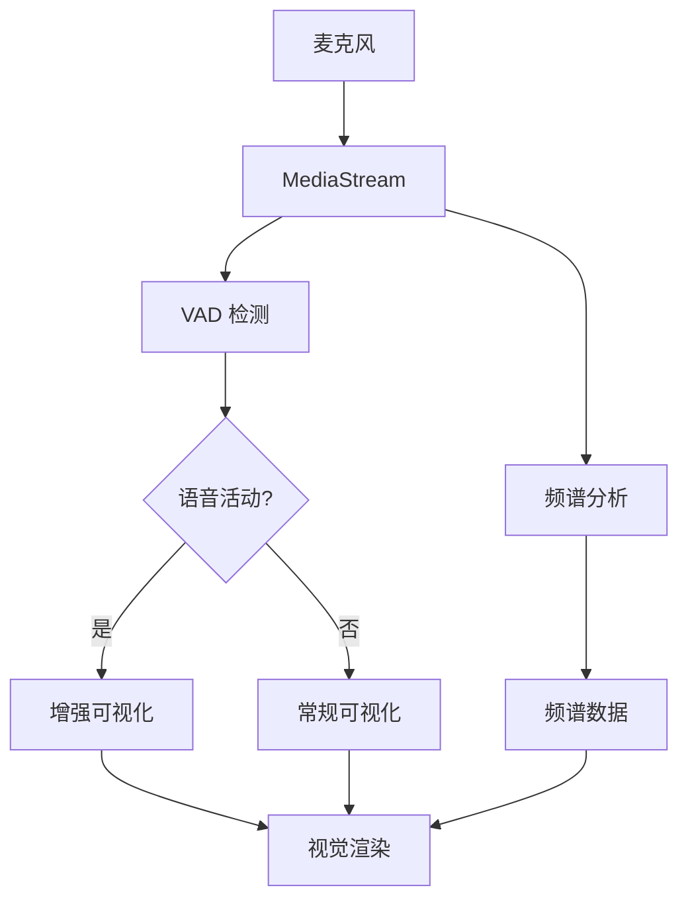

# 音频可视化组件

<cite>
**Referenced Files in This Document**  
- [AudioSpectrum.vue](file://packages/stage-ui/src/components/gadgets/AudioSpectrum.vue)
- [AudioSpectrumVisualizer.vue](file://packages/stage-ui/src/components/gadgets/AudioSpectrumVisualizer.vue)
- [audio-input.ts](file://apps/stage-web/src/composables/audio-input.ts)
- [micvad.ts](file://packages/stage-ui/src/composables/micvad.ts)
</cite>

## 目录
1. [简介](#简介)
2. [核心组件分析](#核心组件分析)
3. [架构与集成](#架构与集成)
4. [性能优化建议](#性能优化建议)
5. [最佳实践](#最佳实践)
6. [结论](#结论)

## 简介
本文档详细介绍了音频可视化系统中的核心组件：`AudioSpectrum` 和 `AudioSpectrumVisualizer`。这些组件利用 Web Audio API 实现了实时音频处理中的声谱和波形可视化功能，为用户提供直观的音频反馈体验。文档将深入解析组件的属性配置、事件机制、插槽使用方式，并提供与音频输入管理、语音活动检测（VAD）等模块的集成方案。

## 核心组件分析

### AudioSpectrum 组件
`AudioSpectrum` 是一个基于 Vue 3 的组合式组件，负责从媒体流中提取音频频谱数据。该组件通过 Web Audio API 创建音频上下文、分析器节点，并对音频数据进行频率域分析。

组件接收 `MediaStream` 作为输入源，允许配置频谱分析的参数，包括频谱条数量（bars）、最小频率（minFreq）和最大频率（maxFreq）。组件内部实现了频率数据的动态更新机制，通过 `requestAnimationFrame` 持续获取分析器的字节频率数据，并根据配置的频率范围进行数据聚合和归一化处理。

组件通过插槽（slot）机制将处理后的频率数据暴露给父组件，实现了高度的可定制性，允许开发者根据实际需求设计不同的可视化表现形式。

**Section sources**
- [AudioSpectrum.vue](file://packages/stage-ui/src/components/gadgets/AudioSpectrum.vue#L1-L85)

### AudioSpectrumVisualizer 组件
`AudioSpectrumVisualizer` 组件负责将 `AudioSpectrum` 提供的频率数据转换为可视化的频谱条形图。该组件接收频率数组作为 prop，并通过计算每个频段的相对高度来渲染动态变化的视觉效果。

组件实现了频率响应的非线性映射，通过 `getReductionFactor` 函数对不同频率范围应用不同的衰减因子，模拟人耳对不同频率的感知特性。低频部分应用更大的衰减，而高频部分保留更多原始信息，从而产生更自然的视觉效果。

视觉渲染采用 CSS 过渡动画实现平滑的动态效果，通过 `transition` 属性确保频谱条的高度变化流畅自然。组件支持通过 `barsClass` prop 自定义频谱条的样式，提供了灵活的外观定制能力。

**Section sources**
- [AudioSpectrumVisualizer.vue](file://packages/stage-ui/src/components/gadgets/AudioSpectrumVisualizer.vue#L1-L30)

## 架构与集成

### Web Audio API 集成
`AudioSpectrum` 组件通过标准的 Web Audio API 流程实现音频分析：
1. 创建 `AudioContext` 实例
2. 使用 `createMediaStreamSource` 将媒体流连接到音频图
3. 创建 `AnalyserNode` 进行实时音频分析
4. 配置分析器的 `fftSize` 参数（默认 2048）以控制频率分辨率
5. 通过 `getByteFrequencyData` 方法获取实时频谱数据



**Diagram sources**
- [AudioSpectrum.vue](file://packages/stage-ui/src/components/gadgets/AudioSpectrum.vue#L1-L85)

### 音频输入管理集成
`audio-input.ts` 组合式函数提供了完整的音频输入设备管理功能，包括设备列表获取、权限请求、设备选择和媒体流控制。`AudioSpectrum` 组件可以与该模块无缝集成，通过 `selectedAudioInputId` 和 `media` 对象获取有效的音频输入流。



**Diagram sources**
- [audio-input.ts](file://apps/stage-web/src/composables/audio-input.ts#L1-L83)
- [AudioSpectrum.vue](file://packages/stage-ui/src/components/gadgets/AudioSpectrum.vue#L1-L85)

### 语音活动检测（VAD）集成
`micvad.ts` 组件实现了基于机器学习的语音活动检测功能，可以与 `AudioSpectrum` 组件协同工作。VAD 模块负责检测音频流中的语音活动状态，而 `AudioSpectrum` 则专注于提供视觉反馈。

两者可以通过共享的 `MediaStream` 实现集成，VAD 检测到语音活动时，可以触发更精细的频谱分析或改变可视化样式，实现更智能的音频可视化效果。



**Diagram sources**
- [micvad.ts](file://packages/stage-ui/src/composables/micvad.ts#L1-L74)
- [AudioSpectrum.vue](file://packages/stage-ui/src/components/gadgets/AudioSpectrum.vue#L1-L85)

## 性能优化建议

### Canvas 渲染优化
虽然当前组件使用 DOM 元素进行渲染，但在处理大量频谱条时，建议考虑使用 Canvas 进行渲染以提高性能。Canvas 渲染可以减少 DOM 操作开销，特别适合高频更新的可视化场景。

### 动画配置
- 使用 `requestAnimationFrame` 确保动画与浏览器刷新率同步
- 合理配置 `fftSize` 参数，平衡频率分辨率和性能开销
- 采用 CSS 过渡动画实现平滑的视觉效果，避免直接操作样式属性

### 实时数据更新
- 限制分析频率，避免过度消耗 CPU 资源
- 实现数据采样和插值，平滑高频数据波动
- 在组件销毁时及时清理音频上下文和定时器，防止内存泄漏

## 最佳实践

### 组件使用示例
```vue
<AudioSpectrum :stream="audioStream" :bars="32" :min-freq="60" :max-freq="4000">
  <template #default="{ frequencies }">
    <AudioSpectrumVisualizer :frequencies="frequencies" bars-class="bg-gradient-to-t from-purple-500 to-pink-500" />
  </template>
</AudioSpectrum>
```

### 错误处理
组件内部实现了基本的错误捕获机制，但在实际使用中建议添加更完善的错误处理策略，包括音频上下文创建失败、权限拒绝等情况的处理。

### 响应式设计
确保可视化组件能够适应不同屏幕尺寸和设备类型，通过 CSS 媒体查询或动态计算组件尺寸来实现响应式布局。

## 结论
`AudioSpectrum` 和 `AudioSpectrumVisualizer` 组件提供了一套完整、灵活的音频可视化解决方案。通过合理的架构设计和性能优化，这些组件能够为各种音频应用提供高质量的视觉反馈。与音频输入管理和语音活动检测模块的集成进一步扩展了其应用场景，使其能够支持更复杂的交互式音频体验。