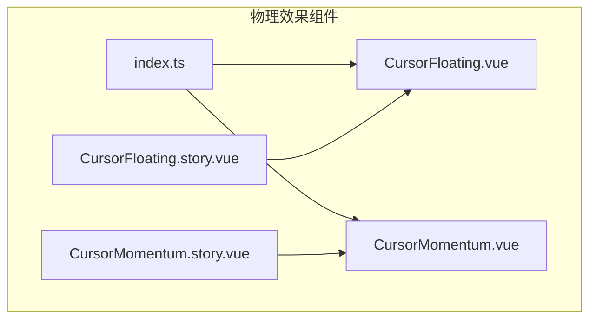
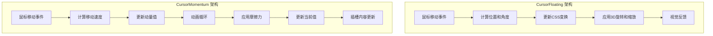
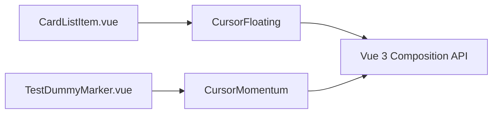

# 物理效果组件

<cite>
**Referenced Files in This Document**   
- [CursorFloating.vue](file://packages/stage-ui/src/components/physics/CursorFloating.vue)
- [CursorMomentum.vue](file://packages/stage-ui/src/components/physics/CursorMomentum.vue)
- [CursorFloating.story.vue](file://packages/stage-ui/src/components/physics/CursorFloating.story.vue)
- [CursorMomentum.story.vue](file://packages/stage-ui/src/components/physics/CursorMomentum.story.vue)
- [CardListItem.vue](file://packages/stage-pages/src/pages/settings/airi-card/components/CardListItem.vue)
- [TestDummyMarker.vue](file://packages/stage-ui/src/components/gadgets/TestDummyMarker.vue)
- [index.ts](file://packages/stage-ui/src/components/physics/index.ts)
</cite>

## 目录
1. [简介](#简介)
2. [项目结构](#项目结构)
3. [核心组件](#核心组件)
4. [架构概述](#架构概述)
5. [详细组件分析](#详细组件分析)
6. [依赖分析](#依赖分析)
7. [性能考虑](#性能考虑)
8. [故障排除指南](#故障排除指南)
9. [结论](#结论)

## 简介
`stage-ui`物理效果组件库提供了两种增强用户交互体验的组件：`CursorFloating`和`CursorMomentum`。这些组件通过模拟物理效果，为Web界面带来更生动、更具沉浸感的用户体验。`CursorFloating`组件实现了鼠标跟随的3D浮动效果，而`CursorMomentum`组件则提供了基于鼠标移动速度的惯性滚动效果。这些组件不仅提升了视觉吸引力，还增强了用户与界面元素之间的互动感。

## 项目结构
物理效果组件位于`packages/stage-ui/src/components/physics`目录下，包含两个核心组件文件和相应的故事书（Storybook）文件，用于展示组件的使用示例。



**Diagram sources**
- [CursorFloating.vue](file://packages/stage-ui/src/components/physics/CursorFloating.vue)
- [CursorMomentum.vue](file://packages/stage-ui/src/components/physics/CursorMomentum.vue)
- [index.ts](file://packages/stage-ui/src/components/physics/index.ts)

**Section sources**
- [CursorFloating.vue](file://packages/stage-ui/src/components/physics/CursorFloating.vue)
- [CursorMomentum.vue](file://packages/stage-ui/src/components/physics/CursorMomentum.vue)

## 核心组件
`CursorFloating`和`CursorMomentum`是`stage-ui`中用于增强用户交互体验的两个关键物理效果组件。`CursorFloating`通过监听鼠标移动事件，计算鼠标相对于组件的位置，并应用3D变换（旋转和缩放）来创建浮动效果。同时，它还使用CSS伪元素创建动态渐变和闪光效果，增强视觉反馈。`CursorMomentum`则通过监听全局鼠标移动事件，计算鼠标移动速度，并将其转换为"动量"值。该组件使用`requestAnimationFrame`循环持续更新一个基于动量和摩擦力的物理模型，从而产生平滑的惯性动画效果。

**Section sources**
- [CursorFloating.vue](file://packages/stage-ui/src/components/physics/CursorFloating.vue)
- [CursorMomentum.vue](file://packages/stage-ui/src/components/physics/CursorMomentum.vue)

## 架构概述
物理效果组件的架构设计遵循了Vue 3的组合式API模式，将逻辑与模板分离。`CursorFloating`组件采用直接的事件驱动架构，其状态（变换样式、渐变位置等）完全由鼠标移动事件触发更新。`CursorMomentum`组件则采用了更复杂的基于时间的物理模拟架构，它在组件挂载时启动一个持续的动画循环，该循环独立于直接的用户输入，但由用户输入（鼠标移动）所影响。这种设计允许创建更复杂、更流畅的动画效果。



**Diagram sources**
- [CursorFloating.vue](file://packages/stage-ui/src/components/physics/CursorFloating.vue)
- [CursorMomentum.vue](file://packages/stage-ui/src/components/physics/CursorMomentum.vue)

## 详细组件分析

### CursorFloating 组件分析
`CursorFloating`组件为任何包含的内容提供了一个带有3D浮动效果的容器。当用户将鼠标悬停在组件上时，内容会根据鼠标位置产生轻微的旋转和缩放，创造出一种悬浮在屏幕上的错觉。

#### Props
`CursorFloating`组件接受一个可选的`intensity`属性，用于控制浮动效果的强度。
- `intensity` (number, 默认值: 1.5): 控制旋转、缩放和视觉效果的强度。值越大，效果越明显。

#### 事件
该组件通过内置的事件监听器处理交互：
- `@mousemove`: 当鼠标在组件内移动时，触发位置和角度的重新计算。
- `@mouseleave`: 当鼠标离开组件时，调用`resetCard`函数将变换重置为默认状态，实现平滑的退出动画。

#### 插槽
- 默认插槽: 用于放置需要应用浮动效果的任何内容。

#### 实际使用示例
```vue
<CursorFloating :intensity="2.0">
  <div class="card-content">
    <h3>悬浮卡片</h3>
    <p>将鼠标悬停在此处以查看3D效果。</p>
  </div>
</CursorFloating>
```

**Section sources**
- [CursorFloating.vue](file://packages/stage-ui/src/components/physics/CursorFloating.vue)
- [CursorFloating.story.vue](file://packages/stage-ui/src/components/physics/CursorFloating.story.vue)

### CursorMomentum 组件分析
`CursorMomentum`组件提供了一个基于物理的动量系统，可以根据鼠标移动的速度驱动动画。

#### Props
- `baseSpeed` (number, 默认值: 0.1): 动量的基础速度，当没有鼠标输入时，动量会衰减到此值。
- `friction` (number, 默认值: 0.95): 摩擦系数，控制动量衰减的速度。值越接近1，衰减越慢，惯性越强。
- `momentumFactor` (number, 默认值: 0.005): 动量因子，控制鼠标移动速度对动量增加的影响程度。

#### 事件
该组件监听全局的`mousemove`事件来捕获鼠标移动数据。

#### 插槽
- 作用域插槽: 向其内容暴露两个响应式变量：
  - `momentum`: 当前的动量值，反映了鼠标移动的"速度"。
  - `currentValue`: 一个累积值，随时间根据当前动量持续增加，非常适合用于驱动旋转或位置动画。

#### 实际使用示例
```vue
<CursorMomentum v-slot="{ currentValue }">
  <div :style="{ transform: `rotate(${currentValue}deg)` }">
    这个方块会根据鼠标移动速度旋转
  </div>
</CursorMomentum>
```

**Section sources**
- [CursorMomentum.vue](file://packages/stage-ui/src/components/physics/CursorMomentum.vue)
- [CursorMomentum.story.vue](file://packages/stage-ui/src/components/physics/CursorMomentum.story.vue)

## 依赖分析
物理效果组件主要依赖Vue 3的组合式API（`ref`, `onMounted`, `onUnmounted`等）来管理状态和生命周期。`CursorMomentum`组件通过`defineExpose`向父组件暴露其内部状态，实现了组件间的通信。这些组件被设计为可复用的UI元素，可以在项目中的任何地方通过导入使用。



**Diagram sources**
- [CursorFloating.vue](file://packages/stage-ui/src/components/physics/CursorFloating.vue)
- [CursorMomentum.vue](file://packages/stage-ui/src/components/physics/CursorMomentum.vue)
- [CardListItem.vue](file://packages/stage-pages/src/pages/settings/airi-card/components/CardListItem.vue)
- [TestDummyMarker.vue](file://packages/stage-ui/src/components/gadgets/TestDummyMarker.vue)

**Section sources**
- [CursorFloating.vue](file://packages/stage-ui/src/components/physics/CursorFloating.vue)
- [CursorMomentum.vue](file://packages/stage-ui/src/components/physics/CursorMomentum.vue)
- [CardListItem.vue](file://packages/stage-pages/src/pages/settings/airi-card/components/CardListItem.vue)

## 性能考虑
为了确保流畅的用户体验，这些物理效果组件采用了多种性能优化策略：
- **`will-change` CSS属性**: `CursorFloating`使用`will-change: transform`提示浏览器对变换进行硬件加速。
- **`transform-style: preserve-3d`**: 正确启用3D变换上下文。
- **`requestAnimationFrame`**: `CursorMomentum`使用此API进行动画更新，确保动画与浏览器的刷新率同步，避免丢帧。
- **事件节流**: 虽然`CursorFloating`直接响应`mousemove`，但其计算相对简单，且CSS变换由浏览器高效处理。`CursorMomentum`通过独立的动画循环将计算与输入事件解耦。
- **内存管理**: `CursorMomentum`在组件卸载时（`onUnmounted`）正确移除了全局事件监听器，防止内存泄漏。

最佳实践建议：
- 对于复杂的DOM结构，谨慎使用`CursorFloating`，因为频繁的变换可能影响性能。
- 在`CursorMomentum`中，合理调整`friction`和`momentumFactor`以平衡效果和性能。
- 避免在单个页面上同时使用过多的`CursorMomentum`实例。

## 故障排除指南
- **效果不显示**: 确保组件已正确导入并注册。检查浏览器控制台是否有JavaScript错误。
- **动画卡顿**: 检查是否有其他耗时的JavaScript操作阻塞了主线程。简化`CursorFloating`容器内的内容。
- **动量不重置**: 确认`CursorMomentum`组件已正确卸载，其`onUnmounted`钩子会清理事件监听器。
- **样式冲突**: `CursorFloating`使用了特定的CSS变量（如`--color-primary-500`），确保这些变量在全局样式中已定义。

**Section sources**
- [CursorFloating.vue](file://packages/stage-ui/src/components/physics/CursorFloating.vue)
- [CursorMomentum.vue](file://packages/stage-ui/src/components/physics/CursorMomentum.vue)

## 结论
`CursorFloating`和`CursorMomentum`组件为`stage-ui`库提供了强大而灵活的物理交互能力。`CursorFloating`通过简单的API即可为UI元素添加引人注目的3D悬浮效果，而`CursorMomentum`则提供了一个更高级的、基于物理的动量系统，可用于创建复杂的、响应式的动画。两者都经过了性能优化，并通过清晰的API和作用域插槽设计，易于在各种场景中集成和使用，显著提升了用户界面的现代感和互动性。