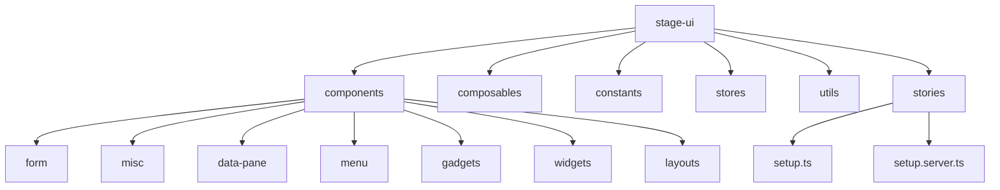
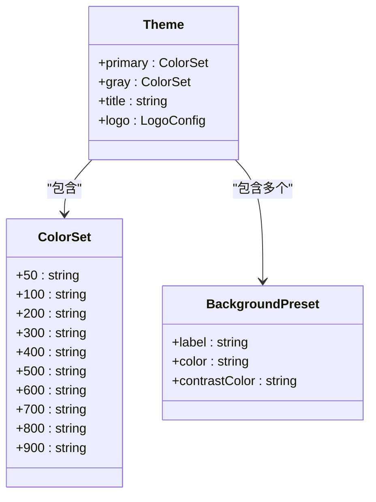
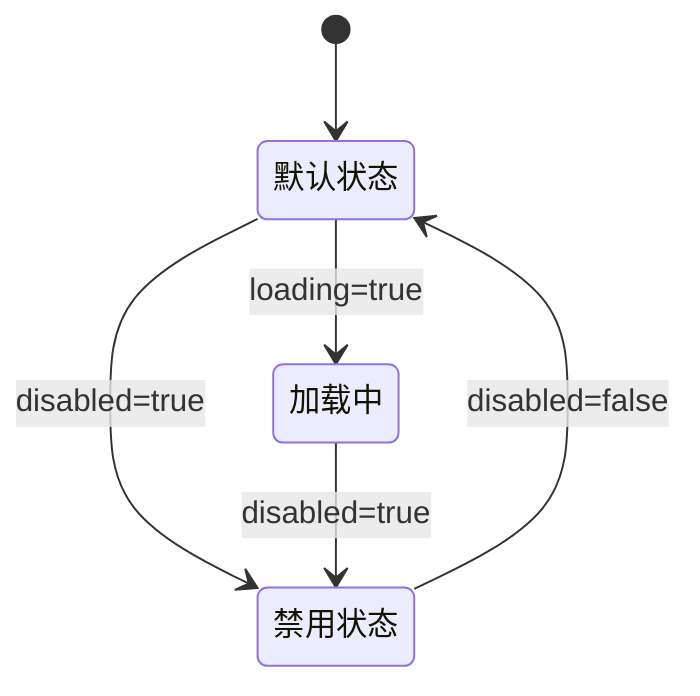

# 组件库

<cite>
**本文档中引用的文件**  
- [Button.vue](file://packages/stage-ui/src/components/misc/Button.vue)
- [Progress.vue](file://packages/stage-ui/src/components/misc/Progress.vue)
- [Alert.vue](file://packages/stage-ui/src/components/misc/Alert.vue)
- [Skeleton.vue](file://packages/stage-ui/src/components/misc/Skeleton.vue)
- [Input.story.vue](file://packages/stage-ui/src/components/form/input/Input.story.vue)
- [FieldInput.story.vue](file://packages/stage-ui/src/components/form/field/FieldInput.story.vue)
- [index.ts](file://packages/stage-ui/src/components/index.ts)
- [README.md](file://packages/stage-ui/README.md)
- [histoire.config.ts](file://packages/stage-ui/histoire.config.ts)
- [vite.config.ts](file://packages/stage-ui/vite.config.ts)
</cite>

## 目录
1. [简介](#简介)
2. [项目结构](#项目结构)
3. [设计理念与主题定制](#设计理念与主题定制)
4. [组件分类](#组件分类)
5. [核心组件详解](#核心组件详解)
6. [表单组件使用方法](#表单组件使用方法)
7. [视觉展示与最佳实践](#视觉展示与最佳实践)
8. [引入与使用方式](#引入与使用方式)
9. [总结](#总结)

## 简介
`stage-ui` 是一个共享的 UI 组件库，专为 AIRI 项目生态设计，提供统一的设计语言和可复用的前端组件。该组件库支持 Histoire 进行可视化故事板开发，便于开发者预览和测试组件在不同状态下的表现。文档将详细介绍其设计理念、组件分类、使用方法以及如何在项目中引入和定制主题。

## 项目结构
`stage-ui` 的组件组织清晰，按功能模块划分目录，便于维护和扩展。



**Diagram sources**  
- [index.ts](file://packages/stage-ui/src/components/index.ts#L1-L11)

**Section sources**  
- [index.ts](file://packages/stage-ui/src/components/index.ts#L1-L11)

## 设计理念与主题定制
`stage-ui` 遵循现代设计系统原则，强调一致性、可访问性和响应式体验。通过 Histoire 配置文件 `histoire.config.ts` 定义了主题颜色、背景预设和组件分组，确保所有组件在视觉上保持统一。

主题支持明暗模式切换，并通过 UnoCSS 实现原子化样式管理。开发者可通过配置 `theme.colors` 自定义主色调、灰色调等，实现品牌化设计。



**Diagram sources**  
- [histoire.config.ts](file://packages/stage-ui/histoire.config.ts#L4-L133)

**Section sources**  
- [histoire.config.ts](file://packages/stage-ui/histoire.config.ts#L4-L133)

## 组件分类
根据 `histoire.config.ts` 中的 `tree.groups` 配置，组件被划分为多个逻辑组，便于在 Histoire 中浏览：

- **Design System**: 设计系统基础
- **Common**: 通用组件
- **Form**: 表单相关组件
- **Misc**: 杂项 UI 元素
- **Data Pane**: 数据展示面板
- **Menu**: 菜单与卡片类组件
- **Widgets**: 小部件
- **Gadgets**: 动态数据可视化工具
- **Physics**: 物理动效组件
- **Graphics**: 图形元素
- **Providers**: 第三方服务集成

这种分类方式有助于开发者快速定位所需组件。

**Section sources**  
- [histoire.config.ts](file://packages/stage-ui/histoire.config.ts#L108-L132)

## 核心组件详解

### Button 按钮组件
`Button` 是最常用的交互元素之一，支持多种变体、尺寸和状态。

**Props**
- `variant`: 按钮样式（primary, secondary, secondary-muted, danger）
- `size`: 尺寸（sm, md, lg）
- `toggled`: 是否处于切换状态
- `icon`: 图标类名
- `label`: 按钮文本
- `disabled`: 是否禁用
- `loading`: 是否加载中
- `block`: 是否为块级元素

**插槽**
- 默认插槽：用于自定义内容

**事件**
- 原生 `click` 事件



**Section sources**  
- [Button.vue](file://packages/stage-ui/src/components/misc/Button.vue#L1-L113)

### Progress 进度条
显示任务完成进度，支持自定义进度值和样式。

**Props**
- `progress`: 当前进度百分比（0-100）
- `barClass`: 自定义进度条样式类

**插槽**
- 无

**事件**
- 无

**Section sources**  
- [Progress.vue](file://packages/stage-ui/src/components/misc/Progress.vue#L1-L44)

### Alert 警告提示
用于展示重要信息，支持多种类型。

**Props**
- `type`: 类型（error, warning, success, info, loading）

**插槽**
- `title`: 标题内容
- `content`: 正文内容

**事件**
- 无

**Section sources**  
- [Alert.vue](file://packages/stage-ui/src/components/misc/Alert.vue#L1-L71)

### Skeleton 骨架屏
在内容加载时提供视觉占位符。

**Props**
- `animation`: 动画类型（pulse, wave, none）

**插槽**
- 默认插槽：被包裹的内容

**事件**
- 无

**Section sources**  
- [Skeleton.vue](file://packages/stage-ui/src/components/misc/Skeleton.vue#L1-L75)

## 表单组件使用方法

### Input 输入框
基础输入组件，支持多种输入类型（text, password, email, number, url）。

**Props**
- `v-model`: 双向绑定值
- `type`: 输入类型
- `placeholder`: 占位符
- `disabled`: 禁用状态
- `readonly`: 只读状态
- `autofocus`: 自动聚焦

**示例**
```vue
<Input v-model="text" placeholder="请输入文本" />
```

**Section sources**  
- [Input.story.vue](file://packages/stage-ui/src/components/form/input/Input.story.vue#L1-L151)

### FieldInput 字段输入框
带标签和描述的输入字段容器。

**Props**
- `label`: 字段标签
- `description`: 描述文本
- `required`: 是否必填

**示例**
```vue
<FieldInput
  v-model="email"
  label="邮箱地址"
  description="请输入您的邮箱"
  type="email"
  required
/>
```

**Section sources**  
- [FieldInput.story.vue](file://packages/stage-ui/src/components/form/field/FieldInput.story.vue#L1-L94)

## 视觉展示与最佳实践
通过 Histoire 工具可查看所有组件的实时演示。运行以下命令启动故事板服务：

```bash
pnpm -F @proj-airi/stage-ui run story:dev
```

**最佳实践建议：**
- 使用 `block` 属性创建全宽按钮用于表单提交
- 在异步操作中结合 `loading` 状态提升用户体验
- 利用 `variant` 区分主次操作
- 使用 `Skeleton` 组件优化加载体验
- 通过 `Alert` 组件统一错误提示样式

**Section sources**  
- [README.md](file://packages/stage-ui/README.md#L1-L16)

## 引入与使用方式
1. 安装依赖：
```bash
pnpm add @proj-airi/stage-ui
```

2. 在项目中引入并注册组件：
```ts
import { Button, Input, Alert } from '@proj-airi/stage-ui'
```

3. 使用组件：
```vue
<Button label="提交" variant="primary" />
```

组件通过 `index.ts` 统一导出，支持按需引入。

**Section sources**  
- [index.ts](file://packages/stage-ui/src/components/index.ts#L1-L11)
- [vite.config.ts](file://packages/stage-ui/vite.config.ts#L1-L51)

## 总结
`stage-ui` 是一个功能丰富、结构清晰的 UI 组件库，为 AIRI 生态提供了统一的视觉语言和交互体验。通过合理的组件分类、灵活的 Props 设计和完善的主题系统，开发者可以快速构建高质量的用户界面。结合 Histoire 可视化工具，进一步提升了开发效率和协作体验。