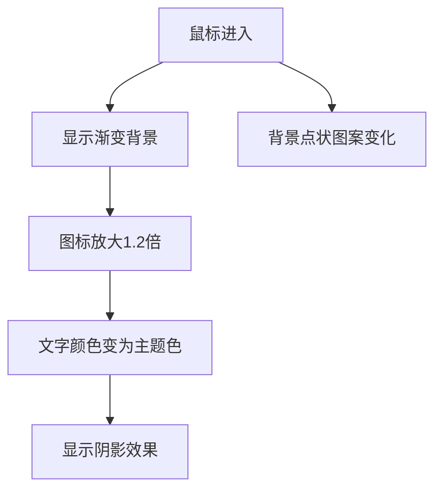
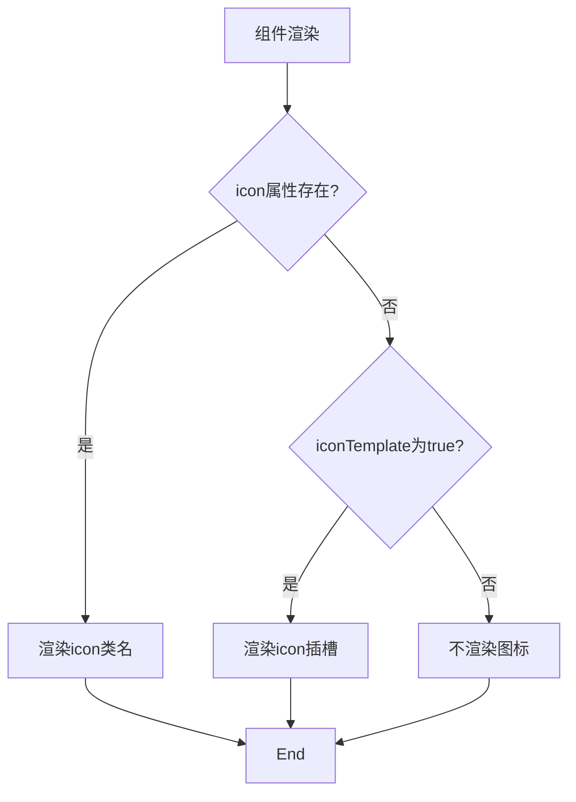

# 图标项组件 (IconItem)

<cite>
**Referenced Files in This Document**   
- [IconItem.vue](file://packages\stage-ui\src\components\menu\IconItem.vue)
- [IconItem.story.vue](file://packages\stage-ui\src\components\menu\IconItem.story.vue)
</cite>

## 目录
1. [简介](#简介)
2. [核心功能](#核心功能)
3. [属性配置](#属性配置)
4. [事件与交互](#事件与交互)
5. [插槽使用](#插槽使用)
6. [视觉效果实现](#视觉效果实现)
7. [使用示例](#使用示例)
8. [组合使用模式](#组合使用模式)

## 简介
图标项组件 (IconItem) 是一个功能导航项基础组件，用于构建工具栏或功能导航菜单。该组件提供了一个美观且交互性强的导航项，支持图标、标题和描述的展示，并具有丰富的视觉反馈效果。

**Section sources**
- [IconItem.vue](file://packages\stage-ui\src\components\menu\IconItem.vue#L1-L128)

## 核心功能
图标项组件作为功能导航项的基础构建块，主要提供以下核心功能：
- 导航链接功能，通过 `to` 属性实现页面跳转
- 图标与文本内容的组合展示
- 悬停和激活状态的视觉反馈
- 响应式布局设计
- 键盘导航支持

该组件设计简洁但功能完整，适用于各种导航场景，从简单的工具栏到复杂的功能菜单。

**Section sources**
- [IconItem.vue](file://packages\stage-ui\src\components\menu\IconItem.vue#L1-L128)

## 属性配置
图标项组件提供了多个可配置的属性，以满足不同的使用需求。

### 基础属性
| 属性 | 类型 | 必需 | 描述 |
|------|------|------|------|
| `title` | string | 是 | 导航项的标题文本 |
| `description` | string | 是 | 导航项的描述文本 |
| `to` | string | 是 | 导航目标路由 |

### 图标相关属性
| 属性 | 类型 | 必需 | 描述 |
|------|------|------|------|
| `icon` | string | 否 | 图标类名，用于显示指定图标 |
| `iconTemplate` | boolean | 否 | 是否使用插槽自定义图标模板 |

**Section sources**
- [IconItem.vue](file://packages\stage-ui\src\components\menu\IconItem.vue#L1-L10)

## 事件与交互
图标项组件基于 `RouterLink` 实现，继承了其所有交互功能。

### 内置交互
- **点击事件**：点击组件会导航到 `to` 属性指定的路由
- **悬停效果**：鼠标悬停时显示渐变背景和图标动画
- **键盘导航**：支持 Tab 键导航和 Enter 键激活

### 状态管理
组件通过 CSS 类实现状态管理：
- 正常状态：默认样式
- 悬停状态：通过 `:hover` 伪类实现
- 激活状态：通过 `_hover` CSS 类实现，可用于程序化控制悬停外观

**Section sources**
- [IconItem.vue](file://packages\stage-ui\src\components\menu\IconItem.vue#L11-L128)

## 插槽使用
图标项组件提供了灵活的插槽机制，允许自定义图标内容。

### 默认插槽
组件支持 `icon` 插槽，当 `iconTemplate` 属性设置为 `true` 时启用：
```vue
<IconItem :iconTemplate="true" to="/path">
  <template #icon>
    <!-- 自定义图标内容 -->
    <CustomIcon />
  </template>
</IconItem>
```

这种设计模式允许开发者使用复杂的图标组件或动画，而不仅限于简单的图标类名。

**Section sources**
- [IconItem.vue](file://packages\stage-ui\src\components\menu\IconItem.vue#L35-L40)

## 视觉效果实现
图标项组件通过 CSS 和 UnoCSS 实现了丰富的视觉效果。

### 悬停效果


### 激活状态管理
组件使用了两种方式管理激活状态：
1. CSS `:hover` 伪类处理鼠标悬停
2. `_hover` CSS 类处理程序化激活状态

### 图标渲染机制


**Diagram sources**
- [IconItem.vue](file://packages\stage-ui\src\components\menu\IconItem.vue#L41-L128)

**Section sources**
- [IconItem.vue](file://packages\stage-ui\src\components\menu\IconItem.vue#L41-L128)

## 使用示例
以下是图标项组件的实际使用示例。

### 基本用法
```vue
<IconItem
  title="模块管理"
  description="思维、视觉、语音合成、游戏等功能"
  icon="i-solar:layers-bold-duotone"
  to="/settings/modules"
/>
```

### 激活状态示例
```vue
<IconItem
  title="模块管理"
  description="思维、视觉、语音合成、游戏等功能"
  icon="i-solar:layers-bold-duotone"
  to="/settings/modules"
  class="_hover"
/>
```

### 自定义图标模板
```vue
<IconItem
  :iconTemplate="true"
  to="/custom-path"
>
  <template #icon>
    <div class="custom-icon-animation">
      <AnimatedIcon />
    </div>
  </template>
</IconItem>
```

**Section sources**
- [IconItem.story.vue](file://packages\stage-ui\src\components\menu\IconItem.story.vue#L15-L34)

## 组合使用模式
图标项组件通常与其他组件组合使用，构建完整的导航界面。

### 工具栏模式
将多个 `IconItem` 组件垂直排列，创建功能工具栏：
```vue
<div class="flex flex-col gap-2">
  <IconItem title="首页" description="返回主界面" icon="i-lucide:home" to="/" />
  <IconItem title="设置" description="系统配置" icon="i-lucide:settings" to="/settings" />
  <IconItem title="帮助" description="获取支持" icon="i-lucide:help-circle" to="/help" />
</div>
```

### 功能导航菜单
结合布局组件创建功能导航菜单，支持分组和标题：
```vue
<div class="p-4">
  <h3 class="text-sm font-medium text-neutral-500 mb-2">系统功能</h3>
  <div class="space-y-2">
    <IconItem title="模块" description="AI功能管理" icon="i-solar:layers-bold-duotone" to="/modules" />
    <IconItem title="记忆" description="知识库管理" icon="i-solar:memory-card-bold-duotone" to="/memory" />
  </div>
</div>
```

这种组合使用模式提高了组件的灵活性和可复用性，使开发者能够快速构建一致的用户界面。

**Section sources**
- [IconItem.story.vue](file://packages\stage-ui\src\components\menu\IconItem.story.vue#L15-L34)
- [IconItem.vue](file://packages\stage-ui\src\components\menu\IconItem.vue#L1-L128)