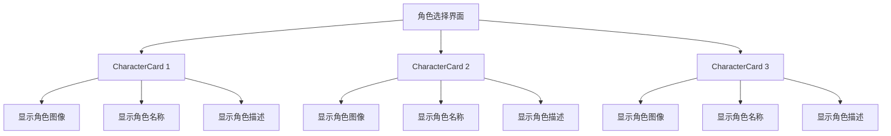
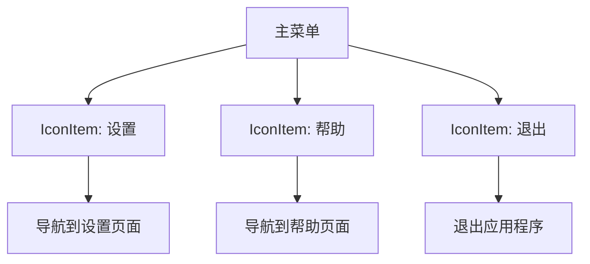
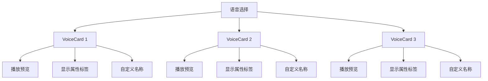

# 菜单与选择组件

<cite>
**Referenced Files in This Document**   
- [CharacterCard.vue](file://packages/stage-ui/src/components/menu/CharacterCard.vue)
- [IconItem.vue](file://packages/stage-ui/src/components/menu/IconItem.vue)
- [RadioCardSimple.vue](file://packages/stage-ui/src/components/menu/RadioCardSimple.vue)
- [VoiceCard.vue](file://packages/stage-ui/src/components/menu/VoiceCard.vue)
</cite>

## 目录
1. [简介](#简介)
2. [核心组件概览](#核心组件概览)
3. [CharacterCard 组件](#charactercard-组件)
4. [IconItem 组件](#iconitem-组件)
5. [RadioCardSimple 组件](#radiocardsimple-组件)
6. [VoiceCard 组件](#voicecard-组件)
7. [使用示例](#使用示例)
8. [最佳实践](#最佳实践)

## 简介
本文档详细介绍了 stage-ui 库中的菜单与选择组件，这些组件在用户界面导航和选择操作中扮演着关键角色。文档将深入解析 CharacterCard、IconItem、RadioCardSimple 和 VoiceCard 四个核心组件的属性、事件和插槽，提供实际使用示例，并探讨选中状态管理、键盘导航、响应式布局和可访问性等最佳实践。

## 核心组件概览
stage-ui 提供了一系列精心设计的菜单与选择组件，用于构建直观的用户界面。这些组件包括：

- **CharacterCard**: 用于展示角色信息的卡片式组件，包含标题、副标题、描述和视觉元素
- **IconItem**: 带有图标的导航项组件，适用于功能菜单和设置选项
- **RadioCardSimple**: 简单的单选卡片组件，用于在多个选项中进行选择
- **VoiceCard**: 专门用于语音模型选择的组件，支持音频预览和可视化

这些组件共同构成了用户选择和导航的基础，提供了统一的视觉风格和交互体验。

## CharacterCard 组件

CharacterCard 组件是一个视觉吸引力强的角色展示卡片，用于在角色选择界面中呈现角色信息。

**Section sources**
- [CharacterCard.vue](file://packages/stage-ui/src/components/menu/CharacterCard.vue#L1-L290)

### Props
CharacterCard 组件接受以下属性：

- `title`: 角色名称，显示在卡片的主要位置
- `subtitle`: 角色副标题，通常用于显示角色类型或分类
- `backgroundLabel`: 背景标签文本，默认为"Character"
- `description`: 角色描述文本，显示在卡片底部
- `image`: 角色图像的 URL
- `cardHeight` 和 `cardWidth`: 卡片的尺寸设置
- `primaryColor` 和 `secondaryColor`: 主要和次要颜色，用于定义卡片的视觉主题
- `textColor`: 文本颜色
- `dividerColor` 和 `dividerOpacity`: 分隔线的颜色和透明度

### 事件与插槽
该组件支持以下插槽：

- `cover`: 用于自定义卡片封面内容，通常包含角色图像

### 功能特性
CharacterCard 组件具有以下特性：
- 动态生成的条形码装饰元素
- 渐变背景和文本阴影效果
- 悬停时的图像动画效果
- 响应式设计，适应不同屏幕尺寸

## IconItem 组件

IconItem 组件是一个简洁的图标导航项，用于功能菜单和设置界面。

**Section sources**
- [IconItem.vue](file://packages/stage-ui/src/components/menu/IconItem.vue#L1-L127)

### Props
IconItem 组件接受以下属性：

- `title`: 项目标题，显示在主要位置
- `description`: 项目描述，提供额外信息
- `icon`: 图标类名，用于显示图标
- `iconTemplate`: 布尔值，指示是否使用模板插槽而不是图标类名
- `to`: 目标路由，用于导航

### 事件与插槽
该组件支持以下插槽：

- `icon`: 用于自定义图标内容

### 功能特性
IconItem 组件具有以下特性：
- 基于 Vue Router 的导航功能
- 悬停时的渐变动画效果
- 点击反馈和阴影变化
- 深色模式支持
- 网格背景装饰

## RadioCardSimple 组件

RadioCardSimple 组件是一个简单的单选卡片，用于在多个选项中进行选择。

**Section sources**
- [RadioCardSimple.vue](file://packages/stage-ui/src/components/menu/RadioCardSimple.vue#L1-L114)

### Props
RadioCardSimple 组件接受以下属性：

- `id`: 唯一标识符
- `name`: 表单名称，用于分组单选按钮
- `value`: 绑定值
- `title`: 选项标题
- `description`: 选项描述

### 事件与插槽
该组件使用 `defineModel` 实现双向绑定，自动处理选中状态的同步。

### 功能特性
RadioCardSimple 组件具有以下特性：
- 视觉化的单选按钮设计
- 选中状态的高亮显示
- 悬停效果和动画过渡
- 网格背景装饰
- 响应式布局

## VoiceCard 组件

VoiceCard 组件是专门为语音模型选择设计的高级组件，支持音频预览功能。

**Section sources**
- [VoiceCard.vue](file://packages/stage-ui/src/components/menu/VoiceCard.vue#L1-L267)

### Props
VoiceCard 组件接受以下属性：

- `name`: 表单名称
- `voice`: 语音对象，包含语音的详细信息
- `currentlyPlayingId`: 当前正在播放的语音 ID
- `customInputPlaceholder`: 自定义语音名称输入框的占位符
- `showVisualizer`: 是否显示音频可视化器
- `audioStream`: 音频流对象

### 事件
该组件触发以下事件：

- `togglePlayback`: 当用户点击播放/暂停按钮时触发

### 事件与插槽
该组件使用两个 `defineModel` 实现双向绑定：
- `voice-id`: 用于同步选中的语音 ID
- `custom-voice-name`: 用于同步自定义语音名称

### 功能特性
VoiceCard 组件具有以下特性：
- 音频预览播放/暂停功能
- 音频频谱可视化器
- 语音属性标签显示（性别、年龄、口音等）
- 自定义语音名称输入功能
- 详细的语音信息展示

## 使用示例

### 角色选择界面

**Diagram sources**
- [CharacterCard.vue](file://packages/stage-ui/src/components/menu/CharacterCard.vue#L1-L290)

### 功能导航菜单

**Diagram sources**
- [IconItem.vue](file://packages/stage-ui/src/components/menu/IconItem.vue#L1-L127)

### 语音模型选择

**Diagram sources**
- [VoiceCard.vue](file://packages/stage-ui/src/components/menu/VoiceCard.vue#L1-L267)

## 最佳实践

### 选中状态管理
使用 `defineModel` 是管理选中状态的最佳方式，它简化了父子组件之间的双向绑定，减少了样板代码。

### 键盘导航支持
所有选择组件都应支持键盘导航，包括：
- Tab 键在选项间移动
- Enter 或 Space 键选择当前选项
- 箭头键在选项间移动（对于单选组）

### 响应式布局
组件应适应不同屏幕尺寸，在移动设备上提供良好的触摸体验，在桌面设备上提供精确的鼠标交互。

### 可访问性
遵循 WCAG 指南，确保组件对所有用户都可访问：
- 提供适当的 ARIA 属性
- 确保足够的颜色对比度
- 支持屏幕阅读器
- 提供键盘替代方案

### 性能优化
- 懒加载大型图像
- 优化动画性能
- 避免不必要的重渲染
- 使用虚拟滚动处理大量选项