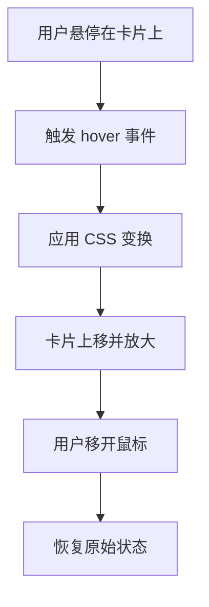
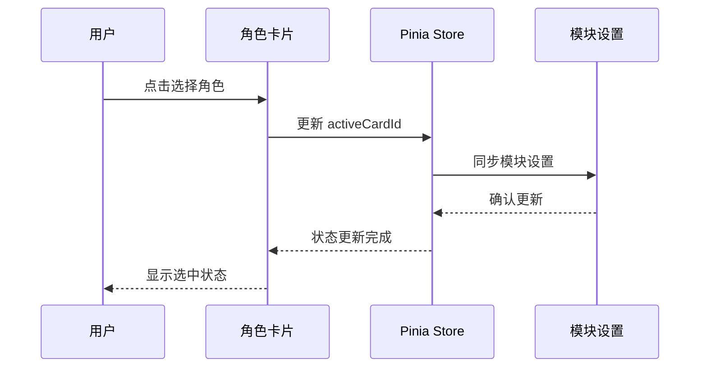

# 角色卡片组件 (CharacterCard)

<cite>
**Referenced Files in This Document**   
- [CharacterCard.vue](file://packages/stage-ui/src/components/menu/CharacterCard.vue)
- [airi-card.ts](file://packages/stage-ui/src/stores/modules/airi-card.ts)
- [index.vue](file://packages/stage-pages/src/pages/settings/airi-card/index.vue)
- [CardDetailDialog.vue](file://packages/stage-pages/src/pages/settings/airi-card/components/CardDetailDialog.vue)
</cite>

## 目录
1. [简介](#简介)
2. [核心功能](#核心功能)
3. [Props 详解](#props-详解)
4. [事件与交互](#事件与交互)
5. [插槽使用](#插槽使用)
6. [选中状态样式](#选中状态样式)
7. [响应式布局适配](#响应式布局适配)
8. [可访问性属性 (ARIA)](#可访问性属性-aria)
9. [Pinia 状态管理集成](#pinia-状态管理集成)
10. [与其他选择组件的交互逻辑](#与其他选择组件的交互逻辑)

## 简介
角色卡片组件 (CharacterCard) 是一个用于角色选择界面的可视化组件，旨在提供一种美观且功能丰富的角色展示方式。该组件通过精心设计的视觉效果和交互体验，帮助用户在角色选择场景中快速识别和选择所需角色。组件支持高度自定义的外观配置，包括颜色、尺寸、文本样式等，同时集成了与 Pinia 状态管理的深度交互，确保在角色选择过程中的状态同步和数据一致性。

**Section sources**
- [CharacterCard.vue](file://packages/stage-ui/src/components/menu/CharacterCard.vue#L1-L291)

## 核心功能
角色卡片组件的核心功能是为角色选择界面提供一个统一且可复用的展示单元。该组件通过接收一系列 props 来定制其外观和行为，包括角色的名称、图像、状态描述等信息。组件的视觉设计采用了现代卡片式布局，结合了渐变背景、条形码装饰和动态悬停效果，提升了整体的视觉吸引力。此外，组件还支持通过插槽机制扩展其内容，允许在卡片上添加徽章、标签等额外信息。

**Section sources**
- [CharacterCard.vue](file://packages/stage-ui/src/components/menu/CharacterCard.vue#L1-L291)

## Props 详解
角色卡片组件提供了丰富的 props 用于配置其外观和行为。主要 props 包括：
- `title`: 角色的主标题，通常为角色名称。
- `subtitle`: 角色的副标题，用于补充说明角色身份。
- `backgroundLabel`: 背景标签文本，默认为 "Character"。
- `description`: 角色的详细描述文本。
- `image`: 角色的头像或代表图像 URL。
- `cardHeight` 和 `cardWidth`: 卡片的高度和宽度，以像素为单位。
- `primaryColor`, `secondaryColor`, `backgroundColor`: 分别定义卡片的主要颜色、次要颜色和背景颜色。
- `textColor`, `descriptionTextColor`, `subtitleTextColor`: 定义标题、描述和副标题的文本颜色。
- `dividerColor` 和 `dividerOpacity`: 配置分隔线的颜色和透明度。
- `textShadowColor` 和 `textShadowSize`: 设置文本阴影的颜色和大小。

这些 props 允许开发者根据具体需求灵活定制卡片的视觉效果，确保其与整体应用设计风格保持一致。

**Section sources**
- [CharacterCard.vue](file://packages/stage-ui/src/components/menu/CharacterCard.vue#L1-L291)

## 事件与交互
角色卡片组件通过内置的交互逻辑提供丰富的用户体验。组件默认具有点击和悬停事件，用户可以通过点击卡片来选择角色，或通过悬停来预览角色的详细信息。悬停效果通过 CSS 变换实现，当鼠标悬停在卡片上时，卡片会轻微上移并放大，产生一种“浮起”的视觉效果。这种交互设计不仅增强了用户界面的生动性，还提供了明确的视觉反馈，帮助用户确认其操作。

**Diagram sources**
- [CharacterCard.vue](file://packages/stage-ui/src/components/menu/CharacterCard.vue#L84-L121)

**Section sources**
- [CharacterCard.vue](file://packages/stage-ui/src/components/menu/CharacterCard.vue#L84-L121)

## 插槽使用
角色卡片组件支持通过插槽机制扩展其内容。组件定义了多个插槽，包括默认插槽和特定功能插槽（如 cover 插槽）。`cover` 插槽允许开发者在卡片的封面区域添加自定义内容，例如角色的动态图像或视频。通过使用插槽，开发者可以创建更加丰富和个性化的角色展示效果，满足不同应用场景的需求。

**Section sources**
- [CharacterCard.vue](file://packages/stage-ui/src/components/menu/CharacterCard.vue#L1-L291)

## 选中状态样式
在角色选择界面中，选中状态的视觉反馈至关重要。角色卡片组件通过与外部状态管理系统的集成，实现了选中状态的样式变化。当某个角色被选中时，其卡片会通过 CSS 类或内联样式的变化来突出显示，例如改变边框颜色、添加选中图标或调整阴影效果。这种视觉反馈帮助用户清晰地识别当前选中的角色，提升用户体验。

**Section sources**
- [index.vue](file://packages/stage-pages/src/pages/settings/airi-card/index.vue#L1-L310)

## 响应式布局适配
角色卡片组件设计时充分考虑了不同设备和屏幕尺寸的适配需求。组件采用灵活的布局策略，能够根据容器大小自动调整其尺寸和排列方式。在移动设备上，卡片会以单列形式垂直排列，而在桌面设备上则可以以网格形式多列展示。这种响应式设计确保了组件在各种设备上都能提供良好的用户体验。

**Section sources**
- [index.vue](file://packages/stage-pages/src/pages/settings/airi-card/index.vue#L1-L310)

## 可访问性属性 (ARIA)
为了确保所有用户都能无障碍地使用角色卡片组件，该组件遵循了可访问性最佳实践。组件通过添加适当的 ARIA 属性，如 `aria-label` 和 `role`，来增强屏幕阅读器等辅助技术的兼容性。例如，每个卡片都应具有一个明确的 `aria-label`，描述其代表的角色信息，确保视觉障碍用户也能准确理解卡片内容。

**Section sources**
- [CharacterCard.vue](file://packages/stage-ui/src/components/menu/CharacterCard.vue#L1-L291)

## Pinia 状态管理集成
角色卡片组件与 Pinia 状态管理深度集成，确保在角色选择过程中的状态同步。组件通过 `useAiriCardStore` 从 Pinia store 中获取角色数据，并在用户选择角色时更新 `activeCardId` 状态。这种集成方式不仅简化了状态管理的复杂性，还确保了应用各部分之间的数据一致性。当用户选择一个角色时，相关的模块设置（如意识模型、语音模型等）也会自动同步更新。

**Diagram sources**
- [airi-card.ts](file://packages/stage-ui/src/stores/modules/airi-card.ts#L55-L244)
- [CardDetailDialog.vue](file://packages/stage-pages/src/pages/settings/airi-card/components/CardDetailDialog.vue#L1-L355)

**Section sources**
- [airi-card.ts](file://packages/stage-ui/src/stores/modules/airi-card.ts#L55-L244)
- [CardDetailDialog.vue](file://packages/stage-pages/src/pages/settings/airi-card/components/CardDetailDialog.vue#L1-L355)

## 与其他选择组件的交互逻辑
角色卡片组件在角色选择界面中与其他选择组件（如删除对话框、详情对话框等）协同工作。当用户选择一个角色时，相关的详情信息会通过 `CardDetailDialog` 组件展示，用户可以查看角色的详细描述、创建者笔记和模块设置。同时，用户也可以通过 `DeleteCardDialog` 组件删除不再需要的角色。这种组件间的交互逻辑通过事件总线和共享状态实现，确保了整个角色管理流程的流畅性和一致性。

**Section sources**
- [index.vue](file://packages/stage-pages/src/pages/settings/airi-card/index.vue#L1-L310)
- [CardDetailDialog.vue](file://packages/stage-pages/src/pages/settings/airi-card/components/CardDetailDialog.vue#L1-L355)