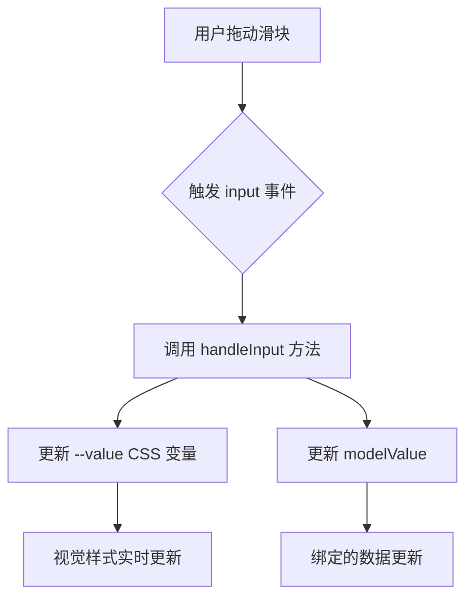
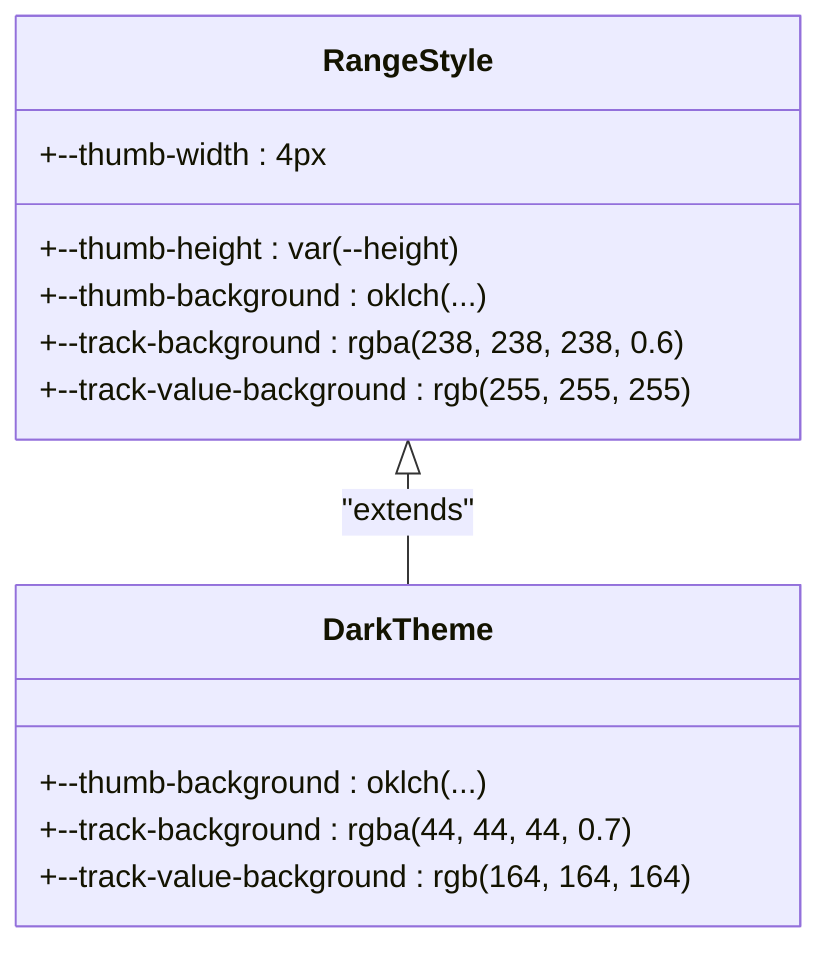

# 滑块 (Range)

<cite>
**Referenced Files in This Document**  
- [Range.vue](file://packages/ui/src/components/Form/Range/Range.vue)
- [Range.story.vue](file://packages/stage-ui/src/components/form/range/Range.story.vue)
- [ColorHueRange.story.vue](file://packages/stage-ui/src/components/form/range/ColorHueRange.story.vue)
- [RoundRange.story.vue](file://packages/stage-ui/src/components/form/range/RoundRange.story.vue)
</cite>

## 目录
1. [简介](#简介)
2. [核心功能与设计目的](#核心功能与设计目的)
3. [Props 详细说明](#props-详细说明)
4. [事件系统](#事件系统)
5. [使用示例](#使用示例)
6. [视觉样式与主题](#视觉样式与主题)
7. [可访问性支持](#可访问性支持)
8. [最佳实践与应用场景](#最佳实践与应用场景)
9. [性能优化建议](#性能优化建议)

## 简介

`Range` 组件是 `stage-ui` 库中的一个核心表单控件，用于实现直观的滑块输入功能。该组件提供了一个现代化、响应式的滑块界面，允许用户通过拖动滑块来选择数值范围内的值。组件设计注重用户体验，支持多种自定义选项，包括最小值、最大值、步长、禁用状态以及丰富的视觉样式配置。

**Section sources**
- [Range.vue](file://packages/ui/src/components/Form/Range/Range.vue#L1-L359)

## 核心功能与设计目的

`Range` 组件的设计旨在为用户提供一种直观、高效的数值选择方式。其主要功能包括：

- **数值范围选择**：用户可以在预设的最小值和最大值之间选择一个数值。
- **精确控制**：通过 `step` 属性，用户可以控制数值的增量，实现精确调整。
- **实时反馈**：滑块的视觉反馈（如填充颜色）会随着用户操作实时更新，提供即时的视觉确认。
- **可定制性**：组件支持多种自定义属性，允许开发者根据具体需求调整外观和行为。

该组件适用于需要用户进行数值调整的场景，如音量控制、亮度调节、参数设置等。

**Section sources**
- [Range.vue](file://packages/ui/src/components/Form/Range/Range.vue#L1-L359)

## Props 详细说明

`Range` 组件通过一系列 `props` 提供了丰富的配置选项，以满足不同的使用需求。

### 基础属性

| 属性名 | 类型 | 默认值 | 描述 |
| :--- | :--- | :--- | :--- |
| `min` | `number` | `0` | 滑块的最小值。用户可选择的最小数值。 |
| `max` | `number` | `100` | 滑块的最大值。用户可选择的最大数值。 |
| `step` | `number` | `1` | 滑块的步长。用户每次拖动滑块时数值的增量。 |
| `disabled` | `boolean` | `false` | 是否禁用滑块。当设置为 `true` 时，用户无法与滑块交互。 |

### 视觉样式属性

| 属性名 | 类型 | 默认值 | 描述 |
| :--- | :--- | :--- | :--- |
| `thumbColor` | `string` | `'#9090906e'` | 滑块拇指（即用户拖动的部分）的颜色。 |
| `trackColor` | `string` | `'gray'` | 滑块轨道（即滑块移动的路径）的背景颜色。 |
| `trackValueColor` | `string` | `'red'` | 滑块已选择部分（即从最小值到当前值的填充部分）的颜色。 |

这些属性允许开发者根据应用的主题和设计风格，对滑块的外观进行深度定制。

**Section sources**
- [Range.vue](file://packages/ui/src/components/Form/Range/Range.vue#L4-L18)

## 事件系统

`Range` 组件通过 `v-model` 实现双向数据绑定，这是其主要的交互方式。当用户拖动滑块时，组件会自动更新绑定的 `modelValue`，反之亦然。

- **`input` 事件**：当用户拖动滑块时触发。组件内部通过 `@input` 监听器调用 `handleInput` 方法，实时更新滑块的视觉状态（如填充颜色）。
- **`change` 事件**：虽然代码中未显式定义 `change` 事件，但 `v-model` 的实现机制确保了当滑块值发生变化时，绑定的数据会立即更新。



**Diagram sources**
- [Range.vue](file://packages/ui/src/components/Form/Range/Range.vue#L35-L42)
- [Range.vue](file://packages/ui/src/components/Form/Range/Range.vue#L19-L33)

**Section sources**
- [Range.vue](file://packages/ui/src/components/Form/Range/Range.vue#L19-L42)

## 使用示例

### 基础滑块

最简单的用法是创建一个基础滑块，绑定一个响应式变量。

```vue
<template>
  <Range v-model="value" />
</template>

<script setup>
import { ref } from 'vue'
const value = ref(50)
</script>
```

### 带刻度滑块

通过设置 `min`、`max` 和 `step` 属性，可以创建一个带有明确刻度的滑块。

```vue
<template>
  <Range v-model="volume" min="0" max="100" step="5" />
</template>

<script setup>
import { ref } from 'vue'
const volume = ref(75)
</script>
```

### 双滑块范围选择

虽然当前组件实现的是单值滑块，但可以通过组合两个 `Range` 组件来实现双滑块范围选择。

```vue
<template>
  <div>
    <Range v-model="minValue" :max="maxValue" />
    <Range v-model="maxValue" :min="minValue" />
  </div>
</template>

<script setup>
import { ref } from 'vue'
const minValue = ref(20)
const maxValue = ref(80)
</script>
```

### 与数字输入联动

将滑块与数字输入框结合，提供两种输入方式。

```vue
<template>
  <div>
    <input v-model.number="value" type="number" />
    <Range v-model="value" min="0" max="100" />
  </div>
</template>

<script setup>
import { ref } from 'vue'
const value = ref(50)
</script>
```

**Section sources**
- [Range.story.vue](file://packages/stage-ui/src/components/form/range/Range.story.vue#L1-L29)

## 视觉样式与主题

`Range` 组件的视觉样式通过 CSS 自定义属性（CSS Variables）实现，这使得样式定制非常灵活。组件支持深色和浅色主题，并通过 `:hover` 和 `:active` 状态提供交互反馈。

- **深色主题**：当应用处于深色模式时，组件会自动调整颜色，确保在深色背景下的可读性。
- **交互反馈**：当用户悬停或点击滑块时，拇指的大小和颜色会发生变化，提供清晰的视觉反馈。



**Diagram sources**
- [Range.vue](file://packages/ui/src/components/Form/Range/Range.vue#L60-L150)

**Section sources**
- [Range.vue](file://packages/ui/src/components/Form/Range/Range.vue#L60-L150)

## 可访问性支持

`Range` 组件支持键盘导航，确保所有用户都能方便地使用。

- **键盘操作**：用户可以使用 `Tab` 键将焦点移动到滑块上，然后使用 `←` 和 `→` 键来调整数值。
- **焦点管理**：组件通过 `:focus` 伪类移除了默认的轮廓线（`outline: none`），但开发者应确保在移除轮廓线后提供其他视觉反馈，以符合可访问性标准。

**Section sources**
- [Range.vue](file://packages/ui/src/components/Form/Range/Range.vue#L152-L154)

## 最佳实践与应用场景

### 音量控制

在音频应用中，`Range` 组件是实现音量控制的理想选择。通过设置 `min="0"` 和 `max="100"`，用户可以直观地调整音量大小。

### 参数调节

在设置界面中，`Range` 组件可用于调节各种参数，如亮度、对比度、饱和度等。通过设置合适的 `step` 值，可以实现精细的控制。

### 数据过滤

在数据可视化应用中，`Range` 组件可以用于过滤数据范围。例如，用户可以通过滑块选择一个时间范围，以查看特定时间段内的数据。

**Section sources**
- [Range.story.vue](file://packages/stage-ui/src/components/form/range/Range.story.vue#L1-L29)
- [ColorHueRange.story.vue](file://packages/stage-ui/src/components/form/range/ColorHueRange.story.vue#L1-L35)
- [RoundRange.story.vue](file://packages/stage-ui/src/components/form/range/RoundRange.story.vue#L1-L29)

## 性能优化建议

- **避免频繁更新**：在 `watch` 中监听 `sliderValue` 和 `[scaledMin, scaledMax, scaledStep]` 时，使用 `{ immediate: true }` 选项可以确保在组件挂载时立即执行回调，避免不必要的重复计算。
- **CSS 变量优化**：通过 `setProperty` 方法动态更新 CSS 变量，而不是直接修改内联样式，可以提高渲染性能。
- **事件委托**：组件内部的事件处理逻辑简洁高效，避免了不必要的 DOM 操作。

**Section sources**
- [Range.vue](file://packages/ui/src/components/Form/Range/Range.vue#L21-L33)
- [Range.vue](file://packages/ui/src/components/Form/Range/Range.vue#L35-L42)