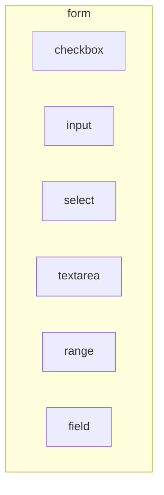
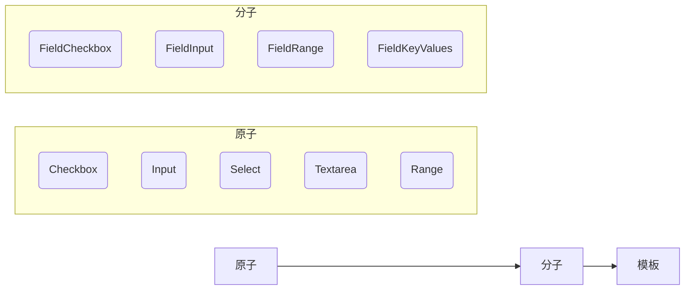
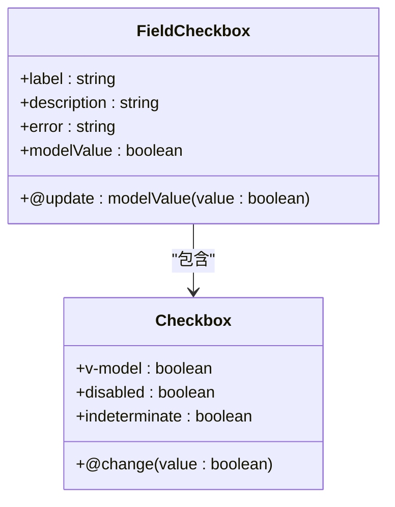
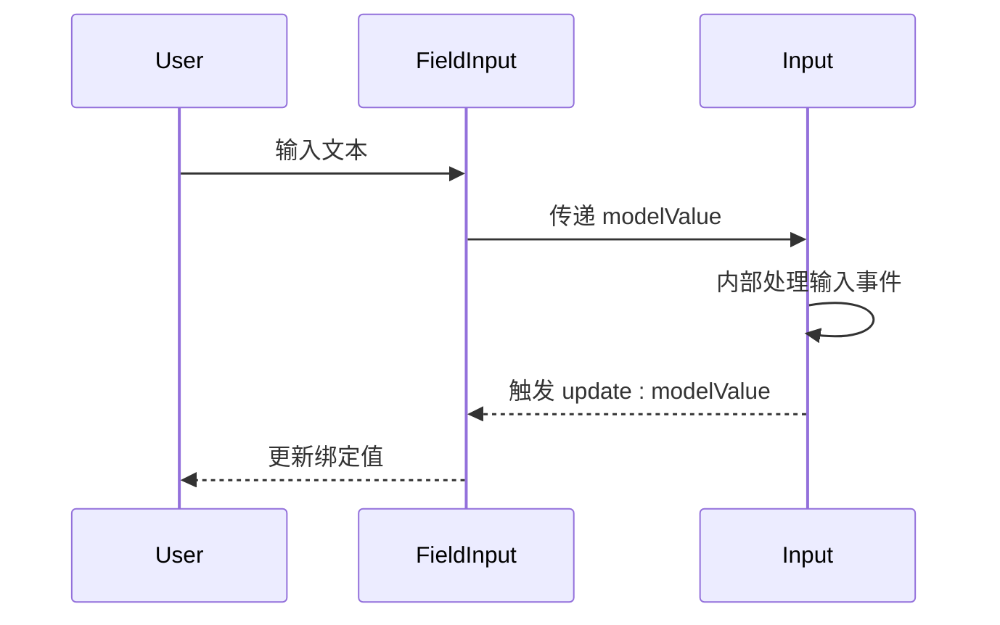
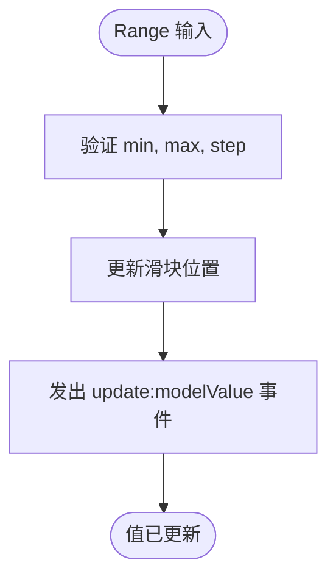
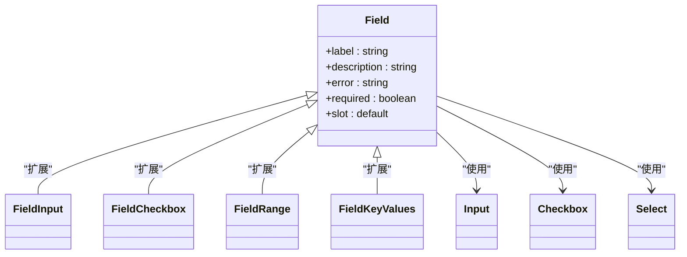
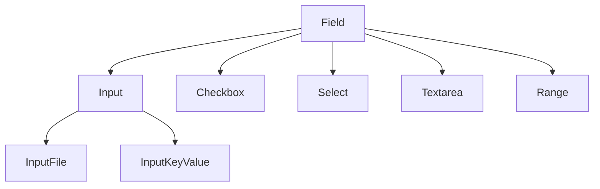

# 表单组件

<cite>
**本文档中引用的文件**  
- [Checkbox.story.vue](file://packages/stage-ui/src/components/form/checkbox/Checkbox.story.vue)
- [Input.story.vue](file://packages/stage-ui/src/components/form/input/Input.story.vue)
- [Select.story.vue](file://packages/stage-ui/src/components/form/select/Select.story.vue)
- [Textarea.story.vue](file://packages/stage-ui/src/components/form/textarea/Textarea.story.vue)
- [Range.story.vue](file://packages/stage-ui/src/components/form/range/Range.story.vue)
- [FieldCheckbox.story.vue](file://packages/stage-ui/src/components/form/field/FieldCheckbox.story.vue)
- [FieldInput.story.vue](file://packages/stage-ui/src/components/form/field/FieldInput.story.vue)
- [FieldRange.story.vue](file://packages/stage-ui/src/components/form/field/FieldRange.story.vue)
- [FieldKeyValues.story.vue](file://packages/stage-ui/src/components/form/field/FieldKeyValues.story.vue)
- [ColorHueRange.story.vue](file://packages/stage-ui/src/components/form/range/ColorHueRange.story.vue)
- [RoundRange.story.vue](file://packages/stage-ui/src/components/form/range/RoundRange.story.vue)
- [InputFile.story.vue](file://packages/stage-ui/src/components/form/input/InputFile.story.vue)
- [InputKeyValue.story.vue](file://packages/stage-ui/src/components/form/input/InputKeyValue.story.vue)
- [Basic.story.vue](file://packages/stage-ui/src/components/form/textarea/Basic.story.vue)
</cite>

## 目录
1. [简介](#简介)
2. [项目结构](#项目结构)
3. [核心组件](#核心组件)
4. [架构概览](#架构概览)
5. [详细组件分析](#详细组件分析)
6. [依赖分析](#依赖分析)
7. [性能考虑](#性能考虑)
8. [故障排除指南](#故障排除指南)
9. [结论](#结论)

## 简介
本项目 `stage-ui` 是一个共享的 UI 组件库，专为构建现代化、响应式和可访问的用户界面而设计。其核心目标是提供一套可复用、可定制且语义清晰的表单组件，涵盖从基础输入控件到复杂字段组合的完整需求。这些组件通过 Histoire 工具进行可视化展示和测试，确保在不同场景下的稳定性和一致性。

## 项目结构
`stage-ui` 的表单组件位于 `src/components/form` 目录下，采用模块化设计，每个组件类型拥有独立的子目录。这种结构提高了代码的可维护性和可发现性。

**Diagram sources**
- [Checkbox.story.vue](file://packages/stage-ui/src/components/form/checkbox/Checkbox.story.vue)
- [Input.story.vue](file://packages/stage-ui/src/components/form/input/Input.story.vue)

**Section sources**
- [README.md](file://packages/stage-ui/README.md#L1-L16)

## 核心组件
`stage-ui` 提供了六大核心表单输入组件：`Checkbox`、`Input`、`Select`、`Textarea`、`Range` 和 `Field`。其中，`Field` 组件作为容器，用于包裹其他输入组件，提供标签、描述、错误状态等统一的布局和样式。

**Section sources**
- [FieldCheckbox.story.vue](file://packages/stage-ui/src/components/form/field/FieldCheckbox.story.vue)
- [FieldInput.story.vue](file://packages/stage-ui/src/components/form/field/FieldInput.story.vue)

## 架构概览
该组件库的架构遵循原子设计原则，将 UI 分解为基本的原子（如 `Input`）和分子（如 `FieldInput`）。`Field` 组件作为分子级元素，组合了原子级的输入控件和辅助元素（如 `<label>` 和 ``），形成一个功能完整的表单字段单元。

**Diagram sources**
- [FieldCheckbox.story.vue](file://packages/stage-ui/src/components/form/field/FieldCheckbox.story.vue)
- [FieldInput.story.vue](file://packages/stage-ui/src/components/form/field/FieldInput.story.vue)
- [FieldRange.story.vue](file://packages/stage-ui/src/components/form/field/FieldRange.story.vue)

## 详细组件分析

### Checkbox 组件分析
`Checkbox` 组件用于提供二元选择（选中/未选中）。它通常与 `FieldCheckbox` 一起使用，以获得完整的标签和布局支持。

**Diagram sources**
- [Checkbox.story.vue](file://packages/stage-ui/src/components/form/checkbox/Checkbox.story.vue)
- [FieldCheckbox.story.vue](file://packages/stage-ui/src/components/form/field/FieldCheckbox.story.vue)

### Input 组件分析
`Input` 组件是文本输入的基础控件，支持多种类型（如 text, password, email）。`FieldInput` 将其封装，提供更丰富的功能。

**Diagram sources**
- [Input.story.vue](file://packages/stage-ui/src/components/form/input/Input.story.vue)
- [FieldInput.story.vue](file://packages/stage-ui/src/components/form/field/FieldInput.story.vue)

### Select 组件分析
`Select` 组件提供下拉选项选择功能。其设计注重可访问性，确保键盘导航和屏幕阅读器的兼容性。

**Section sources**
- [Select.story.vue](file://packages/stage-ui/src/components/form/select/Select.story.vue)

### Textarea 组件分析
`Textarea` 组件用于多行文本输入。`Basic.story.vue` 展示了其基础用法，而 `Field` 封装则提供了更完整的表单集成方案。

**Section sources**
- [Textarea.story.vue](file://packages/stage-ui/src/components/form/textarea/Textarea.story.vue)
- [Basic.story.vue](file://packages/stage-ui/src/components/form/textarea/Basic.story.vue)

### Range 组件分析
`Range` 组件提供滑块输入，适用于数值范围选择。`ColorHueRange` 和 `RoundRange` 是其特定样式的变体，用于颜色选择和圆形滑块等场景。

**Diagram sources**
- [Range.story.vue](file://packages/stage-ui/src/components/form/range/Range.story.vue)
- [ColorHueRange.story.vue](file://packages/stage-ui/src/components/form/range/ColorHueRange.story.vue)
- [RoundRange.story.vue](file://packages/stage-ui/src/components/form/range/RoundRange.story.vue)

### Field 组件分析
`Field` 组件是表单布局的核心。它通过插槽（slots）机制，允许任意输入组件作为其内容，并统一管理标签、描述、错误信息和验证状态。

**Diagram sources**
- [FieldInput.story.vue](file://packages/stage-ui/src/components/form/field/FieldInput.story.vue)
- [FieldCheckbox.story.vue](file://packages/stage-ui/src/components/form/field/FieldCheckbox.story.vue)
- [FieldRange.story.vue](file://packages/stage-ui/src/components/form/field/FieldRange.story.vue)
- [FieldKeyValues.story.vue](file://packages/stage-ui/src/components/form/field/FieldKeyValues.story.vue)

## 依赖分析
`stage-ui` 作为一个独立的 UI 库，其内部组件之间存在清晰的依赖关系。`Field` 系列组件依赖于基础的输入组件（`Input`, `Checkbox` 等）。项目通过 `pnpm` 工作区进行管理，确保了包之间的高效链接和版本同步。

**Diagram sources**
- [InputFile.story.vue](file://packages/stage-ui/src/components/form/input/InputFile.story.vue)
- [InputKeyValue.story.vue](file://packages/stage-ui/src/components/form/input/InputKeyValue.story.vue)

**Section sources**
- [package.json](file://packages/stage-ui/package.json)

## 性能考虑
由于组件主要基于 Vue 3 的 Composition API 和响应式系统构建，其性能表现优异。`v-model` 的双向绑定和事件处理都经过优化。对于大量表单的场景，建议使用懒加载或虚拟滚动技术来进一步提升性能。

## 故障排除指南
当遇到组件不显示或行为异常时，请检查：
1.  确保已正确安装 `@proj-airi/stage-ui` 包。
2.  检查组件的 `v-model` 绑定是否正确。
3.  查看浏览器控制台是否有 JavaScript 错误或警告。
4.  确认使用的属性（props）名称和类型是否符合文档要求。

**Section sources**
- [README.md](file://packages/stage-ui/README.md#L1-L16)

## 结论
`stage-ui` 的表单组件库提供了一套完整、灵活且易于使用的解决方案。通过 `Field` 组件的封装模式，开发者可以快速构建出既美观又符合可访问性标准的表单界面。结合 Histoire 的故事板功能，可以极大地提高开发和测试效率。