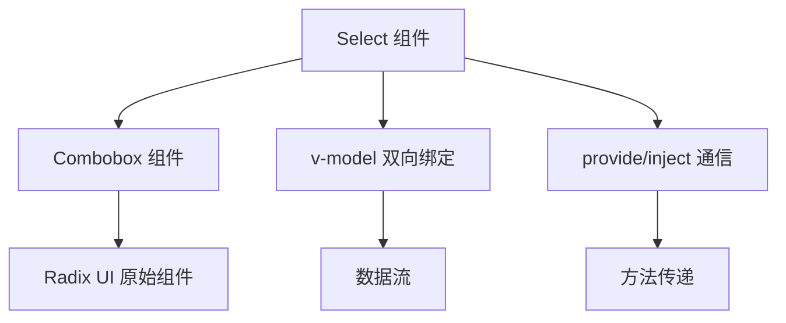
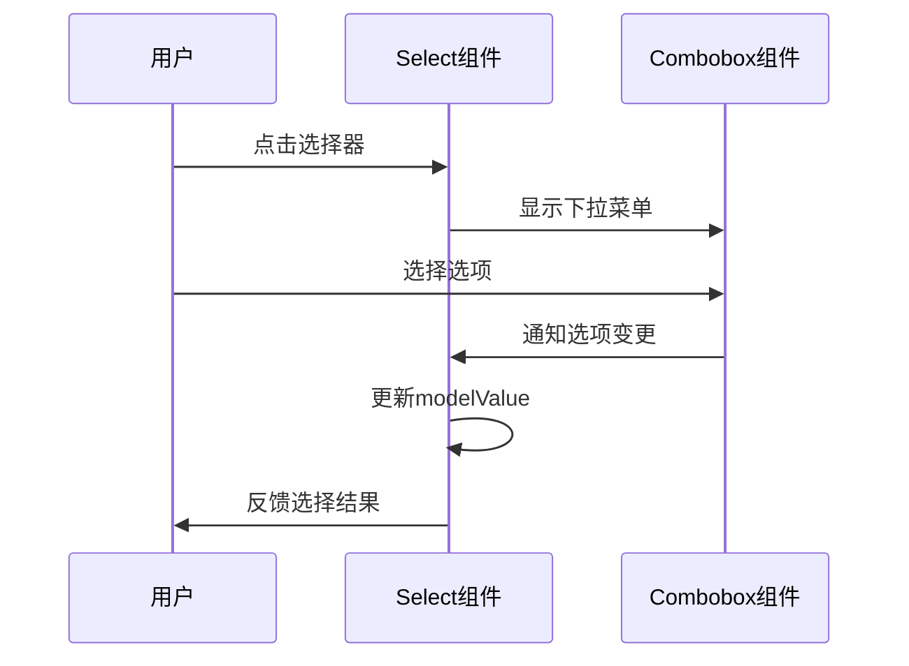
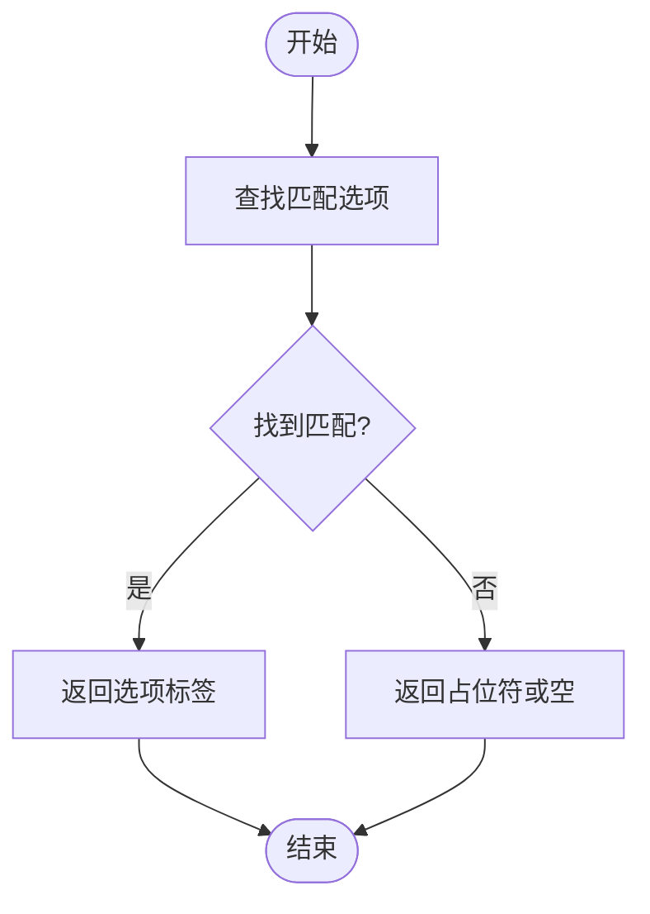
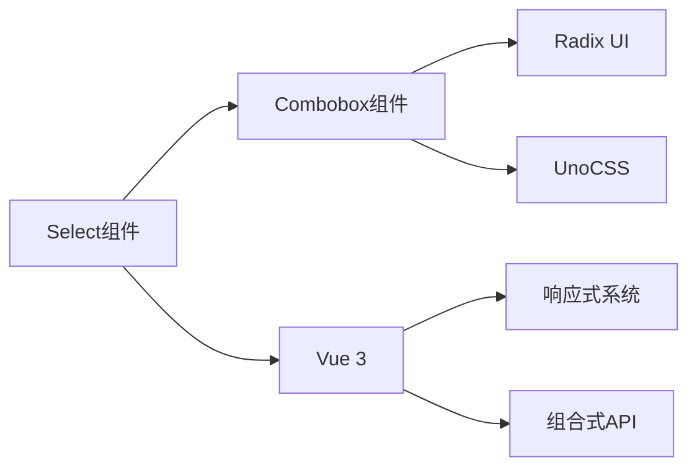

# 选择器 (Select)

<cite>
**Referenced Files in This Document **   
- [Select.vue](file://packages/ui/src/components/Form/Select/Select.vue)
- [Select.story.vue](file://packages/stage-ui/src/components/form/select/Select.story.vue)
- [Combobox.vue](file://packages/ui/src/components/Form/Combobox/Combobox.vue)
</cite>

## 目录
1. [简介](#简介)
2. [核心组件](#核心组件)
3. [架构概览](#架构概览)
4. [详细组件分析](#详细组件分析)
5. [依赖分析](#依赖分析)
6. [性能考虑](#性能考虑)
7. [故障排除指南](#故障排除指南)
8. [结论](#结论)

## 简介
选择器 (Select) 组件是 stage-ui 库中的一个表单元素，用于提供下拉选择功能。该组件设计用于在用户界面中实现标准的选择操作，支持单选、禁用状态和自定义宽度等基本功能。选择器组件通过封装底层的 Combobox 组件来实现其功能，提供了简洁的 API 接口供开发者使用。

## 核心组件

选择器组件的主要功能包括：
- 支持 v-model 双向绑定
- 可配置的选项列表 (options)
- 禁用状态 (disabled)
- 占位符文本 (placeholder)
- 标题属性 (title)
- 布局方向 (layout)

该组件通过 provide/inject 机制向子组件提供选择选项和隐藏下拉菜单的方法，实现了组件间的通信。

**Section sources**
- [Select.vue](file://packages/ui/src/components/Form/Select/Select.vue#L1-L32)

## 架构概览

选择器组件采用分层架构设计，上层 Select 组件负责处理业务逻辑和状态管理，底层 Combobox 组件负责实现具体的 UI 交互和渲染。

**Diagram sources **
- [Select.vue](file://packages/ui/src/components/Form/Select/Select.vue#L1-L32)
- [Combobox.vue](file://packages/ui/src/components/Form/Combobox/Combobox.vue#L1-L131)

## 详细组件分析

### 选择器组件分析

#### 组件结构
选择器组件是一个基于 Vue 3 的组合式 API 组件，使用 `<script setup>` 语法糖简化代码结构。组件通过 defineProps 定义了多个可配置的属性，包括选项列表、占位符、禁用状态等。

#### 属性 (Props) 分析
选择器组件支持以下属性：

| 属性 | 类型 | 描述 |
|------|------|------|
| options | Array<{label: string, value: string \| number}> | 下拉选项列表，包含标签和值 |
| placeholder | string | 当没有选中值时显示的占位文本 |
| disabled | boolean | 是否禁用选择器 |
| title | string | 选择器的标题属性 |
| layout | 'horizontal' \| 'vertical' | 布局方向 |

**Section sources**
- [Select.vue](file://packages/ui/src/components/Form/Select/Select.vue#L4-L14)

#### 事件与数据流
选择器组件通过 v-model 实现双向数据绑定，内部使用 defineModel 来声明模型值。当用户选择一个选项时，会触发 selectOption 方法更新模型值。

组件通过 provide 函数向子组件提供两个方法：
- selectOption: 用于选择特定选项
- handleHide: 用于隐藏下拉菜单

**Diagram sources **
- [Select.vue](file://packages/ui/src/components/Form/Select/Select.vue#L16-L27)

#### 插槽 (Slots) 分析
虽然当前实现中没有显式定义插槽，但选择器组件通过组合 Combobox 组件间接支持了内容分发。Combobox 组件内部使用了多个 Radix UI 组件，如 ComboboxItem、ComboboxLabel 等，这些组件可以被视为隐式的插槽位置。

### 组合框 (Combobox) 组件分析

#### 组件功能
Combobox 组件是选择器组件的基础实现，提供了完整的下拉选择交互功能。它基于 Radix UI 的原始组件构建，确保了无障碍访问性和跨浏览器兼容性。

#### 选项处理
Combobox 组件通过 toDisplayValue 方法将模型值转换为显示文本。该方法遍历所有选项，找到与当前值匹配的选项并返回其标签。

**Diagram sources **
- [Combobox.vue](file://packages/ui/src/components/Form/Combobox/Combobox.vue#L16-L22)

## 依赖分析

选择器组件具有清晰的依赖关系，主要依赖于 Combobox 组件和 Vue 的响应式系统。

**Diagram sources **
- [Select.vue](file://packages/ui/src/components/Form/Select/Select.vue#L1-L32)
- [Combobox.vue](file://packages/ui/src/components/Form/Combobox/Combobox.vue#L1-L131)

## 性能考虑

选择器组件在性能方面有以下特点：
- 使用了 Vue 3 的响应式系统，确保了高效的更新机制
- 通过 provide/inject 实现组件间通信，避免了深层 prop 传递
- Combobox 组件实现了虚拟滚动（通过 max-h-50dvh 限制高度），防止大量选项导致的性能问题
- 使用了 CSS 类的批量应用，减少了样式计算开销

## 故障排除指南

### 常见问题

#### 选项无法选择
如果发现选项无法被选择，可能的原因包括：
- 父组件的 v-model 绑定有问题
- 选项的 value 类型与 modelValue 类型不匹配
- 组件被禁用 (disabled=true)

#### 显示文本不正确
当选择后显示的文本不正确时，应检查：
- toDisplayValue 方法的逻辑
- 选项列表中是否存在重复的 value
- 模型值与选项 value 的数据类型是否一致

#### 样式问题
样式问题通常与 UnoCSS 的类名解析有关，建议检查：
- 是否正确引入了 UnoCSS
- 类名是否拼写正确
- 是否存在样式冲突

**Section sources**
- [Select.vue](file://packages/ui/src/components/Form/Select/Select.vue#L1-L32)
- [Combobox.vue](file://packages/ui/src/components/Form/Combobox/Combobox.vue#L1-L131)

## 结论

选择器组件是一个功能完整、设计良好的表单元素，通过封装底层的 Combobox 组件提供了简洁易用的 API。组件遵循了现代前端开发的最佳实践，使用了 Vue 3 的最新特性，并确保了良好的可访问性和性能表现。对于需要下拉选择功能的场景，该组件是一个可靠的选择。