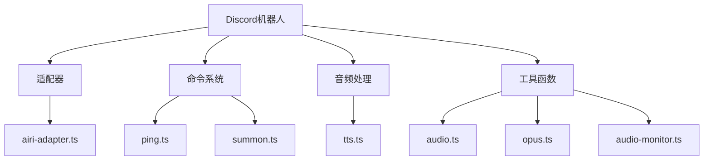
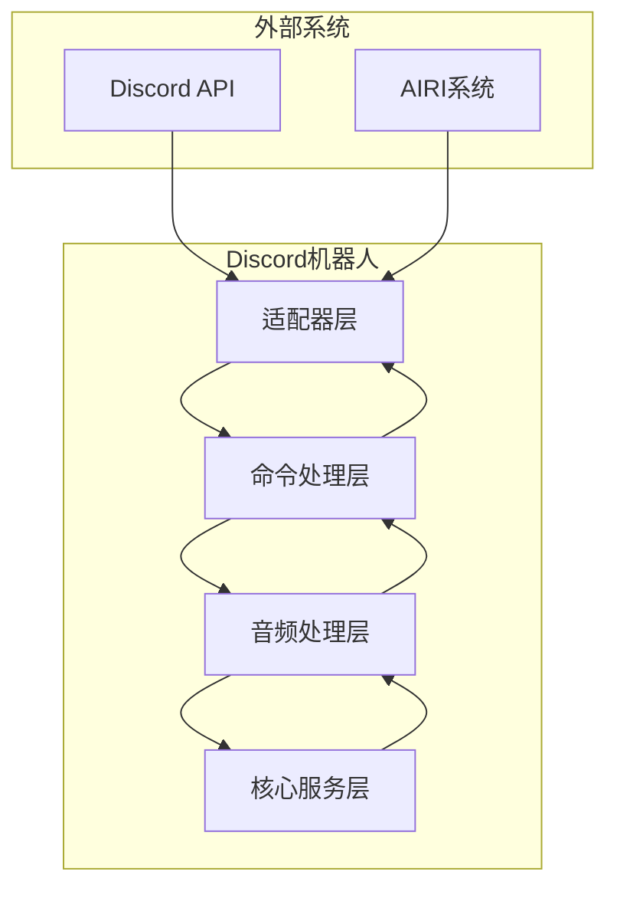
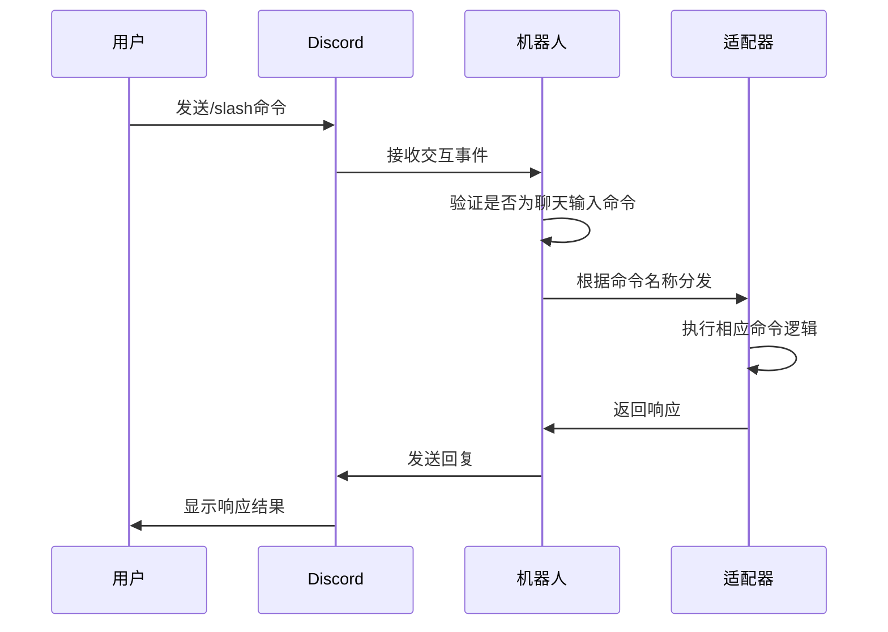
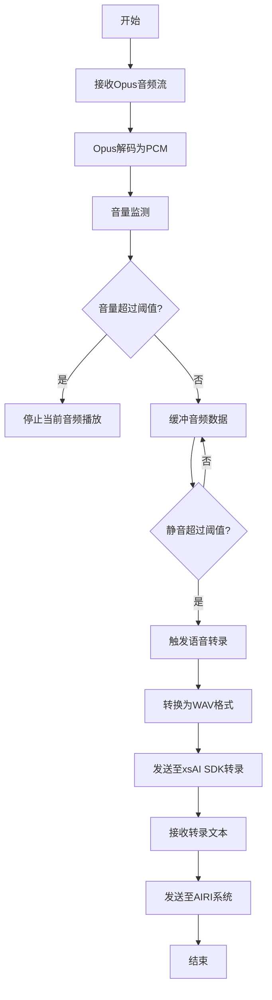
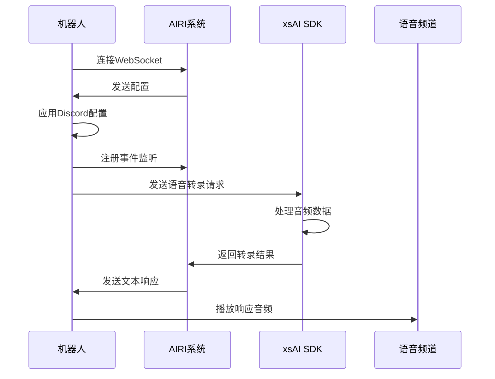

# Discord机器人

<cite>
**本文档引用的文件**   
- [index.ts](file://services/discord-bot/src/index.ts)
- [airi-adapter.ts](file://services/discord-bot/src/adapters/airi-adapter.ts)
- [ping.ts](file://services/discord-bot/src/bots/discord/commands/ping.ts)
- [summon.ts](file://services/discord-bot/src/bots/discord/commands/summon.ts)
- [index.ts](file://services/discord-bot/src/bots/discord/commands/index.ts)
- [tts.ts](file://services/discord-bot/src/pipelines/tts.ts)
- [.env](file://services/discord-bot/.env)
- [README.md](file://services/discord-bot/README.md)
- [audio.ts](file://services/discord-bot/src/utils/audio.ts)
- [opus.ts](file://services/discord-bot/src/utils/opus.ts)
- [audio-monitor.ts](file://services/discord-bot/src/utils/audio-monitor.ts)
- [audio.ts](file://services/discord-bot/src/constants/audio.ts)
</cite>

## 目录
1. [简介](#简介)
2. [项目结构](#项目结构)
3. [核心组件](#核心组件)
4. [架构概述](#架构概述)
5. [详细组件分析](#详细组件分析)
6. [依赖分析](#依赖分析)
7. [性能考虑](#性能考虑)
8. [故障排除指南](#故障排除指南)
9. [结论](#结论)

## 简介
本项目是一个集成xsAI SDK的Discord机器人服务，旨在实现与核心角色系统的深度集成，支持语音合成（TTS）和实时聊天响应功能。机器人通过Discord API与用户交互，提供ping、summon等命令系统，支持音频处理流水线，能够实时转录用户语音并生成响应。系统设计注重可扩展性和稳定性，适用于多用户环境下的实时语音交互场景。

## 项目结构
Discord机器人服务位于`services/discord-bot`目录下，采用TypeScript编写，遵循模块化设计原则。项目主要包含适配器、命令处理、音频处理、工具函数等核心模块。



**图示来源**
- [airi-adapter.ts](file://services/discord-bot/src/adapters/airi-adapter.ts)
- [ping.ts](file://services/discord-bot/src/bots/discord/commands/ping.ts)
- [summon.ts](file://services/discord-bot/src/bots/discord/commands/summon.ts)
- [tts.ts](file://services/discord-bot/src/pipelines/tts.ts)

**本节来源**
- [index.ts](file://services/discord-bot/src/index.ts)
- [package.json](file://services/discord-bot/package.json)

## 核心组件
Discord机器人服务的核心组件包括适配器层、命令处理器、音频处理流水线和xsAI SDK集成。适配器层负责与Discord API和AIRI系统的双向通信，命令处理器实现了ping和summon等基础命令，音频处理流水线负责语音数据的采集、转码和传输，xsAI SDK集成则实现了语音识别和文本生成的核心功能。

**本节来源**
- [airi-adapter.ts](file://services/discord-bot/src/adapters/airi-adapter.ts)
- [summon.ts](file://services/discord-bot/src/bots/discord/commands/summon.ts)
- [tts.ts](file://services/discord-bot/src/pipelines/tts.ts)

## 架构概述
Discord机器人采用分层架构设计，分为适配器层、命令处理层、音频处理层和核心服务层。适配器层负责与外部系统（Discord和AIRI）的通信，命令处理层解析和执行用户命令，音频处理层管理语音数据的采集和处理，核心服务层集成xsAI SDK实现智能功能。



**图示来源**
- [airi-adapter.ts](file://services/discord-bot/src/adapters/airi-adapter.ts)
- [summon.ts](file://services/discord-bot/src/bots/discord/commands/summon.ts)

## 详细组件分析

### 命令系统分析
Discord机器人的命令系统基于Discord.js的Slash Command功能实现，支持ping和summon两个核心命令。ping命令用于测试机器人响应，summon命令用于将机器人加入语音频道。

#### 命令注册与处理


**图示来源**
- [index.ts](file://services/discord-bot/src/bots/discord/commands/index.ts)
- [ping.ts](file://services/discord-bot/src/bots/discord/commands/ping.ts)
- [summon.ts](file://services/discord-bot/src/bots/discord/commands/summon.ts)

**本节来源**
- [index.ts](file://services/discord-bot/src/bots/discord/commands/index.ts)
- [ping.ts](file://services/discord-bot/src/bots/discord/commands/ping.ts)

### 音频处理流水线分析
音频处理流水线是Discord机器人的核心功能之一，负责从语音频道采集音频数据，进行转码和处理，最终传输给xsAI SDK进行语音识别。

#### 音频处理流程


**图示来源**
- [summon.ts](file://services/discord-bot/src/bots/discord/commands/summon.ts)
- [opus.ts](file://services/discord-bot/src/utils/opus.ts)
- [audio-monitor.ts](file://services/discord-bot/src/utils/audio-monitor.ts)
- [audio.ts](file://services/discord-bot/src/utils/audio.ts)

**本节来源**
- [summon.ts](file://services/discord-bot/src/bots/discord/commands/summon.ts)
- [opus.ts](file://services/discord-bot/src/utils/opus.ts)

### xsAI SDK集成分析
xsAI SDK集成实现了与核心角色系统的无缝对接，支持语音识别和文本生成功能。系统通过WebSocket与AIRI系统通信，实现双向数据交换。

#### xsAI集成流程


**图示来源**
- [airi-adapter.ts](file://services/discord-bot/src/adapters/airi-adapter.ts)
- [tts.ts](file://services/discord-bot/src/pipelines/tts.ts)

**本节来源**
- [airi-adapter.ts](file://services/discord-bot/src/adapters/airi-adapter.ts)
- [tts.ts](file://services/discord-bot/src/pipelines/tts.ts)

## 依赖分析
Discord机器人服务依赖多个核心库和SDK，形成了完整的功能生态系统。

```mermaid
graph LR
A[Discord机器人] --> B[discord.js]
A --> C[@discordjs/voice]
A --> D[@xsai/generate-speech]
A --> E[@xsai/generate-text]
A --> F[@xsai/generate-transcription]
A --> G[opusscript]
A --> H[wavefile]
B --> I[Discord API]
D --> J[xsAI SDK]
E --> J
F --> J
style A fill:#f9f,stroke:#333
style J fill:#bbf,stroke:#333
```

**图示来源**
- [package.json](file://services/discord-bot/package.json)
- [airi-adapter.ts](file://services/discord-bot/src/adapters/airi-adapter.ts)

**本节来源**
- [package.json](file://services/discord-bot/package.json)
- [index.ts](file://services/discord-bot/src/index.ts)

## 性能考虑
在设计和实现Discord机器人时，需要考虑多个性能因素以确保系统的稳定性和响应性。

1. **音频缓冲管理**：系统使用AudioMonitor类管理音频缓冲，设置最大缓冲区大小为10MB，避免内存溢出。
2. **并发控制**：通过processingVoice标志位控制语音处理的并发性，确保同一时间只有一个语音转录任务在执行。
3. **资源清理**：在音频播放完成后及时清理音频播放器资源，避免内存泄漏。
4. **错误处理**：实现完善的错误处理机制，确保在异常情况下系统能够优雅降级。
5. **消息队列**：建议在高并发场景下引入消息队列，将语音转录请求异步处理，提高系统吞吐量。

## 故障排除指南

### 连接失败
当机器人无法连接到Discord服务器时，可能的原因和解决方案包括：

- **令牌无效**：检查.env文件中的DISCORD_TOKEN是否正确
- **权限不足**：确保机器人应用具有必要的权限（Guilds, GuildVoiceStates）
- **网络问题**：检查网络连接是否正常，防火墙是否阻止了连接
- **客户端ID错误**：验证DISCORD_BOT_CLIENT_ID是否与应用ID匹配

**本节来源**
- [.env](file://services/discord-bot/.env)
- [airi-adapter.ts](file://services/discord-bot/src/adapters/airi-adapter.ts)

### 音频中断
当语音通信出现中断时，可能的原因和解决方案包括：

- **音频编码问题**：检查Opus解码器是否正常工作
- **缓冲区溢出**：调整AudioMonitor的maxSize参数
- **网络延迟**：优化网络连接，减少延迟
- **资源竞争**：检查是否有多个音频播放器同时运行

**本节来源**
- [summon.ts](file://services/discord-bot/src/bots/discord/commands/summon.ts)
- [audio-monitor.ts](file://services/discord-bot/src/utils/audio-monitor.ts)

### 配置问题
环境变量配置是确保机器人正常运行的关键。.env文件中需要配置以下关键变量：

- DISCORD_TOKEN：Discord机器人令牌
- DISCORD_BOT_CLIENT_ID：Discord应用客户端ID
- OPENAI_STT_API_KEY：语音转文本API密钥
- OPENAI_STT_API_BASE_URL：语音转文本API基础URL
- OPENAI_STT_MODEL：语音转文本模型名称

**本节来源**
- [.env](file://services/discord-bot/.env)
- [README.md](file://services/discord-bot/README.md)

## 结论
Discord机器人服务成功实现了与xsAI SDK的深度集成，提供了完整的语音合成和实时聊天响应功能。系统架构清晰，模块化设计良好，具备良好的可扩展性和稳定性。通过合理的性能优化和完善的故障排除指南，能够满足多用户环境下的实时交互需求。未来可以进一步优化音频处理算法，引入更先进的并发控制机制，提升系统的整体性能和用户体验。