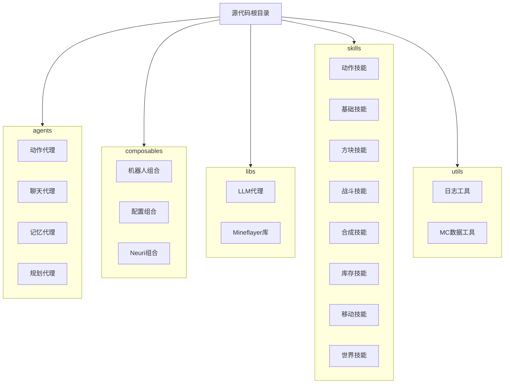
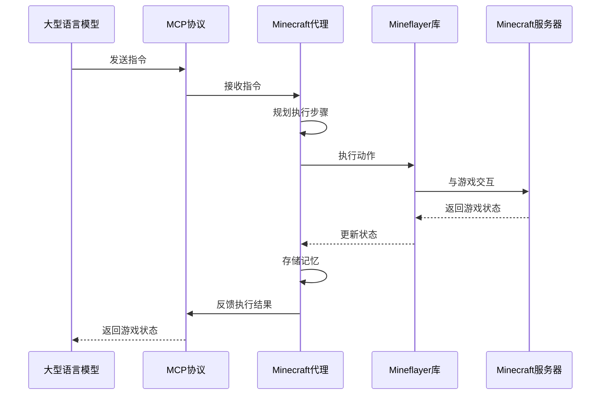
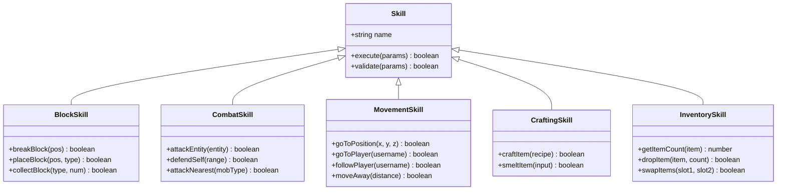
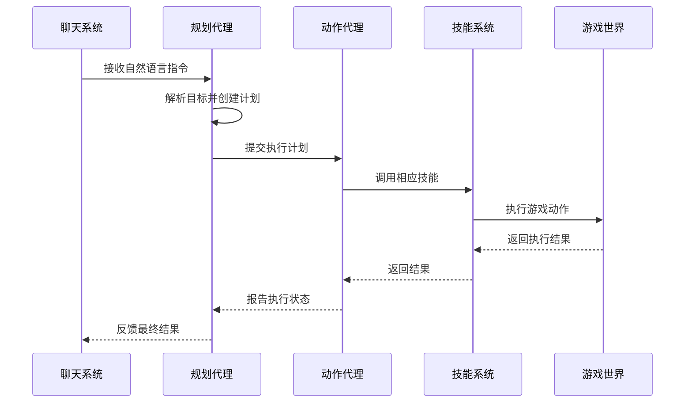
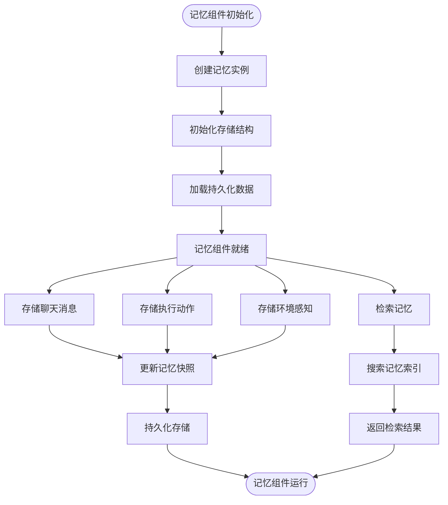
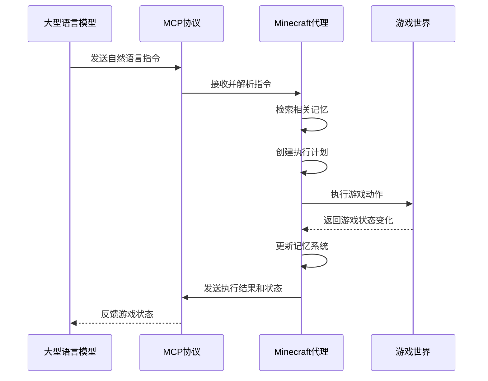
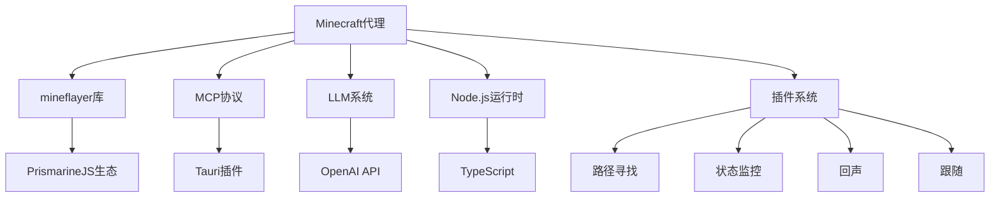

# Minecraft代理

<cite>
**本文档中引用的文件**  
- [main.ts](file://services/minecraft/src/main.ts)
- [README.md](file://services/minecraft/README.md)
- [core.ts](file://services/minecraft/src/libs/mineflayer/core.ts)
- [base-agent.ts](file://services/minecraft/src/libs/mineflayer/base-agent.ts)
- [memory.ts](file://services/minecraft/src/libs/mineflayer/memory.ts)
- [memory\index.ts](file://services/minecraft/src/agents/memory/index.ts)
- [planning\index.ts](file://services/minecraft/src/agents/planning/index.ts)
- [LLM-agent\index.ts](file://services/minecraft/src/libs/llm-agent/index.ts)
- [skills\index.ts](file://services/minecraft/src/skills/index.ts)
- [skills\blocks.ts](file://services/minecraft/src/skills/blocks.ts)
- [skills\combat.ts](file://services/minecraft/src/skills/combat.ts)
- [skills\movement.ts](file://services/minecraft/src/skills/movement.ts)
- [bot.ts](file://services/minecraft/src/composables/bot.ts)
- [config.ts](file://services/minecraft/src/composables/config.ts)
- [gaming-minecraft.ts](file://packages/stage-ui/src/stores/modules/gaming-minecraft.ts)
- [mcp.ts](file://packages/stage-ui/src/stores/mcp.ts)
- [lib.rs](file://crates/tauri-plugin-mcp/src/lib.rs)
- [mcp-adapter.ts](file://services/twitter-services/src/adapters/mcp-adapter.ts)
</cite>

## 目录
1. [简介](#简介)
2. [项目结构](#项目结构)
3. [核心组件](#核心组件)
4. [架构概述](#架构概述)
5. [详细组件分析](#详细组件分析)
6. [依赖分析](#依赖分析)
7. [性能考虑](#性能考虑)
8. [故障排除指南](#故障排除指南)
9. [结论](#结论)

## 简介
Minecraft代理是一个基于mineflayer库的智能游戏客户端自动化系统，专为Project AIRI设计。该代理能够理解自然语言指令，与Minecraft世界进行交互，并协助玩家完成各种任务。通过MCP协议接收指令并反馈游戏状态，代理实现了与大型语言模型（LLM）的无缝集成。其模块化技能系统、记忆组件和高级路径规划能力使其能够在复杂的游戏环境中自主执行动作，如采集方块、收集木材和战斗。

## 项目结构
Minecraft代理的项目结构清晰地划分了不同功能模块，便于维护和扩展。主要目录包括agents、composables、libs、mineflayer、prompts、skills和utils。

**图表来源**  
- [main.ts](file://services/minecraft/src/main.ts#L1-L50)
- [README.md](file://services/minecraft/README.md#L1-L114)

**章节来源**  
- [main.ts](file://services/minecraft/src/main.ts#L1-L50)
- [README.md](file://services/minecraft/README.md#L1-L114)

## 核心组件
Minecraft代理的核心组件包括基于mineflayer的游戏客户端自动化、动作执行、路径规划、战斗系统、技能系统、记忆组件和与LLM的交互流程。这些组件协同工作，使代理能够理解自然语言指令并在Minecraft世界中执行相应动作。

**章节来源**  
- [main.ts](file://services/minecraft/src/main.ts#L25-L100)
- [core.ts](file://services/minecraft/src/libs/mineflayer/core.ts#L15-L80)

## 架构概述
Minecraft代理的架构基于mineflayer库，通过MCP协议与LLM进行通信。代理接收自然语言指令，利用规划代理创建执行计划，由动作代理执行具体操作，并通过记忆代理存储和检索游戏状态信息。

**图表来源**  
- [core.ts](file://services/minecraft/src/libs/mineflayer/core.ts#L10-L50)
- [LLM-agent\index.ts](file://services/minecraft/src/libs/llm-agent/index.ts#L20-L40)

## 详细组件分析
Minecraft代理的详细组件分析涵盖了技能系统、记忆组件和与LLM的交互流程。这些组件的设计和实现确保了代理能够高效地执行各种游戏任务。

### 技能系统分析
技能系统采用模块化设计，将不同的游戏动作分解为独立的技能模块。每个技能模块负责特定类型的动作执行，如方块操作、战斗和移动。

#### 对于对象导向组件：

**图表来源**  
- [skills\index.ts](file://services/minecraft/src/skills/index.ts#L15-L45)
- [skills\blocks.ts](file://services/minecraft/src/skills/blocks.ts#L5-L20)
- [skills\combat.ts](file://services/minecraft/src/skills/combat.ts#L5-L20)
- [skills\movement.ts](file://services/minecraft/src/skills/movement.ts#L5-L20)

#### 对于API/服务组件：

**图表来源**  
- [LLM-agent\index.ts](file://services/minecraft/src/libs/llm-agent/index.ts#L20-L60)
- [planning\index.ts](file://services/minecraft/src/agents/planning/index.ts#L30-L80)

### 记忆组件分析
记忆组件负责存储和检索代理的游戏状态信息，包括聊天历史、执行动作和环境感知数据。该组件采用分层存储结构，支持快速访问和持久化。

**图表来源**  
- [memory\index.ts](file://services/minecraft/src/agents/memory/index.ts#L45-L108)
- [memory.ts](file://services/minecraft/src/libs/mineflayer/memory.ts#L5-L20)

**章节来源**  
- [memory\index.ts](file://services/minecraft/src/agents/memory/index.ts#L1-L100)
- [memory.ts](file://services/minecraft/src/libs/mineflayer/memory.ts#L1-L14)

### 与LLM交互流程分析
Minecraft代理通过MCP协议与LLM进行双向通信，实现自然语言指令的理解和执行结果的反馈。该流程确保了代理能够根据上下文做出智能决策。

**图表来源**  
- [LLM-agent\index.ts](file://services/minecraft/src/libs/llm-agent/index.ts#L45-L120)
- [core.ts](file://services/minecraft/src/libs/mineflayer/core.ts#L15-L50)

**章节来源**  
- [LLM-agent\index.ts](file://services/minecraft/src/libs/llm-agent/index.ts#L1-L100)
- [core.ts](file://services/minecraft/src/libs/mineflayer/core.ts#L1-L150)

## 依赖分析
Minecraft代理的依赖关系复杂但组织良好，主要依赖mineflayer库进行游戏客户端自动化，并通过MCP协议与外部LLM系统通信。内部组件之间通过明确定义的接口进行交互，确保了系统的可维护性和可扩展性。

**图表来源**  
- [lib.rs](file://crates/tauri-plugin-mcp/src/lib.rs#L1-L20)
- [mcp-adapter.ts](file://services/twitter-services/src/adapters/mcp-adapter.ts#L10-L30)
- [main.ts](file://services/minecraft/src/main.ts#L1-L15)

**章节来源**  
- [lib.rs](file://crates/tauri-plugin-mcp/src/lib.rs#L1-L30)
- [mcp-adapter.ts](file://services/twitter-services/src/adapters/mcp-adapter.ts#L1-L50)
- [main.ts](file://services/minecraft/src/main.ts#L1-L30)

## 性能考虑
Minecraft代理在设计时充分考虑了性能因素，通过异步操作、缓存机制和资源优化确保了在游戏环境中的流畅运行。代理采用事件驱动架构，避免了阻塞操作，同时通过智能路径规划减少了不必要的移动和计算。

## 故障排除指南
当Minecraft代理出现问题时，可以通过检查日志文件、验证配置设置和监控网络连接来诊断和解决问题。建议使用行为回放功能来重现和分析异常行为，同时确保所有依赖项都已正确安装和配置。

**章节来源**  
- [config.ts](file://services/minecraft/src/composables/config.ts#L10-L50)
- [gaming-minecraft.ts](file://packages/stage-ui/src/stores/modules/gaming-minecraft.ts#L1-L10)
- [mcp.ts](file://packages/stage-ui/src/stores/mcp.ts#L1-L13)

## 结论
Minecraft代理是一个功能强大且设计精良的游戏自动化系统，它通过结合mineflayer库的强大功能和LLM的智能决策能力，实现了高度自主的游戏客户端操作。其模块化的技能系统、先进的记忆组件和高效的MCP通信协议使其能够处理复杂的自然语言指令并在Minecraft世界中执行相应的动作。随着进一步的优化和功能扩展，该代理有望成为虚拟角色与游戏世界交互的重要桥梁。