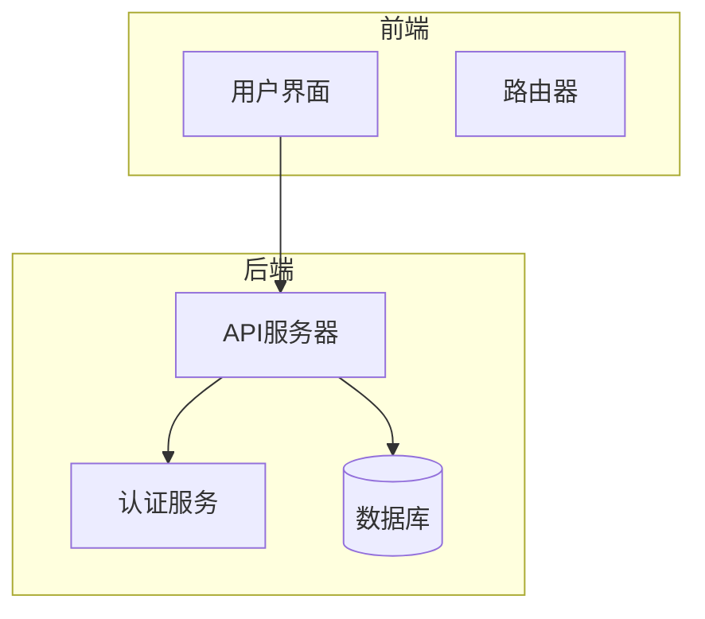

# Telegram机器人

<cite>
**本文档引用的文件**
- [schema.ts](file://services/telegram-bot/src/db/schema.ts)
- [index.ts](file://services/telegram-bot/src/index.ts)
- [drizzle.config.ts](file://services/telegram-bot/drizzle.config.ts)
- [startTelegramBot](file://services/telegram-bot/src/bots/telegram/index.ts)
- [chat-message.ts](file://services/telegram-bot/src/models/chat-message.ts)
- [attention-handler.ts](file://services/telegram-bot/src/bots/telegram/agent/attention-handler.ts)
- [interruption.ts](file://services/telegram-bot/src/bots/telegram/agent/interruption.ts)
- [actions.ts](file://services/telegram-bot/src/llm/actions.ts)
- [message-split-v1.velin.md](file://services/telegram-bot/src/prompts/message-split-v1.velin.md)
- [.env](file://services/telegram-bot/.env)
- [README.md](file://services/telegram-bot/README.md)
</cite>

## 目录
1. [简介](#简介)
2. [项目结构](#项目结构)
3. [核心组件](#核心组件)
4. [架构概述](#架构概述)
5. [详细组件分析](#详细组件分析)
6. [依赖分析](#依赖分析)
7. [性能考虑](#性能考虑)
8. [故障排除指南](#故障排除指南)
9. [结论](#结论)

## 简介
本文档详细介绍了基于Drizzle ORM的Telegram机器人服务的技术实现。文档涵盖了数据库架构设计、聊天历史持久化机制、与LLM系统的上下文同步策略、机器人代理的消息处理、注意力机制和中断逻辑。同时提供了从初始化到部署的完整流程，包括Telegram Bot API密钥配置、数据库迁移（drizzle-kit）和环境变量设置。文档还包含了错误处理策略、消息分片逻辑和安全性最佳实践。

## 项目结构
Telegram机器人服务位于`services/telegram-bot`目录下，主要包含以下子目录和文件：
- `deploy`：包含Grafana、Prometheus和Tempo的部署配置文件。
- `drizzle`：包含数据库迁移文件和快照。
- `scripts`：包含嵌入所有聊天消息的脚本。
- `sql`：包含数据库初始化SQL脚本。
- `src`：源代码目录，包含机器人、数据库、LLM、模型、提示和工具等子模块。
- `.env`：环境变量配置文件。
- `README.md`：项目说明文档。
- `docker-compose.yaml`：Docker Compose配置文件。
- `drizzle.config.ts`：Drizzle ORM配置文件。
- `package.json`：Node.js包配置文件。
- `tsconfig.json`：TypeScript配置文件。

**Section sources**
- [README.md](file://services/telegram-bot/README.md)

## 核心组件
Telegram机器人服务的核心组件包括：
- **数据库架构**：基于Drizzle ORM的PostgreSQL数据库，支持向量搜索。
- **聊天历史持久化**：通过Drizzle ORM将聊天消息持久化到数据库，并支持向量嵌入。
- **上下文同步**：与LLM系统同步上下文，确保机器人能够理解并响应用户消息。
- **消息处理**：机器人代理处理用户消息，管理注意力机制和中断逻辑。
- **部署流程**：从初始化到部署的完整流程，包括环境变量设置和数据库迁移。

**Section sources**
- [schema.ts](file://services/telegram-bot/src/db/schema.ts)
- [index.ts](file://services/telegram-bot/src/index.ts)
- [drizzle.config.ts](file://services/telegram-bot/drizzle.config.ts)

## 架构概述
Telegram机器人服务的架构主要包括以下几个部分：
- **入口点**：`src/index.ts`文件是服务的入口点，负责初始化数据库和启动Telegram机器人。
- **数据库**：使用Drizzle ORM与PostgreSQL数据库交互，支持向量搜索。
- **机器人代理**：处理用户消息，管理注意力机制和中断逻辑。
- **LLM系统**：与LLM系统同步上下文，生成响应。
- **部署**：通过Docker Compose部署服务，使用Grafana、Prometheus和Tempo进行监控。

**Diagram sources**
- [index.ts](file://services/telegram-bot/src/index.ts)
- [schema.ts](file://services/telegram-bot/src/db/schema.ts)

## 详细组件分析
### 数据库架构设计
Telegram机器人服务使用Drizzle ORM与PostgreSQL数据库交互。数据库架构设计支持向量搜索，以便快速检索相关聊天消息。主要表包括：
- `chat_messages`：存储聊天消息，支持向量嵌入。
- `stickers`：存储贴纸信息，支持向量嵌入。
- `sticker_packs`：存储贴纸包信息。
- `photos`：存储图片信息，支持向量嵌入。
- `joined_chats`：存储加入的聊天信息。
- `chat_completions_history`：存储聊天完成历史。
- `memory_fragments`：存储记忆片段，支持向量嵌入。
- `memory_tags`：存储记忆标签。
- `memory_episodic`：存储情景记忆。
- `memory_long_term_goals`：存储长期目标。
- `memory_short_term_ideas`：存储短期想法。

**Section sources**
- [schema.ts](file://services/telegram-bot/src/db/schema.ts)

### 聊天历史持久化机制
聊天历史持久化通过Drizzle ORM将聊天消息存储到`chat_messages`表中。每条消息包含以下字段：
- `id`：消息ID，UUID类型。
- `platform`：平台名称，文本类型。
- `platform_message_id`：平台消息ID，文本类型。
- `from_id`：发送者ID，文本类型。
- `from_name`：发送者名称，文本类型。
- `in_chat_id`：聊天ID，文本类型。
- `content`：消息内容，文本类型。
- `is_reply`：是否为回复，布尔类型。
- `reply_to_name`：回复对象名称，文本类型。
- `reply_to_id`：回复对象ID，文本类型。
- `created_at`：创建时间，bigint类型。
- `updated_at`：更新时间，bigint类型。
- `content_vector_1536`：内容向量（1536维），向量类型。
- `content_vector_1024`：内容向量（1024维），向量类型。
- `content_vector_768`：内容向量（768维），向量类型。

**Section sources**
- [chat-message.ts](file://services/telegram-bot/src/models/chat-message.ts)

### 与LLM系统的上下文同步策略
机器人代理通过`imagineAnAction`函数与LLM系统同步上下文。该函数接收当前消息、动作历史和全局状态，生成一个动作。动作可以是发送消息、发送贴纸、读取未读消息等。生成的动作通过`dispatchAction`函数执行。

**Section sources**
- [actions.ts](file://services/telegram-bot/src/llm/actions.ts)

### 机器人代理的消息处理
机器人代理通过`startTelegramBot`函数启动，监听用户消息。当收到消息时，消息被添加到消息队列中，并触发`onMessageArrival`函数处理。`onMessageArrival`函数将消息标记为“准备就绪”，并触发`loopIterationForChat`函数处理。

**Section sources**
- [startTelegramBot](file://services/telegram-bot/src/bots/telegram/index.ts)

### 注意力机制和中断逻辑
机器人代理通过`attention-handler.ts`文件中的`createAttentionHandler`函数管理注意力机制。该函数根据消息类型、提及、回复和触发词决定是否响应。中断逻辑通过`interruption.ts`文件中的`shouldInterruptProcessing`函数实现，根据处理时间和新消息数量决定是否中断当前处理。

**Section sources**
- [attention-handler.ts](file://services/telegram-bot/src/bots/telegram/agent/attention-handler.ts)
- [interruption.ts](file://services/telegram-bot/src/bots/telegram/agent/interruption.ts)

## 依赖分析
Telegram机器人服务依赖以下外部库和工具：
- `drizzle-orm`：用于与PostgreSQL数据库交互。
- `grammy`：用于与Telegram Bot API交互。
- `@opentelemetry`：用于监控和追踪。
- `@xsai`：用于与LLM系统交互。
- `pg`：PostgreSQL客户端。
- `sharp`：图像处理库。
- `fluent-ffmpeg`：音视频处理库。
- `nanoid`：生成唯一ID。
- `p-limit`：限制并发请求。

**Section sources**
- [package.json](file://services/telegram-bot/package.json)

## 性能考虑
为了提高性能，Telegram机器人服务采取了以下措施：
- **向量搜索**：使用向量嵌入和HNSW索引加速相似性搜索。
- **消息队列**：使用消息队列异步处理消息，避免阻塞主线程。
- **缓存**：缓存常用数据，减少数据库查询。
- **并发限制**：使用`p-limit`库限制并发请求，避免过载。

## 故障排除指南
### 错误处理策略
- **未处理的拒绝**：通过`process.on('unhandledRejection')`捕获未处理的拒绝错误，并记录日志。
- **数据库错误**：通过`try-catch`块捕获数据库操作错误，并记录日志。
- **网络错误**：通过`try-catch`块捕获网络请求错误，并记录日志。

### 消息分片逻辑
消息分片逻辑通过`message-split-v1.velin.md`文件中的规则实现。主要规则包括：
- 快速输入时的兴奋或强烈情绪。
- 实时思考复杂问题时的自然停顿。
- 创建戏剧效果或强调某一点时的时间安排。
- 添加快速反应或事后想法时。

**Section sources**
- [message-split-v1.velin.md](file://services/telegram-bot/src/prompts/message-split-v1.velin.md)

## 结论
本文档详细介绍了基于Drizzle ORM的Telegram机器人服务的技术实现。通过合理的数据库架构设计、聊天历史持久化机制、与LLM系统的上下文同步策略、机器人代理的消息处理、注意力机制和中断逻辑，以及从初始化到部署的完整流程，确保了机器人服务的高效、可靠和安全。希望本文档能帮助开发者更好地理解和使用Telegram机器人服务。